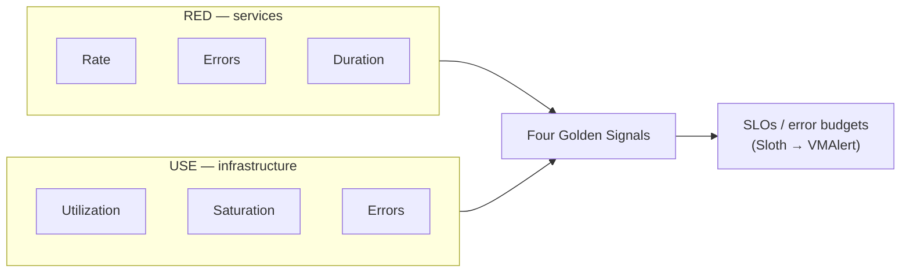
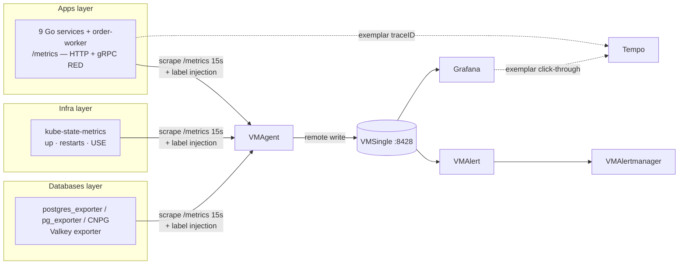

# Metrics

The **metrics pillar** of the platform — what each service and piece of
infrastructure is doing *right now*, stored as time series and queried with
PromQL/MetricsQL. Metrics tell you *that* something is wrong (latency up, errors
up, memory climbing); traces tell you *where*, and profiles tell you *which line
of code* (see [`../README.md`](../README.md)).

| | |
|---|---|
| **Collector** | VMAgent — scrapes every target's `/metrics` every `15s` |
| **Storage** | VMSingle `:8428` — single-binary TSDB + Prometheus-compatible PromQL/MetricsQL API |
| **CRDs** | `prometheus-operator-crds` (definitions only) → auto-converted to VM CRDs by the VM Operator |
| **Rules / alerts** | VMAlert (recording + alerting) → VMAlertmanager; SLO burn-rate via Sloth |
| **Visualization** | Grafana (VictoriaMetrics datasource) |
| **Correlation** | Exemplars carry `traceID` → click a latency spike straight into Tempo |

---

## Overview

This platform monitors three layers — **applications**, **cluster
infrastructure**, and **databases** — with one collection pipeline and one query
language. To decide *what* to measure on each layer it applies three
industry-standard methodologies, each answering a different question:

| Method | View | Signals | Best for | Origin |
|--------|------|---------|----------|--------|
| **RED** | External (request) | **R**ate, **E**rrors, **D**uration | APIs, microservices, user-facing endpoints | Tom Wilkie (Weaveworks) |
| **USE** | Internal (resource) | **U**tilization, **S**aturation, **E**rrors | CPU, memory, disk, network, DB, cache | Brendan Gregg |
| **Golden Signals** | Superset | Latency, Traffic, Errors, **Saturation** | Full-stack (RED + saturation) | Google SRE |

**How they combine here:** the 9 Go microservices are request-driven, so they use
**RED** — all three signals come from a single `request_duration_seconds`
histogram, plus `requests_in_flight` for the 4th Golden Signal (saturation).
Infrastructure (pods, nodes, databases, cache) is resource-driven, so it uses
**USE**. The Four Golden Signals are the umbrella that both roll up into.

**SLOs** sit on top of the metrics. Service Level Objectives (e.g. "99% of
requests < 500ms", "99.9% availability") are defined per service and compiled by
the **Sloth** operator into multi-window burn-rate recording + alerting rules
that run in VMAlert — so an alert fires on *error-budget burn*, not on a raw
threshold. See [SLO docs](../slo/README.md).



## Monitoring stack & why

The platform runs **VictoriaMetrics** (VMAgent + VMSingle), **not** a Prometheus
server or `kube-prometheus-stack`. The reasons:

- **Lower footprint** — VMSingle uses far less RAM/disk than Prometheus for the
  same series count, which matters on a Kind homelab and keeps prod cheap.
- **Drop-in compatibility** — VMSingle speaks the Prometheus remote-write,
  PromQL, and exemplar APIs, so Grafana, dashboards, and queries are unchanged;
  MetricsQL adds conveniences on top.
- **One operator, familiar CRDs** — the VM Operator consumes the *same*
  `ServiceMonitor` / `PodMonitor` / `PrometheusRule` CRDs the ecosystem already
  emits (Valkey charts, Sloth, etc.), auto-converting them to native VM scrape
  objects. That is why `prometheus-operator-crds` is installed for the CRD
  definitions even though no Prometheus server runs.

Full architecture, the dual-CRD model, and component deep-dive:
[**VictoriaMetrics Operator Stack**](victoriametrics.md).

## Architecture

One pipeline serves all three layers. VMAgent auto-discovers targets from
`ServiceMonitor`/`PodMonitor` objects (converted to VM scrape CRDs), scrapes
`/metrics`, injects target labels (`app`, `namespace`, `job`, `instance`), and
remote-writes to VMSingle. Grafana queries VMSingle; VMAlert evaluates rules and
routes firing alerts to VMAlertmanager.



Two cross-cutting conventions make this scale to any number of services without
manual wiring — detailed in [metrics-apps.md](metrics-apps.md):

- **Label injection** — applications emit only 3 labels (`method`, `path`,
  `code`); VMAgent adds `app`/`namespace`/`job`/`instance` at scrape time.
- **ServiceMonitor auto-discovery** — a single `ServiceMonitor` selects every
  Service labelled `app.kubernetes.io/component: api` in any namespace, so new services (deployed
  via the `mop` chart) are scraped automatically.

## Metrics coverage by layer

Each layer has its own reference doc with the full metric catalog, PromQL, and
runbooks:

| Layer | What it covers | Methodology | Reference |
|-------|----------------|-------------|-----------|
| **Applications** | HTTP RED (`request_duration_seconds`), saturation, request/response size, Go runtime, **gRPC east-west RED**, exemplars, instrumentation | RED + Golden | [**metrics-apps.md**](metrics-apps.md) |
| **Infrastructure** | `up`, container restarts, pod/node/API-server resources, network | USE + Golden | [**metrics-infra.md**](metrics-infra.md) |
| **Databases** | PostgreSQL (Zalando + CNPG), custom queries, PgBouncer/pooler, Valkey | USE | [**postgresql/monitoring.md**](postgresql/monitoring.md) |

### Methodology coverage matrix

Status of each methodology across the platform (✅ implemented, ❌ scoped out):

| Signal | Scope | Status | Implementation |
|--------|-------|:------:|----------------|
| **RED** (Rate/Errors/Duration) | 9 microservices | ✅ | `request_duration_seconds` → recording rules + 17 alerts + Apdex |
| **Latency** | API server | ✅ | `KubeAPIServerHighLatency` (P99 > 1s) |
| **Traffic** | Microservices | ✅ | RPS recording rule + per-endpoint breakdown |
| **Errors** | Infra / API server / PostgreSQL / Valkey | ✅ | OOMKill, CrashLoop, 5xx rate, ~25 PG alerts, Valkey down/rejected |
| **Saturation** | Microservices / pods / nodes / API server / PG / Valkey | ✅ | `requests_in_flight`, CPU throttle, memory pressure, inflight, connections, evictions |
| **USE** | Pod CPU/mem, node, PVC, network, PostgreSQL, Valkey, workloads | ✅ | See [metrics-infra.md](metrics-infra.md) + [databases](postgresql/monitoring.md) |
| **SLO** | Microservices | ✅ | 48 Sloth-generated burn-rate rules |
| etcd / kubelet / ingress / node_exporter | Cluster | ❌ | Scoped out for Kind — see [metrics-infra.md](metrics-infra.md#not-covered-scoped-out-for-kind) |

> Every deployed alert and recording rule — exact manifest files, counts, and
> production impact — is catalogued authoritatively in the
> [Alert Catalog](../alerting/alert-catalog.md); each layer doc links its relevant
> domain.

## Documentation map

```
metrics/
├── README.md            # This hub — fundamentals, stack, architecture, coverage
├── metrics-apps.md      # Application + gRPC east-west metrics (RED)
├── metrics-infra.md     # Cluster / infrastructure metrics (USE)
├── victoriametrics.md   # The stack: VM Operator, dual CRDs, components, ops
├── promql-guide.md      # PromQL: counters, rate() vs increase(), $rate vs $__range
└── postgresql/          # Databases layer
    ├── monitoring.md            # Entry point: 3-cluster strategy + exporters
    ├── custom-metrics.md        # postgres_exporter custom queries (Zalando)
    ├── pg-exporter-dashboards.md
    └── pg-exporter-mapping.md   # Full pg_exporter metric reference
```

## Operations quick-start

```bash
# Query VMSingle directly (VMUI)
kubectl port-forward -n monitoring svc/vmsingle-victoria-metrics 8428:8428
# → http://localhost:8428/vmui

# Inspect what VMAgent is scraping
kubectl port-forward -n monitoring svc/vmagent-victoria-metrics 8429:8429
# → http://localhost:8429/targets

# Force a reconcile after changing monitoring manifests
flux reconcile kustomization monitoring-local --with-source
```

Sample RED queries (microservices):

```promql
# Rate (RPS)
sum(rate(request_duration_seconds_count{job="microservices"}[5m]))
# Error ratio
sum(rate(request_duration_seconds_count{job="microservices", code=~"5.."}[5m]))
  / sum(rate(request_duration_seconds_count{job="microservices"}[5m]))
# Duration (P95)
histogram_quantile(0.95, sum by (le) (rate(request_duration_seconds_bucket{job="microservices"}[5m])))
```

## References

- [VictoriaMetrics Operator Stack](victoriametrics.md) — architecture, dual CRDs, components
- [Application metrics (RED)](metrics-apps.md) · [Infrastructure metrics (USE)](metrics-infra.md) · [Database metrics](postgresql/monitoring.md)
- [PromQL Guide](promql-guide.md) — counters, `rate()`/`increase()`, `$rate` vs `$__range`
- [SLO Documentation](../slo/README.md) — SLI mappings, Sloth integration
- [Grafana Dashboard Guide](../grafana/dashboard-reference.md) · [Datasource Strategy](../grafana/datasources.md)
- [VictoriaMetrics docs](https://docs.victoriametrics.com/) · [prometheus-operator CRDs](https://prometheus-operator.dev/)

---

_Last updated: 2026-06-29 — VictoriaMetrics (VMAgent + VMSingle `:8428`), 3-layer coverage (apps/infra/databases), SLO via Sloth._
