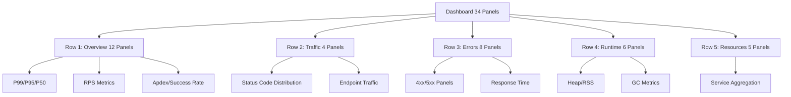

# Grafana Dashboard Guide

> **Audience**: SRE/DevOps Engineers  
> **Dashboard**: Microservices Observability Platform  
> **Total Panels**: 34 panels across 5 row groups  
> **Last Updated**: 2026-01-01

---

## Table of Contents

1. [Overview](#overview)
2. [Row 1: Overview & Key Metrics](#row-1-overview--key-metrics) (12 panels)
3. [Row 2: Traffic & Requests](#row-2-traffic--requests) (4 panels)
4. [Row 3: Errors & Performance](#row-3-errors--performance) (8 panels)
5. [Row 4: Go Runtime & Memory](#row-4-go-runtime--memory) (6 panels)
6. [Row 5: Resources & Infrastructure](#row-5-resources--infrastructure) (5 panels)
7. [Common Patterns](#common-patterns)
8. [Quick Reference](#quick-reference)
9. [Grafana Annotations (Planned Feature)](#grafana-annotations-planned-feature)

---

## Overview

### Dashboard Architecture



### Dashboard Variables

| Variable | Type | Purpose | Example |
|----------|------|---------|---------|
| `$DS_PROMETHEUS` | Datasource | Prometheus instance selector | `Prometheus` |
| `$namespace` | Multi-select | Kubernetes namespace filter | `auth`, `user` |
| `$app` | Multi-select | Service name filter | `auth`, `product` |
| `$rate` | Single-select | Rate interval for calculations | `5m` (default) |

**Variable Cascading**: `$namespace` filters `$app` options dynamically.

### PromQL Patterns

**Core Functions Used**:
- `rate()` - Per-second rate for counters (industry standard)
- `increase()` - Total increase over time range
- `histogram_quantile()` - Percentile calculation from histogram buckets
- `sum() by (label)` - Aggregation with grouping

**Metric Labels**:
- `app` - Service name (injected by ServiceMonitor)
- `namespace` - Kubernetes namespace (injected by ServiceMonitor)
- `job` - Scrape job name (`microservices` for all services)
- `method` - HTTP method (GET, POST, PUT, DELETE) - from app
- `path` - Request path (/api/v1/users) - from app
- `code` - HTTP status code (200, 404, 500) - from app

---

## Row 1: Overview & Key Metrics

### Panel 1: 99th Percentile Response Success (ID: 1)

**Type**: stat | **Unit**: seconds | **Row**: Overview & Key Metrics

**Query**:
```promql
histogram_quantile(0.99, sum(rate(request_duration_seconds_bucket{app=~"$app", namespace=~"$namespace", job=~"microservices", code=~"2.."}[$rate])) by (le))
```

**Query Explanation**:
- `histogram_quantile(0.99, ...)` - Calculate 99th percentile
- `rate(..._bucket{...}[$rate])` - Per-second rate of histogram buckets
- `code=~"2.."` - Only successful requests (200-299)
- `sum(...) by (le)` - Aggregate across services, preserve bucket boundaries
- **Result**: 99% of successful requests complete faster than this value

**Why This Metric**:
- Tail latency indicator - shows worst-case user experience
- Google SRE: "P99 matters more than average for user satisfaction"
- Detects outliers and system degradation early
- SLO target: P99 < 1s for user-facing APIs

**Thresholds**:
- Green: < 0.5s (excellent)
- Yellow: 0.5-1s (acceptable)
- Red: > 1s (investigate)

**What to Do When**:
- **P99 > 1s**: Check P50/P95 - if also high, systemic issue; if only P99 high, investigate outliers
- **Sudden spike**: Correlate with deployment, traffic surge, or dependency issues
- **Gradual increase**: Check for memory leaks, GC pressure, or database slow queries

**Related Panels**: P95 Response (Panel 2), P50 Response (Panel 3), Response Time per Endpoint (Panel 13-15)

---

### Panel 2: 95th Percentile Response Success (ID: 2)

**Type**: stat | **Unit**: seconds | **Row**: Overview & Key Metrics

**Query**:
```promql
histogram_quantile(0.95, sum(rate(request_duration_seconds_bucket{app=~"$app", namespace=~"$namespace", job=~"microservices", code=~"2.."}[$rate])) by (le))
```

**Query Explanation**:
- Same pattern as P99 but at 95th percentile
- 95% of requests complete faster than this
- **Key SLO metric** - commonly used in SLA agreements

**Why This Metric**:
- Balance between tail latency and typical experience
- Less sensitive to extreme outliers than P99
- Industry standard for SLO definitions
- SLO target: P95 < 500ms for interactive APIs

**Thresholds**:
- Green: < 0.3s (excellent)
- Yellow: 0.3-0.5s (acceptable)
- Red: > 0.5s (investigate)

**What to Do When**:
- **P95 increasing but P50 stable**: Investigate specific slow endpoints or database queries
- **P95 and P50 both increasing**: Systemic performance degradation
- **P95 > P99**: Data issue - check metric collection

**Best Practice**: Set SLOs on P95, not P99, for more stable targets.

---

### Panel 3: 50th Percentile Response Success (ID: 3)

**Type**: stat | **Unit**: seconds | **Row**: Overview & Key Metrics

**Query**:
```promql
histogram_quantile(0.5, sum(rate(request_duration_seconds_bucket{app=~"$app", namespace=~"$namespace", job=~"microservices", code=~"2.."}[$rate])) by (le))
```

**Query Explanation**:
- Median response time - 50% of requests faster, 50% slower
- Represents **typical user experience**
- Less affected by outliers

**Why This Metric**:
- Baseline performance indicator
- Detects systemic slowdowns affecting all users
- Correlates with CPU/memory usage patterns

**Thresholds**:
- Green: < 0.2s (excellent)
- Yellow: 0.2-0.3s (acceptable)
- Red: > 0.3s (investigate)

**What to Do When**:
- **P50 increases**: Check CPU usage, memory pressure, GC frequency
- **P50 stable but P95/P99 high**: Investigate specific slow endpoints
- **P50 < 100ms**: Excellent performance, maintain current capacity

**SRE Insight**: If P50 and P95 are similar, performance is consistent. Large gap indicates variable latency.

---

### Panel 4: Total RPS (All Requests) (ID: 4)

**Type**: stat | **Unit**: reqps | **Row**: Overview & Key Metrics

**Query**:
```promql
sum(rate(request_duration_seconds_count{app=~"$app", namespace=~"$namespace", job=~"microservices"}[$rate]))
```

**Query Explanation**:
- `rate(..._count{...}[$rate])` - Per-second rate of total requests
- **No status code filter** - includes 2xx, 4xx, 5xx
- `sum()` - Aggregate across all selected services
- **Result**: Total traffic volume in requests/second

**Why This Metric**:
- Traffic monitoring (RED metrics: Rate, Errors, Duration)
- Capacity planning baseline
- Detect traffic anomalies (DDoS, legitimate spikes)

**Best Practices**:
- Use `rate()` not `increase()` for operational dashboards (Google SRE)
- Choose $rate interval: 5m default, 1m for real-time, 15m for trends
- Monitor relative changes, not absolute values

**What to Do When**:
- **Sudden drop to 0**: Service down - check pod status, ingress, DNS
- **Gradual decline**: User traffic drop or upstream service issues
- **Spike > 5x normal**: Investigate load source - legitimate vs attack
- **Correlation**: Compare with Success RPS (Panel 26) to identify error traffic

**Related Panels**: Success RPS (Panel 26), Error RPS (Panel 27)

---

### Panel 26: Success RPS (2xx) (ID: 26)

**Type**: stat | **Unit**: reqps | **Row**: Overview & Key Metrics

**Query**:
```promql
sum(rate(request_duration_seconds_count{app=~"$app", namespace=~"$namespace", job=~"microservices", code=~"2.."}[$rate]))
```

**Query Explanation**:
- `code=~"2.."` - Regex filter for 200-299 status codes
- Measures **productive traffic** only
- **Golden Signal**: Success rate

**Why This Metric**:
- Distinguish between total traffic and successful traffic
- SLO calculation: Success rate = Success RPS / Total RPS
- Capacity planning based on productive load

**What to Do When**:
- **Success RPS drops but Total RPS stable**: Increasing error rate - check Panel 27/30
- **Success RPS drops with Total RPS**: Traffic decline
- **Success RPS < 95% of Total RPS**: High error rate - investigate immediately

---

### Panel 27: Error RPS (4xx/5xx) (ID: 27)

**Type**: stat | **Unit**: reqps | **Row**: Overview & Key Metrics

**Query**:
```promql
sum(rate(request_duration_seconds_count{app=~"$app", namespace=~"$namespace", job=~"microservices", code=~"4..|5.."}[$rate]))
```

**Query Explanation**:
- `code=~"4..|5.."` - Regex for both 400-499 and 500-599
- **Combined error rate** across client and server errors
- Rapid indicator of service health

**Why This Metric**:
- Early warning system for service degradation
- SLO tracking: Error budget consumption
- Alerts should trigger on sustained error rate increases

**Thresholds**:
- Green: < 1% of Total RPS
- Yellow: 1-5% of Total RPS
- Red: > 5% of Total RPS

**What to Do When**:
- **Spike in errors**: Check Panel 201 (4xx) and 202 (5xx) to classify
- **4xx errors dominate**: Client-side issue - check API changes, auth
- **5xx errors dominate**: Server-side issue - check logs, pod restarts
- **Both high**: Widespread issue - page on-call

**Related Panels**: Client Errors (Panel 201), Server Errors (Panel 202), Error Rate % (Panel 30)

---

### Panel 28: Success Rate % (ID: 28)

**Type**: stat | **Unit**: percent | **Row**: Overview & Key Metrics

**Query**:
```promql
(sum(rate(request_duration_seconds_count{app=~"$app", namespace=~"$namespace", job=~"microservices", code=~"2.."}[$rate])) / sum(rate(request_duration_seconds_count{app=~"$app", namespace=~"$namespace", job=~"microservices"}[$rate]))) * 100
```

**Query Explanation**:
- **Numerator**: Success RPS (2xx)
- **Denominator**: Total RPS (all codes)
- `* 100` - Convert to percentage
- **Result**: Percentage of successful requests

**Why This Metric**:
- SLO tracking: "99.9% of requests succeed"
- User-friendly percentage vs raw RPS
- Easier to set alerts and thresholds

**Thresholds**:
- Green: ≥ 99% (excellent)
- Yellow: 95-99% (acceptable)
- Red: < 95% (critical)

**What to Do When**:
- **< 99%**: Investigate error panels (201, 202) immediately
- **Trending down**: Check if new deployment or traffic pattern change
- **< 95%**: Page on-call - service severely degraded

**SLO Example**: "99.5% success rate over 30 days" = 0.5% error budget = ~216 minutes of errors/month

---

### Panel 30: Error Rate % (ID: 30)

**Type**: stat | **Unit**: percent | **Row**: Overview & Key Metrics

**Query**:
```promql
(sum(rate(request_duration_seconds_count{app=~"$app", namespace=~"$namespace", job=~"microservices", code=~"4..|5.."}[$rate])) / sum(rate(request_duration_seconds_count{app=~"$app", namespace=~"$namespace", job=~"microservices"}[$rate]))) * 100
```

**Query Explanation**:
- Inverse of Success Rate %
- **Error budget consumption rate**
- Direct SLO metric

**Why This Metric**:
- Error budget tracking (SRE practice)
- Alert threshold: "Error rate > 1% for 5 minutes"
- Visualizes impact of incidents

**Thresholds**:
- Green: < 1% (within SLO)
- Yellow: 1-5% (burning error budget fast)
- Red: > 5% (emergency)

**What to Do When**:
- **> 1% sustained**: Error budget burn - investigate source
- **Spike then drop**: Transient issue - post-mortem after resolution
- **Sustained > 5%**: Emergency response - all hands on deck

**Error Budget Math**:
- 99.9% SLO = 0.1% error budget = 43 minutes/month
- Current error rate 5% = burning budget 50x faster
- Time to exhaustion = 43 min / 50 = ~52 minutes

---

### Panel 6: Apdex Score (ID: 6) ⚠️ UPDATED

**Type**: stat | **Unit**: percentunit (0-1) | **Row**: Overview & Key Metrics

**Query**:
```promql
(sum(rate(request_duration_seconds_bucket{app=~"$app", namespace=~"$namespace", job=~"microservices", le="0.5"}[$rate])) + 0.5 * (sum(rate(request_duration_seconds_bucket{app=~"$app", namespace=~"$namespace", job=~"microservices", le="2"}[$rate])) - sum(rate(request_duration_seconds_bucket{app=~"$app", namespace=~"$namespace", job=~"microservices", le="0.5"}[$rate])))) / (sum(rate(request_duration_seconds_count{app=~"$app", namespace=~"$namespace", job=~"microservices"}[$rate])) > 0 or vector(1))
```

**Query Explanation**:
- **Satisfying**: Requests < 0.5s (T threshold)
- **Tolerating**: Requests 0.5-2s (4T threshold)
- **Frustrated**: Requests > 2s
- **Formula**: `(satisfying + 0.5 * tolerating) / total`
- **Defensive division**: `(... > 0 or vector(1))` prevents NaN on zero traffic
- **Result**: Score 0.0-1.0 representing user satisfaction

**Why This Metric**:
- Single metric combining latency and success rate
- Industry standard (Apdex Alliance specification)
- User-centric: models actual user satisfaction
- SLO-friendly: Apdex > 0.9 = excellent UX

**Thresholds**:
- Green: ≥ 0.7 (acceptable)
- Yellow: 0.5-0.7 (poor)
- Red: < 0.5 (unacceptable)

**What to Do When**:
- **Apdex drops but P50 stable**: Increase in slow outliers - check P95/P99
- **Apdex drops with P50**: Systemic slowdown - check CPU/memory/GC
- **Apdex = 0.0 on zero traffic**: Expected behavior (defensive handling)
- **Apdex < 0.5**: User experience severely degraded - immediate action

**BEFORE/AFTER Fix**:
- **BEFORE**: `/ 2)` caused division issues, no zero-traffic handling → NaN values
- **AFTER**: `* 0.5` cleaner syntax, defensive division → Returns 0.0 on zero traffic

**Best Practice**: Set Apdex T threshold based on user research. 0.5s is standard for interactive web apps.

---

### Panel 5: Total Requests (ID: 5)

**Type**: stat | **Unit**: short (count) | **Row**: Overview & Key Metrics

**Query**:
```promql
sum(increase(request_duration_seconds_count{app=~"$app", namespace=~"$namespace", job=~"microservices"}[$__range]))
```

**Query Explanation**:
- `increase(...[$__range])` - Total increase over dashboard time range
- `$__range` - Grafana variable: selected time range (5m, 1h, 24h, etc.)
- **Result**: Total request count in selected time window

**Why This Metric**:
- Historical analysis: "How many requests during the incident?"
- Capacity planning: Daily/weekly request patterns
- Correlation with business metrics (orders, signups)

**What to Do When**:
- **Correlate with incidents**: Total requests during outage window
- **Trend analysis**: Compare week-over-week growth
- **Capacity planning**: Forecast future load based on growth rate

**Note**: Use `increase()` for totals, `rate()` for per-second rates.

---

### Panel 7: Up Instances (ID: 7)

**Type**: stat | **Unit**: short (count) | **Row**: Overview & Key Metrics

**Query**:
```promql
count(up{job=~"microservices", app=~"$app", namespace=~"$namespace"})
```

**Query Explanation**:
- `up` - Prometheus metric: 1 if target reachable, 0 if down
- `count()` - Number of healthy instances
- **Result**: Total running pods for selected services

**Why This Metric**:
- Availability monitoring
- Scaling verification: "Did HPA create new pods?"
- Incident detection: Sudden drop = mass pod failures

**What to Do When**:
- **Sudden drop**: Check pod status, node health, resource limits
- **Gradual decrease**: Pods crashing - check logs, restarts (Panel 8)
- **Zero instances**: Service completely down - emergency

**Related Panels**: Restarts (Panel 8)

---

### Panel 8: Restarts (ID: 8)

**Type**: stat | **Unit**: short (count) | **Row**: Overview & Key Metrics

**Query**:
```promql
sum(kube_pod_container_status_restarts_total{namespace=~"$namespace", pod=~"^$app-[a-z0-9]+-[a-z0-9]+$"})
```

**Query Explanation**:
- `kube_pod_container_status_restarts_total` - Kubernetes metric from kube-state-metrics
- Regex filter: `pod=~"^$app-..."` matches pod naming pattern
- **Result**: Total restarts for selected service pods

**Why This Metric**:
- OOM detection: Frequent restarts = memory limits too low
- Crash loop detection: Startup issues or missing dependencies
- Stability indicator: 0 restarts = stable deployment

**Thresholds**:
- Green: 0 restarts (stable)
- Yellow: 1-5 restarts (investigate)
- Red: > 5 restarts (critical issue)

**What to Do When**:
- **Frequent restarts**: Check pod logs, memory limits, liveness probes
- **OOM kills**: Increase memory limits or fix memory leaks (Panel 31-33)
- **Crash loops**: Check application startup logs, config issues
- **Restarts after deployment**: Expected - verify gradual rollout

**Investigation Commands**:
```bash
kubectl describe pod <pod-name> -n <namespace>  # Check restart reason
kubectl logs <pod-name> -n <namespace> --previous  # Check crashed container logs
```

---

## Row 2: Traffic & Requests

### Panel 9: Status Code Distribution (ID: 9) ⚠️ UPDATED

**Type**: piechart | **Unit**: (percentage) | **Row**: Traffic & Requests

**Query**:
```promql
sum(rate(request_duration_seconds_count{app=~"$app", namespace=~"$namespace", job=~"microservices"}[$rate])) by (code)
```

**Query Explanation**:
- `rate(..._count{...}[$rate])` - Per-second rate over time window
- `sum(...) by (code)` - Group by HTTP status code
- **Pie chart automatically converts to percentages**
- **Result**: Real-time traffic distribution by status code (req/sec)

**Why This Metric**:
- Quick health check: Expected ~95% code 2xx
- Pattern detection: Abnormal code distribution indicates issues
- Client vs server errors at a glance

**BEFORE/AFTER Fix**:
- **BEFORE**: `sum(request_duration_seconds_count{...}) by (code)` (cumulative counter)
  - **Problem**: Ever-increasing totals since pod start
  - **Result**: Misleading percentages based on historical data
- **AFTER**: `sum(rate(..._count{...}[$rate])) by (code)` (rate-based)
  - **Benefit**: Shows current traffic distribution (req/sec)
  - **Industry Standard**: Google SRE, Prometheus best practices

**Expected Distribution**:
- **Healthy**: 95%+ code 2xx, <5% code 4xx/5xx
- **Warning**: 90-95% code 2xx, 5-10% errors
- **Critical**: <90% code 2xx, >10% errors

**What to Do When**:
- **High 4xx %**: Check Panel 201 (Client Errors) - API misuse, auth issues
- **High 5xx %**: Check Panel 202 (Server Errors) - service bugs, infrastructure
- **High 3xx %**: Redirect loops or misconfigured routing
- **No 2xx codes**: Service completely failing - emergency

**Related Panels**: Client Errors 4xx (Panel 201), Server Errors 5xx (Panel 202)

---

### Panel 10: Total Requests by Endpoint (ID: 10)

**Type**: piechart | **Unit**: (percentage) | **Row**: Traffic & Requests

**Query**:
```promql
sum(increase(request_duration_seconds_count{app=~"$app", namespace=~"$namespace", job=~"microservices"}[$__range])) by (path)
```

**Query Explanation**:
- `increase(...[$__range])` - Total requests over dashboard time range
- `sum(...) by (path)` - Group by endpoint path
- **Result**: Total requests per endpoint (historical)

**Why This Metric**:
- Identify hot paths: Which endpoints receive most traffic?
- Capacity planning: Focus optimization on high-traffic endpoints
- API usage patterns: Understand client behavior

**What to Do When**:
- **Single endpoint dominates**: Optimize that endpoint first
- **Unexpected endpoint high traffic**: Investigate if legitimate or bot traffic
- **New endpoint suddenly popular**: Monitor for scaling needs

**Use Case**: "Our /api/v1/search endpoint handles 60% of traffic - prioritize its optimization."

---

### Panel 23: Request Rate by Endpoint (ID: 23)

**Type**: timeseries | **Unit**: reqps | **Row**: Traffic & Requests

**Query**:
```promql
sum(rate(request_duration_seconds_count{app=~"$app", namespace=~"$namespace", job=~"microservices"}[$rate])) by (path)
```

**Query Explanation**:
- Same as Panel 10 but with `rate()` instead of `increase()`
- **Timeseries visualization** shows trends over time
- **Result**: Real-time req/sec per endpoint

**Why This Metric**:
- Detect endpoint-specific traffic spikes
- Identify traffic pattern changes over time
- Correlate with deployments or incidents

**What to Do When**:
- **Sudden spike in one endpoint**: Investigate cause - legitimate traffic or abuse
- **Gradual increase**: Plan for capacity scaling
- **Flat line on critical endpoint**: Possible upstream service issue

**Difference vs Panel 10**: Panel 10 = historical total, Panel 23 = real-time rate

---

### Panel 12: RPS by Endpoint (ID: 12)

**Type**: timeseries | **Unit**: reqps | **Row**: Traffic & Requests

**Query**:
```promql
sum(rate(request_duration_seconds_count{app=~"$app", namespace=~"$namespace", job=~"microservices"}[$rate])) by (path)
```

**Note**: Same query as Panel 23 - likely duplicate or different visualization settings.

---

## Row 3: Errors & Performance

### Panel 24: Request Rate by Method and Endpoint (ID: 24)

**Type**: timeseries | **Unit**: reqps | **Row**: Errors & Performance

**Query**:
```promql
sum(rate(request_duration_seconds_count{app=~"$app", namespace=~"$namespace", job=~"microservices"}[$rate])) by (method, path)
```

**Query Explanation**:
- `sum(...) by (method, path)` - Group by **both** HTTP method and endpoint
- **Result**: Breakdown showing GET /api/v1/users, POST /api/v1/users separately

**Why This Metric**:
- Method-specific issues: "POST endpoints slow but GET fast"
- Granular traffic analysis
- Detect unusual patterns (e.g., unexpected DELETE traffic)

**What to Do When**:
- **POST/PUT high traffic**: Write-heavy load - check database write capacity
- **DELETE spike**: Investigate if legitimate cleanup or malicious
- **GET traffic drops**: Cache layer issue or upstream problem

---

### Panel 25: Error Rate by Method and Endpoint (ID: 25)

**Type**: timeseries | **Unit**: percent | **Row**: Errors & Performance

**Query**:
```promql
(sum(rate(request_duration_seconds_count{app=~"$app", namespace=~"$namespace", job=~"microservices", code=~"4..|5.."}[$rate])) by (method, path) / sum(rate(request_duration_seconds_count{app=~"$app", namespace=~"$namespace", job=~"microservices"}[$rate])) by (method, path)) * 100 > 0
```

**Query Explanation**:
- **Numerator**: Error rate (4xx + 5xx) per method+path
- **Denominator**: Total rate per method+path
- `* 100` - Convert to percentage
- `> 0` - **Filter: only show endpoints with errors** (reduces noise)

**Why This Metric**:
- Pinpoint exact failing endpoints
- Avoid alert fatigue: only see problematic combinations
- Root cause analysis: "Only POST /api/v1/orders failing"

**Thresholds**:
- Yellow: > 1% error rate
- Red: > 5% error rate

**What to Do When**:
- **Single endpoint high error rate**: Check that endpoint's code, database queries, dependencies
- **All POST endpoints failing**: Database write issue or validation problem
- **All endpoints for one method**: Method-specific middleware or auth issue

**Best Practice**: This panel is your first stop when investigating errors - it shows exactly where the problem is.

---

### Panel 201: Client Errors (4xx) (ID: 201) ✨ NEW

**Type**: timeseries | **Unit**: reqps | **Row**: Errors & Performance

**Query**:
```promql
sum(rate(request_duration_seconds_count{app=~"$app", namespace=~"$namespace", job=~"microservices", code=~"4.."}[$rate])) by (app)
```

**Query Explanation**:
- `code=~"4.."` - Regex matches 400-499 status codes
- `sum(...) by (app)` - Show 4xx rate per service
- **Result**: Client-side error rate in req/sec by service

**Why This Metric**:
- Separate client errors from server errors (different root causes)
- Client errors don't always indicate service problems
- Track API misuse and client issues

**Common 4xx Codes**:
- **400 Bad Request**: Invalid input, malformed JSON
- **401 Unauthorized**: Missing or invalid auth token
- **403 Forbidden**: Valid auth but insufficient permissions
- **404 Not Found**: Resource doesn't exist, wrong endpoint
- **429 Too Many Requests**: Rate limit exceeded

**Thresholds**:
- Green: < 0.5 req/s (normal)
- Yellow: 0.5-1 req/s (elevated)
- Orange: 1-5 req/s (high)

**What to Do When**:
- **High 400 errors**: API contract changed? Check recent client updates
- **High 401/403 errors**: Auth service issue or token expiration problems
- **High 404 errors**: Clients using wrong endpoints or broken links
- **High 429 errors**: Legitimate traffic surge or need to increase rate limits
- **Sudden spike**: New client deployment with bugs or DDoS attempt

**Investigation**:
1. Check which specific 4xx codes (use Prometheus query)
2. Check affected endpoints (Panel 25)
3. Review recent API changes or client deployments
4. Validate request samples in logs

**Note**: 4xx errors consume error budget in some SLOs, review your SLO definition.

---

### Panel 202: Server Errors (5xx) (ID: 202) ✨ NEW

**Type**: timeseries | **Unit**: reqps | **Row**: Errors & Performance

**Query**:
```promql
sum(rate(request_duration_seconds_count{app=~"$app", namespace=~"$namespace", job=~"microservices", code=~"5.."}[$rate])) by (app)
```

**Query Explanation**:
- `code=~"5.."` - Regex matches 500-599 status codes
- **Result**: Server-side error rate in req/sec by service
- **Critical metric**: 5xx = service problems, not client issues

**Why This Metric**:
- Direct indicator of service health
- Always counts against SLO/error budget
- Requires immediate investigation

**Common 5xx Codes**:
- **500 Internal Server Error**: Unhandled exception, application bug
- **502 Bad Gateway**: Upstream service unreachable, proxy issue
- **503 Service Unavailable**: Service overloaded, circuit breaker open
- **504 Gateway Timeout**: Upstream service too slow, timeout exceeded

**Thresholds**:
- Green: 0 req/s (perfect)
- Orange: 0.1-0.5 req/s (concerning)
- Red: > 0.5 req/s (critical)

**What to Do When**:
- **Any 5xx errors**: Immediate investigation required
- **High 500 errors**: Application bugs - check logs, recent deployments
- **High 502/504 errors**: Dependency issues - check upstream services
- **High 503 errors**: Service overloaded - check CPU, memory, requests in flight (Panel 19)
- **Spike after deployment**: Rollback immediately, investigate bug
- **Gradual increase**: Resource exhaustion - check memory leaks (Panel 31-33)

**Emergency Response**:
1. Page on-call engineer
2. Check service logs for stack traces
3. Check Pod restarts (Panel 8) - OOM kills?
4. Verify dependencies are healthy
5. Consider rollback if recent deployment
6. Increase monitoring granularity

**SLO Impact**: 5xx errors always consume error budget. Even 0.1% can violate 99.9% SLO.

---

### Panel 13: Response time 95th percentile (ID: 13)

**Type**: timeseries | **Unit**: seconds | **Row**: Errors & Performance

**Query**:
```promql
histogram_quantile(0.95, sum(rate(request_duration_seconds_bucket{app=~"$app", namespace=~"$namespace", job=~"microservices"}[$rate])) by (le, path, code))
```

**Query Explanation**:
- `histogram_quantile(0.95, ...)` - Calculate P95 per group
- `sum(...) by (le, path, code)` - **Per endpoint and status code**
- **Result**: P95 latency for each endpoint+code combination

**Legend Format**: `{{code}} {{path}}`
- Shows HTTP status code and endpoint path in single column
- Example: `404 /api/v1/shipping/estimate`
- **Note**: Grafana timeseries panels do not support splitting legend labels into separate columns. The code and path must remain in a single Name column.

**Why This Metric**:
- Identify which specific endpoints are slow
- Separate successful vs failed request latency
- Prioritize optimization efforts

**What to Do When**:
- **One endpoint much slower**: Optimize that endpoint (N+1 queries, inefficient logic)
- **5xx responses slow**: Slow failures - check timeout settings
- **All endpoints slow**: Systemic issue - check Panel 1-3, CPU, memory, GC

---

### Panel 14: Response time 50th percentile (ID: 14)

**Type**: timeseries | **Unit**: seconds | **Row**: Errors & Performance

**Query**:
```promql
histogram_quantile(0.50, sum(rate(request_duration_seconds_bucket{app=~"$app", namespace=~"$namespace", job=~"microservices"}[$rate])) by (le, path, code))
```

**Query Explanation**:
- Median latency per endpoint and status code
- Shows typical performance per endpoint

**Legend Format**: `{{code}} {{path}}`
- Example: `200 /api/v1/users`

**Use Case**: Compare with Panel 13 to understand latency distribution per endpoint.

---

### Panel 15: Response time 99th percentile (ID: 15)

**Type**: timeseries | **Unit**: seconds | **Row**: Errors & Performance

**Query**:
```promql
histogram_quantile(0.99, sum(rate(request_duration_seconds_bucket{app=~"$app", namespace=~"$namespace", job=~"microservices"}[$rate])) by (le, path, code))
```

**Query Explanation**:
- Tail latency per endpoint
- Highlights endpoints with worst outliers

**Legend Format**: `{{code}} {{path}}`
- Example: `201 /api/v1/cart`

**Use Case**: Identify which endpoints have variable latency or occasional slowness.

---

## Row 4: Go Runtime & Memory

### Panel 31: Heap Allocated Memory (ID: 31)

**Type**: timeseries | **Unit**: bytes | **Row**: Go Runtime & Memory

**Query**:
```promql
sum(go_memstats_alloc_bytes{app=~"$app", namespace=~"$namespace", job=~"microservices"}) by (app)
```

**Query Explanation**:
- `go_memstats_alloc_bytes` - Currently allocated heap memory
- **Go runtime metric** from standard library
- **Result**: Active heap allocations per service

**Why This Metric**:
- Memory leak detection
- Correlation with GC pressure
- Capacity planning

**Memory Leak Pattern**:
- **Sawtooth normal**: Allocate → GC → Drop → Repeat
- **Staircase leak**: Each cycle doesn't drop to baseline → grows over time
- **Ramp leak**: Continuous growth without GC drops

**What to Do When**:
- **Steady growth without drops**: Memory leak - profile with pprof
- **Growth correlates with traffic**: Normal - check if proportional
- **Sudden jumps**: Large allocations - check recent code changes

---

### Panel 32: Heap In-Use Memory (ID: 32)

**Type**: timeseries | **Unit**: bytes | **Row**: Go Runtime & Memory

**Query**:
```promql
sum(go_memstats_heap_inuse_bytes{app=~"$app", namespace=~"$namespace", job=~"microservices"}) by (app)
```

**Query Explanation**:
- `heap_inuse_bytes` - Memory spans in use by heap
- **Difference**: Alloc = objects, InUse = memory spans (includes fragmentation)

**What to Do When**:
- **InUse > Alloc**: Normal (includes metadata, fragmentation)
- **InUse keeps growing**: OS not reclaiming memory - check GOGC settings

---

### Panel 33: Process Memory (RSS) (ID: 33)

**Type**: timeseries | **Unit**: bytes | **Row**: Go Runtime & Memory

**Query**:
```promql
sum(process_resident_memory_bytes{app=~"$app", namespace=~"$namespace", job=~"microservices"}) by (app)
```

**Query Explanation**:
- `process_resident_memory_bytes` - **OS-level metric**: actual RAM used
- Includes Go heap + stack + off-heap (CGo, mmap)

**Why This Metric**:
- Detect OOM kills: RSS approaching memory limit = danger
- Off-heap memory leaks: RSS grows but heap stable

**What to Do When**:
- **RSS approaching pod memory limit**: Risk of OOM kill - increase limits
- **RSS >> heap**: Off-heap allocations (CGo, file mappings) - investigate
- **RSS stable but heap growing**: Normal Go memory retention

---

### Panel 21: Goroutines & Threads (ID: 21)

**Type**: timeseries | **Unit**: short (count) | **Row**: Go Runtime & Memory

**Query**:
```promql
sum(go_goroutines{app=~"$app", namespace=~"$namespace", job=~"microservices"}) by (app)
sum(go_threads{app=~"$app", namespace=~"$namespace", job=~"microservices"}) by (app)
```

**Query Explanation**:
- `go_goroutines` - Active goroutines
- `go_threads` - OS threads (much lower than goroutines)

**Why This Metric**:
- **Goroutine leak detection** - common Go bug
- Threads stable, goroutines growing = goroutine leak

**Goroutine Leak Causes**:
- Forgotten `defer cancel()` in contexts
- Channels not closed
- Infinite loops without exit conditions
- HTTP clients not closing connections

**What to Do When**:
- **Goroutines steadily increasing**: Goroutine leak - capture goroutine profile
- **Thousands of goroutines**: Check for leaks with `go tool pprof`
- **Threads increasing**: Unusual - investigate CGo or syscall blocking

**Investigation**:
```bash
curl http://<service>:8080/debug/pprof/goroutine?debug=2  # Goroutine stack traces
go tool pprof http://<service>:8080/debug/pprof/goroutine  # Interactive profiling
```

---

### Panel 20: GC Duration (ID: 20)

**Type**: timeseries | **Unit**: seconds | **Row**: Go Runtime & Memory

**Query**:
```promql
sum(increase(go_gc_duration_seconds_sum{app=~"$app", namespace=~"$namespace", job=~"microservices"}[5m])) by (app) / 300
```

**Query Explanation**:
- `go_gc_duration_seconds_sum` - Cumulative GC pause time
- `increase(...[5m]) / 300` - Average GC pause per second over 5 minutes
- **Result**: GC overhead as fraction of time

**Why This Metric**:
- High GC duration = less time for actual work
- Memory pressure indicator
- Latency impact: GC pauses block application

**What to Do When**:
- **GC duration increasing**: Memory pressure - reduce allocations or increase heap size
- **GC duration > 10% of time**: Severe pressure - urgent optimization needed
- **Correlates with P95/P99 spikes**: GC causing latency - tune GOGC

**Go GC Tuning**:
- `GOGC=100` (default) - GC when heap doubles
- `GOGC=200` - Less frequent GC, more memory usage
- `GOGC=50` - More frequent GC, less memory usage

---

### Panel 34: GC Frequency (ID: 34)

**Type**: timeseries | **Unit**: short (GCs/sec) | **Row**: Go Runtime & Memory

**Query**:
```promql
sum(rate(go_gc_duration_seconds_count{app=~"$app", namespace=~"$namespace", job=~"microservices"}[5m])) by (app)
```

**Query Explanation**:
- `go_gc_duration_seconds_count` - Total number of GC cycles
- `rate(...)` - GC cycles per second

**Why This Metric**:
- Frequent GC = high allocation rate or small heap
- Combine with GC duration for full picture

**What to Do When**:
- **High GC frequency**: Reduce allocations (use sync.Pool, reuse buffers)
- **Low frequency but high duration**: Large heap - consider splitting service
- **Frequency spikes with traffic**: Normal allocation pattern

---

## Row 5: Resources & Infrastructure

### Panel 16: Total Memory per Service (ID: 16)

**Type**: timeseries | **Unit**: bytes | **Row**: Resources & Infrastructure

**Query**:
```promql
sum(go_memstats_alloc_bytes{app=~"$app", namespace=~"$namespace", job=~"microservices"}) by (app)
```

**Query Explanation**:
- `sum(...) by (app)` - **Aggregate across ALL pods in service**
- Example: auth with 3 pods = sum of all 3 pods' memory

**Why This Metric**:
- **Capacity planning**: Total memory footprint per service
- **Cost analysis**: Memory costs across entire service fleet
- **Scaling decisions**: "Add more pods or increase pod memory?"

**What to Do When**:
- **High total memory**: Consider horizontal scaling (more pods)
- **Memory per pod high**: Consider vertical scaling (bigger pods)
- **Total growing**: Plan for capacity expansion

---

### Panel 17: Total CPU per Service (ID: 17)

**Type**: timeseries | **Unit**: percent | **Row**: Resources & Infrastructure

**Query**:
```promql
sum(rate(process_cpu_seconds_total{app=~"$app", namespace=~"$namespace", job=~"microservices"}[5m])) by (app) * 100
```

**Query Explanation**:
- `process_cpu_seconds_total` - Cumulative CPU seconds used
- `rate(...) * 100` - CPU usage as percentage (100% = 1 core)
- `sum(...) by (app)` - Total across all pods

**Why This Metric**:
- Service-level CPU consumption
- Horizontal scaling trigger: "Total CPU > 200% = need more pods"
- Cost optimization: Identify CPU-hungry services

**What to Do When**:
- **Total CPU high but per-pod normal**: Add more pods (horizontal scaling)
- **Total CPU low but response time high**: Not CPU-bound - check I/O, database
- **Sudden CPU spike**: Check for code inefficiency or traffic spike

---

### Panel 18: Total Network Traffic per Service (ID: 18)

**Type**: timeseries | **Unit**: Bps (bytes/sec) | **Row**: Resources & Infrastructure

**Query**:
```promql
sum(rate(response_size_bytes_sum{app=~"$app", namespace=~"$namespace", job=~"microservices"}[5m])) by (app)  # TX
sum(rate(request_size_bytes_sum{app=~"$app", namespace=~"$namespace", job=~"microservices"}[5m])) by (app)   # RX
```

**Query Explanation**:
- `response_size_bytes_sum` - Total response body bytes (TX)
- `request_size_bytes_sum` - Total request body bytes (RX)
- **Result**: Bandwidth consumption per service

**Why This Metric**:
- Network cost analysis
- Bandwidth bottleneck detection
- Payload size optimization

**What to Do When**:
- **High TX**: Large responses - consider compression, pagination
- **High RX**: Large requests - validate payload size limits
- **TX >> RX**: Read-heavy API (typical)
- **RX >> TX**: Write-heavy API (file uploads)

**Note**: Only HTTP body size, excludes TCP/IP overhead (~5-10% additional).

---

### Panel 19: Total Requests In Flight per Service (ID: 19)

**Type**: timeseries | **Unit**: short (count) | **Row**: Resources & Infrastructure

**Query**:
```promql
sum(requests_in_flight{app=~"$app", namespace=~"$namespace", job=~"microservices"}) by (app)
```

**Query Explanation**:
- `requests_in_flight` - Gauge: currently processing requests
- `sum(...) by (app)` - Total concurrent requests across all pods

**Why This Metric**:
- **Saturation signal** (4 Golden Signals: Latency, Traffic, Errors, Saturation)
- Queue depth indicator
- Service capacity verification

**What to Do When**:
- **High in-flight requests**: Service saturated - scale horizontally
- **In-flight growing unbounded**: Requests piling up - check slow dependencies
- **In-flight = 0 but traffic exists**: Fast responses (good) or instrumentation issue
- **In-flight correlates with P95/P99**: Queueing causing latency

**Saturation Threshold**: Depends on service, typically warn at 80% of capacity.

---

### Panel 22: Total Memory Allocations per Service (ID: 22)

**Type**: timeseries | **Unit**: short (count) | **Row**: Resources & Infrastructure

**Query**:
```promql
sum(go_memstats_frees_total{app=~"$app", namespace=~"$namespace", job=~"microservices"}) by (app)
```

**Query Explanation**:
- `go_memstats_frees_total` - Cumulative memory frees (counter)
- Indicates GC activity and allocation churn

**Why This Metric**:
- Allocation pressure indicator
- Correlate with GC frequency
- Optimization target: Reduce allocations

**What to Do When**:
- **High allocation rate**: Optimize hot paths to reduce allocations
- **Correlates with GC pressure**: Use sync.Pool, reuse buffers
- **Sudden increase**: Code change introduced excessive allocations

---

## Common Patterns

### Pattern 1: Rate-Based Queries (Industry Standard)

```promql
rate(metric_count{...}[$rate])
```

**Why**: Google SRE and Prometheus recommend `rate()` for operational dashboards.

**Benefits**:
- Normalizes across time windows
- Handles counter resets automatically
- Per-second values easier to reason about

**When to use `increase()` instead**: Historical totals, not rates.

---

### Pattern 2: Histogram Percentiles

```promql
histogram_quantile(0.95, sum(rate(metric_bucket{...}[$rate])) by (le))
```

**Components**:
- `histogram_quantile()` - Calculate percentile from buckets
- `rate(..._bucket{...}[$rate])` - Rate of histogram buckets
- `sum(...) by (le)` - Preserve bucket boundaries (`le` label)

**Gotcha**: Must use `by (le)` or percentile calculation fails.

---

### Pattern 3: Defensive Division (Avoid NaN)

```promql
numerator / (denominator > 0 or vector(1))
```

**Why**: Prevents division by zero → NaN values.

**Example**: Apdex score returns 0.0 on zero traffic, not NaN.

---

### Pattern 4: Service-Level Aggregation

```promql
sum(metric{...}) by (app)
```

**Why**: Aggregate across all pods in a service.

**Use Case**: Capacity planning, cost analysis.

---

## Quick Reference

### Dashboard Health Checklist

| Metric | Healthy | Warning | Critical |
|--------|---------|---------|----------|
| P99 Response Time | < 500ms | 500ms-1s | > 1s |
| Success Rate % | ≥ 99% | 95-99% | < 95% |
| Error Rate % | < 1% | 1-5% | > 5% |
| Apdex Score | ≥ 0.9 | 0.7-0.9 | < 0.7 |
| 5xx Rate | 0 req/s | < 0.1 req/s | > 0.1 req/s |
| Restarts | 0 | 1-5 | > 5 |

### When to Investigate

1. **Latency Issues** → Check Panels 1-3, 13-15, 20-21, 31-34
2. **Error Spike** → Check Panels 27, 30, 201, 202, 25
3. **Traffic Drop** → Check Panels 4, 7, 23
4. **Memory Leak** → Check Panels 31-33, 20, 34
5. **Service Down** → Check Panels 7, 8, 28

### PromQL Functions Used

| Function | Purpose | Example |
|----------|---------|---------|
| `rate()` | Per-second rate over interval | `rate(requests_total[5m])` |
| `increase()` | Total increase over interval | `increase(requests_total[1h])` |
| `histogram_quantile()` | Calculate percentile | `histogram_quantile(0.95, ...)` |
| `sum()` | Aggregate values | `sum(metric) by (label)` |
| `count()` | Count time series | `count(up{...})` |

---

## Grafana Annotations (Planned Feature)

> **Status:** Planned - Not yet implemented  
> **Reference:** [Leverage Grafana annotations - 0xdc.me](https://0xdc.me/blog/leverage-grafana-annotations/)  
> **Created:** 2025-01-19

### Overview

Triển khai Grafana Annotations để track các events quan trọng:
- **Deployments** - Khi deploy phiên bản mới
- **k6 Load Tests** - Khi chạy load test
- **Incidents** - Khi xảy ra sự cố
- **Config Changes** - Khi thay đổi config
- **Manual Interventions** - Khi can thiệp thủ công

### Grafana Annotations là gì?

> Annotations cho phép đánh dấu các điểm trên graph với thông tin chi tiết về sự kiện. Chúng được hiển thị dưới dạng đường thẳng đứng và icons trên tất cả graph panels.

**Lợi ích:**
- Correlate dữ liệu graph với các sự kiện quan trọng
- Theo dõi deployments và thấy impact lên metrics
- Đánh dấu incidents và quá trình giải quyết
- Team collaboration - mọi người thấy chuyện gì đã xảy ra và khi nào
- Troubleshoot nhanh hơn

### 3 loại Annotations

#### 1. Simple Annotations (Điểm thời gian)
- Một timestamp duy nhất
- Đánh dấu sự kiện cụ thể (deployment hoàn tất, incident bắt đầu)
- Hiển thị: Đường thẳng đứng trên graphs

#### 2. Region Annotations (Khoảng thời gian)
- Có timestamp bắt đầu và kết thúc
- Đánh dấu sự kiện kéo dài (load test đang chạy, incident resolution)
- Hiển thị: Vùng được tô màu trên graphs

#### 3. Logs-based Annotations
- Pull annotations từ Loki logs
- Query: `{job="grafana-annotations"}`
- Tự động từ log streams

---

### Kế hoạch triển khai

#### Phase 1: Bật Built-in Annotations

**Cấu hình trong grafana-dashboard.json:**

```json
{
  "annotations": {
    "list": [
      {
        "builtIn": 1,
        "datasource": {"type": "grafana", "uid": "-- Grafana --"},
        "enable": true,
        "hide": false,
        "name": "Annotations & Alerts"
      }
    ]
  }
}
```

**Action:**
- Enable built-in annotations
- Show trên tất cả panels
- Màu xanh dương mặc định

#### Phase 2: Thêm Custom Annotations theo Tags

**3 loại tags chính:**

##### 1. Deployments (Màu xanh #5c4ee5)
- Tag: `deployment`
- Dùng khi: Deploy version mới
- Example: "Deployed auth v2.1.0 to production"

##### 2. k6 Load Tests (Màu cam #ff6b6b)
- Tag: `k6-loadtest`
- Dùng khi: Chạy load test
- Example: "k6 load test: continuous - VUs: 300-500"

##### 3. Incidents (Màu đỏ #ff0000)
- Tag: `incident`
- Dùng khi: Xảy ra sự cố
- Example: "Incident: High Error Rate - Severity: SEV1"

**Thêm vào grafana-dashboard.json:**

```json
{
  "annotations": {
    "list": [
      {
        "datasource": {"type": "datasource", "uid": "grafana"},
        "enable": true,
        "hide": false,
        "iconColor": "#5c4ee5",
        "name": "Deployments",
        "target": {
          "limit": 100,
          "matchAny": false,
          "tags": ["deployment"],
          "type": "tags"
        }
      },
      {
        "datasource": {"type": "datasource", "uid": "grafana"},
        "enable": true,
        "hide": false,
        "iconColor": "#ff6b6b",
        "name": "k6 Load Tests",
        "target": {
          "limit": 100,
          "matchAny": false,
          "tags": ["k6-loadtest"],
          "type": "tags"
        }
      },
      {
        "datasource": {"type": "datasource", "uid": "grafana"},
        "enable": true,
        "hide": false,
        "iconColor": "#ff0000",
        "name": "Incidents",
        "target": {
          "limit": 100,
          "matchAny": false,
          "tags": ["incident"],
          "type": "tags"
        }
      }
    ]
  }
}
```

#### Phase 3: Gửi Annotations (curl)

##### 1) Đánh dấu Deployment

**Công dụng:**
- Gửi annotation khi deploy xong
- Point annotation (đường thẳng đứng)
- Màu xanh

```bash
GRAFANA_URL="http://localhost:3000"
GRAFANA_TOKEN="${GRAFANA_TOKEN}" # setup trước

curl -X POST "${GRAFANA_URL}/api/annotations" \
  -H "Authorization: Bearer ${GRAFANA_TOKEN}" \
  -H "Content-Type: application/json" \
  -d "{
    \"time\": $(date +%s%3N),
    \"tags\": [\"deployment\"],
    \"text\": \"Deployed ${APP_NAME} version ${VERSION} to ${ENV}\"
  }"
```

##### 2) Đánh dấu k6 Load Test

**Công dụng:**
- Gửi annotation sau khi k6 test xong
- Region annotation (vùng tô màu)
- Màu cam

```bash
GRAFANA_URL="http://localhost:3000"
GRAFANA_TOKEN="${GRAFANA_TOKEN}"

START_TIME=$(date +%s%3N -d "60 minutes ago") # test chạy 60 phút
END_TIME=$(date +%s%3N)

curl -X POST "${GRAFANA_URL}/api/annotations" \
  -H "Authorization: Bearer ${GRAFANA_TOKEN}" \
  -H "Content-Type: application/json" \
  -d "{
    \"time\": ${START_TIME},
    \"timeEnd\": ${END_TIME},
    \"tags\": [\"k6-loadtest\"],
    \"text\": \"k6 load test: VUs ${K6_VUS}, Duration 60m\",
    \"isRegion\": true
  }"
```

##### 3) Đánh dấu Incident

**Công dụng:**
- Gửi annotation khi xảy ra incident
- Region annotation (từ lúc bắt đầu đến lúc resolve)
- Màu đỏ

```bash
GRAFANA_URL="http://localhost:3000"
GRAFANA_TOKEN="${GRAFANA_TOKEN}"

START_TIME="${INCIDENT_START}" # Unix timestamp ms
END_TIME=$(date +%s%3N)

curl -X POST "${GRAFANA_URL}/api/annotations" \
  -H "Authorization: Bearer ${GRAFANA_TOKEN}" \
  -H "Content-Type: application/json" \
  -d "{
    \"time\": ${START_TIME},
    \"timeEnd\": ${END_TIME},
    \"tags\": [\"incident\"],
    \"text\": \"Incident: ${INCIDENT_NAME} - Severity: ${SEVERITY}\",
    \"isRegion\": true
  }"
```

#### Phase 4: Tích hợp vào Workflows

##### 1. Deployment Workflow

```bash
# Deploy version mới (GitOps): bump image tag / config in manifests, then reconcile
make sync

# Gửi annotation
export APP_NAME="auth"
export VERSION="v2.1.0"
export ENV="production"

GRAFANA_URL="http://localhost:3000"
curl -X POST "${GRAFANA_URL}/api/annotations" \
  -H "Authorization: Bearer ${GRAFANA_TOKEN}" \
  -H "Content-Type: application/json" \
  -d "{
    \"time\": $(date +%s%3N),
    \"tags\": [\"deployment\"],
    \"text\": \"Deployed ${APP_NAME} version ${VERSION} to ${ENV}\"
  }"
```

##### 2. k6 Load Test Workflow

```bash
# Chạy k6 test (GitOps): enable k6 in `kubernetes/apps/k6.yaml` then reconcile
make sync

# Đợi test chạy xong (ví dụ 60 phút), rồi gửi annotation
export K6_VUS="300-500"

GRAFANA_URL="http://localhost:3000"
START_TIME=$(date +%s%3N -d "60 minutes ago")
END_TIME=$(date +%s%3N)
curl -X POST "${GRAFANA_URL}/api/annotations" \
  -H "Authorization: Bearer ${GRAFANA_TOKEN}" \
  -H "Content-Type: application/json" \
  -d "{
    \"time\": ${START_TIME},
    \"timeEnd\": ${END_TIME},
    \"tags\": [\"k6-loadtest\"],
    \"text\": \"k6 load test: VUs ${K6_VUS}, Duration 60m\",
    \"isRegion\": true
  }"
```

##### 3. Incident Response Workflow

```bash
# Phát hiện incident lúc 09:30
export INCIDENT_START=$(date +%s%3N -d "09:30")
export INCIDENT_NAME="High Error Rate"
export SEVERITY="SEV1"

# Resolve incident lúc 10:15, gửi annotation
GRAFANA_URL="http://localhost:3000"
END_TIME=$(date +%s%3N)
curl -X POST "${GRAFANA_URL}/api/annotations" \
  -H "Authorization: Bearer ${GRAFANA_TOKEN}" \
  -H "Content-Type: application/json" \
  -d "{
    \"time\": ${INCIDENT_START},
    \"timeEnd\": ${END_TIME},
    \"tags\": [\"incident\"],
    \"text\": \"Incident: ${INCIDENT_NAME} - Severity: ${SEVERITY}\",
    \"isRegion\": true
  }"
```

#### Phase 5: Tạo Documentation

**File mới:** `docs/GRAFANA_ANNOTATIONS.md`

**Nội dung:**
1. Giới thiệu Grafana Annotations
2. Cách xem annotations trên dashboard
3. Cách gửi annotations thủ công
4. Ví dụ sử dụng scripts
5. Best practices
6. Troubleshooting

---

### Use Cases thực tế

#### Use Case 1: "Deployment có làm tăng error rate không?"

**Scenario:**
- Deploy auth service lúc 10:00
- Muốn xem có ảnh hưởng gì không

**Workflow:**
```bash
# 1. Deploy (GitOps)
make sync

# 2. Đánh dấu deployment (curl snippet ở Phase 3)
# 3. Mở dashboard và correlate với RPS / Error Rate / Latency
```

**Kết quả:** Biết ngay deployment có impact gì lên hệ thống

#### Use Case 2: "k6 test có làm hệ thống chậm không?"

**Scenario:**
- Chạy k6 stress test với 500 VUs
- Muốn xem system handle thế nào

**Workflow:**
```bash
# 1. Chạy k6 (GitOps): enable k6 then reconcile
make sync

# 2. Đợi test xong, đánh dấu (curl snippet ở Phase 3)
# 3. Mở dashboard và correlate trong time window đó
```

**Kết quả:** Hiểu được system capacity và bottlenecks

#### Use Case 3: "Incident do deploy hay do load?"

**Scenario:**
- Error rate tăng đột ngột lúc 10:30
- Cần tìm nguyên nhân

**Workflow:**
```bash
# 1. Mở dashboard, zoom vào 10:30
# 2. Correlate annotations (deployment/k6) với error spike
# 3. Đánh dấu incident (curl snippet ở Phase 3)
export INCIDENT_START=$(date +%s%3N -d "10:30")
```

**Kết quả:** Tìm được root cause nhanh chóng

---

### Prerequisites (Chuẩn bị)

#### 1. Tạo Grafana Service Account

**Bước 1:** Truy cập Grafana
```bash
kubectl port-forward -n monitoring svc/grafana-service 3000:3000
# Mở: http://localhost:3000
```

**Bước 2:** Tạo Service Account
- Vào: `http://localhost:3000/org/serviceaccounts`
- Click `Add service account`
- Name: `annotations_sa`
- Role: `Editor`

**Bước 3:** Generate Token
- Click `Add service account token`
- Click `Generate token`
- Copy token (ví dụ: `glsa_OlX64rUBFgWD0FpwyuZDtvgBGjqWNQQk_aed22945`)

**Bước 4:** Lưu token
```bash
export GRAFANA_TOKEN="glsa_OlX64rUBFgWD0FpwyuZDtvgBGjqWNQQk_aed22945"
# Hoặc lưu vào .env file
echo "GRAFANA_TOKEN=glsa_..." >> .env
```

#### 2. Test API Connection

```bash
# Test xem token có work không
curl -H "Authorization: Bearer ${GRAFANA_TOKEN}" \
  http://localhost:3000/api/org
  
# Nếu thành công, sẽ thấy response JSON
```

---

### Lợi ích cho Project này

#### 1. Deployment Tracking
- Thấy ngay impact của mỗi deployment
- Correlate version changes với performance
- Quyết định rollback nhanh

#### 2. Load Test Correlation
- Hiểu được metrics thay đổi thế nào khi chạy k6
- Validate system capacity
- Identify bottlenecks

#### 3. Incident Response
- Đánh dấu incident start/end
- Thấy được gì đã thay đổi trước incident
- Document resolution timeline

#### 4. Team Collaboration
- Mọi người thấy cùng events
- Không cần hỏi "chuyện gì xảy ra lúc 10am?"
- Shared context cho troubleshooting

---

### Color Coding (Mã màu)

| Loại Event | Màu | Ví dụ |
|------------|-----|-------|
| Deployment | Xanh (#5c4ee5) | Deploy version mới |
| k6 Load Test | Cam (#ff6b6b) | Chạy load test |
| Incident | Đỏ (#ff0000) | Sự cố production |
| Config Change | Tím (#9c27b0) | Update Prometheus config |
| Manual Action | Vàng (#ffd700) | Scale thủ công |

---

### Ví dụ Workflow hoàn chỉnh

#### Scenario: Deploy rồi test

```bash
# Bước 1: Deploy version mới (GitOps)
make sync
echo "✓ Deployed"

# Bước 2: Đánh dấu deployment
export APP_NAME="auth"
export VERSION="v2.1.0"
export ENV="dev"
GRAFANA_URL="http://localhost:3000"
curl -X POST "${GRAFANA_URL}/api/annotations" \
  -H "Authorization: Bearer ${GRAFANA_TOKEN}" \
  -H "Content-Type: application/json" \
  -d "{
    \"time\": $(date +%s%3N),
    \"tags\": [\"deployment\"],
    \"text\": \"Deployed ${APP_NAME} version ${VERSION} to ${ENV}\"
  }"
echo "✓ Deployment annotation sent"

# Bước 3: Đợi 5 phút, check dashboard
sleep 300
echo "→ Check dashboard: Có deployment annotation màu xanh"
echo "→ Check metrics: RPS, Error Rate, Latency có thay đổi?"

# Bước 4: Nếu ok, chạy load test
# (enable k6 in GitOps manifests if currently disabled)
make sync
echo "✓ k6 test started"

# Bước 5: Đợi test xong (60 phút)
sleep 3600

# Bước 6: Đánh dấu k6 test
export K6_VUS="300-500"
START_TIME=$(date +%s%3N -d "60 minutes ago")
END_TIME=$(date +%s%3N)
curl -X POST "${GRAFANA_URL}/api/annotations" \
  -H "Authorization: Bearer ${GRAFANA_TOKEN}" \
  -H "Content-Type: application/json" \
  -d "{
    \"time\": ${START_TIME},
    \"timeEnd\": ${END_TIME},
    \"tags\": [\"k6-loadtest\"],
    \"text\": \"k6 load test: VUs ${K6_VUS}, Duration 60m\",
    \"isRegion\": true
  }"
echo "✓ k6 annotation sent"

# Bước 7: Review dashboard
echo "→ Thấy 2 annotations:"
echo "  - Deployment (xanh) lúc 10:00"
echo "  - k6 test (cam) 10:05-11:05"
echo "→ Correlate với RPS, latency, error rate"
echo "→ Kết luận: System ok hay cần optimize?"
```

---

### Implementation Checklist

#### Dashboard Configuration
- Enable built-in annotations
- Add tags: `deployment`, `k6-loadtest`, `incident`

#### Setup
- Create Grafana service account
- Generate and store `GRAFANA_TOKEN`
- Test curl snippets for annotations

---

### Future Enhancements (Tương lai)

#### 1. Loki-based Annotations
- Stream annotations vào Loki
- Query từ Loki: `{job="grafana-annotations"}`
- Persistent annotation history

#### 2. Automated Annotations
- GitHub Actions: Auto annotate khi merge PR
- ArgoCD: Auto annotate khi sync
- Prometheus AlertManager: Auto annotate khi có alert

#### 3. Annotation Dashboard
- Panel riêng show tất cả annotations
- Filter by tag
- Search by text

---

### Tài liệu tham khảo

- [Leverage Grafana annotations - 0xdc.me](https://0xdc.me/blog/leverage-grafana-annotations/)
- [Grafana Annotations Docs](https://grafana.com/docs/grafana/latest/dashboards/build-dashboards/annotate-visualizations/)
- [Grafana HTTP API - Annotations](https://grafana.com/docs/grafana/latest/developers/http_api/annotations/)

---

**Last Updated**: 2026-01-01  
**Version**: 1.0  
**Maintainer**: SRE Team
