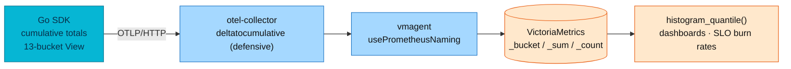

# Histograms & Temporality

> How an OpenTelemetry **histogram** actually works — bucket mechanics,
> explicit vs **exponential** buckets, delta vs **cumulative** temporality —
> and why this platform pins one explicit bucket set fleet-wide instead of
> letting each service choose. Authoring rules (which buckets, which View)
> live in [`docs/api/metrics.md`](../../api/metrics.md); this doc explains the
> machinery underneath them.

| | |
|---|---|
| **Platform histogram type** | Explicit buckets, pinned by `pkg/obsx` Views |
| **Duration buckets** | 13 values, `0.005 … 10` s (SLO-tuned) |
| **Temporality** | Cumulative (SDK default; RFC-0017 D-7) |
| **Percentiles computed by** | VictoriaMetrics (`histogram_quantile()` over `_bucket` series) |
| **Exponential histograms** | Not used — rationale below |

---

## Bucket mechanics

A histogram compresses a stream of measurements into counts-per-range so the
backend can answer "what is p95?" without storing every value.

- A boundary array of **N** values defines **N+1 buckets**. Each bucket spans
  `(lower, upper]` — exclusive of its lower bound, inclusive of its upper —
  and the final bucket is the implicit **overflow** `(max, +∞)`.
- Each exported data point carries **Count**, **Sum**, the per-bucket counts,
  and optionally **Min**/**Max**. On the Prometheus wire this becomes the
  familiar `_bucket{le=…}` / `_sum` / `_count` triplet (cumulative `le`
  buckets).
- **The SDK never computes percentiles.** The backend interpolates them from
  bucket counts — so a percentile is only as precise as the boundaries around
  it. If p95 lands between `le=1` and `le=2`, the backend can only
  linearly guess inside that band.

That last point is the entire reason bucket choice matters, and why the
platform's 13-bucket set clusters precision around the 500 ms SLO threshold
(`0.2, 0.3, 0.5, 0.75`) — see the
[per-bucket purpose table](../../api/metrics.md#histogram-buckets).

## One stream per attribute set

The SDK keeps a **separate histogram stream for every unique attribute
combination**: `{method=GET, route=/products/:id, status=200}` and the same
route with `status=500` are two full sets of bucket series. With 13+2
boundaries that is ~16 series *per combination* — which is why:

- attribute values must be **bounded enumerations** (route templates, not raw
  paths; reasons, not IDs);
- a single `user_id` attribute would multiply the whole bucket set per user —
  the platform forbids it outright
  ([cross-signal data policy](../../api/observability.md#cross-signal-data-and-privacy-policy));
- the fleet-wide series math (49–720 series per service today, bounded
  worst case) is tracked in
  [streaming-aggregation.md § The cardinality math](streaming-aggregation.md#the-cardinality-math).

## Explicit vs exponential buckets

| | Explicit buckets | Exponential buckets |
|---|-----------------|---------------------|
| Boundaries | Hand-picked array, fixed at instrument/View level | Computed from a **`scale`** parameter — higher scale ⇒ more, narrower buckets |
| Long tail | Needs filler boundaries you must predict up front | Handled natively — buckets widen exponentially, p99 of a spiky tail stays accurate |
| Adaptivity | None — wrong guesses blunt percentiles until someone re-tunes | SDK **auto-downscales** per export to keep bucket count under the configured cap (bucket count drives memory) |
| Cross-service comparability | Guaranteed *if* everyone uses the same array | Depends on scale negotiation; comparisons need backend support |
| Backend support | Universal (Prometheus lineage) | Uneven — needs native-histogram-aware storage and query |

Exponential histograms solve a real problem — "I don't know my distribution
yet, and it changes" — by replacing bucket planning with a formula: bucket `i`
spans `(base^i, base^(i+1)]` where `base = 2^(2^-scale)`.

**Why this platform stays on explicit buckets (deliberate, not inertia):**

1. **The distribution is known and contractual.** Request latency targets are
   SLO-driven; precision belongs at fixed thresholds (0.5 s, 2 s Apdex), not
   spread adaptively.
2. **Cross-service `histogram_quantile()` comparisons are a platform
   feature** — one pinned array means every service's p95 is computed from
   identical bands. Divergent buckets are classified as a defect
   (RFC-0013 D3, RFC-0014 D-7).
3. **The storage path is classic Prometheus-shaped** — vmagent ingests OTLP
   and renders `_bucket{le=…}` series; the platform's dashboards, alerts, and
   burn-rate math are all built on that form.

Revisit only if a workload appears whose latency spans many orders of
magnitude with no fixed SLO threshold — and then as an RFC, because it
changes the query layer too.

## Temporality: delta vs cumulative

Every metric stream declares how its numbers relate to time:

| | Cumulative | Delta |
|---|-----------|-------|
| Each export contains | Running total **since process start** | Change **since the previous export** |
| Missed export | Harmless — next point still carries the total | That interval's data is gone |
| Backend work | Backend computes rates (`rate()` handles resets) | Backend must re-aggregate; simpler SDK memory |
| Fits | Prometheus-lineage storage (VictoriaMetrics) | Backends that aggregate server-side |

**Platform contract: cumulative** — the Go SDK default and what
VictoriaMetrics' `rate()`/`increase()` assume (RFC-0017 D-7). The collector's
`deltatocumulative` processor on the metrics pipeline is **defensive**: if any
future SDK or tool ever emitted delta points, they would be converted rather
than silently stored — a delta sample in VictoriaMetrics doesn't error, it
just makes `rate()` lie. Services never set
`OTEL_EXPORTER_OTLP_METRICS_TEMPORALITY_PREFERENCE`.

## Practices that keep histograms honest

- **Label with context, not identity** — a bounded `reason`/`payload_type`
  attribute turns "p90 is high" into "p90 of `user_data` payloads is
  spiking"; an ID attribute turns your histogram into a memory leak.
- **Change buckets through the shared View only** (`pkg/obsx`) — a service
  hand-tuning its own boundaries silently breaks fleet-wide quantiles even
  though "it works".
- **Alert on histogram-derived SLIs** (burn rates over `_bucket` ratios), not
  on raw averages — `_sum/_count` hides the tail.
- **Declare the unit in metadata** (`WithUnit("s")`), never in the
  instrument name — the ingest naming policy renders the suffix.
- Business histograms reuse the platform duration buckets unless the measured
  quantity is not a duration — see
  [`docs/api/metrics.md § Business metrics`](../../api/metrics.md#business-metrics-custom).

## References

- [OTel metrics data model](https://opentelemetry.io/docs/specs/otel/metrics/data-model/) · [Exponential histograms (OTEP-0149)](https://opentelemetry.io/docs/specs/otel/metrics/data-model/#exponentialhistogram) · [Aggregation temporality](https://opentelemetry.io/docs/specs/otel/metrics/data-model/#temporality)
- In-house: [Application metrics contract](../../api/metrics.md) · [Streaming aggregation](streaming-aggregation.md) · [PromQL guide](promql-guide.md) · [Metrics hub](README.md)

---

_Last updated: 2026-07-29 — initial histogram & temporality fundamentals; platform values verified against `pkg/obsx` and the collector manifest._
