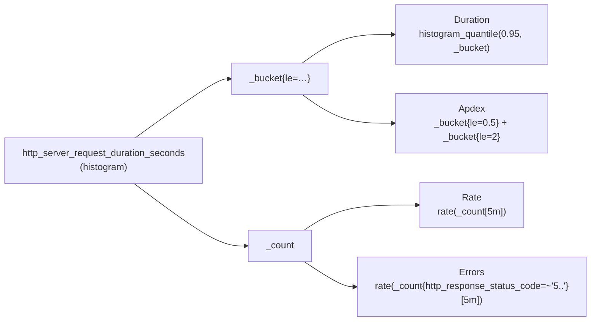
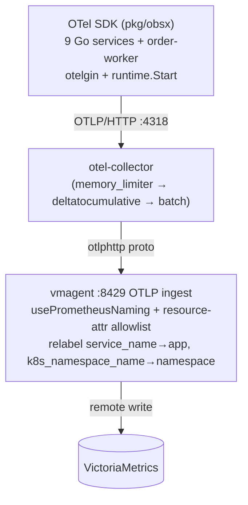

# Application Metrics (RED)

The **application layer** of the metrics pillar: the RED signals (Rate, Errors,
Duration) for the 9 Go microservices and their gRPC east-west calls, plus Go
runtime health and the instrumentation that produces it. Since the RFC-0014 P3
cutover these metrics are **pushed over OTLP** (no `/metrics` scrape); names and
labels follow OpenTelemetry semantic conventions. For methodology theory, the
stack, and the other layers, start at the [metrics hub](README.md).

| | |
|---|---|
| **Source** | OTLP push — each service's OTel SDK (`pkg/obsx`) exports to `otel-collector`; **no app `/metrics` scrape** |
| **Core metric** | `http_server_request_duration_seconds` (histogram) — single source of RED |
| **East-west** | gRPC RED on the *same* OTLP stream via `pkg/obsx` / `pkg/grpcx` |
| **App labels** | `http_request_method`, `http_route`, `http_response_status_code` |
| **Provenance** | `app` / `namespace` from OTLP resource attributes + vmagent relabel |
| **Correlation** | `trace_id` field in VictoriaLogs + Tempo (exemplars lost — [D-14](../../proposals/rfc/RFC-0014/README.md)) |
| **Dashboard** | Microservices dashboard (see [§ Dashboard](#dashboard)) |

---

## Overview

Microservices are request-driven, so they are measured with the **RED method**.
The design principle, shared by every large-scale platform (Uber M3, Grab,
Google SRE), is **one histogram = three signals**: a single
`http_server_request_duration_seconds` observation per request yields Rate,
Errors, and Duration, plus SLO compliance and Apdex — no redundant counters.
East-west gRPC calls follow the identical model on the same OTLP export.

The instrument names and labels are OpenTelemetry semantic conventions
(`http.server.request.duration`, `http.request.method`, `http.route`,
`http.response.status_code`), translated to their PromQL form by vmagent's
`usePrometheusNaming` on ingest.

## Custom application metrics

Three HTTP metrics are emitted by the shared observability wiring (`pkg/obsx`,
which installs the `otelgin` middleware). All also carry the OTLP
resource-attribute labels (`app`, `namespace`, `k8s_pod_name`, …); only the
per-request semconv labels are listed below.

| Metric | Type | App labels | Purpose |
|--------|------|------------|---------|
| `http_server_request_duration_seconds` | Histogram | `http_request_method`, `http_route`, `http_response_status_code` | RED core — Rate (`_count`), Errors (`_count`+status), Duration (`_bucket`) |
| `http_server_request_body_size_bytes` | Histogram | `http_request_method`, `http_route`, `http_response_status_code` | Request body size; RX bytes/s via `_sum` |
| `http_server_response_body_size_bytes` | Histogram | `http_request_method`, `http_route`, `http_response_status_code` | Response body size; TX bytes/s via `_sum` |

> **Saturation (in-flight) is not emitted.** The scrape era had a
> `requests_in_flight` gauge (4th Golden Signal). Its semconv successor
> `http.server.active_requests` is **not emitted by `otelgin` v0.69** (verified
> live 2026-07-09), so the metric and its two saturation alerts were retired at
> the cutover. Re-add once upstream ships it; until then, saturation is inferred
> from cAdvisor working-set + goroutine trends.

### One histogram → three signals

`http_server_request_duration_seconds` is the single source of truth for RED. An
OTLP-exported histogram carries `_bucket`, `_count`, and `_sum` sub-metrics
after Prometheus naming, so one observation per request covers everything:



| RED signal | PromQL | Sub-metric |
|-----------|--------|------------|
| **Rate** | `rate(http_server_request_duration_seconds_count{app!=""}[5m])` | `_count` |
| **Errors** | `rate(http_server_request_duration_seconds_count{app!="", http_response_status_code=~"5.."}[5m])` | `_count` + status |
| **Duration** (P95) | `histogram_quantile(0.95, rate(http_server_request_duration_seconds_bucket{app!=""}[5m]))` | `_bucket` |
| Error rate % | `(errors / rate) * 100` | `_count` ratio |
| Apdex | `(satisfied + 0.5 * tolerating) / total` | `_bucket{le="0.5"}`, `_bucket{le="2"}` |

### Histogram buckets

`http_server_request_duration_seconds` buckets are **SLO-tuned** with extra
precision around the 500 ms latency threshold:
`0.005, 0.01, 0.025, 0.05, 0.1, 0.2, 0.3, 0.5, 0.75, 1, 2, 5, 10`.

This is the **canonical fleet bucket set** — pinned by an explicit SDK
**View** in `pkg/obsx` (RFC-0014 D-7), because the semconv *advised* bucket
boundaries lack `le=2` (Apdex *tolerating*) and the 0.2/0.3 SLO precision
points. Every service must use exactly these values; divergent buckets break
cross-service `histogram_quantile()` comparisons and blunt SLO precision
([RFC-0013](../../proposals/rfc/RFC-0013/README.md),
[RFC-0014](../../proposals/rfc/RFC-0014/README.md)).

| Bucket (s) | Purpose |
|------------|---------|
| 0.005, 0.01, 0.025 | Fast responses (cache hits, health checks) |
| 0.05, 0.1 | Typical DB queries |
| **0.2, 0.3** | Precision zone before the SLO threshold |
| **0.5** | SLO latency threshold; Apdex *satisfying* boundary |
| **0.75** | Precision zone after the SLO threshold |
| 1 | Slow responses |
| **2** | Apdex *tolerating* boundary |
| 5, 10 | Timeouts, degraded responses |

`http_server_request_body_size_bytes` / `http_server_response_body_size_bytes`
use a byte-bucket View (`100, 1000, 10000, 100000, 1000000`) — semconv gives no
size-bucket advice — and measure the HTTP body only (not TCP/IP, headers, or
TLS overhead).

## Labels & provenance

Application code sets **only the semconv per-request attributes**
(`http.request.method`, `http.route`, `http.response.status_code`); the SDK's
`Resource` carries identity (`service.name`, `k8s.namespace.name`,
`k8s.pod.name`, …). vmagent promotes a fixed allowlist of resource attributes to
labels on ingest and relabels the two the whole platform groups by.

| Label | Source | Example | Added by |
|-------|--------|---------|----------|
| `http_request_method` | HTTP request | `GET` | Application (otelgin) |
| `http_route` | Route pattern | `/api/v1/users/:id` | Application (otelgin) |
| `http_response_status_code` | Status code | `200` | Application (otelgin) |
| `app` | `service.name` resource attr | `auth` | **vmagent relabel** |
| `namespace` | `k8s.namespace.name` resource attr | `auth` | **vmagent relabel** |
| `k8s_pod_name` | `k8s.pod.name` resource attr | `auth-7d4c…` | **vmagent** (promoted) |

vmagent's OTLP ingest runs with a **deliberately narrow** resource-attribute
allowlist (`promoteAllResourceAttributes: false`) so the SDK-default
`service.instance.id` / `process.pid` don't re-mint every series on each
restart:

```yaml
# kubernetes/infra/configs/observability/metrics/victoriametrics/vmagent.yaml
extraArgs:
  opentelemetry.usePrometheusNaming: "true"          # http.server.request.duration → http_server_request_duration_seconds_*
  opentelemetry.promoteAllResourceAttributes: "false"
  opentelemetry.promoteResourceAttributes: "service.name,service.version,k8s.namespace.name,k8s.pod.name,deployment.environment.name"
  opentelemetry.promoteScopeMetadata: "false"        # otel_scope_* labels have no consumer
inlineRelabelConfig:
  - { action: replace, source_labels: [service_name],        regex: "(.+)", target_label: app }
  - { action: replace, source_labels: [k8s_namespace_name], regex: "(.+)", target_label: namespace }
```

The `regex: "(.+)"` guard means the relabel only fires on OTLP-pushed series
(empty `service_name` never matches), so scraped infra series keep their own
`app`/`namespace`. New services need **no** registration — they inherit the
pipeline the moment their SDK points at the collector.



> **No app `/metrics` scrape exists anymore.** The scrape-era `ServiceMonitor`
> (`app.kubernetes.io/component: api`) and the order-worker `PodMonitor` were
> retired at the P3 cutover. vmagent scraping / ServiceMonitors remain **only
> for infra exporters** (postgres/pg_exporter, kube-state-metrics, cAdvisor,
> collector self-telemetry) — those legitimately stay on pull. The RFC once
> designed a `legacy-checkout` scrape fence; checkout-service was never deployed
> and ADR-016 dropped the fence at landing.

## App-side cardinality control

Two application-level rules keep series count bounded and predictable:

**Route normalization** — `otelgin` sets `http_route` from the **matched route
pattern**, not the raw URL, so IDs don't explode cardinality:

| Approach | Example | Cardinality |
|----------|---------|-------------|
| Raw URL | `/api/v1/products/123`, `/456`, … | **Unbounded** |
| Route pattern (`http.route`) | `/api/v1/products/:id` | **Bounded** (~20 routes) |

With the original 8 services × ~20 routes × 3 methods × 5 status codes ≈ **2,400 series**
(payment adds a small increment) — bounded and predictable.
Measured (2026-07-06, one replica per service, live traffic): **49–720 series
per service, Σ 2,777** across the 9 services — histogram label sets materialize
lazily, so this grows toward the worst-case bound of ~1,800 series/replica
(~48 route×status combos × 32 histogram series + runtime). Bounded and
predictable either way; the full model and at-scale projection live in the
[streaming-aggregation playbook](streaming-aggregation.md#the-cardinality-math).

**Forbidden as label values** (unbounded or request-scoped — these belong in
logs/traces, never metrics): `user_id`, `request_id`, `trace_id`, `session_id`,
`email`, IP addresses, raw URL paths, order/cart/payment IDs, pod UID, image
SHA.

**No-drift rule** — the observability wiring lives in the shared `pkg/obsx`
`SetupObservability` (instrument names, buckets, Views, resource attributes),
so all 9 services and order-worker instrument identically by construction. A
service pinning a different `pkg/obsx` version or overriding a View is a defect
even if it "works" (see RFC-0013 D3, RFC-0014 D-7).

**Infrastructure-endpoint filtering** — `/health`, `/ready`, `/metrics`,
`/readiness`, `/liveness` are excluded from HTTP instrumentation, so metrics
reflect real user traffic with lower cardinality and accurate latency
percentiles.

## Go runtime metrics

Emitted by the OpenTelemetry Go runtime instrumentation (`runtime.Start`,
started by `pkg/obsx`; no per-handler code). They carry only the resource-attr
labels and are exported every ~15 s — traffic-independent, which is why they
double as the availability heartbeat (see [§ Availability](#availability--the-heartbeat-not-up)).

| Metric | Type | Purpose |
|--------|------|---------|
| `go_goroutine_count` | Gauge | Active goroutines; steady increase ⇒ goroutine leak. Also the liveness heartbeat |
| `go_memory_used_bytes` | Gauge | Runtime memory in use (carries a `go_memory_type` label = `stack`/`other`); steady post-GC growth ⇒ leak |
| `go_memory_gc_goal_bytes` | Gauge | Heap size that triggers the next GC; compared against `go_memory_used_bytes` for GC-thrash |
| `go_memory_limit_bytes` | Gauge | Soft memory limit (`GOMEMLIMIT`), if set |
| `container_memory_working_set_bytes` | Gauge (cAdvisor) | Limits-aware RSS — the OTel runtime set has **no** process-RSS metric, so memory alerting moved here (an improvement: it tracks the Kyverno-mandated container limit, not a fixed byte threshold) |

> **Gone with the scrape:** the Prometheus Go-client families
> (`go_memstats_*`, `process_resident_memory_bytes`, `process_cpu_seconds_total`,
> `go_threads`) are **not** part of the OTel runtime set and are no longer
> emitted. There is likewise **no GC-pause metric** in the OTel Go runtime
> instrumentation (verified live 2026-07-09) — the old
> `go_gc_duration_seconds_*` has no successor.

## gRPC instrumentation (east-west)

> **Status: live.** gRPC is the official east-west (service-to-service)
> transport. Services export gRPC RED metrics via the shared `pkg/obsx` /
> `pkg/grpcx` helpers on the **same OTLP stream** as HTTP, so the standard
> resource-attr labels are present. No separate export path and no extra port.

Names are already OpenTelemetry semantic conventions (no rename at the cutover —
the transport simply gained pre-aggregation and alerting); the one-histogram
model applies per RPC method.

**Server side** — `rpc_server_call_duration_seconds_{count,bucket,sum}`:

| Label | Example | Notes |
|-------|---------|-------|
| `rpc_method` | `shipping.v1.ShippingService/GetShipmentByOrder` | Fully-qualified RPC |
| `rpc_response_status_code` | `OK` | gRPC status; non-`OK` = error |
| `rpc_system_name` | `grpc` | Constant |
| `app` / `namespace` | `shipping` / `shipping` | From OTLP resource attributes (vmagent relabel) |

**Client side** — `rpc_client_call_duration_seconds_{count,bucket,sum}`: as above
plus `server_address` and `server_port` (the upstream called), minus
`rpc_system_name`.

`pkg/grpcx` installs `otelgrpc` client/server interceptors so gRPC spans
propagate trace context end-to-end alongside HTTP spans. For the transport
design, dual-port services, health checks, and resilience defaults see
[**API → gRPC internal comms**](../../api/grpc-internal-comms.md).

## Instrumentation

Observability is wired once, in the shared `pkg/obsx.SetupObservability`, called
from each service's `cmd/main.go`. It configures the OTel `MeterProvider` with
the platform Views (13-bucket duration, byte buckets), installs the `otelgin`
HTTP middleware, starts `runtime.Start` for the Go runtime metrics, and points
the OTLP/HTTP exporter at `otel-collector`. There is **no hand-written
Prometheus middleware and no `promauto` registry** anymore — the SDK emits the
semconv instruments and vmagent translates the names on ingest.

The middleware chain is **tracing → logging → metrics**; because tracing runs
first, the active span (and its `trace_id`) is on the request context by the
time the metrics and logs are recorded, which is what enables cross-signal
correlation below.

gRPC RED + tracing come from the `pkg/grpcx` interceptors. Route shapes,
audiences, and SLO conventions: [API reference](../../api/api.md).

## Correlation: metrics ↔ traces ↔ logs

> **Exemplars are not available on this platform (RFC-0014 D-14).**
> VictoriaMetrics does not support exemplars (upstream won't-fix), and they were
> already dead end-to-end under the previous pipeline. There is **no**
> "click the exemplar dot → jump to the trace" path, and the histogram is
> recorded without `ObserveWithExemplar`.

Correlation is instead done through the shared `trace_id`:

1. A latency or error spike shows on a RED panel (`http_server_request_duration_seconds`).
2. Pivot to **VictoriaLogs** for the same `app`/`namespace`/time window; every
   log line carries a `trace_id` field (populated because tracing middleware
   runs before logging — see above). This is what P4 fixed: `trace_id` is now a
   first-class, queryable log field.
3. Follow that `trace_id` into **Tempo** for the full distributed trace, and
   back to logs via the Tempo↔logs datasource link.

So the loop is metric → logs (by label + time) → `trace_id` → Tempo, rather than
metric → exemplar → trace.

## Memory leak & GC diagnosis

The Go Runtime row of the dashboard supports systematic diagnosis:

| Memory | Goroutines | GC pressure | Diagnosis | Action |
|--------|------------|-------------|-----------|--------|
| ↑↑↑ | → | used ≈ goal | **Heap leak** | Caches without eviction, global maps, unclosed resources |
| →/↑ | ↑↑↑ | → | **Goroutine leak** | Forgotten `defer cancel()`, unclosed channels, blocking ops |
| ↑↓ | ↑↓ | used ≈ goal | **High load** (OK) | Traffic up, app coping — not a leak |
| → | → | headroom | **Healthy** | No action |

Workflow: watch `go_memory_used_bytes` and cAdvisor
`container_memory_working_set_bytes` — sustained climb ⇒ heap leak; watch
`go_goroutine_count` — steady climb ⇒ goroutine leak; confirm GC pressure by
comparing `go_memory_used_bytes` against `go_memory_gc_goal_bytes` (persistently
within a few percent means the collector is running back-to-back). The
`MicroserviceGCThrash` alert encodes exactly this used-vs-goal comparison, since
no GC-pause metric exists.

## Availability — the heartbeat, not `up`

Under OTLP push there is **no `up{job="microservices"}`** (that series was a
scrape artifact). Liveness is derived from the runtime heartbeat: `go_goroutine_count`
is exported every ~15 s regardless of traffic. A pod is "down" when its
heartbeat series existed in the last 15 m but no longer does:

```promql
count by (app, namespace, k8s_pod_name) (last_over_time(go_goroutine_count{app!=""}[15m]))
  unless
count by (app, namespace, k8s_pod_name) (go_goroutine_count{app!=""})
```

VictoriaMetrics keeps returning the last sample for ~5 m (staleness window), so
detection **lags a pod kill by about 5 minutes** — accepted in RFC-0014 D-4 and
verified by the P3 pod-kill test. The push pipeline itself is now an availability
dependency, so a collector export-failure alert
(`otelcol_exporter_send_failed_metric_points_total`) runs alongside to
disambiguate "service down" from "pipeline broken".

## Dashboard

The **Microservices dashboard** (RED + Golden Signals) groups panels into:
Overview & key metrics, Traffic & requests, Errors & performance, Go runtime &
memory, Resources & infrastructure, and **gRPC East-West (RED)** (server/client
RPS, error rate, P95 by `rpc_method`).

Which metric powers which panels:

| Metric | Used by |
|--------|---------|
| `http_server_request_duration_seconds_count` | RPS, success/error rate, status distribution, per-endpoint, 4xx/5xx |
| `http_server_request_duration_seconds_bucket` | P50/P95/P99, Apdex |
| `http_server_request_body_size_bytes_sum` / `http_server_response_body_size_bytes_sum` | Network RX / TX |
| `rpc_{server,client}_call_duration_seconds_*` | gRPC East-West row |
| `go_goroutine_count` / `go_memory_used_bytes` / `container_memory_working_set_bytes` | Runtime, memory, liveness heartbeat |
| `kube_pod_container_status_restarts_total` | Restarts (kube-state-metrics) |

Variables: `$DS_PROMETHEUS`, `$namespace`, `$app` (cascades from `$namespace`,
keyed off `go_goroutine_count`), `$rate`. See
[Grafana Dashboard Guide](../grafana/dashboard-reference.md) and
[Variables & Regex Guide](../grafana/variables.md). For `$rate` vs `$__range` and
counter-reset handling, see the [PromQL Guide](promql-guide.md).

## Troubleshooting — cardinality

Symptoms: slow PromQL, high-cardinality warnings, high VictoriaMetrics memory.

```promql
count by (__name__) ({app!=""})                           # series per metric (target < 5000)
count(count by (http_route) ({app!=""}))                  # unique routes (target < 30/service)
topk(10, count by (__name__) ({app!=""}))                 # worst offenders
```

Prevention: route normalization (`http_route` from the matched pattern) keeps
routes bounded; the vmagent resource-attr allowlist blocks
`service.instance.id` / `process.pid` re-minting; never put raw IDs, emails, or
IPs in labels.

## Manifest index

The app metrics now arrive by **OTLP push**, so this layer owns the ingest and
consumer config, not a scrape config. The alert and recording rules that consume
these metrics are catalogued (with counts and production impact) in the
[Alert Catalog](../alerting/alert-catalog.md).

| Manifest (under `kubernetes/infra/configs/observability/`) | Purpose |
|------|---------|
| `victoriametrics/vmagent.yaml` | OTLP ingest args (`usePrometheusNaming`, resource-attr allowlist) + `service_name→app` / `k8s_namespace_name→namespace` relabel |
| `prometheusrules/microservices/recording-rules.yaml` | RED/latency/Apdex/bandwidth + gRPC pre-aggregation under the `app:` / `app_route:` prefixes |
| `prometheusrules/microservices/alerts.yaml` | RED/Golden + runtime + D-4 heartbeat-absence + collector-pipeline alerts |

The `otel-collector` deployment (metrics pipeline) and the SDK exporter config
live with the [OpenTelemetry](../opentelemetry.md) setup. There is no app
`ServiceMonitor` — scrape configs remain only for infra exporters.

- **Alerts + recording rules** — see
  [Alert Catalog → Microservices](../alerting/alert-catalog.md#1-microservices-red-metrics)
  and [Alerting Strategy](../alerting/README.md#layer-1-threshold-alerts-immediate-detection).
- **SLOs** — rendered per service by the `mop` chart (not a repo path) and
  expanded by Sloth into burn-rate alerts. See [SLO docs](../slo/README.md).

Runbook: [`microservices-alerts.md`](../runbooks/microservices-alerts.md).

## References

- [Metrics hub](README.md) · [Infrastructure metrics (USE)](metrics-infra.md) · [Database metrics](postgresql/monitoring.md)
- [OpenTelemetry setup](../opentelemetry.md) · [RFC-0014: full OpenTelemetry adoption](../../proposals/rfc/RFC-0014/README.md)
- [API → gRPC internal comms](../../api/grpc-internal-comms.md) · [API reference](../../api/api.md)
- [PromQL Guide](promql-guide.md) · [SLO Documentation](../slo/README.md)
- [Grafana Dashboard Guide](../grafana/dashboard-reference.md) · [Variables & Regex Guide](../grafana/variables.md)

---

_Last updated: 2026-07-09 — RFC-0014 P5: rewritten for the OTLP-push semconv reality (metric/label renames, push pipeline, exemplars-lost correlation via trace_id, heartbeat availability, in-flight/GC-pause metrics retired)._
</content>
</invoke>
