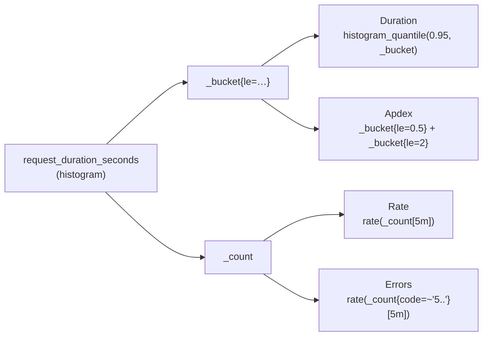
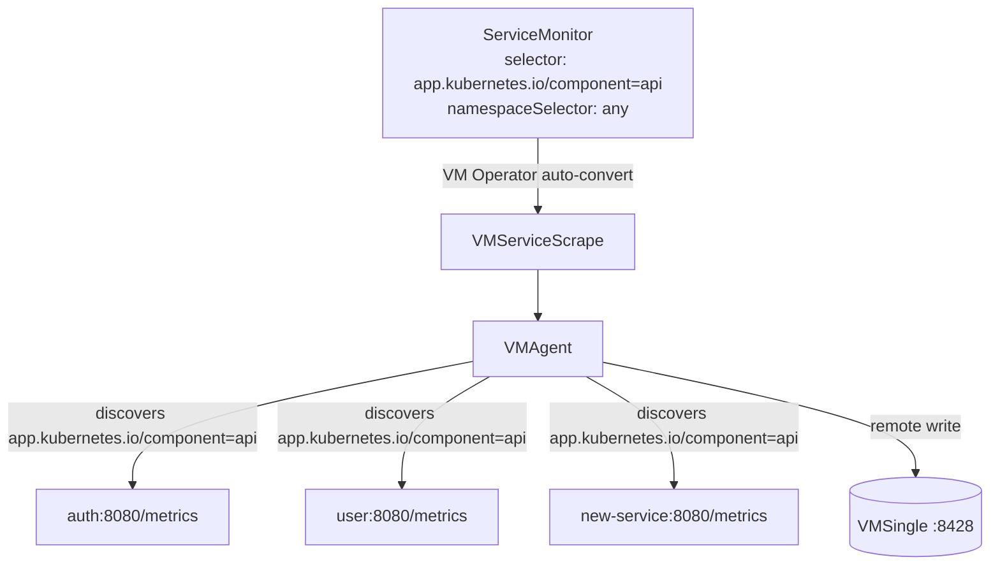

# Application Metrics (RED)

The **application layer** of the metrics pillar: the RED signals (Rate, Errors,
Duration) for the 9 Go microservices and their gRPC east-west calls, plus Go
runtime health and the instrumentation that produces it. For methodology theory,
the stack, and the other layers, start at the [metrics hub](README.md).

| | |
|---|---|
| **Source** | Each service's `/metrics` (HTTP `:8080`) — Prometheus Go client |
| **Core metric** | `request_duration_seconds` (histogram) — single source of RED |
| **East-west** | gRPC RED on the *same* `/metrics` via `pkg/obsx` |
| **App labels** | `method`, `path`, `code` (target labels injected by VMAgent) |
| **Correlation** | `traceID` exemplars on the histogram → Tempo |
| **Dashboard** | Microservices dashboard (see [§ Dashboard](#dashboard)) |

---

## Overview

Microservices are request-driven, so they are measured with the **RED method**.
The design principle, shared by every large-scale platform (Uber M3, Grab,
Google SRE), is **one histogram = three signals**: a single
`request_duration_seconds` observation per request yields Rate, Errors, and
Duration, plus SLO compliance and Apdex — no redundant counters. East-west gRPC
calls follow the identical model on the same endpoint.

## Custom application metrics

Four metrics are emitted by application middleware. All also carry the four
VMAgent-injected target labels (`app`, `namespace`, `job`, `instance`); only the
application-set labels are listed below.

| Metric | Type | App labels | Purpose |
|--------|------|------------|---------|
| `request_duration_seconds` | Histogram | `method`, `path`, `code` | RED core — Rate (`_count`), Errors (`_count`+`code`), Duration (`_bucket`) |
| `requests_in_flight` | Gauge | `method`, `path` | Saturation (4th Golden Signal) — concurrent requests |
| `request_size_bytes` | Histogram | `method`, `path`, `code` | Request body size; RX bytes/s via `_sum` |
| `response_size_bytes` | Histogram | `method`, `path`, `code` | Response body size; TX bytes/s via `_sum` |

### One histogram → three signals

`request_duration_seconds` is the single source of truth for RED. A Prometheus
histogram automatically exposes `_bucket`, `_count`, and `_sum` sub-metrics, so
one `.Observe()` call per request covers everything:



| RED signal | PromQL | Sub-metric |
|-----------|--------|------------|
| **Rate** | `rate(request_duration_seconds_count{job="microservices"}[5m])` | `_count` |
| **Errors** | `rate(request_duration_seconds_count{job="microservices", code=~"5.."}[5m])` | `_count` + `code` |
| **Duration** (P95) | `histogram_quantile(0.95, rate(request_duration_seconds_bucket{job="microservices"}[5m]))` | `_bucket` |
| Error rate % | `(errors / rate) * 100` | `_count` ratio |
| Apdex | `(satisfied + 0.5 * tolerating) / total` | `_bucket{le="0.5"}`, `_bucket{le="2"}` |

### Histogram buckets

`request_duration_seconds` buckets are **SLO-tuned** with extra precision around
the 500 ms latency threshold:
`0.005, 0.01, 0.025, 0.05, 0.1, 0.2, 0.3, 0.5, 0.75, 1, 2, 5, 10`.

This is the **canonical fleet bucket set** — every service must use exactly
these values. Divergent buckets break cross-service `histogram_quantile()`
comparisons and blunt SLO precision (cart drifted once:
[RFC-0013](../../proposals/rfc/RFC-0013/README.md) D1).

| Bucket (s) | Purpose |
|------------|---------|
| 0.005, 0.01, 0.025 | Fast responses (cache hits, health checks) |
| 0.05, 0.1 | Typical DB queries |
| **0.2, 0.3** | Precision zone before the SLO threshold |
| **0.5** | SLO latency threshold; Apdex *satisfying* boundary |
| **0.75** | Precision zone after the SLO threshold |
| 1 | Slow responses |
| **2** | Apdex *tolerating* boundary |
| 5, 10 | Timeouts, degraded responses |

`request_size_bytes` / `response_size_bytes` use byte buckets
`100, 1000, 10000, 100000, 1000000` and measure the HTTP body only (not TCP/IP,
headers, or TLS overhead).

## Label injection & auto-discovery

Applications emit **only 3 labels**; VMAgent adds **4 target labels** at scrape
time. This keeps app code free of self-identification and lets a single
`ServiceMonitor` cover the whole fleet.

```go
// middleware/prometheus.go (each service repo)
requestDuration = promauto.NewHistogramVec(
    prometheus.HistogramOpts{Name: "request_duration_seconds", ...},
    []string{"method", "path", "code"}, // only 3 labels
)
```

| Label | Source | Example | Added by |
|-------|--------|---------|----------|
| `method` | HTTP request | `GET` | Application |
| `path` | Route pattern | `/api/v1/users/:id` | Application |
| `code` | Status code | `200` | Application |
| `app` | Pod/service label | `auth` | **VMAgent** |
| `namespace` | Namespace | `auth` | **VMAgent** |
| `job` | ServiceMonitor relabel | `microservices` | **VMAgent** |
| `instance` | Pod IP:port | `10.244.1.5:8080` | **VMAgent** |

A **single ServiceMonitor** discovers every microservice via label match in any
namespace, so new services (deployed with the `mop` chart, which sets
`app.kubernetes.io/component: api`) are scraped with no manual registration:

```yaml
# kubernetes/infra/configs/monitoring/servicemonitors/microservices.yaml
apiVersion: monitoring.coreos.com/v1
kind: ServiceMonitor
metadata: { name: microservices-api, namespace: monitoring }
spec:
  namespaceSelector: { any: true }
  selector: { matchLabels: { app.kubernetes.io/component: api } }
  endpoints:
    - port: http
      path: /metrics
      interval: 15s
      relabelings:
        - { replacement: microservices, targetLabel: job }
        - { sourceLabels: [__meta_kubernetes_service_label_app], targetLabel: app }
        - { sourceLabels: [__meta_kubernetes_namespace], targetLabel: namespace }
```



The unified `job="microservices"` label (set by relabeling) gives a single
filter for all services while `app` identifies each one — backward-compatible
with existing dashboard queries and scalable as services are added.

## App-side cardinality control

Two application-level rules keep series count bounded and predictable:

**Path normalization** — label `path` uses the registered **route pattern**, not
the raw URL, so IDs don't explode cardinality:

```go
path := c.FullPath() // "/api/v1/products/:id" (bounded), not "/api/v1/products/123"
if path == "" { path = "unknown" } // 404 / unmatched
```

| Approach | Example | Cardinality |
|----------|---------|-------------|
| Raw URL | `/api/v1/products/123`, `/456`, … | **Unbounded** |
| Route pattern (`c.FullPath()`) | `/api/v1/products/:id` | **Bounded** (~20 routes) |

With the original 8 services × ~20 routes × 3 methods × 5 status codes ≈ **2,400 series**
(payment adds a small increment) — bounded and predictable.
Measured (2026-07-06, one replica per service, live traffic): **49–720 series
per service, Σ 2,777** across the 9 services — histogram label sets materialize
lazily, so this grows toward the worst-case bound of ~1,800 series/replica
(~48 route×code combos × 32 histogram series + ~250 runtime). Bounded and
predictable either way; the full model and at-scale projection live in the
[streaming-aggregation playbook](streaming-aggregation.md#the-cardinality-math).

**Forbidden as label values** (unbounded or request-scoped — these belong in
logs/traces, never metrics): `user_id`, `request_id`, `trace_id`, `session_id`,
`email`, IP addresses, raw URL paths, order/cart/payment IDs, pod UID, image
SHA.

**No-drift rule** — `middleware/prometheus.go` is intentionally identical
across all 9 service repos (the order-service copy is the reference). Any
change must be replicated fleet-wide in the same change-set; a diverging copy
is a defect even if it "works" (see RFC-0013 D1/D4).

**Infrastructure-endpoint filtering** — `/health`, `/ready`, `/metrics`,
`/readiness`, `/liveness` return early in the middleware before any metric is
recorded. Metrics then reflect real user traffic, with lower cardinality and
~75% fewer datapoints, and accurate latency percentiles.

## Go runtime metrics

Exposed automatically by the Prometheus Go client (no app code). Carry only the
four target labels.

| Metric | Type | Purpose |
|--------|------|---------|
| `go_memstats_alloc_bytes` | Gauge | Heap allocated; grows without GC recovery ⇒ leak |
| `go_memstats_heap_inuse_bytes` | Gauge | Heap in-use; steady growth post-GC ⇒ leak |
| `process_resident_memory_bytes` | Gauge | Process RSS; OS-level leaks beyond Go heap |
| `go_goroutines` | Gauge | Active goroutines; steady increase ⇒ goroutine leak |
| `go_threads` | Gauge | OS threads; spike ⇒ blocking operations |
| `go_gc_duration_seconds_{sum,count}` | Counter | GC time / cycles; high ⇒ memory pressure |
| `go_memstats_frees_total` | Counter | Memory frees; high ⇒ frequent GC |
| `process_cpu_seconds_total` | Counter | CPU time; `rate()*100` for CPU % |

## gRPC instrumentation (east-west)

> **Status: live.** gRPC is the official east-west (service-to-service)
> transport. Services export gRPC RED metrics via the shared `pkg/obsx` helpers
> onto their **existing** `/metrics` endpoint — scraped by the *same*
> ServiceMonitor as HTTP, so the standard target labels are present. No separate
> scrape config and no extra port.

Metric names follow OpenTelemetry→Prometheus naming; the one-histogram model
applies per RPC method.

**Server side** — `rpc_server_call_duration_seconds_{count,bucket,sum}`:

| Label | Example | Notes |
|-------|---------|-------|
| `rpc_method` | `shipping.v1.ShippingService/GetShipmentByOrder` | Fully-qualified RPC |
| `rpc_response_status_code` | `OK` | gRPC status; non-`OK` = error |
| `rpc_system_name` | `grpc` | Constant |
| `app` / `namespace` | `shipping` / `shipping` | Injected by the ServiceMonitor |

**Client side** — `rpc_client_call_duration_seconds_{count,bucket,sum}`: as above
plus `server_address` and `server_port` (the upstream called), minus
`rpc_system_name`.

`pkg/grpcx` installs `otelgrpc` client/server interceptors so gRPC spans
propagate trace context end-to-end alongside HTTP spans. For the transport
design, dual-port services, health checks, and resilience defaults see
[**API → gRPC internal comms**](../../api/grpc-internal-comms.md).

## Instrumentation

Metrics are produced by a Gin middleware in each service repo
(`middleware/prometheus.go`). Order matters — tracing runs **first** so the
exemplar `traceID` is available when the histogram is observed:

```go
func PrometheusMiddleware() gin.HandlerFunc {
    return func(c *gin.Context) {
        if !shouldCollectMetrics(c.Request.URL.Path) { c.Next(); return } // filter infra endpoints
        start, method := time.Now(), c.Request.Method
        path := c.FullPath(); if path == "" { path = "unknown" }          // bounded cardinality

        requestsInFlight.WithLabelValues(method, path).Inc()
        c.Next()
        duration := time.Since(start).Seconds()
        statusCode := strconv.Itoa(c.Writer.Status())

        // Exemplar: attach traceID for metrics→traces correlation
        span := trace.SpanFromContext(c.Request.Context())
        if span.SpanContext().HasTraceID() {
            requestDuration.WithLabelValues(method, path, statusCode).(prometheus.ExemplarObserver).
                ObserveWithExemplar(duration, prometheus.Labels{"traceID": span.SpanContext().TraceID().String()})
        } else {
            requestDuration.WithLabelValues(method, path, statusCode).Observe(duration)
        }
        requestSize.WithLabelValues(method, path, statusCode).Observe(float64(c.Request.ContentLength))
        responseSize.WithLabelValues(method, path, statusCode).Observe(float64(c.Writer.Size()))
        requestsInFlight.WithLabelValues(method, path).Dec()
    }
}
```

Middleware order (`cmd/main.go`): `TracingMiddleware()` → `LoggingMiddleware()`
→ `PrometheusMiddleware()`. gRPC RED + tracing come from the shared `pkg/obsx` /
`pkg/grpcx` helpers. Route shapes, audiences, and SLO conventions:
[API reference](../../api/api.md).

## Exemplars: metrics → traces

Exemplars attach trace context to individual histogram observations, so Grafana
links a latency spike straight to the exact Tempo trace.

1. Open a histogram panel (P95/P99 response time).
2. Enable the **Exemplars** toggle in the panel query options.
3. Exemplar dots appear on the graph; click one to get the `traceID`, then click
   through to Tempo.

**Prerequisites**: the emit side is fully configured — VMSingle stores
exemplars natively, tracing middleware runs before Prometheus middleware, and
Grafana has the Tempo datasource. The Grafana **display** side (exemplar
toggle wired into the shipped RED dashboard panels) is still a pending item in
`TODO.md`; until then, enable the toggle manually per panel as described above.

## Memory leak detection

The Go Runtime row of the dashboard supports systematic leak diagnosis:

| Heap | Goroutines | GC | Diagnosis | Action |
|------|------------|-----|-----------|--------|
| ↑↑↑ | → | ↑↑ | **Heap leak** | Caches without eviction, global maps, unclosed resources |
| →/↑ | ↑↑↑ | → | **Goroutine leak** | Forgotten `defer cancel()`, unclosed channels, blocking ops |
| ↑↓ | ↑↓ | ↑↑ | **High load** (OK) | Traffic up, app coping — not a leak |
| → | → | → | **Healthy** | No action |

Workflow: check the three heap panels (`go_memstats_alloc_bytes`,
`go_memstats_heap_inuse_bytes`, `process_resident_memory_bytes`) → if all climb,
heap leak; check `go_goroutines` → steady climb means goroutine leak; confirm
with the GC panels.

## Dashboard

The **Microservices dashboard** (RED + Golden Signals) groups panels into:
Overview & key metrics, Traffic & requests, Errors & performance, Go runtime &
memory, Resources & infrastructure, and **gRPC East-West (RED)** (server/client
RPS, error rate, P95 by `rpc_method`).

Which metric powers which panels:

| Metric | Used by |
|--------|---------|
| `request_duration_seconds_count` | RPS, success/error rate, status distribution, per-endpoint, 4xx/5xx |
| `request_duration_seconds_bucket` | P50/P95/P99, Apdex |
| `requests_in_flight` | Requests in flight |
| `request_size_bytes_sum` / `response_size_bytes_sum` | Network RX / TX |
| `rpc_{server,client}_call_duration_seconds_*` | gRPC East-West row |
| Go runtime / `up` / `kube_pod_container_status_restarts_total` | Runtime, up, restarts |

Variables: `$DS_PROMETHEUS`, `$namespace`, `$app` (cascades from `$namespace`),
`$rate`. See [Grafana Dashboard Guide](../grafana/dashboard-reference.md) and
[Variables & Regex Guide](../grafana/variables.md). For `$rate` vs `$__range` and
counter-reset handling, see the [PromQL Guide](promql-guide.md).

## Troubleshooting — cardinality

Symptoms: slow PromQL, high-cardinality warnings, high VMSingle memory.

```promql
count by (__name__) ({job="microservices"})                      # series per metric (target < 5000)
count(count by (path) ({job="microservices"}))                   # unique paths (target < 30/service)
topk(10, count by (__name__) ({job="microservices"}))            # worst offenders
```

Prevention: path normalization (`c.FullPath()`) keeps `path` bounded; never put
raw IDs, emails, or IPs in labels.

## Manifest index

The metrics layer owns the **scrape config**; the alert and recording rules that
consume these metrics are owned by the alerting docs — the authoritative,
per-domain index (exact files, counts, and production impact) is the
[Alert Catalog](../alerting/alert-catalog.md).

| Manifest (under `kubernetes/infra/configs/monitoring/`) | Purpose |
|------|---------|
| `servicemonitors/microservices.yaml` | Single ServiceMonitor scraping every `app.kubernetes.io/component: api` service |

- **Alerts + recording rules** — the RED/Golden microservice alerts and the RED
  pre-aggregation rules (`prometheusrules/microservices/`): see
  [Alert Catalog → Microservices](../alerting/alert-catalog.md#1-microservices-red-metrics)
  and [Alerting Strategy](../alerting/README.md#layer-1-threshold-alerts-immediate-detection).
- **SLOs** — rendered per service by the `mop` chart (not a repo path) and
  expanded by Sloth into burn-rate alerts. See [SLO docs](../slo/README.md).

Runbook: [`microservices-alerts.md`](../runbooks/microservices-alerts.md).

## References

- [Metrics hub](README.md) · [Infrastructure metrics (USE)](metrics-infra.md) · [Database metrics](postgresql/monitoring.md)
- [API → gRPC internal comms](../../api/grpc-internal-comms.md) · [API reference](../../api/api.md)
- [PromQL Guide](promql-guide.md) · [SLO Documentation](../slo/README.md)
- [Grafana Dashboard Guide](../grafana/dashboard-reference.md) · [Variables & Regex Guide](../grafana/variables.md)

---

_Last updated: 2026-07-07 — RFC-0013 P1: measured cardinality baseline, canonical bucket set, forbidden-label list, no-drift rule, exemplar-status reconciliation._
