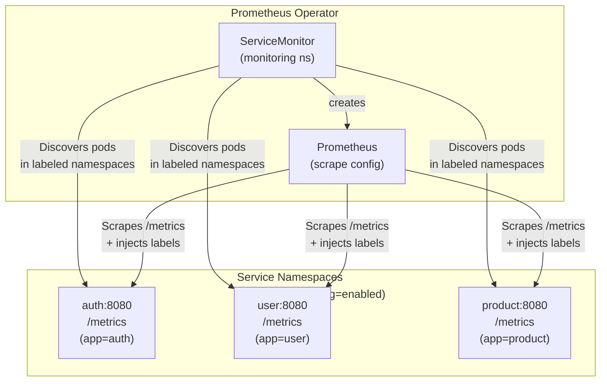

# Metrics Label Architecture (Prometheus Operator)

## Quick Summary

**Objectives:**
- Understand how Prometheus automatically injects labels during scrape
- Learn ServiceMonitor-based auto-discovery for microservices
- Configure namespace-based service discovery at scale

**Learning Outcomes:**
- Label injection strategy: application vs Prometheus-added labels
- ServiceMonitor configuration for automatic pod discovery
- Namespace-based filtering with `monitoring: enabled`
- Troubleshooting label and discovery issues

**Keywords:**
Prometheus Operator, ServiceMonitor, Label Injection, Relabel Configs, Auto-discovery, Namespace Selector, Service Identification

**Technologies:**
- Prometheus Operator (v0.5.0+)
- ServiceMonitor CRD
- Kubernetes (namespace labels)
- Prometheus (relabel_configs)

## Overview

**Since v0.5.0**, this project uses **Prometheus Operator** with **ServiceMonitor-based auto-discovery**. Labels (`app`, `namespace`) are **automatically injected by Prometheus** during scrape, not by the application code.

**Consistent approach across the stack:**
- **Metrics (Prometheus)**: Labels auto-injected by Prometheus during scrape
- **Tracing (OpenTelemetry)**: Service name auto-detected from Kubernetes environment
- **Profiling (Pyroscope)**: Service name auto-detected from Kubernetes environment
- **No manual env var injection needed!**

**Key Changes from v0.4.x:**
- ❌ **Removed**: Downward API injection of `APP_NAME`, `NAMESPACE` env vars (for metrics and APM)
- ❌ **Removed**: `getAppName()`, `getNamespace()` functions in Go middleware
- ✅ **Added**: Single ServiceMonitor for all microservices
- ✅ **Added**: Prometheus relabel_configs auto-inject `app`, `namespace`
- ✅ **Added**: OpenTelemetry resource auto-detection for tracing/profiling

---

## Label Injection Strategy

### Application Level (Go Middleware)

Applications **only emit** 3 labels:

```go
// services/pkg/middleware/prometheus.go
var (
    requestDuration = promauto.NewHistogramVec(
        prometheus.HistogramOpts{
            Name: "request_duration_seconds",
            Help: "Duration of HTTP requests in seconds",
        },
        []string{"method", "path", "code"}, // ← Only 3 labels
    )
    // ... other metrics with same 3 labels
)
```

**Emitted labels:**
- `method` - HTTP method (GET, POST, PUT, DELETE)
- `path` - Request path (e.g., `/api/v1/users`)
- `code` - HTTP status code (200, 404, 500)

### Prometheus Level (Scrape Time)

Prometheus **automatically adds** 4 labels during scrape via ServiceMonitor relabel_configs:

- `app` - From pod's `metadata.labels.app`
- `namespace` - From pod's `metadata.namespace`
- `job` - From ServiceMonitor's job name (e.g., `microservices-api`)
- `instance` - Pod IP:port (e.g., `10.244.1.5:8080`)

### Final Metric Labels

After Prometheus scrape, metrics have **7 labels total**:

```promql
request_duration_seconds_bucket{
  app="auth",           # ← Added by Prometheus
  namespace="auth",     # ← Added by Prometheus
  job="microservices-api", # ← Added by Prometheus
  instance="10.244.1.5:8080", # ← Added by Prometheus
  method="GET",         # ← From application
  path="/api/v1/login", # ← From application
  code="200",           # ← From application
  le="0.1"
} 150
```

### Benefits of This Approach

1. **Eliminates Label Duplication**
   - Application doesn't need to know its own name or namespace
   - Prometheus is the source of truth for pod metadata

2. **Simplifies Application Code**
   - No env var injection needed
   - No helper functions to read pod metadata
   - Less code to maintain

3. **Follows Best Practices**
   - Prometheus Community best practice: let Prometheus add target labels
   - Aligns with Prometheus Operator patterns

4. **Scales to 1000+ Pods**
   - Single ServiceMonitor discovers all microservices
   - No manual scrape config per service
   - Automatic discovery as services scale

---

## ServiceMonitor-Based Auto-Discovery

### ServiceMonitor Configuration

**Single ServiceMonitor** for all microservices:

```yaml
# k8s/prometheus/servicemonitor-microservices.yaml
apiVersion: monitoring.coreos.com/v1
kind: ServiceMonitor
metadata:
  name: microservices-api
  namespace: monitoring
  labels:
    release: prometheus-operator
spec:
  namespaceSelector:
    matchLabels:
      monitoring: enabled  # ← Discovers services in labeled namespaces
  selector:
    matchLabels:
      app: "*"  # ← Matches all services with 'app' label
  endpoints:
  - port: http
    path: /metrics
    interval: 15s
```

### How It Works

1. **Namespace Labeling**: Mark namespaces for discovery
   ```bash
   kubectl label namespace auth monitoring=enabled
   kubectl label namespace user monitoring=enabled
   # ... repeat for all service namespaces
   ```

2. **Pod Discovery**: ServiceMonitor automatically finds:
   - All pods in labeled namespaces
   - That have a service with `app` label
   - With a port named `http`

3. **Label Injection**: Prometheus adds `app`, `namespace` labels from pod metadata

4. **Scraping**: Prometheus scrapes `/metrics` endpoint every 15s

### Architecture Diagram



---

## Metrics Labels Reference

### Label Source Table

| Label | Source | Example | Added By |
|-------|--------|---------|----------|
| `method` | HTTP request | `GET`, `POST` | Application |
| `path` | Request path | `/api/v1/users` | Application |
| `code` | Status code | `200`, `404`, `500` | Application |
| `app` | Pod label | `auth`, `user` | **Prometheus** |
| `namespace` | Pod namespace | `auth`, `user` | **Prometheus** |
| `job` | ServiceMonitor | `microservices-api` | **Prometheus** |
| `instance` | Pod IP:port | `10.244.1.5:8080` | **Prometheus** |

### Custom Metrics (6 Total)

All 6 custom metrics use the same **3 application-level labels** (`method`, `path`, `code`):

1. **`request_duration_seconds`** (Histogram)
   - Labels: `method`, `path`, `code`
   - Buckets: `0.005, 0.01, 0.025, 0.05, 0.1, 0.25, 0.5, 1, 2.5, 5, 10`

2. **`requests_total`** (Counter)
   - Labels: `method`, `path`, `code`

3. **`requests_in_flight`** (Gauge)
   - Labels: `method`, `path` (no `code` - requests not completed yet)

4. **`request_size_bytes`** (Histogram)
   - Labels: `method`, `path`, `code`

5. **`response_size_bytes`** (Histogram)
   - Labels: `method`, `path`, `code`

6. **`error_rate_total`** (Counter)
   - Labels: `method`, `path`, `code`

**Note**: Prometheus automatically adds `app`, `namespace`, `job`, `instance` to all metrics during scrape.
---
### Issue: High Cardinality Warning

**Symptoms:**
- Prometheus slow
- Warning: "high cardinality metrics"

**Cause:**
Too many unique label combinations (e.g., unique `path` values)

**Solutions:**
1. **Aggregate high-cardinality labels** in queries:
   ```promql
   # Instead of showing all paths
   sum by (app) (rate(requests_total[5m]))
   
   # Or limit to top 10
   topk(10, sum by (path) (rate(requests_total[5m])))
   ```

2. **Use relabeling** to drop/aggregate labels in ServiceMonitor:
   ```yaml
   # k8s/prometheus/servicemonitor-microservices.yaml
   endpoints:
   - port: http
     path: /metrics
     relabelings:
     - sourceLabels: [__meta_kubernetes_pod_label_version]
       action: drop  # Don't scrape version label
   ```

---

## Job Label Strategy: Two Approaches

### Current Approach: Option A - Unified `job="microservices"` Label

**Implementation:** ServiceMonitor relabeling sets `job="microservices"` for all microservice targets.

**Configuration** (`k8s/prometheus/servicemonitor-microservices.yaml`):
```yaml
endpoints:
  - port: http
    path: /metrics
    interval: 15s
    scrapeTimeout: 10s
    relabelings:
      # Set job label to "microservices" for all targets
      - targetLabel: job
        replacement: microservices
      # Preserve original service name in "service" label
      - sourceLabels: [__meta_kubernetes_service_name]
        targetLabel: service
      # Add namespace and app labels
      - sourceLabels: [__meta_kubernetes_namespace]
        targetLabel: namespace
      - sourceLabels: [__meta_kubernetes_service_label_app]
        targetLabel: app
```

**Labels after scrape:**
```
job="microservices"          # Same for all services
app="auth"                   # Service identifier
service="auth"               # Original service name
namespace="auth"             # Kubernetes namespace
instance="10.244.1.6:8080"   # Pod IP:port
```

**Dashboard Queries:**
```promql
# Works with job filter
sum(rate(request_duration_seconds_count{job=~"microservices", app=~"$app", namespace=~"$namespace"}[5m]))

# Filters out system metrics (kubelet, node-exporter, etc.)
up{job="microservices"}
```

**Advantages:**
- ✅ Backward compatible with existing dashboard queries
- ✅ Clear separation: microservices vs system metrics vs monitoring stack
- ✅ Scalable: new services auto-discovered, queries work immediately
- ✅ Consistent with pre-v0.5.0 convention (before Prometheus Operator migration)
- ✅ Single filter to identify all microservices: `job="microservices"`

**Use Case:** When you have multiple service types (microservices, databases, monitoring stack) and want clear grouping.

---

### Alternative Approach: Option B - Individual Job Labels

**Implementation:** Let ServiceMonitor use default behavior (job = service name).

**Configuration** (`k8s/prometheus/servicemonitor-microservices.yaml`):
```yaml
endpoints:
  - port: http
    path: /metrics
    interval: 15s
    scrapeTimeout: 10s
    relabelings:
      # Only inject namespace and app, let job default to service name
      - sourceLabels: [__meta_kubernetes_namespace]
        targetLabel: namespace
      - sourceLabels: [__meta_kubernetes_service_label_app]
        targetLabel: app
```

**Labels after scrape:**
```
job="auth"                   # Service name (Prometheus default)
app="auth"                   # Service identifier
namespace="auth"             # Kubernetes namespace
instance="10.244.1.6:8080"   # Pod IP:port
```

**Dashboard Queries:**
```promql
# Remove job filter (or use regex for all services)
sum(rate(request_duration_seconds_count{app=~"$app", namespace=~"$namespace"}[5m]))

# Or match multiple jobs explicitly
sum(rate(request_duration_seconds_count{job=~"auth|user|product|cart|order|review|notification|shipping", app=~"$app"}[5m]))
```

**Advantages:**
- ✅ Simpler configuration (fewer relabel rules)
- ✅ Follows Prometheus convention: `job` = scrape target identity
- ✅ Each service is independently identifiable by `job` label

**Disadvantages:**
- ❌ Requires updating all dashboard queries (30+ panels)
- ❌ Harder to filter microservices vs system metrics
- ❌ If adding non-microservice apps later, queries might pick up unwanted metrics

**Use Case:** When you only have microservices and want Prometheus defaults with minimal customization.

---
## Related Documentation

- [metrics.md](./metrics.md) - Complete metrics documentation
- [PromQL Guide](./promql_guide.md) - rate() and increase() functions, time range vs rate interval
- [variables_regex.md](./variables_regex.md) - Dashboard variables and filtering
- [Prometheus Operator](https://prometheus-operator.dev/) - Official documentation
- [ServiceMonitor API](https://prometheus-operator.dev/docs/operator/api/#monitoring.coreos.com/v1.ServiceMonitor) - CRD reference

---