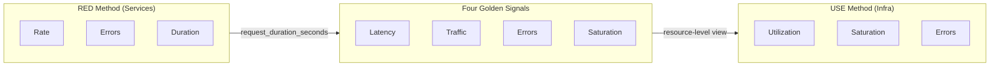

# Monitoring Methodology Coverage

> **Purpose**: Living document tracking coverage of industry-standard monitoring methodologies across the platform.
>
> **Last Updated**: 2026-03-31

---

## Table of Contents

1. [Overview](#1-overview)
2. [RED Method Coverage](#2-red-method-coverage)
3. [Four Golden Signals Coverage](#3-four-golden-signals-coverage)
4. [USE Method Coverage](#4-use-method-coverage)
5. [Manifest Index](#5-manifest-index)
6. [Future Roadmap](#6-future-roadmap)

---

## 1. Overview

The platform uses three complementary monitoring methodologies:

| Methodology | Scope | Origin |
|-------------|-------|--------|
| **RED Method** | Request-driven services (8 Go microservices) | Tom Wilkie (Weaveworks) |
| **Four Golden Signals** | All services and infrastructure | Google SRE Book |
| **USE Method** | Infrastructure resources (CPU, memory, disk, network, databases, cache) | Brendan Gregg |

### Metrics Stack

| Component | Role |
|-----------|------|
| **VMAgent** | Scrapes all targets |
| **VMSingle** | Metrics storage + PromQL API |
| **VMAlert** | Evaluates recording + alerting rules |
| **VMAlertmanager** | Alert routing + deduplication |
| **Sloth Operator** | SLO burn-rate alert generation |
| **Grafana** | Dashboards + visualization |

---

## 2. RED Method Coverage

**Scope**: 8 Go microservices (auth, user, product, cart, order, review, notification, shipping)

**Single source metric**: `request_duration_seconds` histogram (emits `_count`, `_bucket`, `_sum`)

| Signal | Status | Recording Rule | Alert(s) |
|--------|:------:|----------------|----------|
| **Rate** | :white_check_mark: | `job_app:request_duration_seconds:rate5m` | `MicroserviceNoTraffic` |
| **Errors** | :white_check_mark: | `job_app:request_duration_seconds:error_ratio5m` | `MicroserviceHighErrorRate`, `MicroserviceErrorRateCritical`, `MicroserviceNoSuccessfulRequests` |
| **Duration** | :white_check_mark: | `job_app:request_duration_seconds:p95_5m`, `p99_5m` | `MicroserviceHighLatencyP95`, `MicroserviceHighLatencyP99`, `MicroserviceLatencyCritical` |

**Manifest**: [`prometheusrules/microservices-alerts.yaml`](../../../kubernetes/infra/configs/monitoring/prometheusrules/microservices-alerts.yaml), [`prometheusrules/microservices-recording-rules.yaml`](../../../kubernetes/infra/configs/monitoring/prometheusrules/microservices-recording-rules.yaml)

---

## 3. Four Golden Signals Coverage

| Signal | Scope | Status | Implementation |
|--------|-------|:------:|----------------|
| **Latency** | Microservices | :white_check_mark: | P50/P95/P99 recording rules + 3 alerts + Apdex |
| **Latency** | API Server | :white_check_mark: | `KubeAPIServerHighLatency` (P99 >1s) |
| **Traffic** | Microservices | :white_check_mark: | RPS recording rule + per-endpoint breakdown |
| **Errors** | Microservices | :white_check_mark: | 4xx/5xx error ratio + SLO burn-rate (Layer 2) |
| **Errors** | Infrastructure | :white_check_mark: | Pod OOMKill, CrashLoop, network errors, node conditions |
| **Errors** | API Server | :white_check_mark: | `KubeAPIServerErrorRate` (>3% 5xx) |
| **Errors** | PostgreSQL | :white_check_mark: | ~25 alerts (CNPG + Zalando) |
| **Errors** | Valkey | :white_check_mark: | `ValkeyDown`, `ValkeyRejectedConnections` |
| **Saturation** | Microservices | :white_check_mark: | `requests_in_flight` + 2 alerts |
| **Saturation** | Pods | :white_check_mark: | CPU throttling, memory near-limit alerts |
| **Saturation** | Nodes | :white_check_mark: | Memory/disk/PID pressure via kube-state-metrics |
| **Saturation** | API Server | :white_check_mark: | `KubeAPIServerHighInflight` (>200) |
| **Saturation** | PostgreSQL | :white_check_mark: | Connection saturation alerts |
| **Saturation** | Valkey | :white_check_mark: | Memory saturation, eviction rate, client connections |

---

## 4. USE Method Coverage

### Request-Driven Services (Covered by RED)

Microservices use RED Method; see [Section 2](#2-red-method-coverage).

### Infrastructure Resources

| Resource | Utilization | Saturation | Errors | Manifest |
|----------|:-----------:|:----------:|:------:|----------|
| **Pod CPU** | :white_check_mark: throttling % | :white_check_mark: CFS periods | :white_check_mark: OOMKill | `kubernetes-pod-resources-alerts.yaml` |
| **Pod Memory** | :white_check_mark: near-limit % | :white_check_mark: working set vs limit | :white_check_mark: OOMKill | `kubernetes-pod-resources-alerts.yaml` |
| **Node** | :white_check_mark: KSM conditions | :white_check_mark: pressure flags | :white_check_mark: NotReady | `kubernetes-node-alerts.yaml` |
| **PVC/Disk** | :white_check_mark: available/capacity | :white_check_mark: filling up | :white_check_mark: <5% critical | `kubernetes-workload-alerts.yaml` |
| **Network** | :white_check_mark: RX/TX recording rules | -- | :white_check_mark: error rate | `kubernetes-network-rules.yaml` |
| **PostgreSQL** | :white_check_mark: connections, TPS, cache hit | :white_check_mark: connection saturation, locks | :white_check_mark: replication lag, offline | `prometheusrules/postgres/` |
| **Valkey/Redis** | :white_check_mark: memory ratio | :white_check_mark: evictions, connections | :white_check_mark: down, rejected | `valkey-alerts.yaml` |
| **K8s Workloads** | :white_check_mark: replica status | :white_check_mark: HPA maxed | :white_check_mark: job failures, mismatch | `kubernetes-workload-alerts.yaml` |
| **API Server** | :white_check_mark: CPU, memory | :white_check_mark: inflight requests | :white_check_mark: 5xx rate | `kube-apiserver-alerts.yaml` |

### Not Covered (Scoped Out for Kind)

| Resource | Reason |
|----------|--------|
| **etcd** | Metrics endpoint not accessible in Kind without host networking |
| **kubelet/scheduler/controller-manager** | Not exposed via K8s Services in Kind |
| **Ingress controller** | No ingress controller deployed |
| **node_exporter** | Kind nodes are Docker containers; KSM conditions used instead |

---

## 5. Manifest Index

### Alert Rules

| File | Category | Alert Count | Methodology |
|------|----------|:-----------:|-------------|
| `microservices-alerts.yaml` | Application | 18 | RED + Golden |
| `kubernetes-pod-resources-alerts.yaml` | Containers | 5 | USE |
| `kubernetes-workload-alerts.yaml` | Workloads | 6 | USE |
| `kubernetes-node-alerts.yaml` | Nodes | 5 | USE + Golden |
| `valkey-alerts.yaml` | Cache | 7 | USE + RED |
| `kube-apiserver-alerts.yaml` | Control Plane | 4 | Golden |
| `kubernetes-network-rules.yaml` | Network | 1 | USE |
| `postgres/cnpg/*.yaml` | Database (CNPG) | ~20 | USE |
| `postgres/zalando/*.yaml` | Database (Zalando) | ~8 | USE |
| `postgres-backup-alerts.yaml` | Backups | 2 | USE |
| Sloth-generated | SLO burn-rate | 48 | SLO |

**Total**: ~124 alerts

### Recording Rules

| File | Rule Count | Purpose |
|------|:----------:|---------|
| `microservices-recording-rules.yaml` | 15 | RED pre-aggregation |
| `pg-exporter-recording-rules.yaml` | 44 | PostgreSQL pre-aggregation |
| `valkey-recording-rules.yaml` | 4 | Cache USE pre-aggregation |
| `kubernetes-network-rules.yaml` | 2 | Network USE pre-aggregation |

### Dashboards

| Dashboard | Focus | Panels |
|-----------|-------|:------:|
| Microservices Dashboard | RED + Golden Signals | 34 |
| Kubernetes Cluster Overview | USE (cluster-wide) | 19 |
| CloudNativePG Cluster | USE (CNPG) | ~30 |
| pg-monitoring | USE (general PG) | ~20 |
| Redis/Valkey | USE (cache) | ~15 |
| SLO Overview/Detailed | Error budgets | -- |

### Runbooks

| Runbook | Scope |
|---------|-------|
| [`microservices-alerts.md`](../runbooks/microservices-alerts.md) | 18 application alerts |
| [`infrastructure-alerts.md`](../runbooks/infrastructure-alerts.md) | Infrastructure USE alerts |

---

## 6. Future Roadmap

Items to add when moving to a production cluster:

- [ ] **node_exporter** deployment + alerts (real node CPU/memory/disk I/O)
- [ ] **etcd** monitoring (leader elections, proposal latency, db size)
- [ ] **Ingress controller** metrics + alerts (when deployed)
- [ ] **kubelet** metrics + alerts (pod startup latency, runtime errors)
- [ ] **CoreDNS** monitoring (DNS latency, NXDOMAIN rate)
- [ ] **Certificate** monitoring (cert-manager expiry alerts)
