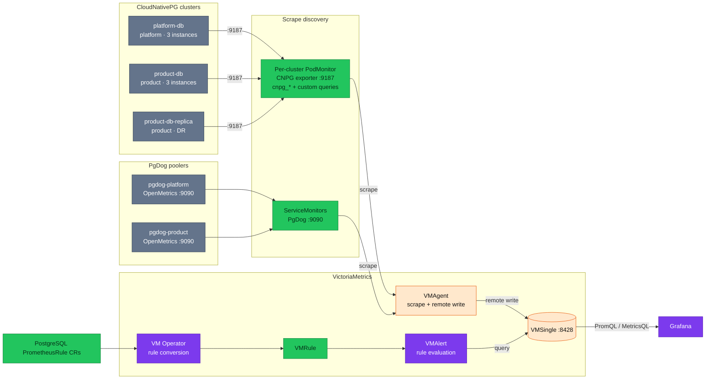

# PostgreSQL Monitoring

All PostgreSQL on the platform runs on **CloudNativePG (CNPG)**. Each cluster
exposes the CNPG **built-in exporter on `:9187`** (metrics prefixed `cnpg_`) plus
a custom-queries ConfigMap, scraped by a **per-cluster `PodMonitor`**.

## Architecture

## Cluster inventory

| Cluster | Namespace | Instances | Databases | Database metrics | Pooler metrics |
|---|---|---|---|---|---|
| `platform-db` | platform | 3 | auth, user, notification, shipping, review, temporal, temporal_visibility | CNPG `:9187` via PodMonitor | `pgdog-platform :9090` |
| `product-db` (+ `product-db-replica` DR) | product | 3 | product, cart, order, payment | CNPG `:9187` via PodMonitor | `pgdog-product :9090` |

## Metric coverage

The CNPG built-in exporter emits `cnpg_collector_*` health/replication/backup
metrics plus every custom query defined in the cluster's monitoring ConfigMap
(CNPG auto-prefixes those with `cnpg_`).

| Metric layer | Source |
|---|---|
| Availability | `cnpg_collector_up` |
| Replication (streaming) | `cnpg_collector_sync_replicas`, `cnpg_pg_replication_lag` |
| WAL status | `cnpg_collector_pg_wal` |
| Backup status | `cnpg_collector_last_available_backup_timestamp`, `cnpg_collector_last_failed_backup_timestamp` |
| pg_stat_statements | custom query (`cnpg_pg_stat_statements_*`) |
| Connection stats | built-in `cnpg_backends_total` + `cnpg_pg_settings_setting{name="max_connections"}` |
| Lock contention | custom query (`cnpg_pg_locks_count_*`, `cnpg_pg_blocking_queries_*`) |
| Autovacuum / dead tuples | custom query (`cnpg_pg_stat_user_tables_autovacuum_*`) |
| Table / index size | custom query (`cnpg_pg_table_size_*`, `cnpg_pg_stat_user_indexes_*`) |
| Per-database stats | built-in `pg_stat_database` (`cnpg_pg_stat_database_*`: deadlocks, blks_hit/read, temp_bytes) |
| Checkpoints | built-in `pg_stat_checkpointer` (`cnpg_pg_stat_checkpointer_*`) |
| Database size | built-in `pg_database` (`cnpg_pg_database_size_bytes`, `_xid_age`, `_mxid_age`) |
| Pooler metrics | PgDog OpenMetrics `:9090` |

## Exporter: CNPG built-in

- **Used by**: all clusters — the built-in exporter is mandatory for CNPG and cannot be replaced.
- **Port**: `9187`.
- **Format**: postgres_exporter-compatible query format. CNPG prefixes **all** metrics (built-in collectors and custom queries) with `cnpg_`.
- **Custom queries**: a per-cluster ConfigMap referenced from `spec.monitoring.customQueriesConfigMapList`; queries keep their original names and CNPG auto-prefixes the emitted metrics.

> **Retired with the Zalando→CNPG migration.** The former Zalando/Spilo clusters
> and their exporters were removed: the postgres_exporter sidecar (`:9187`) on
> `auth-db`, the Pigsty **pg_exporter** (`:9630`, 600+ metrics) pilot on
> `supporting-shared-db`, and the **pgbouncer-exporter** (`:9127`). The 44
> pg-exporter recording rules and the pg_exporter Grafana dashboards were retired
> along with them. The reference material for that pilot is kept for reference
> only: [pg-exporter-dashboards.md](pg-exporter-dashboards.md),
> [pg-exporter-mapping.md](pg-exporter-mapping.md).

## Built-in default queries

Besides the `cnpg_collector_*` health metrics, CNPG runs **13 built-in default
queries** from the `cnpg-default-monitoring` ConfigMap (`disableDefaultQueries:
false`) — `pg_stat_database`, `pg_database`, `pg_stat_archiver`,
`pg_stat_checkpointer`, `pg_stat_bgwriter`, `pg_replication`, `pg_replication_slots`,
`pg_stat_replication`, `backends`, `backends_waiting`, `pg_settings`,
`pg_postmaster`, `pg_extensions`. Most chart and deep-signal alerts consume these.
Full inventory (query → metrics → consuming alert): [builtin-metrics.md](builtin-metrics.md).

## Custom queries

Nine SQL definitions per cluster ConfigMap — same queries, different
`target_databases` per cluster (the `pg_database_size`, `pg_stat_checkpointer`,
and `pg_connection_limits` customs were removed as redundant with built-ins). Full reference,
PromQL, alert and runbook links: [custom-metrics.md](custom-metrics.md). Hub and
learning path: [README.md](README.md).

Chart **connection alerts** use built-in `cnpg_backends_total` /
`cnpg_pg_settings_setting{name="max_connections"}` — see [workflows.md](workflows.md).

## Alert rules

### PostgreSQL `PrometheusRule` layout (`prometheusrules/postgres/`)

CNPG alert rules are chart-generated per cluster (one file per upstream
`cluster-*.yaml` from the [cloudnative-pg/charts](https://github.com/cloudnative-pg/charts)
`cluster` chart), each in the cluster's own namespace:

- **[`postgres/cnpg/`](../../../../kubernetes/infra/configs/observability/metrics/prometheusrules/postgres/cnpg/)** — `product-db` (namespace `product`): the full HA set plus small extras (`CnpgClusterFenced`, `PostgresWALSizeHigh`) and the **global operator-health singleton** (`CNPGOperatorDown`, `CNPGControllerReconcileErrorsSpiking`, namespace `cloudnative-pg`).
- **[`postgres/cnpg-platform-db/`](../../../../kubernetes/infra/configs/observability/metrics/prometheusrules/postgres/cnpg-platform-db/)** — `platform-db` (namespace `platform`): full HA set (offline, fencing, HA, connections, physical + logical replication, disk, WAL); covers auth, supporting services, and Temporal persistence.

Backup alerts (`PostgresBackupTooOld`, `PostgresBackupFailed`) live in
`postgres/backup-alerts.yaml`. The full per-alert catalog with impact is in
[alert-catalog.md](../../alerting/alert-catalog.md#4-postgresql--cloudnativepg).

Per-alert runbooks: [../../runbooks/postgresql/README.md](../../runbooks/postgresql/README.md).

**Note**: Rules are evaluated by **VMAlert** against **VMSingle**; Grafana Alerting can show read-only rules proxied via VMSingle (see [`docs/observability/metrics/victoriametrics.md`](../victoriametrics.md)). Notifications route through VMAlertmanager (Slack wired, webhook injected out-of-band).

## Audit and query-plan logging

DB audit and query-plan logs do **not** use per-cluster exporters or sidecars.
`pgaudit` (`pgaudit.log = 'ddl, write'`) and `auto_explain` output is written to
the CNPG pod logs, tailed by the cluster-wide **Vector DaemonSet**, and shipped to
**VictoriaLogs** as CNPG-parsed structured records — audit rows carry
`logger: pgaudit` (CNPG parsing strips the literal `AUDIT:` prefix). See
[VictoriaLogs](../../logging/victorialogs.md) for the pipeline.

## References

- [PostgreSQL metrics hub](README.md) — learning path, document map
- [Custom metrics query guide](custom-metrics.md) — CNPG custom queries, columns, PromQL
- [Diagnostic workflows](workflows.md) — on-call decision trees
- [PostgreSQL alert runbooks](../../runbooks/postgresql/README.md)
- [Database Guide](../../../databases/002-database-integration.md) — custom queries configuration
- [Metrics hub](../README.md) — methodology, stack, and coverage
- [PromQL Guide](../promql-guide.md) — PromQL functions and examples
- [Alert Catalog](../../alerting/alert-catalog.md) — every deployed PostgreSQL alert
- Retired reference: [pg-exporter-dashboards.md](pg-exporter-dashboards.md), [pg-exporter-mapping.md](pg-exporter-mapping.md)

---
_Last updated: 2026-07-18 — link runbook hub; dedupe custom query table to custom-metrics.md_
