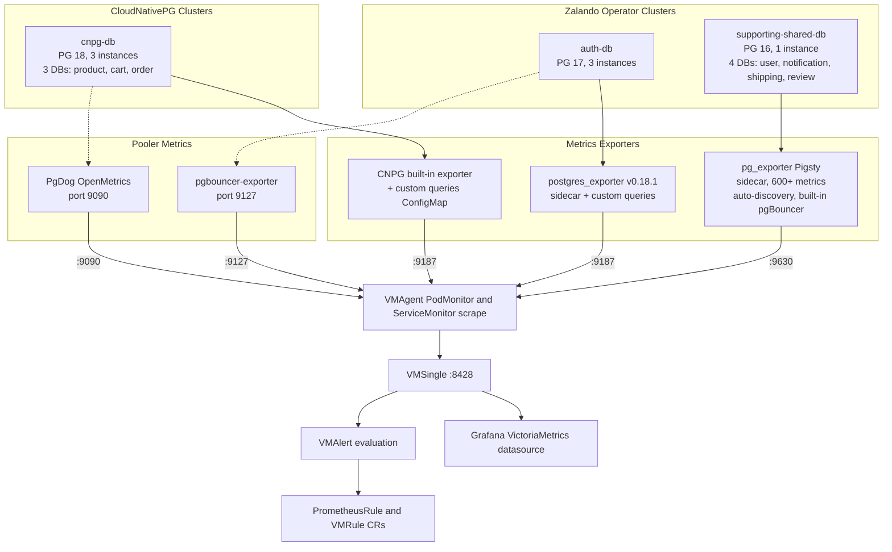

# PostgreSQL Monitoring

## Architecture



## Monitoring Coverage Matrix

| Metric Layer | auth-db | supporting-shared-db | cnpg-db |
|---|---|---|---|
| **Operator** | Zalando | Zalando | CloudNativePG |
| **Exporter** | postgres_exporter | pg_exporter (Pigsty) | CNPG built-in |
| **Availability** | pg_up | pg_up (600+) | cnpg_collector_up |
| **Replication lag** | pg_replication_lag | pg_repl_* | cnpg_collector_sync_replicas |
| **WAL status** | - | pg_wal_* | cnpg_collector_pg_wal |
| **Backup status** | - | - | cnpg_collector_last_*_backup |
| **pg_stat_statements** | custom query | built-in collector | custom query |
| **Connection stats** | built-in + custom_ | built-in collector | custom query |
| **Lock contention** | custom_ query | built-in collector | custom query |
| **Autovacuum/dead tuples** | built-in + custom_ | built-in collector | custom query |
| **Table/index size** | custom_ query | built-in collector | custom query |
| **Bloat estimation** | - | built-in collector | - |
| **Checkpoints** | built-in collector | built-in collector | custom query |
| **Database size** | built-in collector | built-in collector | custom query |
| **Pooler metrics** | pgbouncer-exporter | pg_exporter built-in pgBouncer | PgDog OpenMetrics :9090 |

## Exporter Comparison

### postgres_exporter (Prometheus Community)

- **Used by**: auth-db (Zalando sidecar) + CNPG built-in exporter uses same query format
- **Port**: 9187
- **Default metrics**: ~50
- **Custom queries**: YAML ConfigMap (`queries.yaml`)
- **Strengths**: Industry standard, broad community, simple, low resource footprint
- **Limitations**: No per-query caching/timeout, no version-aware planning, no auto-discovery

### pg_exporter (Pigsty) - Pilot on supporting-shared-db

- **Used by**: supporting-shared-db (pilot)
- **Port**: 9630
- **Default metrics**: 600+ from 50+ YAML collectors
- **Key features tested in pilot**:
  - **Auto-discovery**: Automatically scrapes user, notification, shipping databases
  - **Built-in pgBouncer monitoring**: Collectors 0910-0940 (fills gap - supporting-shared-db had zero pgBouncer metrics)
  - **Per-collector TTL caching**: Expensive queries (bloat) cached independently from fast queries (activity)
  - **Per-collector timeout**: Default 100ms, prevents slow queries from blocking scrapes
  - **Dynamic planning**: Adapts to PG version and server role (primary/standby)
  - **Health check APIs**: `/primary`, `/replica`, `/health`, `/readiness`

### Decision Rationale

Hybrid approach chosen: custom queries for 3 clusters + pg_exporter pilot on 1 cluster.

1. CNPG clusters must use built-in exporter (mandatory, cannot be replaced)
2. Custom queries achieve ~90% coverage with zero new components
3. pg_exporter pilot on supporting-shared-db validates the remaining 10% value
4. Expansion path: if pilot succeeds, migrate auth-db to pg_exporter

## Collector Reference (pg_exporter)

| Range | Domain | Key Collectors |
|---|---|---|
| 1xx | Basic | pg info, metadata, settings |
| 2xx | Replication | replication lag, WAL receiver, downstream, sync standby, slots |
| 3xx | Persistence | size, WAL, bgwriter, checkpointer, SSL, checkpoint, SLRU, shmem |
| 4xx | Activity | connections by state, wait events, locks, transactions, queries |
| 5xx | Progress | vacuum, indexing, clustering, basebackup, copy progress |
| 6xx | Database | pg_database stats, conflicts, publications, subscriptions |
| 7xx | Objects | tables, indexes, functions, sequences, partitions |
| 8xx | Optional | table bloat, index bloat (disabled by default, slow) |
| 9xx | pgBouncer | list, database, stat, pool |

## Grafana Dashboards (pg_exporter)

Two dashboards adapted from [Pigsty](https://github.com/pgsty/pg_exporter/tree/main/monitor) for `supporting-shared-db`:

| Dashboard | File | UID | Panels | Description |
|---|---|---|---|---|
| PG Exporter Instance | `pg-exporter-instance.json` | `pg-exporter-instance` | 74 | Full instance monitoring: Overview, Activity, Sessions, Persist, Database, Table & Query |
| PG Exporter Self-Monitoring | `pg-exporter-self.json` | `pg-exporter-self` | ~30 | Exporter health: scrape duration, collector errors, cache hits, uptime |

**Template variables**: `ins` (instance), `cls` (cluster), `datname` (database). The `cls` label is injected via `PG_EXPORTER_TAG=cls=supporting-shared-db` env var on the pg_exporter sidecar.

**Provisioning**: GrafanaDashboard CRs in `kubernetes/infra/configs/monitoring/grafana/dashboards/`, folder "Databases". Dashboard variables still use the legacy name `DS_PROMETHEUS`; the `GrafanaDashboard` CR maps that input to the **VictoriaMetrics** datasource (`datasourceName: VictoriaMetrics`). See [`docs/observability/grafana/datasources.md`](../../grafana/datasources.md).

## Recording Rules (pg_exporter)

File: `kubernetes/infra/configs/monitoring/prometheusrules/pg-exporter-recording-rules.yaml`

44 Prometheus recording rules required by the PG Exporter Instance dashboard, adapted from [Pigsty pgsql.yml](https://github.com/pgsty/pigsty/blob/main/files/victoria/rules/pgsql.yml).

| Group | Rules | Description |
|---|---|---|
| pg-exporter-db | 22 | Database-level: `rate()` / `increase()` over `pg_db_*`, `pg_lock_count`, `pg_activity_count` |
| pg-exporter-ins | 18 | Instance-level: `sum without(datname)` aggregations + WAL/timeline |
| pg-exporter-cls | 1 | Cluster-level: `sum by (job, cls)` |
| pg-exporter-objects | 2 | Table scan rate + query call rate |

Recording rule naming follows Pigsty convention: `pg:<level>:<metric>` (e.g., `pg:ins:xact_commit_rate1m`).

## Alert Rules

### postgres-backup-alerts.yaml (existing)

| Alert | Severity | Condition | Clusters |
|---|---|---|---|
| PostgresBackupTooOld | warning | Last backup > 26 hours | CNPG only |
| PostgresBackupFailed | critical | Backup failed in last hour | CNPG only |

### PostgreSQL `PrometheusRule` layout (`prometheusrules/postgres/`)

The former monolith `postgres-alerts.yaml` was split by operator:

- **[`kubernetes/infra/configs/monitoring/prometheusrules/postgres/cnpg/`](../../../../../kubernetes/infra/configs/monitoring/prometheusrules/postgres/cnpg/)** — CloudNativePG: chart-aligned rules (one file per upstream `cluster-*.yaml` from [cloudnative-pg/charts](https://github.com/cloudnative-pg/charts) `cluster` chart), plus small extras (`CnpgClusterFenced`, `PostgresWALSizeHigh`). Namespace **`product`** for chart-derived resources (matches `cnpg-db` cluster).
- **[`kubernetes/infra/configs/monitoring/prometheusrules/postgres/zalando/`](../../../../../kubernetes/infra/configs/monitoring/prometheusrules/postgres/zalando/)** — Zalando: availability, `custom_*` connection/blocking, storage, maintenance (namespace **`monitoring`**).

**Note**: Rules are evaluated by **VMAlert** against **VMSingle**; Grafana Alerting can show read-only rules proxied via VMSingle (see [`docs/observability/metrics/victoriametrics.md`](../victoriametrics.md)). Notifications are not routed until Alertmanager is enabled.

## Custom Queries Reference

### Zalando Clusters (auth-db)

#### Why `custom_` Prefix (Renamed Queries)

`postgres_exporter v0.18+` ships with built-in collectors (`stat_bgwriter`, `stat_user_tables`, `database`, `locks`, etc.) that register metric families at startup. If a custom query name produces metrics whose prefix collides with a built-in collector's metric namespace, the Prometheus client library returns a **duplicate registration error** on the `/metrics` endpoint. The scrape fails with an HTTP 500 and the error is visible in the exporter logs and in VMAgent scrape error metrics.

For example, a custom query named `pg_database_size` would emit `pg_database_size_size_bytes`, but the built-in `database` collector already registers `pg_database_size_bytes`. The Prometheus client detects the shared prefix and rejects the conflicting metric family.

To avoid this, all custom queries that conflicted were renamed with a `custom_` prefix.

#### Rename Mapping

| Original Name | New Name | Conflicting Built-in Collector |
|---|---|---|
| pg_connection_limits | custom_connection_limits | Naming pattern overlap caused registration error |
| pg_blocking_queries | custom_blocking_queries | Naming pattern overlap caused registration error |
| pg_stat_user_tables_autovacuum | custom_autovacuum_stats | `stat_user_tables` (registers `pg_stat_user_tables_n_dead_tup`, etc.) |
| pg_table_size | custom_table_size | Naming pattern overlap caused registration error |
| pg_stat_user_indexes | custom_stat_user_indexes | Naming pattern overlap caused registration error |

#### Removed Queries (Built-in Equivalents)

These queries were removed because `postgres_exporter v0.18+` built-in collectors already provide the same data:

| Removed Query | Built-in Equivalent |
|---|---|
| pg_stat_activity_count | Built-in `pg_stat_activity_count` from default collectors |
| pg_database_size | Built-in `pg_database_size_bytes` from `database` collector |
| pg_stat_bgwriter_checkpoints | Built-in `pg_stat_bgwriter_checkpoints_*_total` from `stat_bgwriter` collector |

#### Active Custom Queries

| Query Name | Metrics | Purpose |
|---|---|---|
| pg_stat_statements | calls, time_milliseconds, rows, blk_* | Top 100 queries by execution time |
| pg_replication | lag | Replication lag in seconds |
| pg_postmaster | start_time_seconds | Postmaster start time |
| custom_connection_limits | max_connections, current_connections | Connection saturation |
| pg_locks_count | count by datname/mode | Lock distribution |
| custom_blocking_queries | blocked_queries | Queries waiting on locks |
| custom_autovacuum_stats | n_dead_tup, n_live_tup, autovacuum_count | Dead tuples and vacuum activity |
| custom_table_size | total_bytes, table_bytes | Table size (top 30) |
| custom_stat_user_indexes | idx_scan, index_bytes | Index usage and size (bottom 30 by scans) |

### CNPG Cluster (cnpg-db)

Queries keep original names; CNPG auto-prefixes all metrics with `cnpg_`.
For `cnpg-db`, queries with `target_databases` include `current_database() AS datname` to disambiguate shared tables (product, cart, order databases coexist on the same cluster).

| Query Name | CNPG Metric Prefix | Purpose |
|---|---|---|
| pg_stat_statements | cnpg_pg_stat_statements_* | Top 100 queries by execution time |
| pg_connection_limits | cnpg_pg_connection_limits_* | Connection saturation |
| pg_locks_count | cnpg_pg_locks_count_* | Lock distribution |
| pg_blocking_queries | cnpg_pg_blocking_queries_* | Queries waiting on locks |
| pg_stat_user_tables_autovacuum | cnpg_pg_stat_user_tables_autovacuum_* | Dead tuples and vacuum activity |
| pg_table_size | cnpg_pg_table_size_* | Table size (top 30) |
| pg_stat_user_indexes | cnpg_pg_stat_user_indexes_* | Index usage and size |
| pg_database_size | cnpg_pg_database_size_* | Database sizes |
| pg_stat_bgwriter_checkpoints | cnpg_pg_stat_bgwriter_checkpoints_* | Checkpoint frequency and I/O |

### PromQL Examples

```promql
# Connection saturation - Zalando (custom_ prefix)
custom_connection_limits_current_connections / custom_connection_limits_max_connections

# Connection saturation - CNPG (cnpg_ prefix)
cnpg_pg_connection_limits_current_connections / cnpg_pg_connection_limits_max_connections

# Dead tuples - Zalando (built-in metric)
pg_stat_user_tables_n_dead_tup / (pg_stat_user_tables_n_live_tup + pg_stat_user_tables_n_dead_tup)

# Dead tuples - CNPG (custom query)
cnpg_pg_stat_user_tables_autovacuum_n_dead_tup

# Checkpoint request rate - Zalando (built-in metric)
rate(pg_stat_bgwriter_checkpoints_req_total[5m])

# Top queries by execution time
topk(10, rate(pg_stat_statements_time_milliseconds[5m]))

# Database size - Zalando (built-in) / CNPG (custom) / pg_exporter
pg_database_size_bytes or cnpg_pg_database_size_size_bytes or pg_size_bytes
```

## Pilot Evaluation Template

After 2 weeks of pg_exporter running on supporting-shared-db, evaluate:

| Criterion | How to Measure | Target |
|---|---|---|
| Auto-discovery | `curl :9630/explain` - check discovered databases | All 3 DBs found |
| pgBouncer monitoring | `curl :9630/metrics \| grep pgbouncer` | pgBouncer metrics present |
| Cardinality | `count({cluster_name="supporting-shared-db"})` in VictoriaMetrics (Explore or `vmui`) | Document total series |
| Resource usage | `kubectl top pod` for exporter container | Compare vs postgres_exporter |
| Scrape duration | `pg_exporter_scrape_duration_seconds` | < 14s (scrapeTimeout) |
| Collector errors | `curl :9630/stat` | No fatal collector failures |
| Dashboard compatibility | Manual review | Effort to adapt existing dashboards |

### Expansion Criteria

Migrate additional Zalando clusters to pg_exporter if:
- Auto-discovery works correctly for all databases
- Resource usage is acceptable (< 2x postgres_exporter)
- Scrape completes within timeout
- Team finds 600+ metrics valuable for troubleshooting
- Dashboard migration effort is justified by operational value
