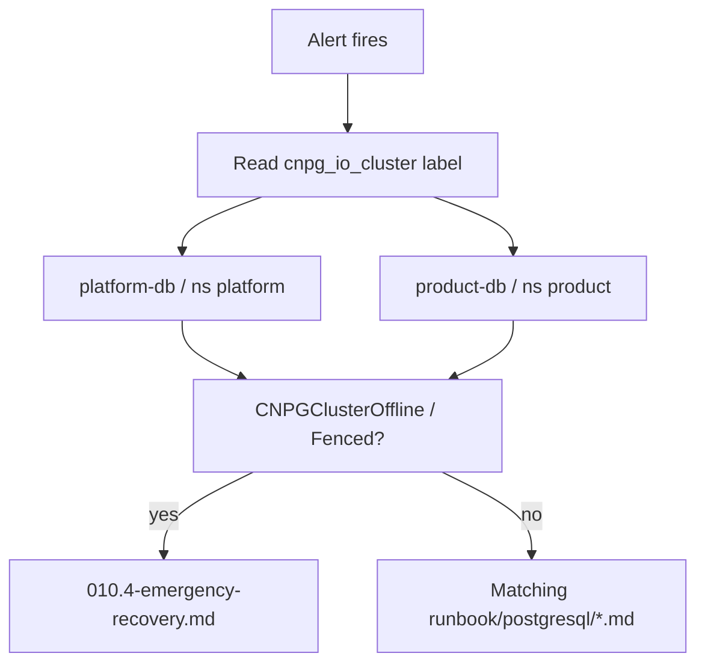
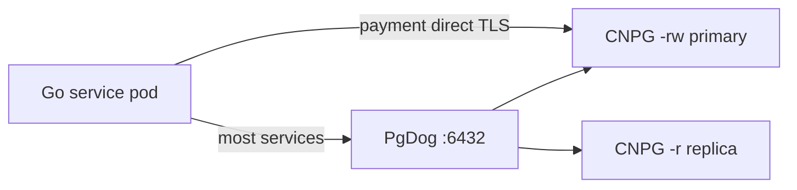

# PostgreSQL Diagnostic Workflows

Postgres-specific on-call decision trees. For general observability theory see
[observability-deep-dive.md](../../runbooks/observability-deep-dive.md) — this
page covers **CNPG homelab paths only**.

## Alert → cluster scope

Every CNPG series carries `cnpg_io_cluster` (`platform-db` or `product-db`).
Deep-signal alerts also label `cnpg_cluster` in VMAlert. Start every investigation
by fixing cluster and namespace:

| `cnpg_io_cluster` | Namespace | Services DB |
|-------------------|-----------|-------------|
| `platform-db` | `platform` | auth, user, notification, shipping, review, temporal, temporal_visibility |
| `product-db` | `product` | product, cart, order, payment, checkout |

## Primary vs pooler vs direct

When connection alerts fire, check **both** Postgres backends and PgDog pool
saturation. Payment bypasses PgDog — see
[PgDog operations](../../../databases/runbooks/pgdog-operations.md).

## Symptom correlation matrix

| Symptom | Built-in / chart metric | Custom query | psql view | Runbook |
|---------|-------------------------|--------------|-----------|---------|
| DB unreachable | `cnpg_collector_up` | — | — | [CNPGClusterOffline](../../runbooks/postgresql/CNPGClusterOffline.md) |
| Connection errors | `cnpg_backends_total`, `cnpg_pg_settings_setting{name="max_connections"}` | — | `pg_stat_activity` | [HighConnectionsCritical](../../runbooks/postgresql/CNPGClusterHighConnectionsCritical.md) |
| Stuck requests | — | `pg_blocking_queries` | `pg_blocking_pids()` | [CNPGBlockedQueries](../../runbooks/postgresql/CNPGBlockedQueries.md) |
| Slow after load | `pg_stat_database` blks | `pg_stat_statements` | `EXPLAIN` | [CNPGLowCacheHitRatio](../../runbooks/postgresql/CNPGLowCacheHitRatio.md) |
| Disk sort spikes | `temp_bytes` | `pg_stat_statements temp_*` | auto_explain logs | [CNPGTempFileSpill](../../runbooks/postgresql/CNPGTempFileSpill.md) |
| Table bloat | — | `pg_stat_user_tables_autovacuum` | `pg_stat_progress_vacuum` | [CNPGAutovacuumFallingBehind](../../runbooks/postgresql/CNPGAutovacuumFallingBehind.md) |
| Migrations hang | long txn gauges | `pg_long_running_transactions` | `xact_start` | [CNPGLongRunningTransaction](../../runbooks/postgresql/CNPGLongRunningTransaction.md) |
| Replica stale | `cnpg_pg_replication_lag` | — | `pg_stat_replication` | [PhysicalReplicationLagCritical](../../runbooks/postgresql/CNPGClusterPhysicalReplicationLagCritical.md) |

## Page vs ticket

| Severity | Response |
|----------|----------|
| critical (offline, fenced, HA critical, wraparound critical, backup failed, WAL archive) | Page — open incident |
| critical (connections >95%) | Page if apps erroring |
| warning (deep-signal tuning) | Ticket — fix within sprint unless SLO burn |
| warning (gated / inactive on Kind) | Document only until production |

## VictoriaLogs pivot

For query tuning alerts (`CNPGLowCacheHitRatio`, `CNPGTempFileSpill`):

1. Note alert timestamp and `cnpg_io_cluster`.
2. VictoriaLogs: CNPG primary pod, filter `auto_explain` or slow query log lines.
3. Match `queryid` from pg-query-performance dashboard — do not paste full
   `query` label text into tickets (cardinality / PII).

---
_Last updated: 2026-07-18_
