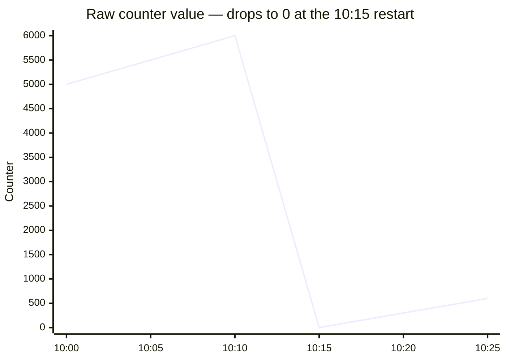
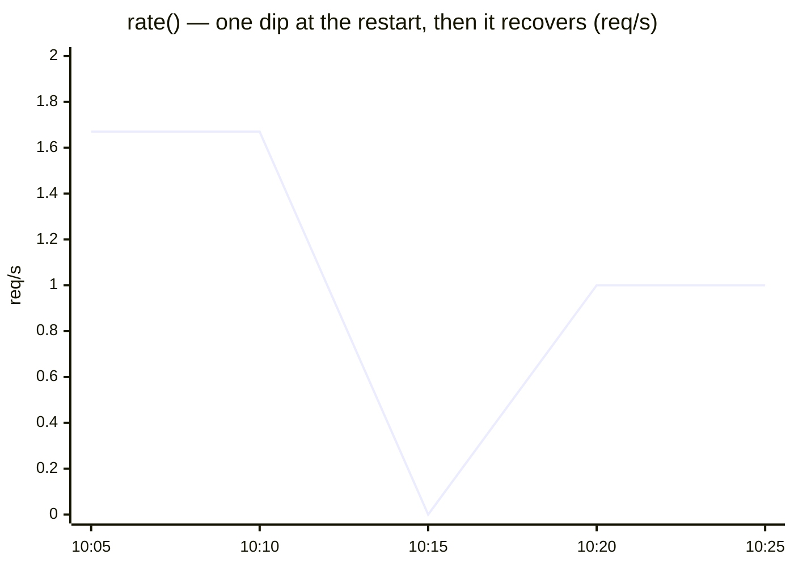
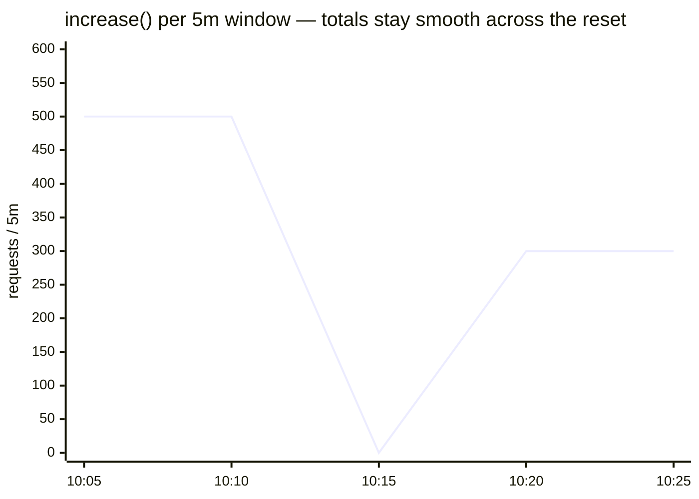

# PromQL Guide — Counters, rate(), increase(), and Time Intervals

How to query counter metrics correctly in this platform: why raw counters
mislead, when to use `rate()` vs `increase()`, and how Grafana's **Time Range**
and **Rate Interval** (`$rate`) interact. PromQL runs in Grafana against the
**VictoriaMetrics** datasource; the backend is **VMSingle** (Prometheus-compatible
API on `:8428`).

| | |
|---|---|
| **Datasource** | VictoriaMetrics (VMSingle `:8428`) — PromQL/MetricsQL |
| **Core functions** | `rate()`, `increase()` — both auto-handle counter resets |
| **Dashboard knobs** | Time Range (`$__range`) vs Rate Interval (`$rate`) |
| **Golden rule** | Never query a raw counter in a panel |

---

## Counter basics

A **counter** is a Prometheus metric type that only ever increases (monotonic).
It resets to `0` on process restart, pod restart, or crash/redeploy:



| Time | Counter | Event |
|------|--------:|-------|
| 10:00 | 5,000 | — |
| 10:05 | 5,500 | +500 requests |
| 10:10 | 6,000 | +500 requests |
| 10:15 | 0 | pod restart |
| 10:20 | 300 | +300 requests (from 0) |
| 10:25 | 600 | +300 requests |

## The problem: querying a raw counter

```promql
request_duration_seconds_count{app="auth"}
```

When the pod restarts the value drops to `0`, so the graph shows a cliff and the
panel "loses" history:

- Data appears to vanish on restart (drop to 0).
- The graph is discontinuous.
- It ignores the dashboard time selector.
- It is an instant value — it reflects neither rate nor trend.

The fix is to wrap counters in `rate()` or `increase()`, which detect resets and
extrapolate across them.

## Solution 1 — `rate()`

`rate()` computes the **average per-second rate of increase** over a window and
automatically handles counter resets.

```
rate(counter[window]) = (value_end - value_start) / window_seconds
```

```promql
rate(request_duration_seconds_count{app="auth"}[5m])
```

How resets are handled — a negative delta is treated as a reset and ignored,
leaving a single small dip that recovers:



| Time | Counter | `rate()` |
|------|--------:|----------|
| 10:00 | 5,000 | — |
| 10:05 | 5,500 | (5,500 − 5,000) / 300s = 1.67 req/s |
| 10:10 | 6,000 | (6,000 − 5,500) / 300s = 1.67 req/s |
| 10:15 | 0 | 0 (negative delta ignored) |
| 10:20 | 300 | 300 / 300s = 1.0 req/s |
| 10:25 | 600 | (600 − 300) / 300s = 1.0 req/s |

Characteristics: auto-detects resets, leaves only a single small dip at the
restart, returns an easy-to-read per-second value, and extrapolates the first/last
points of the window. Use it for RPS, error rate, CPU rate, and network
throughput.

## Solution 2 — `increase()`

`increase()` computes the **total increase** over a window (it is `rate()`
multiplied by the window length) and also handles resets.

```
increase(counter[window]) = rate(counter[window]) * window_seconds
```

```promql
increase(request_duration_seconds_count{app="auth"}[$__range])
```



| Time | Counter | `increase()` |
|------|--------:|--------------|
| 10:00 | 5,000 | — |
| 10:05 | 5,500 | 500 |
| 10:10 | 6,000 | 500 |
| 10:15 | 0 | 0 (reset ignored) |
| 10:20 | 300 | 300 |
| 10:25 | 600 | 300 |

Characteristics: same reset handling as `rate()`, but returns an absolute total
rather than a per-second value, and pairs with `$__range` to total over the whole
dashboard window. Use it for total requests/errors over a period, stat panels,
distribution pie charts, and SLO totals.

## Detailed comparison

| | Raw counter | `rate()` | `increase()` |
|---|---|---|---|
| **Shows** | Instant value (6,000) | Per-second rate (5.2 req/s) | Total in window (15,432) |
| **Unit** | Count | req/s | Count |
| **Pod restart** | ❌ jumps to 0 | ✅ one small dip | ✅ totalled across resets |
| **Time range** | ❌ ignores selector | uses `[window]` | ✅ respects `$__range` |
| **Prometheus history** | ❌ unused | ✅ full | ✅ full |
| **Use case** | Debug snapshots | RPS, throughput | Dashboard totals, SLO |

Example queries:

```promql
sum(request_duration_seconds_count{app="auth"})                       # raw — avoid
sum(rate(request_duration_seconds_count{app="auth"}[5m]))             # RPS
sum(increase(request_duration_seconds_count{app="auth"}[$__range]))   # total in range
```

## Time Range vs Rate Interval

Two independent Grafana concepts control how data is displayed:

1. **Time Range** — *how far back* the dashboard shows data.
2. **Rate Interval** (`$rate`) — *the granularity* of rate calculations.

### Time Range

The window the dashboard displays, set from the dropdown at the top-right
("Last 5 minutes", "Last 6 hours", "Custom", …). It affects the `$__range`
variable, `increase()` results, and the time-series X-axis.

| Common value | Use case |
|--------------|----------|
| Last 5 minutes | Real-time debugging |
| Last 30 minutes | Recent activity |
| Last 6 hours | Normal monitoring |
| Last 24 hours | Daily review |
| Last 7 days | Long-term trends |

### Rate Interval (`$rate`)

The window used to compute **rate** in PromQL, set from the `$rate` dashboard
variable. It affects `rate()` results and the smoothness of time-series graphs.

| Common value | Effect |
|--------------|--------|
| 1m | High detail, sensitive |
| 5m | Balanced detail vs smoothness |
| 30m | Smooth, removes noise |
| 1h | Long-term trend |

## Worked examples

**"Total Request" — does NOT change with `$rate`** (depends only on Time Range):

```promql
sum(increase(request_duration_seconds_count{app=~"$app", namespace=~"$namespace"}[$__range]))
```

```
Time Range: Last 6 hours
$rate = 30m → 21,600 requests
$rate = 5m  → 21,600 requests (unchanged)
```

**"Total RPS" — changes with `$rate`** (depends on the rate window):

```promql
sum(rate(request_duration_seconds_count{app=~"$app", namespace=~"$namespace"}[$rate]))
```

```
Time Range: Last 6 hours
$rate = 30m → RPS = 60 (30-minute average)
$rate = 5m  → RPS = 65 (5-minute average, more sensitive)
```

**"Success Rate %" — both numerator and denominator use `$rate`** for
consistency:

```promql
(
  sum(rate(request_duration_seconds_count{app=~"$app", namespace=~"$namespace", code=~"2.."}[$rate]))
  /
  sum(rate(request_duration_seconds_count{app=~"$app", namespace=~"$namespace"}[$rate]))
) * 100
```

| Panel | Function | Uses Time Range? | Uses `$rate`? | Changes with `$rate`? |
|-------|----------|:---:|:---:|:---:|
| Total Request | `increase($__range)` | ✅ | ❌ | ❌ |
| Total RPS | `rate($rate)` | ❌ | ✅ | ✅ |
| Success Rate % | `rate($rate)` | ❌ | ✅ | ✅ |
| Error Rate % | `rate($rate)` | ❌ | ✅ | ✅ |
| Response Time P95 | `rate($rate)` | ❌ | ✅ | ✅ |
| Memory / CPU usage | `rate($rate)` | ❌ | ✅ | ✅ |

## Best practices

**Raw counter** — avoid in panels; use only for instant debug, testing, or when
restarts are impossible.

**`rate()`** — RPS, error-rate, and any "per second" panel; window `[5m]` or the
`[$rate]` variable.

**`increase()`** — totals in stat panels, distribution charts, SLO totals;
window `[$__range]`.

**Rule of thumb:** keep Rate Interval ≈ 1/10–1/20 of the Time Range.

| Time Range | Recommended `$rate` | Use case |
|------------|---------------------|----------|
| Last 5 minutes | 1m | Real-time debugging |
| Last 30 minutes | 5m | Recent activity |
| Last 6 hours | 30m | Normal monitoring |
| Last 24 hours | 1h | Daily trends |
| Last 7 days | 6h | Weekly patterns |

## Counter-reset detection (how it works)

Prometheus/VictoriaMetrics scrape continuously and compare consecutive samples:

| Sample | Value | Delta | |
|--------|------:|------:|---|
| t1 | 5,000 | — | |
| t2 | 5,500 | +500 | ok |
| t3 | 6,000 | +500 | ok |
| t4 | 0 | −6,000 | **reset detected** |
| t5 | 300 | +300 | ok |

On a negative delta the engine assumes a reset, skips that step, and continues
from the new value. It also extrapolates the first/last points of the window,
assuming the counter started at 0 when there is no prior data.

## Scenarios

| Goal | Time Range | `$rate` | Result |
|------|-----------|---------|--------|
| Troubleshoot a spike | Last 1 hour | 5m | Pinpoints when the spike occurred; RPS panels stay sensitive; totals remain correct |
| Daily review | Last 24 hours | 1h | Peak hours visible; smooth, low-noise trends |
| Capacity planning | Last 7–30 days | 6h–1d | Growth trends and weekly/monthly patterns |

## Performance notes

| Query | Complexity | Notes |
|-------|-----------|-------|
| Raw counter | O(1) | Instant, fastest |
| `rate([5m])` | O(n) | Scans a 5m window, moderate |
| `increase([$__range])` | O(n) | Scans the full range, slowest for large ranges |

For 30m–1h dashboards `increase([$__range])` is fine; for 7d+ ranges consider a
fixed window such as `[1d]` instead of `[$__range]`.

## FAQ

**Why doesn't "Total Request" change when I change `$rate`?** It uses
`increase($__range)`, which depends only on the Time Range.

**Why does RPS change with `$rate`?** It uses `rate($rate)`; a smaller window is
more sensitive.

**What `$rate` should I pick?** ≈ 1/10–1/20 of the Time Range (6h → 30m).

**How are Time Range and `$rate` related?** They are independent: Time Range is
"how far back", `$rate` is "how granular". Choose them together sensibly.

## Troubleshooting

| Problem | Fix |
|---------|-----|
| Graph too noisy | Increase `$rate` (5m → 30m) |
| Can't see spike detail | Decrease `$rate` (30m → 5m) |
| "Total Request" changes with `$rate` | Query likely uses `$rate`; switch to `$__range` |
| RPS doesn't change with `$rate` | Query likely uses `$__range`; switch to `$rate` |

## Key takeaways

1. Never query a raw counter in a panel.
2. Always wrap counters in `rate()` or `increase()`.
3. `rate()` → rates (req/s); `increase()` → totals (count).
4. `increase([$__range])` is best for dashboard stat panels.
5. Counter resets are handled automatically.
6. Time Range and Rate Interval are independent — choose them together.

## References

- [rate()](https://prometheus.io/docs/prometheus/latest/querying/functions/#rate) · [increase()](https://prometheus.io/docs/prometheus/latest/querying/functions/#increase) · [Counter type](https://prometheus.io/docs/concepts/metric_types/#counter)
- [Prometheus instrumentation](https://prometheus.io/docs/practices/instrumentation/) · [Naming conventions](https://prometheus.io/docs/practices/naming/)
- [Grafana time-range controls](https://grafana.com/docs/grafana/latest/dashboards/time-range-controls/) · [Dashboard variables](https://grafana.com/docs/grafana/latest/dashboards/variables/)
- [Application metrics (RED)](metrics-apps.md) · [Metrics hub](README.md)

---

_Last updated: 2026-06-29 — counters, `rate()` vs `increase()`, Time Range vs `$rate` on VictoriaMetrics._
