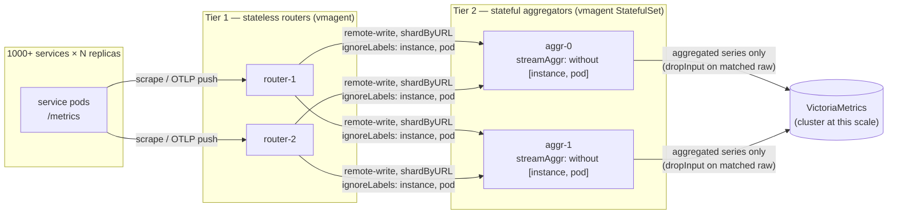
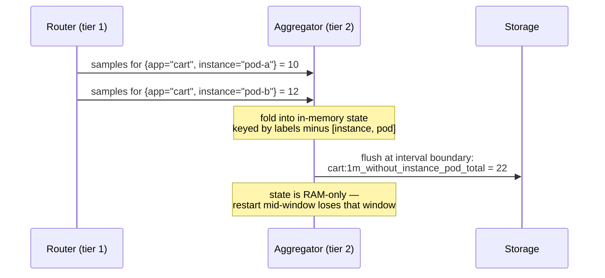
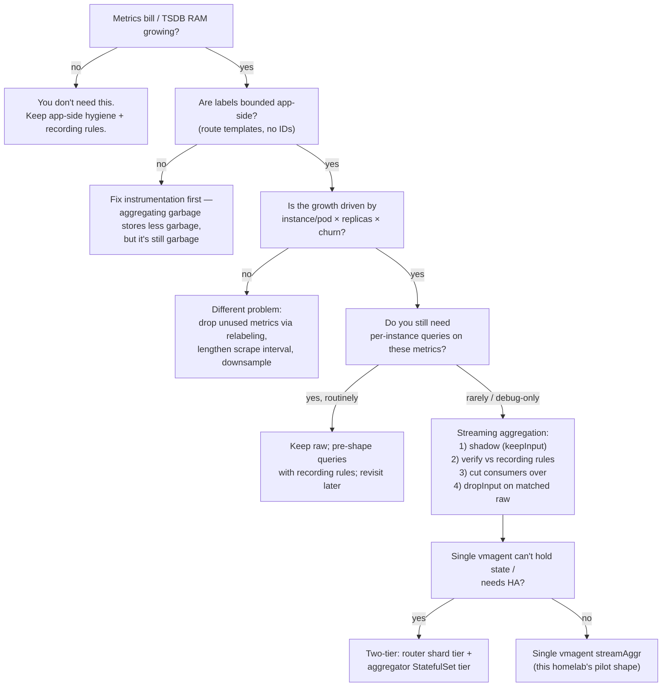

# Streaming Aggregation — the at-scale metrics playbook

How a metrics pipeline survives 1000+ microservices: aggregate series **in
flight** — before they ever become storage cardinality — instead of paying to
store per-instance data nobody queries. This is the playbook layer above
[app-side cardinality control](metrics-apps.md#app-side-cardinality-control):
app hygiene bounds *what one replica emits*; streaming aggregation bounds *what
the fleet costs*.

| | |
|---|---|
| **Status** | **At-scale playbook** — shadow pilot per [RFC-0013](../../proposals/rfc/RFC-0013/README.md) P3; **not** the default pipeline in this homelab |
| **Engine** | vmagent / VictoriaMetrics single-node streaming aggregation |
| **Config surface** | `VMAgent` CR `remoteWrite[].streamAggrConfig` (VM Operator) |
| **Problem it solves** | Per-instance label cardinality × replicas × churn at fleet scale |
| **Cost model** | State in aggregator RAM per active window; storage sees only aggregated outputs |
| **Trigger** | Per-instance labels dominate active series AND fleet-level queries dominate usage |

---

## Overview

A Prometheus-model TSDB does not price metrics — it prices **time series**: one
per unique `metric name + label set`. Every scaling problem in a metrics
pipeline is ultimately this multiplication getting out of hand:

```
series ≈ Σ over services ( replicas × label-combinations × series-per-combination )
```

App-side hygiene (route templates, bounded labels, no request-scoped IDs —
see [metrics-apps.md](metrics-apps.md)) keeps *label-combinations* bounded.
But two factors are **not** controllable in application code:

1. **`instance` (and `pod`)** — injected by the scrape layer, one value per
   replica. It multiplies every app series by the replica count, and every
   deploy/restart mints a fresh set (churn).
2. **Fleet size** — 9 services today; a large platform runs hundreds to
   thousands.

At fleet scale, almost every operational question is asked at the
service/route level ("which service is erroring", "which endpoint is slow"),
not per pod. The per-instance dimension is paid for on **100% of series** and
queried on **~1%** of them. Streaming aggregation removes that dimension in
the pipeline — the raw samples are aggregated in memory over fixed windows and
only the aggregated series reach storage.

## The cardinality math

### What one replica of this platform actually emits

Measured from the running local-stack (Prometheus text endpoint, one replica
each, real traffic; lazy label instantiation means these grow toward the
worst-case bound as more route×status combinations are hit):

| Service | Series/replica (measured) | Notes |
|---|---|---|
| cart | 720 | most route×code combos materialized |
| product | 530 | + 51 `rpc_client_*` (gRPC → review) |
| notification | 410 | |
| auth | 392 | |
| order | 382 | + 76 `temporal_*` SDK series |
| user | 135 | |
| shipping | 83 | gRPC-only traffic → HTTP combos not yet materialized |
| review | 66 | 〃 |
| payment | 49 | 〃 |
| **Σ (apps, 1 replica each)** | **2,777** | |

Worst-case bound per replica for the fleet-standard middleware
(~12 non-infra routes × ~4 status codes = ~48 combos):

```
request_duration_seconds : 48 combos × (14 bucket lines + _sum + _count) ≈ 768
request/response_size    : 48 combos × (6 bucket lines + _sum + _count) × 2 ≈ 768
requests_in_flight       : ~12 (method×path, no code)
go_* / process_* runtime : ~250
                         ≈ 1,800 series / replica worst-case
```

### The same math at fleet scale

Take a conservative production shape — 600 realized series per replica
(between our measured ~400 median and the 1,800 bound), 15s scrape:

| Fleet | Replicas | Active series (raw) | Samples/s (raw) | Active series with `instance` stripped |
|---|---|---|---|---|
| **9 services (this homelab)** | 1–2 | ~3k | ~200 | ~2.5k — *pointless, the multiplier is 1–2* |
| 100 services | ×5 | ~300k | ~20k | ~60k |
| 1,000 services | ×10 | **~6M** | **~400k** | **~600k** |
| 1,000 services + deploy churn | ×10, daily rollouts | 6M *active* + millions of stale-but-indexed | — | churn disappears too: aggregated series carry no per-pod identity |

Two things break first as the raw column grows:

- **Storage/index RAM** scales with *active + recently-churned* series. Rolling
  restarts of 10,000 pods mint 10,000 × 600 new series while the old ones age
  out of the index.
- **Query cost** scales with series touched: `sum by (app)` over 6M raw series
  fans in 6M points per step *at query time* — on every dashboard refresh.

The insight behind in-flight aggregation, proven publicly at shops running
100M+ samples/s: **do that `sum without (instance)` once, in the pipeline,
instead of on every query** — and never let the per-instance series reach the
TSDB at all.

## Why the familiar tools don't solve this

| Approach | Why it falls short at scale |
|---|---|
| **Recording rules** (our `job_app:*`) | Evaluated *after* ingestion — storage already paid for the raw series; the rules **add** series on top. Rule evaluation itself fans in the full raw cardinality every interval. Right tool at small scale; a cost *amplifier* at large scale. |
| **Relabel-dropping `instance`** | Aggregation-by-deletion is wrong: two replicas' samples collide into one series with conflicting values (last-write-wins garbage). Dropping is only safe for series you discard entirely. |
| **Scaling storage horizontally** (cluster/Thanos/Mimir) | Pays to store cardinality that has no readers. Necessary eventually for HA/retention — but it scales the *bill*, not the signal-to-noise. |
| **StatsD-style client aggregation** | Moves aggregation into app processes and a bespoke protocol; loses the pull model, per-replica health (`up`), and exemplars. |

Streaming aggregation composes with — not replaces — the first and third: keep
recording rules for query-shaping on already-small series, keep clustered
storage for HA, and use streaming aggregation to control what enters storage.

## How streaming aggregation works

vmagent (and single-node VictoriaMetrics) can apply aggregation rules on the
**remote-write path**: samples matching a rule are folded into in-memory
aggregation state; every `interval` the state flushes as new output series.

```yaml
- match: 'request_duration_seconds_bucket'   # series selector
  interval: 1m                               # aggregation window
  without: [instance, pod]                   # labels to aggregate away
  outputs: [total]                           # aggregation function(s)
```

Output naming is collision-proof by construction:
`request_duration_seconds_bucket:1m_without_instance_pod_total` — the raw
series (if kept) and the aggregate can coexist.

### Choosing outputs by metric type

The output function must match the metric's semantics — this is the single
most common mistake:

| Metric type | Correct outputs | Wrong (and why) |
|---|---|---|
| Counter (`*_total`, histogram `_bucket`/`_count`/`_sum`) | `total` (cumulative, counter-reset aware) or `increase` | `sum_samples` — sums raw cumulative values, produces garbage across resets/restarts |
| Gauge (`requests_in_flight`, queue depth) | `avg`, `max`, `min`, `last` | `sum`/`total` — the sum of point-in-time gauges across replicas is meaningful only if you truly want fleet total; `total` treats them as counters |
| Latency distribution | aggregate the existing histogram series with `total`, or `quantiles(...)`/`histogram_bucket` on raw values | per-replica percentiles averaged together — percentiles don't average |

### Histogram invariants

A histogram is one logical object spread over many series. Aggregating it has
two hard rules:

1. **`_bucket`, `_count`, `_sum` must use the same `without` list** — otherwise
   `histogram_quantile()` gets buckets and counts with mismatched label sets
   and returns NaN or lies.
2. **All `le` buckets of one histogram must reach the same aggregator** —
   never shard series by `le` (or `vmrange`) across aggregator instances.

## Architecture at scale — the two-tier pattern

One aggregator can't hold fleet state, and a load balancer in front of N
aggregators is *wrong*, not just slow: aggregation is stateful, and correctness
requires **all samples of one output series to meet in one process**. The
solution is deterministic sharding — a stateless router tier that consistent-
hashes series onto a stateful aggregator tier, ignoring exactly the labels the
aggregators will strip:



Invariants that make this correct (each maps to a real failure mode):

- **Shard key = the labels you keep.** Routers hash with
  `-remoteWrite.shardByURL` + `shardByURL.ignoreLabels=instance,pod` so all
  replicas of `{app="cart", path="/cart/v1/..."}` land on the same aggregator.
  The `ignoreLabels` set must be a superset-match of the aggregators'
  `without` list, or one output series gets computed twice with partial data.
- **No load balancer between tiers** — routing must be hash-deterministic.
- **Aggregators are individually addressed** (StatefulSet + headless DNS, one
  remote-write URL per pod from the routers).
- **One `le` never splits** — follows from hashing on kept labels only.
- **Each aggregator stamps a unique label** if its outputs could otherwise
  collide with a peer's.
- **Scale-out reshuffles shards** — adding an aggregator remaps series mid-
  window; expect one blip of partial aggregates (same class of event as an
  aggregator restart).

### What one aggregation window does



Consequences to design for:

- **Restart = lost partial window** (and first window after start is skipped).
  Acceptable for trends; why SLO-critical alerting should tolerate a
  one-interval gap, and why `flush_on_shutdown` exists for graceful restarts.
- **Late samples** past `staleness_interval` are dropped from aggregation —
  keep `interval ≥ 2× scrape interval` and watch the lag self-metrics.
- **Dedup before aggregation** (`dedup_interval`) is how HA scrape pairs avoid
  double-counting into the fold.

## When do you need this?



The homelab today answers the *first* question with "no" (~3k app series,
VMSingle idles) — which is exactly why the pilot below is scoped as a
**learning shadow**, not a cost fix. The playbook exists for the day the
answer flips, and for platforms where it is already "yes".

## How it works in this platform (pilot shape)

The homelab's scrape path is `ServiceMonitor → VMAgent → VMSingle`. The VM
Operator exposes streaming aggregation declaratively on the `VMAgent` CR, so
the pilot is a GitOps-only change to
[`vmagent.yaml`](../../../kubernetes/infra/configs/monitoring/victoriametrics/vmagent.yaml)
— no new components, no router tier (one vmagent = one aggregator = the
sharding invariants hold trivially):

```yaml
# kubernetes/infra/configs/monitoring/victoriametrics/vmagent.yaml (pilot, RFC-0013 P3a)
spec:
  remoteWrite:
    - url: "http://vmsingle-victoria-metrics.monitoring.svc:8428/api/v1/write"
      # SHADOW mode: aggregated series are ADDED next to raw ones.
      # keepInput default (true-equivalent: no dropInput) — Sloth SLOs,
      # recording rules, dashboards keep reading raw series untouched.
      streamAggrConfig:
        rules:
          # Fleet-level RED without per-replica identity.
          # One rule covers _bucket/_count/_sum -> same `without` list,
          # preserving histogram_quantile() on the aggregated set.
          - match: '{__name__=~"request_duration_seconds(_bucket|_count|_sum)", job="microservices"}'
            interval: 1m
            without: [instance, pod]
            outputs: [total]
          # Gauge: fleet view needs avg and worst-replica.
          - match: '{__name__="requests_in_flight", job="microservices"}'
            interval: 1m
            without: [instance, pod]
            outputs: [avg, max]
```

What this yields in VMSingle, next to the raw series:

```
request_duration_seconds_bucket:1m_without_instance_pod_total{app="cart", path="...", le="0.5"}
request_duration_seconds_count:1m_without_instance_pod_total{app="cart", path="..."}
requests_in_flight:1m_without_instance_pod_avg{app="cart", path="..."}
requests_in_flight:1m_without_instance_pod_max{app="cart", path="..."}
```

These are the same shapes the `job_app:*` recording rules compute after
ingestion — which is the point: the shadow phase compares the two for
equivalence before any consumer is switched (RFC-0013 P3b).

## Operations

### Enable / disable

Enable: add `streamAggrConfig` to the remote-write entry in the `VMAgent` CR →
`make flux-push && make flux-sync`. Disable: revert the commit. Raw series are
never touched in shadow mode, so rollback has zero blast radius.

### Watch the aggregator itself

vmagent exports self-metrics for the aggregation stage (already scraped via
the flux-system/monitoring pipeline):

| Metric | Meaning / alarm condition |
|---|---|
| `vm_streamaggr_matched_samples_total` | Samples entering aggregation — flat at 0 = rules match nothing |
| `vm_streamaggr_flushed_samples_total` | Output samples per flush — gaps = missed windows |
| `vm_streamaggr_ignored_samples_total{reason="too_old"}` | Late samples dropped — rising = pipeline lag vs `interval` |
| `vm_streamaggr_dedup_dropped_samples_total` | Duplicates removed pre-fold |
| `vm_streamaggr_samples_lag_seconds` (histogram) | Ingestion delay distribution — keep p99 ≪ `interval` |

### Pitfall checklist

| Pitfall | Guard |
|---|---|
| `sum_samples` on counters | Use `total`/`increase`; watch counter-reset self-metrics |
| Histogram `_bucket`/`_count`/`_sum` with different `without` | One rule (regex match) covering all three |
| Sharding by `le` across aggregators | Hash only on kept labels (single aggregator: N/A) |
| LB in front of aggregators | Individually addressed StatefulSet pods |
| Restart loses window | `flush_on_shutdown: true` for graceful; alerts tolerate 1-interval gap |
| Aggregated output colliding with raw names | Never set `keep_metric_names` in shadow mode |
| `dedup.minScrapeInterval` (storage) vs `dedup_interval` (aggregation) mismatch | Align both when HA-duplicating |
| Catch-all `match` eating RAM | Match exact metric families only; budget state = active input series |

## References

- VictoriaMetrics — [Streaming aggregation](https://docs.victoriametrics.com/victoriametrics/stream-aggregation/)
- VictoriaMetrics — [vmagent](https://docs.victoriametrics.com/victoriametrics/vmagent/) (`remoteWrite.shardByURL`, `shardByURL.ignoreLabels`)
- VictoriaMetrics Operator — [API: `StreamAggrConfig` / `StreamAggrRule`](https://docs.victoriametrics.com/operator/api/)
- In-repo: [metrics hub](README.md) · [metrics-apps.md](metrics-apps.md) · [RFC-0013](../../proposals/rfc/RFC-0013/README.md)

---
_Last updated: 2026-07-06 — initial playbook (RFC-0013 P2)._
