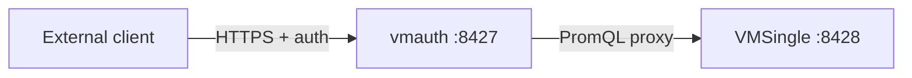
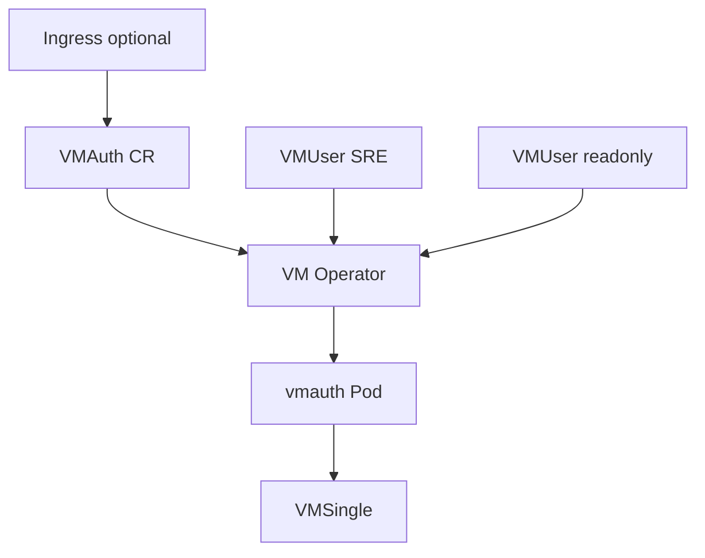
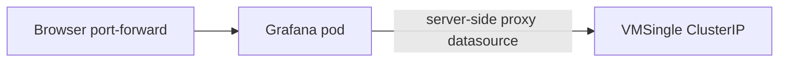
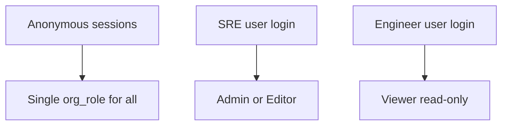

# VMAuth and vmauth (HTTP auth proxy)

## Table of contents

1. [What is vmauth?](#what-is-vmauth)
2. [vmauth binary vs VMAuth CR (Operator)](#vmauth-binary-vs-vmauth-cr-operator)
3. [Use case matrix (upstream-aligned)](#use-case-matrix-upstream-aligned)
4. [auth.config basics](#authconfig-basics)
5. [VMAuth + VMUser on Kubernetes](#vmauth--vmuser-on-kubernetes)
6. [Mapping to this repository](#mapping-to-this-repository)
7. [Grafana vs VMAuth (two security layers)](#grafana-vs-vmauth-two-security-layers)
8. [Diagrams](#diagrams)
9. [FAQ](#faq)
10. [References](#references)

---

## What is vmauth?

**vmauth** is an HTTP reverse proxy from the VictoriaMetrics ecosystem. It can **authorize**, **route**, and **load-balance** requests to VictoriaMetrics components (VMSingle, VMAgent, VMCluster, VictoriaLogs) or any HTTP backend.

| Property | Typical value |
|----------|----------------|
| Default listen port | `8427` (override with `-httpListenAddr`) |
| Config | `-auth.config=/path/to/auth/config.yml` |
| Reload | `SIGHUP`, `/-/reload` (protect with `-reloadAuthKey` in production) |

Official documentation: [vmauth](https://docs.victoriametrics.com/victoriametrics/vmauth/).

For **enterprise** features (e.g. some IP filtering), see VictoriaMetrics Enterprise docs; this page focuses on patterns relevant to OSS and this homelab.

---

## vmauth binary vs VMAuth CR (Operator)

| Aspect | vmauth (process) | VMAuth + VMUser (Kubernetes CRs) |
|--------|------------------|----------------------------------|
| What it is | Single binary / container | CRs managed by VictoriaMetrics Operator |
| Config | YAML `auth.config` on disk or URL | Operator renders config from `VMAuth` + `VMUser` |
| Ingress | You wire Ingress to the Service yourself | **Recommended pattern:** Ingress → **VMAuth** Service (CRDs do not embed Ingress on VMSingle itself) |
| When to use | VMs, bare metal, custom Helm | GitOps-first clusters (this repo) |

Operator overview: [Authorization and exposing components](https://docs.victoriametrics.com/operator/auth/).

---

## Use case matrix (upstream-aligned)

The [upstream use cases](https://docs.victoriametrics.com/victoriametrics/vmauth/#use-cases) are grouped below. Each row states whether it is **typical for this homelab** today (doc-only; no VMAuth deployed).

| Use case | Mechanism (short) | Fits homelab Kind dev? | Notes |
|----------|-------------------|-------------------------|--------|
| Simple HTTP proxy | `unauthorized_user.url_prefix` | Yes (if deployed) | Single backend; path forwarded as-is |
| Generic proxy (multi-backend) | `url_map` + `src_paths` / `drop_src_path_prefix_parts` | Sometimes | Route `/app1/` vs `/app2/` to different URLs |
| Generic load balancer | `url_prefix` as **list** of URLs | Sometimes | Least-loaded round-robin between replicas |
| Load balancer for vmagent | `url_map` for remote-write paths → multiple `vmagent` | After scale-out | This repo: single VMAgent today |
| Load balancer for VM **cluster** | `url_map`: `/insert/` → vminsert, `/select/` → vmselect | Production / not Kind | Kind uses **VMSingle**, not VMCluster |
| High availability | `url_prefix` list + `load_balancing_policy: first_available` | DR / multi-AZ | Hot-standby style failover |
| TLS termination | `-tls` + cert flags on vmauth | Edge / Ingress | Often done at Ingress instead |
| Basic / Bearer auth | `users:` with `username`/`password` or `bearer_token` | Yes | Per-user routing to `url_prefix` |
| JWT / OIDC | `users.jwt` + optional `match_claims` | Advanced | Multi-tenant; see upstream |
| Per-tenant (VM cluster) | Basic auth users + different `url_prefix` per tenant | Production | |
| Enforcing query args | `url_prefix` with fixed query args | Tenant isolation | e.g. `extra_filters` |

**When not to use vmauth in front of Grafana in-cluster:** Grafana already talks to VMSingle over ClusterIP; adding VMAuth between Grafana and VMSingle only makes sense if you **intentionally** change datasource URLs (usually unnecessary for internal dev).

---

## auth.config basics

vmauth reads a YAML file (see [auth config](https://docs.victoriametrics.com/victoriametrics/vmauth/#auth-config)):

- **`users`**: list of authenticated identities (Basic, Bearer, JWT, etc.), each with `url_prefix` or `url_map`.
- **`unauthorized_user`**: requests **without** matching credentials; often used for a single open proxy (still put behind network policy in prod).

Security checklist (production):

- Protect `/-/reload`, `/metrics`, `/flags`, `/debug/pprof` with auth keys or separate internal listen address. See [vmauth security](https://docs.victoriametrics.com/victoriametrics/vmauth/#security).

Minimal **unauthorized** forward (illustrative only):

```yaml
unauthorized_user:
  url_prefix: "http://vmsingle-victoria-metrics.monitoring.svc:8428/"
```

---

## VMAuth + VMUser on Kubernetes

Per [operator auth](https://docs.victoriametrics.com/operator/auth/):

1. **VMAuth** selects which **VMUser** objects to merge (selectors) and can define **Ingress** to expose vmauth.
2. **VMUser** defines credentials and **targetRefs**:
   - **static** `url:` for arbitrary HTTP backends
   - **crd** reference to e.g. `VMAgent`, `VMSingle`, or VMCluster sub-resources

The operator generates Secrets for users and builds the vmauth configuration.

Detailed CR fields: [VMAuth](https://docs.victoriametrics.com/operator/resources/vmauth/), [VMUser](https://docs.victoriametrics.com/operator/resources/vmuser/).

---

## Mapping to this repository

| Component | Manifest / note | Role if VMAuth added later |
|-----------|-------------------|----------------------------|
| VMSingle | `kubernetes/infra/configs/monitoring/victoriametrics/vmsingle.yaml` | Primary PromQL `/api/v1/*` backend |
| VMAgent | `.../vmagent.yaml` | Scrape UI `/targets`, remote-write paths if fronting agents |
| VLSingle | `.../vlsingle.yaml` | Logs HTTP API `:9428` (separate from metrics) |
| Grafana | `kubernetes/infra/configs/monitoring/grafana/grafana.yaml` | **Not** replaced by VMAuth for in-cluster datasource URLs by default |
| Datasources | `.../grafana/datasource-*.yaml` | Point to in-cluster Services (e.g. `vmsingle-victoria-metrics:8428`) |

This repo **does not** ship `VMAuth` or `VMUser` YAML yet; the CRDs exist because the VictoriaMetrics Operator Helm chart installs them.

---

## Grafana vs VMAuth (two security layers)

| Layer | What it protects | This repo (typical) |
|-------|------------------|---------------------|
| **Grafana** (org roles, Teams, folders) | Who can use the **Grafana UI**, edit dashboards, see datasources | See [rbac-multi-team.md](../grafana/rbac-multi-team.md) |
| **VMAuth / vmauth** | Who can call **HTTP APIs** (PromQL, remote write, VictoriaLogs) **outside** the “Grafana pod → ClusterIP” path | Ingress or direct API clients |

**Important:** [VMAuth does not fix anonymous Grafana Admin](../grafana/rbac-multi-team.md). Anyone who can reach Grafana with port-forward gets whatever `auth.anonymous.org_role` grants.

---

## Diagrams

### External client via VMAuth to VMSingle



### GitOps: VMAuth CR + VMUser resources



### In-cluster Grafana (anonymous) uses datasource proxy to VMSingle



VMAuth is **not** on this path unless you change datasource URLs to point at a VMAuth Service.

### Anonymous vs authenticated Grafana sessions (conceptual)



---

## FAQ

**Q: Do we need VMAuth if Grafana is already secured?**  
A: They solve different problems. Grafana secures the **UI**. VMAuth secures **direct HTTP access** to VictoriaMetrics/VictoriaLogs APIs (e.g. scripts, other clusters, public Ingress).

**Q: Should Grafana datasource URL point to VMAuth?**  
A: Only if you explicitly want Grafana queries to go through vmauth (e.g. unified audit, extra auth). For internal Kind dev, direct VMSingle is simpler.

**Q: Where does VMCluster fit?**  
A: vmauth is commonly used to route `/insert/*` and `/select/*` to vminsert/vmselect. This homelab uses **VMSingle**, not VMCluster.

**Q: OSS vs Enterprise?**  
A: Some vmauth features (e.g. certain IP filters) are Enterprise. Check the [vmauth docs](https://docs.victoriametrics.com/victoriametrics/vmauth/) for your version.

---

## References

- [vmauth](https://docs.victoriametrics.com/victoriametrics/vmauth/)
- [Operator: Authorization and exposing components](https://docs.victoriametrics.com/operator/auth/)
- [VMAuth CRD](https://docs.victoriametrics.com/operator/resources/vmauth/)
- [VMUser CRD](https://docs.victoriametrics.com/operator/resources/vmuser/)
- [VictoriaMetrics Operator Stack](victoriametrics.md)
- [Grafana multi-team RBAC](../grafana/rbac-multi-team.md)
