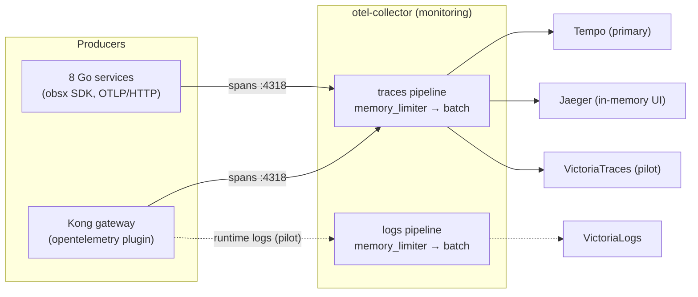

# OpenTelemetry (OTel)

OpenTelemetry is the common language every service and Kong use to describe
"what just happened" during a request — this doc explains it from zero, then
shows exactly how this platform uses it.

## Quick facts

| Item | Value |
|------|-------|
| SDK | OpenTelemetry Go SDK, wired by `pkg/obsx` (OTLP/HTTP export) |
| Collector | `otel-collector` (contrib distribution, `monitoring` namespace) |
| Signals in use | Traces ✅ (all services + Kong) · Logs ✅ (Kong runtime-logs **pilot**) · Metrics ❌ (Prometheus pull model instead) |
| Protocol | OTLP — gRPC `:4317`, HTTP `:4318` |
| Propagation | W3C Trace Context (`traceparent` header); Kong forces injection (`inject: [w3c]`) |
| Sampling | 10% head sampling (`TraceIDRatioBased`; `ParentBased` wrapper **pending** — see [Sampling](#sampling)) |
| Trace backends | Tempo (primary) + Jaeger (in-memory UI) + VictoriaTraces (pilot) |
| Service identity | `OTEL_SERVICE_NAME` env, injected by the app ResourceSets |

## OTel in plain words

When a user clicks "checkout", the request travels through Kong, the order
service, the shipping service, a database, a cache. If something is slow or
broken, you need the story of that trip. **Telemetry** is that story, and it
comes in three forms — the three OTel **signals**:

- **Trace** — the *map of the trip*: which services the request visited, in
  what order, and how long each stop took.
- **Metrics** — the *dashboard gauges*: counters and timers aggregated over
  many requests (requests/sec, error rate, p99 latency). Great for alerting,
  useless for explaining one specific slow request.
- **Logs** — the *notes scribbled along the way*: individual events with
  detail ("payment declined for order 42").

Before OpenTelemetry, every vendor had its own agent, wire format, and API —
switching backends meant re-instrumenting the code. OTel is the CNCF-standard
answer: **one API, one SDK, one wire protocol (OTLP)**, and any backend that
speaks it. This platform leans on that portability: the same span stream
fans out to three different trace backends without touching a line of Go.

## The building blocks

- **API vs SDK** — the *API* is the neutral interface the code calls
  (`tracer.Start(ctx, "name")`); the *SDK* is the engine behind it that
  actually samples, batches, and exports. Libraries depend only on the API;
  the application wires the SDK once at startup (here: `obsx` in `main.go`).
- **Span and trace** — a *span* is one leg of the trip (one HTTP handler, one
  DB query) with a start time, duration, attributes, and a parent. A *trace*
  is the whole trip: every span sharing one `trace_id`, forming a tree.
- **Context propagation** — for spans from different services to join the
  same tree, the `trace_id` must travel with the request. The W3C
  `traceparent` HTTP header (and its gRPC metadata twin) is that boarding
  pass. Kong stamps it onto every upstream request (`inject: [w3c]`), and
  each service passes it on via `pkg/grpcx` / HTTP middleware.
- **Resource attributes** — the name tag on everything a process emits:
  `service.name`, `service.namespace`, `service.instance.id`. Here they come
  from env vars injected by the domain ResourceSets
  (`kubernetes/apps/domains/*-rs.yaml`): `OTEL_SERVICE_NAME` (authoritative —
  without it the SDK falls back to brittle hostname parsing) plus
  `OTEL_RESOURCE_ATTRIBUTES` built from the Downward API.
- **OTLP** — the OpenTelemetry Protocol, the single wire format for all
  three signals. gRPC on `:4317`, HTTP/protobuf on `:4318`. Services and
  Kong both use OTLP/HTTP to `:4318`.
- **Collector** — a standalone process that sits between producers and
  backends, like a mail room: **receivers** accept telemetry (here: OTLP),
  **processors** shape it (here: `memory_limiter`, `batch`), **exporters**
  deliver it. A **pipeline** wires receiver → processors → exporters *per
  signal*. Producers stay dumb — they know one address; the collector owns
  the fan-out, so adding/removing a backend is a collector-only change.

## How it works in this platform

- **Traces** — every service exports spans via `obsx`; Kong opens the root
  span at the edge so traces start at the gateway. The collector fans out to
  three backends (Tempo is the Grafana default; Jaeger is a dev UI;
  VictoriaTraces is a pilot — see
  [tracing/backends-comparison.md](tracing/backends-comparison.md)).
- **Logs** — the primary log path is **not** OTel: Vector tails pod stdout
  into VictoriaLogs. The collector's `logs` pipeline carries one pilot
  stream: Kong **runtime** logs via the plugin's `logs_endpoint` (Kong ≥ 3.8),
  running alongside Vector for comparison
  ([logging/README.md](logging/README.md)).
- **Metrics** — intentionally not OTel. The stack is pull-based
  (VMAgent scrapes `/metrics`; Kong's `prometheus` plugin on `:8100`), with
  dashboards, recording rules, and alerts already built on it. Kong's OTel
  *metrics* export also needs Kong 3.13+ (Enterprise train; OSS is 3.9).
  Revisit if OSS catches up — until then OTel here means traces + the logs
  pilot.

## Sampling

Keeping every trace is expensive and unnecessary; this platform keeps ~10%
(**head sampling** — the decision is made when the trace starts, per
`trace_id`, via `TraceIDRatioBased`; env `OTEL_SAMPLE_RATE=0.1`).

The subtlety is *who decides*. The intended design: Kong (root) decides once,
everyone downstream honours it — that is what a `ParentBased` wrapper does
(the official default, `parentbased_traceidratio`: sample the root by ratio,
then follow the parent's decision). **Known gap:** the services configure
`TraceIDRatioBased` *without* `ParentBased`, so each hop re-rolls the dice
independently. `TraceIDRatioBased` is deterministic on `trace_id` and every
hop uses the same 10%, so decisions *happen* to agree today — but any rate
drift between components would tear traces apart. The fix (wrap in
`ParentBased`) lives in the service repos and is pending; details in
[tracing/architecture.md](tracing/architecture.md).

## Operations

Env vars injected by the app ResourceSets (`kubernetes/apps/domains/*-rs.yaml`,
`kubernetes/apps/order-worker.yaml`):

| Env | Value | Meaning |
|-----|-------|---------|
| `OTEL_COLLECTOR_ENDPOINT` | `otel-collector-opentelemetry-collector.monitoring.svc.cluster.local:4318` | Where `obsx` sends OTLP/HTTP |
| `OTEL_SERVICE_NAME` | `<< inputs.name >>` (e.g. `order`) | Authoritative `service.name` |
| `OTEL_RESOURCE_ATTRIBUTES` | `service.namespace=$(POD_NAMESPACE),service.instance.id=$(POD_NAME)` | Extra identity via Downward API |
| `OTEL_SAMPLE_RATE` | `0.1` | Head-sampling ratio |
| `TRACING_ENABLED` | `true` | `obsx` kill switch per service |

Note: `OTEL_COLLECTOR_ENDPOINT` and `OTEL_SAMPLE_RATE` are platform names read
by `obsx`, not the standard SDK vars (`OTEL_EXPORTER_OTLP_ENDPOINT`,
`OTEL_TRACES_SAMPLER_ARG`).

Quick verification:

- **Traces arriving** — Grafana → Explore → **Tempo** → search
  `service.name = order` (or the Jaeger UI service dropdown).
- **Kong pilot logs arriving** — Explore → **VictoriaLogs** →
  `service.name:kong` (LogsQL).
- **Collector health** — `kubectl -n monitoring logs deploy/otel-collector-opentelemetry-collector`;
  zpages on `:55679`.
- **Log ↔ trace pivot** — a `trace_id` in any log line links to the Tempo
  trace (and back) via the Grafana datasource correlations.

## References

- Official: [opentelemetry.io/docs/concepts](https://opentelemetry.io/docs/concepts/) — signals, SDK, propagation; [Collector docs](https://opentelemetry.io/docs/collector/); [sampling guidance](https://opentelemetry.io/docs/concepts/sampling/)
- In-house: [tracing/README.md](tracing/README.md) · [tracing/architecture.md](tracing/architecture.md) · [logging/README.md](logging/README.md) · [../platform/kong-gateway.md](../platform/kong-gateway.md)

_Last updated: 2026-07-03 — initial version: traces + Kong logs pilot on collector, ParentBased gap documented._
