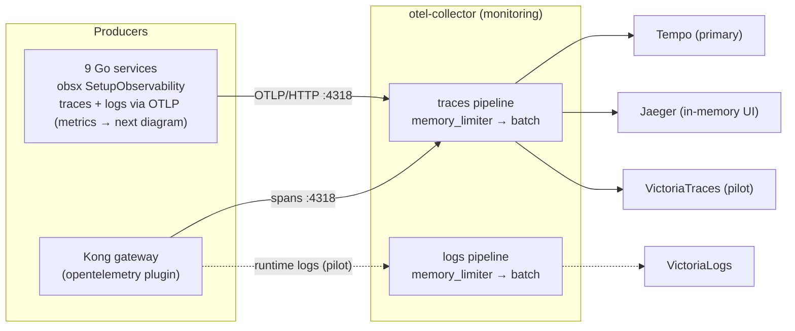
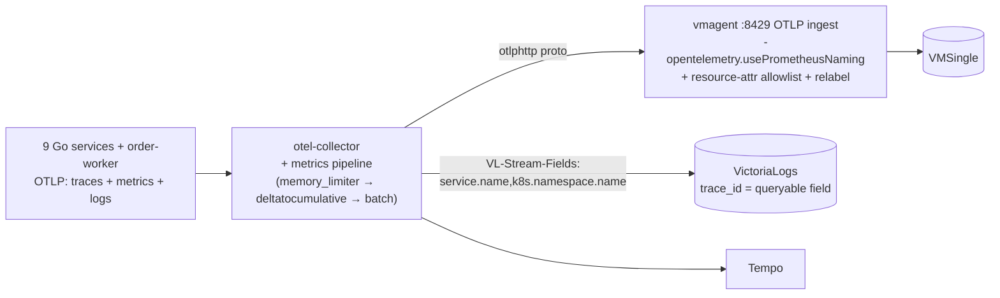

# OpenTelemetry (OTel)

OpenTelemetry is the common language every service and Kong use to describe
"what just happened" during a request. This doc explains it from zero, shows
how this platform uses it today, and — since [RFC-0014](../proposals/rfc/RFC-0014/README.md)
— is the **authoritative instrumentation policy page**: the invariants every
service and PR must respect.

## Quick facts

| Item | Value |
|------|-------|
| SDK | OpenTelemetry Go **v1.44.0**, wired by **`pkg/obsx` `SetupObservability`** (one call in `main()`) |
| Semconv | **v1.41.0**, pinned in `pkg/obsx` — bumps only via a deliberate pkg release |
| Collector | `otel-collector` (contrib distribution, `monitoring` namespace) |
| Signals | Traces ✅ (all services + Kong) · Metrics ✅ (OTLP push, fleet-wide since RFC-0014 P3; `/metrics` scrape retired) · Logs ✅ (otelzap → OTLP, fleet-wide since RFC-0014 P4; Kong runtime-logs pilot ✅) |
| Protocol | OTLP — HTTP/protobuf `:4318` for everything (VictoriaMetrics/VictoriaLogs accept nothing else) |
| Propagation | W3C Trace Context (`traceparent`); Kong forces injection (`inject: [w3c]`) |
| Sampling | 10% head sampling, `ParentBased(TraceIDRatioBased)` (see [Sampling](#sampling)) |
| Trace backends | Tempo (primary) + Jaeger (in-memory UI) + VictoriaTraces (pilot) |
| Service identity | `OTEL_SERVICE_NAME` + Downward API envs, injected by the app ResourceSets |

## OTel in plain words

When a user clicks "checkout", the request travels through Kong, the order
service, the shipping service, a database, a cache. If something is slow or
broken, you need the story of that trip. **Telemetry** is that story, and it
comes in three forms — the three OTel **signals**:

- **Trace** — the *map of the trip*: which services the request visited, in
  what order, and how long each stop took.
- **Metrics** — the *dashboard gauges*: counters and timers aggregated over
  many requests (requests/sec, error rate, p99 latency). Great for alerting,
  useless for explaining one specific slow request.
- **Logs** — the *notes scribbled along the way*: individual events with
  detail ("payment declined for order 42").

Before OpenTelemetry, every vendor had its own agent, wire format, and API —
switching backends meant re-instrumenting the code. OTel is the CNCF-standard
answer: **one API, one SDK, one wire protocol (OTLP)**, and any backend that
speaks it. This platform leans on that portability: the same span stream fans
out to three trace backends without touching a line of Go, and RFC-0014
extends the same idea to metrics and logs.

## The building blocks — and who imports what

The OTel spec's core rule: *libraries depend only on the API; if no SDK is
installed, API calls are no-ops.* That split is why instrumentation can live
in shared code without forcing a telemetry runtime on anyone:

| Layer | Go modules | Who imports it here |
|---|---|---|
| **API** | `go.opentelemetry.io/otel`, `otel/trace`, `otel/metric`, `otel/log` (bridge API) | Library/shared code: `pkg/obsx`, `pkg/grpcx`, middleware |
| **SDK** | `otel/sdk`, `otel/sdk/metric`, `otel/sdk/log`, `otel/sdk/resource` | **Only `pkg/obsx.SetupObservability`** — services never wire the SDK directly |
| **Exporters** (SDK plugins) | `otlptracehttp`, `otlpmetrichttp`, `otlploghttp` | `pkg/obsx` only |
| **Contrib** | `otelgin`, `otelgrpc` (+`filters`), `instrumentation/runtime`, `bridges/otelzap` | Router middleware; the rest via `pkg/obsx`/`pkg/grpcx` |

Other concepts, in one line each:

- **Span / trace** — a span is one leg of the trip (one handler, one DB
  query); a trace is every span sharing one `trace_id`, forming a tree.
- **Context propagation** — the `trace_id` travels in the W3C `traceparent`
  header (or gRPC metadata); Kong stamps it at the edge, `pkg/grpcx`/HTTP
  middleware pass it on.
- **Resource attributes** — the name tag on everything a process emits
  (`service.name`, `k8s.namespace.name`, …). Built by `obsx` from env.
- **OTLP** — the single wire format for all three signals. This platform
  standardizes on **HTTP/protobuf `:4318`** end-to-end (D-6): the
  VictoriaMetrics/VictoriaLogs OTLP ingests accept neither gRPC nor JSON.
- **Collector** — the mail room between producers and backends: receivers →
  processors → exporters, one pipeline per signal. Producers know one
  address; the collector owns the fan-out.
- **Views** — SDK-side reshaping of metrics at aggregation time (bucket
  boundaries, dropped attributes). This platform's Views are **mandatory
  policy**, not tuning (see below).

## Platform instrumentation policy (RFC-0014 — normative)

These are the rules; PRs that violate them get rejected. Rationale lives in
[RFC-0014](../proposals/rfc/RFC-0014/README.md).

1. **One wiring point.** Services call `obsx.SetupObservability(ctx, cfg)`
   once in `main()` and defer its `Shutdown`. No service builds an OTel
   provider, exporter, or resource by hand.

   ```go
   obs, err := obsx.SetupObservability(ctx, obsx.ConfigFromEnv())
   if err != nil { /* fail startup */ }
   defer obs.Shutdown(shutdownCtx)

   // logs (when OTEL_LOGS_ENABLED): tee next to the stdout core —
   // ZapCore is level-gated and never nil, so the tee is unconditional.
   logger := zap.New(zapcore.NewTee(stdoutCore, obs.ZapCore(serviceName, zapcore.InfoLevel)))
   ```

2. **client_golang is retired.** No `prometheus.*`/`promauto` instruments in
   app code — metrics use the OTel Meter API with semconv names. The old
   `middleware/prometheus.go` and its `/metrics` scrape endpoint were removed
   at the RFC-0014 P3 cutover.
3. **Semconv v1.41 is pinned** in `pkg/obsx`; the (SDK, contrib, semconv)
   triple bumps only as a deliberate pkg release with its integration test.
4. **Never set `OTEL_SEMCONV_STABILITY_OPT_IN`.** Any value containing `rpc`
   silently renames `rpc_*` metrics to the legacy milliseconds form and
   breaks every consumer.
5. **The Views are law.** `http.server.request.duration` carries the platform
   13-bucket set `{0.005, 0.01, 0.025, 0.05, 0.1, 0.2, 0.3, 0.5, 0.75, 1, 2, 5, 10}`
   (keeps the 0.2/0.3/0.75 SLO points and the `le=2` Apdex bound that semconv
   defaults lack); `body.size` histograms use the byte set; `rpc.client.call.duration`
   drops `server.address`/`server.port` (pod-IP churn). Changing a bucket is
   an RFC-level decision, not a service PR.
6. **Rollout flags are now ON fleet-wide.** `OTEL_METRICS_ENABLED` /
   `OTEL_LOGS_ENABLED` completed their canary-first, per-service rollout at the
   P3/P4 cutovers and are enabled fleet-wide (set via the shared svc-env
   anchor). They remain as per-service kill switches; flipping one *off* is an
   incident action, tracked against the RFC-0014
   [tracking table](../proposals/rfc/RFC-0014/tracking.md).
7. **Export interval is 15 s** (`OTEL_METRIC_EXPORT_INTERVAL_SECONDS`) — it
   matches the historical scrape interval so burn-rate math never shifted.
   Don't "optimize" it to the SDK's 60 s default.
8. **No secrets/PII in labels or resource attributes.** Label values surface
   in dashboards, alerts and URLs; `OTEL_RESOURCE_ATTRIBUTES` values become
   labels on every signal (the vmagent allowlist is the backstop, not an
   excuse).
9. **Health and reflection RPCs are not telemetry.** `pkg/grpcx` filters them
   from spans and metrics; don't work around it.
10. **Cardinality backstop**: the SDK's 2000-attribute-set limit per
    instrument stays on; an `otel.metric.overflow` datapoint is an alert, not
    noise.

## How it works in this platform

The signals in flight — all three live fleet-wide since the RFC-0014 P3/P4
cutovers (the metrics path is detailed in the next diagram):



The metrics path in full (live per RFC-0014 P1–P4):



> Note: the RFC designed a `legacy-checkout` scrape fence for checkout-service,
> but checkout-service was never deployed/integrated — the fence was dropped at
> landing (ADR-016). No app service is scraped for metrics anymore.

- **Traces** — unchanged: every service exports spans via `obsx`; Kong opens
  the root span at the edge; the collector fans out to three backends.
- **Metrics** — OTLP push, fleet-wide: services emit semconv metrics through
  the OTel Meter API to the collector, which forwards them to vmagent's OTLP
  ingest and on to VMSingle. The `/metrics` scrape and client_golang RED were
  removed at the P3 cutover. Exemplars are not available on this path
  (VictoriaMetrics won't-fix, D-14). Details, mapping tables and the consumer
  checklist: [RFC-0014](../proposals/rfc/RFC-0014/README.md).
- **Logs** — zap records tee through the level-gated otelzap bridge to
  VictoriaLogs, where `TraceId` becomes a **queryable `trace_id` field** (this
  is what repairs the traces↔logs correlation). Vector remains for
  non-instrumented pods forever.

## Sampling

Keeping every trace is expensive and unnecessary; this platform keeps ~10%
(**head sampling** — the decision is made when the trace starts, per
`trace_id`, via `TraceIDRatioBased`; env `OTEL_SAMPLE_RATE=0.1`).

The subtlety is *who decides*. The design: Kong (root) decides once, everyone
downstream honours it — that is what the `ParentBased` wrapper does (the
official default, `parentbased_traceidratio`: sample the root by ratio, then
follow the parent's decision). All services configure
`ParentBased(TraceIDRatioBased(rate))` (now inside `obsx.SetupObservability`),
so a service's own ratio only applies when it is the *root* of a trace; when
it has a parent (the Kong→service edge, or a service→service gRPC hop) it
always honours the parent's `sampled` flag. Concretely, per the OTel Go SDK: a
sampled remote parent → `AlwaysOn`, an unsampled one → `AlwaysOff`. This makes
sampling *complete* — a trace Kong keeps is kept whole downstream. Details in
[tracing/architecture.md](tracing/architecture.md).

## Operations

Env vars read by `obsx.ConfigFromEnv` (injected by the app ResourceSets,
`kubernetes/apps/domains/*-rs.yaml`, `kubernetes/apps/order-worker.yaml`):

| Env | Default | Meaning |
|-----|---------|---------|
| `OTEL_COLLECTOR_ENDPOINT` | `otel-collector-opentelemetry-collector.monitoring.svc.cluster.local:4318` | OTLP/HTTP target for all signals |
| `OTEL_SERVICE_NAME` / `SERVICE_NAME` | — | Authoritative `service.name` |
| `SERVICE_VERSION` | — | semconv `service.version` |
| `K8S_NAMESPACE_NAME`, `K8S_POD_NAME` | Downward API | semconv k8s identity on the Resource |
| `DEPLOYMENT_ENVIRONMENT` | — | semconv `deployment.environment.name` |
| `TRACING_ENABLED` | `true` | Traces kill switch per service |
| `OTEL_SAMPLE_RATE` | `0.1` | Head-sampling ratio (root decisions) |
| `OTEL_METRICS_ENABLED` | **`true`** | OTLP metrics + runtime instrumentation — on fleet-wide since the RFC-0014 P3 cutover (kept as a kill switch) |
| `OTEL_LOGS_ENABLED` | **`true`** | otelzap → OTLP logs — on fleet-wide since the RFC-0014 P4 cutover (kept as a kill switch) |
| `OTEL_METRIC_EXPORT_INTERVAL_SECONDS` | `15` | PeriodicReader interval (policy #7) |

Note: `OTEL_COLLECTOR_ENDPOINT` and `OTEL_SAMPLE_RATE` are platform names read
by `obsx`, not the standard SDK vars (`OTEL_EXPORTER_OTLP_ENDPOINT`,
`OTEL_TRACES_SAMPLER_ARG`).

Quick verification:

- **Traces arriving** — Grafana → Explore → **Tempo** → search
  `service.name = order` (or the Jaeger UI service dropdown).
- **OTLP metrics arriving** — VMSingle/vmui:
  `http_server_request_duration_seconds_bucket{app="<svc>"}` with 13 buckets.
- **OTLP logs arriving** — Explore → **VictoriaLogs** →
  `trace_id:"<id>"` returns the request's lines.
- **Collector health** — `kubectl -n monitoring logs deploy/otel-collector-opentelemetry-collector`;
  zpages on `:55679`.

## References

- Official: [opentelemetry.io/docs/concepts](https://opentelemetry.io/docs/concepts/) · [Go SDK](https://opentelemetry.io/docs/languages/go/) · [versioning & stability](https://opentelemetry.io/docs/specs/otel/versioning-and-stability/) · [Collector](https://opentelemetry.io/docs/collector/) · [sampling](https://opentelemetry.io/docs/concepts/sampling/) · [VictoriaMetrics OTel](https://docs.victoriametrics.com/victoriametrics/integrations/opentelemetry/) · [VictoriaLogs OTel](https://docs.victoriametrics.com/victorialogs/data-ingestion/opentelemetry/)
- In-house: [RFC-0014 explainer](rfc-0014-explainer.md) (old-vs-new, beginner) · [RFC-0014](../proposals/rfc/RFC-0014/README.md) (design record + tracking) · [tracing/README.md](tracing/README.md) · [tracing/architecture.md](tracing/architecture.md) · [logging/README.md](logging/README.md) · [metrics/streaming-aggregation.md](metrics/streaming-aggregation.md) · [../platform/kong-gateway.md](../platform/kong-gateway.md)

_Last updated: 2026-07-09 — RFC-0014 P5 sweep: metrics/logs now OTLP push fleet-wide (P3/P4 cutovers), `/metrics` scrape retired, checkout-service fence dropped (ADR-016), exemplars retired (D-14); educational core and sampling section unchanged._
