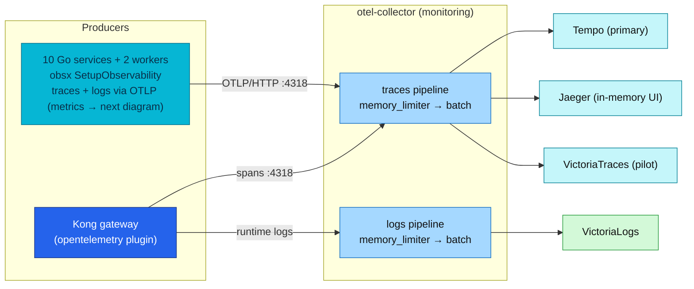
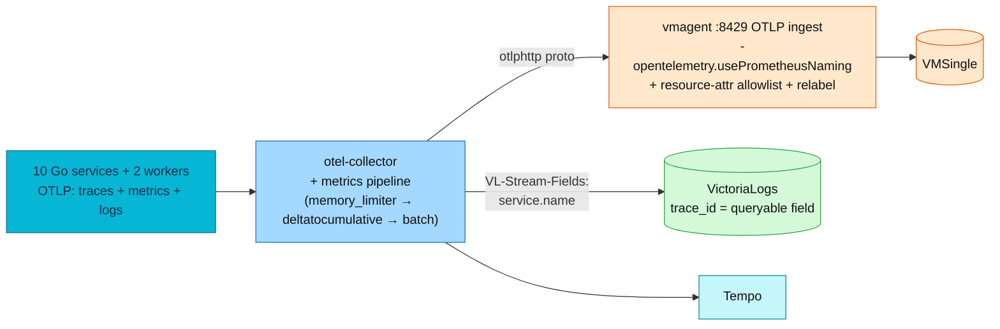

# OpenTelemetry (OTel)

OpenTelemetry is the common language every service, worker, and Kong use to describe
"what just happened" during a request. This doc explains it from zero, shows
how this platform uses it today (Collector topology, sampling, operations).
**Service instrumentation policy** (normative rules for PRs) lives in
[**Application observability**](../../api/observability.md).

## Quick facts

| Item | Value |
|------|-------|
| SDK | OpenTelemetry Go **v1.44.0**, wired by **`pkg/obsx` `SetupObservability`** (one call in `main()`) |
| Semconv | **v1.41.0**, pinned in `pkg/obsx` — bumps only via a deliberate pkg release |
| Collector | `otel-collector` (contrib distribution, `monitoring` namespace) |
| Signals | Traces ✅ (10 services, 2 workers, and Kong) · Metrics ✅ (OTLP push, fleet-wide since RFC-0014 P3; `/metrics` scrape retired) · Logs ✅ (otelzap → OTLP, fleet-wide since RFC-0014 P4; Kong runtime logs via OTLP ✅) |
| Protocol | Services and workers use OTLP/HTTP protobuf on `:4318`; the cluster Collector also accepts OTLP/gRPC on `:4317` |
| Propagation | W3C Trace Context (`traceparent`); Kong forces injection (`inject: [w3c]`) |
| Sampling | 10% head sampling, `ParentBased(TraceIDRatioBased)` (see [Sampling](#sampling)) |
| Trace backends | Tempo (primary) + Jaeger (in-memory UI) + VictoriaTraces (pilot) |
| Service identity | `OTEL_SERVICE_NAME` + Downward API envs, injected by the app ResourceSets |

## How to use this area

The two documents serve different learning needs. Neither replaces the original
RFC, which remains the historical decision and rollout record.

| Goal | Start here |
|------|------------|
| Build the mental model from zero | [RFC-0014 explainer](rfc-0014-explainer.md) |
| Review rules for service code and PRs | [Application observability](../../api/observability.md) |
| Understand the deployed signal paths | [How it works in this platform](#how-it-works-in-this-platform) |
| Operate or troubleshoot export | [Operations](#operations) |
| Read the decision and rollout history | [RFC-0014](../../proposals/rfc/RFC-0014/) |

## OTel in plain words

When a user clicks "checkout", the request travels through Kong, the order
service, the shipping service, a database, a cache. If something is slow or
broken, you need the story of that trip. **Telemetry** is that story, and it
comes in three forms — the three OTel **signals**:

- **Trace** — the *map of the trip*: which services the request visited, in
  what order, and how long each stop took.
- **Metrics** — the *dashboard gauges*: counters and timers aggregated over
  many requests (requests/sec, error rate, p99 latency). Great for alerting,
  useless for explaining one specific slow request.
- **Logs** — the *notes scribbled along the way*: individual events with
  detail ("payment declined for order 42").

Before OpenTelemetry, every vendor had its own agent, wire format, and API —
switching backends meant re-instrumenting the code. OTel is the CNCF-standard
answer: **one API, one SDK, one wire protocol (OTLP)**, and any backend that
speaks it. This platform leans on that portability: the same span stream fans
out to three trace backends without touching a line of Go, and RFC-0014
extends the same idea to metrics and logs.

## The building blocks — and who imports what

The OTel spec's core rule: *libraries depend only on the API; if no SDK is
installed, API calls are no-ops.* That split is why instrumentation can live
in shared code without forcing a telemetry runtime on anyone:

| Layer | Go modules | Who imports it here |
|---|---|---|
| **API** | `go.opentelemetry.io/otel`, `otel/trace`, `otel/metric`, `otel/log` (bridge API) | Library/shared code: `pkg/obsx`, `pkg/grpcx`, middleware |
| **SDK** | `otel/sdk`, `otel/sdk/metric`, `otel/sdk/log`, `otel/sdk/resource` | **Only `pkg/obsx.SetupObservability`** — services never wire the SDK directly |
| **Exporters** (SDK plugins) | `otlptracehttp`, `otlpmetrichttp`, `otlploghttp` | `pkg/obsx` only |
| **Contrib** | `otelgin`, `otelgrpc` (+`filters`), `instrumentation/runtime`, `bridges/otelzap` | Router middleware; the rest via `pkg/obsx`/`pkg/grpcx` |

Other concepts, in one line each:

- **Span / trace** — a span is one leg of the trip (one handler, one DB
  query); a trace is every span sharing one `trace_id`, forming a tree.
- **Context propagation** — the `trace_id` travels in the W3C `traceparent`
  header (or gRPC metadata); Kong stamps it at the edge, `pkg/grpcx`/HTTP
  middleware pass it on.
- **Resource attributes** — the name tag on everything a process emits
  (`service.name`, `k8s.namespace.name`, …). Built by `obsx` from env.
- **OTLP** — the common wire protocol for all three signals. Services and
  workers standardize on **HTTP/protobuf `:4318`** (D-6). The cluster Collector
  also exposes OTLP/gRPC on `:4317` for compatible platform tools, but the Go
  application path does not use it. The Collector then translates and routes
  each signal to the backend-specific ingest endpoint.
- **Collector** — the mail room between producers and backends: receivers →
  processors → exporters, one pipeline per signal. Producers know one
  address; the collector owns the fan-out.
- **Views** — SDK-side reshaping of metrics at aggregation time (bucket
  boundaries, dropped attributes). This platform's Views are **mandatory
  policy**, not tuning (see below).

### What OpenTelemetry does not replace

OpenTelemetry standardizes how telemetry is created, described, transported,
and processed. It is not the database, query language, dashboard, or alert
evaluator. Keeping those boundaries clear makes the stack easier to reason
about and keeps backend changes out of service code.

| Responsibility | This platform uses | OTel role |
|----------------|--------------------|-----------|
| Instrumentation API and SDK | `pkg/obsx`, `otelgin`, `otelgrpc`, `otelzap` | Defines and emits signals |
| Wire protocol | OTLP/HTTP protobuf | Standard transport |
| Processing and routing | OpenTelemetry Collector | Receives, batches, normalizes, and fans out |
| Storage and query | VictoriaMetrics, VictoriaLogs, Tempo, Jaeger, VictoriaTraces | Not an OTel responsibility |
| Visualization and alerting | Grafana, VMAlert, VMAlertmanager, Sloth | Consumes backend data; not an OTel responsibility |

## Platform instrumentation policy (RFC-0014 — normative)

> **Canonical location:** [Application observability](../../api/observability.md)
> — rules 1–10, middleware order, env table, three-layer spans, and correlation
> fields. This section is not duplicated here.

Rationale and rollout history: [RFC-0014](../../proposals/rfc/RFC-0014/README.md).

## How it works in this platform

The signals in flight — all three live fleet-wide since the RFC-0014 P3/P4
cutovers (the metrics path is detailed in the next diagram):

The metrics path in full (live per RFC-0014 P1–P4):

> Historical note: at the RFC-0014 P3 cutover, checkout-service had not yet
> been deployed to the cluster, so the planned `legacy-checkout` scrape fence
> was dropped at landing (ADR-016). RFC-0015 P5 later deployed checkout and
> checkout-worker directly on the unified OTel path. No app service is scraped
> for metrics today.

- **Traces** — unchanged: every service and worker exports spans via `obsx`;
  Kong opens the root span at the edge; the collector fans out to three backends.
- **Metrics** — OTLP push, fleet-wide: services and workers emit semconv
  metrics through the OTel Meter API to the collector, which forwards them to vmagent's OTLP
  ingest and on to VMSingle. The `/metrics` scrape and client_golang RED were
  removed at the P3 cutover. Exemplars are not available on this path
  (VictoriaMetrics won't-fix, D-14). Details, mapping tables and the consumer
  checklist: [RFC-0014](../../proposals/rfc/RFC-0014/README.md).
- **Logs** — service and worker zap records tee through the level-gated
  otelzap bridge to VictoriaLogs, where `TraceId` becomes a **queryable `trace_id` field** (this
  is what repairs the traces↔logs correlation). Vector remains for
  non-instrumented pods forever.

### Cluster and local-stack differences

The same application instrumentation runs in both environments, but the
Collector and backend topology are intentionally different. This distinction
matters when a local query returns a series that does not exist in the cluster.

| Concern | Kubernetes | Local-stack |
|---------|------------|-------------|
| Producer sampling | `0.1` at Kong and services | `1.0` for complete demo traces |
| Collector receivers | OTLP/HTTP `:4318` and OTLP/gRPC `:4317` | OTLP/HTTP `:4318` only |
| Trace fan-out | Tempo, Jaeger, and VictoriaTraces | VictoriaTraces |
| RED metrics | Application SDK metrics; no spanmetrics connector | Application SDK metrics plus a spanmetrics compatibility connector |
| Infrastructure logs | Vector DaemonSet | Container logging path used by the local stack |

The local spanmetrics connector is a compatibility aid, not the source of the
cluster RED metrics. Cluster dashboards and alerts use the semconv metrics
emitted directly by `otelgin` and `otelgrpc`.

## Sampling

Keeping every production trace is expensive and unnecessary. Kubernetes keeps
about 10% (**head sampling** — the decision is made when the trace starts, per
`trace_id`, via `TraceIDRatioBased`; env `OTEL_SAMPLE_RATE=0.1`). Local-stack
sets the rate to `1.0` so a learner can inspect every demo request.

The subtlety is *who decides*. The design: Kong (root) decides once, everyone
downstream honours it — that is what the `ParentBased` wrapper does (the
official default, `parentbased_traceidratio`: sample the root by ratio, then
follow the parent's decision). All services and workers configure
`ParentBased(TraceIDRatioBased(rate))` (now inside `obsx.SetupObservability`),
so a service's own ratio only applies when it is the *root* of a trace; when
it has a parent (the Kong→service edge, or a service→service gRPC hop) it
always honours the parent's `sampled` flag. Concretely, per the OTel Go SDK: a
sampled remote parent → `AlwaysOn`, an unsampled one → `AlwaysOff`. This makes
sampling *complete* — a trace Kong keeps is kept whole downstream. Details in
[tracing/architecture.md](../tracing/architecture.md).

## Operations

Environment variables read by `obsx.ConfigFromEnv`: see
[Application observability § Environment variables](../../api/observability.md#environment-variables).

Quick verification:

- **Traces arriving** — Grafana → Explore → **Tempo** → search
  `service.name = order` (or the Jaeger UI service dropdown).
- **OTLP metrics arriving** — VMSingle/vmui:
  `http_server_request_duration_seconds_bucket{app="<svc>"}` with 13 buckets.
- **OTLP logs arriving** — Explore → **VictoriaLogs** →
  `trace_id:"<id>"` returns the request's lines.
- **Collector health** — `kubectl -n monitoring logs deploy/otel-collector-opentelemetry-collector`;
  zpages on `:55679`.

## References

- Official: [opentelemetry.io/docs/concepts](https://opentelemetry.io/docs/concepts/) · [Go SDK](https://opentelemetry.io/docs/languages/go/) · [versioning & stability](https://opentelemetry.io/docs/specs/otel/versioning-and-stability/) · [Collector](https://opentelemetry.io/docs/collector/) · [sampling](https://opentelemetry.io/docs/concepts/sampling/) · [VictoriaMetrics OTel](https://docs.victoriametrics.com/victoriametrics/integrations/opentelemetry/) · [VictoriaLogs OTel](https://docs.victoriametrics.com/victorialogs/data-ingestion/opentelemetry/)
- In-house: [Application observability](../../api/observability.md) · [RFC-0014 explainer](rfc-0014-explainer.md) (old-vs-new, beginner) · [RFC-0014](../../proposals/rfc/RFC-0014/README.md) (design record + tracking) · [tracing/README.md](../tracing/README.md) · [tracing/architecture.md](../tracing/architecture.md) · [logging/README.md](../logging/README.md) · [metrics/streaming-aggregation.md](../metrics/streaming-aggregation.md) · [../platform/kong-gateway.md](../../platform/kong-gateway.md)

_Last updated: 2026-07-14 — moved into the OpenTelemetry area; verified SDK, protocol, worker coverage, environment differences, and checkout rollout history._
