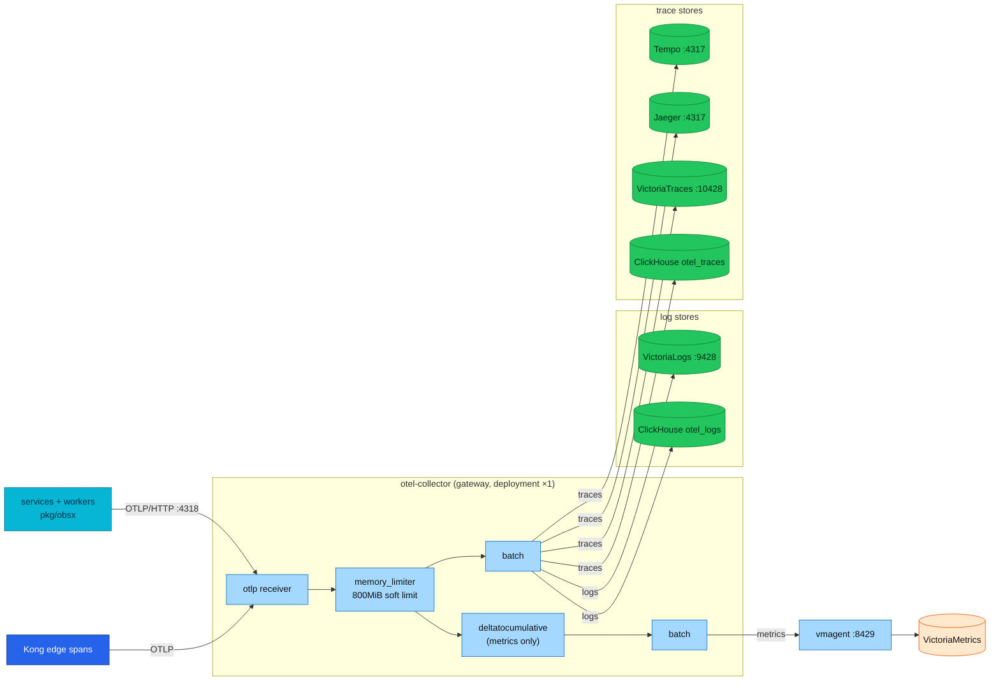

# OpenTelemetry Collector

> The **otel-collector** is the single door all application telemetry walks
> through: one OTLP endpoint in, governed processing in the middle, fan-out to
> six backends on the way out. This doc explains how a Collector works —
> components, pipelines, deployment patterns — and then walks the **actual
> deployed configuration** line by line.

| | |
|---|---|
| **Manifest** | `kubernetes/infra/controllers/tracing/otel-collector/otel-collector.yaml` (HelmRelease, ns `monitoring`) |
| **Distribution** | `otel/opentelemetry-collector-contrib:0.152.0` |
| **Mode** | Gateway — `deployment`, 1 replica (SPOF, accepted — see [stack review](../stack-review.md)) |
| **Receivers** | OTLP only — gRPC `:4317`, HTTP `:4318` |
| **Pipelines** | `traces`, `logs`, `metrics` — see [table below](#the-deployed-pipelines) |
| **Self-telemetry** | `:8888` (scraped) · health `:13133` · zpages `:55679` |
| **Resources** | requests 50m/256Mi · limits 200m/**1Gi** (`memory_limiter` at 800MiB) |

---

## Overview

The Collector is a standalone service that does three jobs, in order:
**receive** telemetry (natively OTLP; other formats translatable), **process**
it (batch, guard memory, normalize, filter, enrich), and **export** it to one
or more backends. It is optional in OTel's design — an SDK can export straight
to a backend — but at platform scale it earns its place fast:

- **Decoupling** — every service points at one endpoint; backends can be added
  or swapped (Loki → VictoriaLogs, the ClickHouse OLAP path) with zero app
  changes.
- **Offload** — batching, retries, compression, and queueing happen here, not
  in every application process.
- **Governance** — one place to normalize temporality, guard against memory
  blowups, and (if ever needed) scrub attributes before data leaves the
  cluster.

> **Service authors:** you never talk to the Collector directly — `pkg/obsx`
> points at it via `OTEL_COLLECTOR_ENDPOINT`. This doc is the platform view;
> the app contract is [`docs/api/observability.md`](../../api/observability.md).

## Component model

A Collector config has five component types; **pipelines** wire the first
three together per signal:

| Component | Role | Deployed here |
|-----------|------|---------------|
| **Receiver** | How data gets in — push (listen on a port) or pull (scrape a target) | `otlp` (gRPC `:4317`, HTTP `:4318`) |
| **Processor** | Transformations between receive and export; run **in the order listed** | `memory_limiter`, `deltatocumulative`, `batch` |
| **Exporter** | How data leaves — per backend, with its own retry/queue | 7 defined, 6 wired (see below) |
| **Extension** | Cross-cutting services outside the data path | `health_check` `:13133`, `zpages` `:55679` |
| **Connector** | Joins the *exporter* end of one pipeline to the *receiver* end of another (e.g. deriving span metrics from traces) | none deployed |



## Deployment patterns — and which one this platform runs

| Pattern | Shape | Buys you | Costs you |
|---------|-------|----------|-----------|
| **Agent** | One Collector per node (DaemonSet) or per pod (sidecar) | Host metadata enrichment, host metrics, early sampling close to the source | A collector's worth of CPU/memory on every node; config sprawl |
| **Gateway** | Central Deployment/fleet behind one Service | One choke point for governance and egress; cheap | Single point of failure until replicated; no host-local metadata |
| **Hybrid** | Agents forward to a gateway fleet | Both of the above | Both operational surfaces |

This platform runs a **single gateway** (`mode: deployment`, 1 replica) —
right-sized for a Kind lab: applications already attach their own Kubernetes
identity via the Downward API (`K8S_NAMESPACE_NAME`, `K8S_POD_NAME`), which
removes the main reason to run node agents. The costs are accepted and
documented: the collector is a SPOF for *telemetry* (not for serving traffic —
`obsx` setup failure is non-fatal by contract), and a restart drops whatever
sat in in-memory queues. Scaling out later = raise `replicaCount` behind the
same Service; only tail-based sampling (not used — head sampling per
[README.md § Sampling](README.md#sampling)) would force trace-ID-aware routing.

## The deployed pipelines

| Pipeline | Receivers | Processors (ordered) | Exporters |
|----------|-----------|----------------------|-----------|
| `traces` | `otlp` | `memory_limiter` → `batch` | `otlp/tempo` · `otlp/jaeger` · `otlphttp/victoriatraces` · `clickhouse` |
| `logs` | `otlp` | `memory_limiter` → `batch` | `otlphttp/victorialogs` · `clickhouse` |
| `metrics` | `otlp` | `memory_limiter` → `deltatocumulative` → `batch` | `otlphttp/victoriametrics` |

A `debug` exporter is **defined but wired into no pipeline** — attach it
temporarily when debugging ingest, never leave it on.

Two non-obvious facts about what is *not* in these pipelines: there are **no
connectors** — cluster RED metrics come exclusively from the applications'
own SDK metrics, not from span derivation (local-stack keeps a spanmetrics
connector as a compatibility path only); and Tempo's own metrics-generator is
configured but writes nowhere (`remote_write: []`), so it produces nothing.

### Processors, and why the order is law

Processors execute **in the order they are listed** — this chain is a
deliberate sequence, not a set:

1. **`memory_limiter`** (`check_interval: 1s`, `limit_mib: 800`,
   `spike_limit_mib: 200`) — always **first**, so backpressure triggers
   *before* downstream processors allocate more memory. At the soft limit the
   collector starts **refusing incoming data** (clients retry) instead of
   dying; 800 + 200 MiB sits under the 1Gi container limit so the limiter
   trips before the OOM killer does.
2. **`deltatocumulative`** (`max_stale: 5m`, metrics only) — defensive
   temporality normalization. The Go SDK exports cumulative by default
   (RFC-0017 D-7), but a delta sample that ever slipped into VictoriaMetrics
   would silently corrupt `rate()`; this processor makes that impossible.
3. **`batch`** (`send_batch_size: 512`, `send_batch_max_size: 1024`,
   `timeout: 5s`) — always **last**, groups exports for compression
   efficiency.

### Exporters and durability

Backend-facing exporters own their own resilience — retry and queueing moved
into exporters (the old dedicated retry processor is long deprecated):

- The ClickHouse exporter shows the full shape: `retry_on_failure`
  (5s → 30s backoff, 300s max elapsed) + `sending_queue` (4 consumers,
  queue 1000), `async_insert`, lz4, 90-day TTL (`2160h`).
- OTLP-HTTP exporters to the Victoria family use gzip; the metrics exporter
  targets **vmagent `:8429`** (not VMSingle) so relabeling and any
  streaming-aggregation stay at one choke point.
- Logs to VictoriaLogs carry `VL-Stream-Fields: service.name` — one stream
  per service.
- All queues are **in-memory**: a collector restart loses whatever is queued.
  Durable buffering would require a storage extension — not deployed,
  accepted for a lab.

### Startup coupling worth knowing

The ClickHouse exporter runs `create_schema` DDL **in `start()`** — if
ClickHouse is unreachable, the whole collector fails to start, taking the
traces *and* logs pipelines with it. That is why the Flux Kustomization
`tracing-local` declares `dependsOn: clickhouse-local`. Removing ClickHouse
from a pipeline also removes this coupling.

## Operations

```bash
kubectl -n monitoring get pods -l app.kubernetes.io/name=opentelemetry-collector
kubectl -n monitoring logs deploy/otel-collector-opentelemetry-collector --tail=50
# live pipeline introspection (zpages)
kubectl -n monitoring port-forward svc/otel-collector-opentelemetry-collector 55679:55679
# → http://localhost:55679/debug/pipelinez , /debug/tracez
```

Health: liveness/readiness probe the `health_check` extension on `:13133`.
Self-metrics on `:8888` feed the
[`OtelMetricsPipelineExportFailures`](../runbooks/microservices/OtelMetricsPipelineExportFailures.md)
alert — watch `otelcol_exporter_send_failed_*` and `otelcol_processor_refused_*`.

### Runbook — common failures {#troubleshooting}

| Symptom | Cause | Fix |
|---------|-------|-----|
| Log: `Memory usage is above soft limit`, clients see refusals | `memory_limiter` backpressure — collector or a backend is overloaded | Check exporter queue metrics for the slow backend; raise limits/replicas only after the backend is healthy. Never reorder the limiter later in the chain |
| Export errors: `context deadline exceeded` | Backend unreachable or too slow before the exporter timeout | Verify endpoint/NetworkPolicy; exporters buffer + retry with backoff, so transient blips self-heal — persistent ones need the backend fixed or `timeout` raised |
| `tls: first record does not look like a TLS handshake` | Exporter speaks TLS to a plaintext endpoint (or vice versa) | Match the exporter `tls.insecure` setting to the backend — in-cluster hops here are plaintext |
| Startup: `unknown type: "…"` | Component not in the running distribution | This platform ships **contrib**; check spelling, then confirm the component exists in `0.152.0` |
| Collector crash-loops at startup, ClickHouse also down | `create_schema` DDL coupling (above) | Restore ClickHouse first (or temporarily remove the exporter from both pipelines) |

## References

- [Collector docs](https://opentelemetry.io/docs/collector/) · [Configuration](https://opentelemetry.io/docs/collector/configuration/) · [Deployment patterns](https://opentelemetry.io/docs/collector/deployment/)
- In-house: [OTel fundamentals](fundamentals.md) (incl. the [RFC-0014 migration story](fundamentals.md#how-this-platform-got-here--rfc-0014-in-pictures)) · [OpenTelemetry (platform)](README.md) · [Logging pipeline](../logging/README.md) · [ClickHouse](../clickhouse/README.md)

---

_Last updated: 2026-07-29 — initial dedicated Collector doc; every value verified against the deployed HelmRelease._
