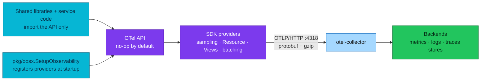

# OpenTelemetry Fundamentals

> Plain-English primer on **what OpenTelemetry actually is** — the API/SDK
> split, signals and when to use each, the OTLP wire protocol, and context
> propagation — written against this platform's real stack. Platform wiring
> lives in [README.md](README.md); the day-to-day rules service authors follow
> are in [`docs/api/observability.md`](../../api/observability.md).

| Item | Value |
|------|-------|
| **What OTel is** | A framework to **generate, collect, and export** telemetry — not a backend, not a UI |
| **Signals here** | Traces, metrics, logs (+ continuous profiling via a separate SDK) |
| **Wire protocol** | OTLP/HTTP + protobuf + gzip, `:4318` (gRPC `:4317` exposed, unused by apps) |
| **Propagation** | W3C `traceparent` + `baggage` (composite propagator in `pkg/obsx`) |
| **Who registers providers** | `pkg/obsx.SetupObservability` — exactly once per process |

---

## What OpenTelemetry is (and is not)

OpenTelemetry is the **plumbing** of observability: a specification plus
per-language libraries that standardize how telemetry is *produced* and
*moved*. It was formed in 2019 by merging OpenTracing (a tracing API) and
OpenCensus (metrics + tracing libraries), and is developed specification-first
under the CNCF — every language SDK implements the same data model, so a trace
started in Go looks identical to one started in Java.

What it deliberately does **not** do: store data or draw dashboards. Storage
and query belong to backends (here: VictoriaMetrics, VictoriaLogs, Tempo,
ClickHouse, Pyroscope), and visualization to Grafana. Choosing OTel is what
lets this platform swap backends (Loki → VictoriaLogs, the VictoriaTraces
pilot, the ClickHouse OLAP path) **without touching a single service**.

## The design concept everything sits on: context

All signals are built on one shared **context propagation** mechanism:

- **Context** — a per-execution key-value store. In Go it is literally
  `context.Context`; every instrumented call passes it down.
- **Propagators** — serialize the context into carriers (HTTP headers, gRPC
  metadata) on the way out and deserialize it on the way in, so telemetry
  emitted in service B can point at the request that started in service A.

This is why one rule in [`docs/api/`](../../api/observability.md) — *always
propagate `context.Context` into `logic/v1`* — powers everything: trace
continuity, log↔trace correlation, and baggage all ride the same object.

## Client architecture: API vs SDK

The instrumentation libraries split into two deliberately separate layers:

| Layer | What it is | Who imports it here |
|-------|------------|---------------------|
| **API** | Interfaces only (`otel.Tracer`, `otel.Meter`, …). **No-op without an SDK** — calls run, nothing is emitted | Everything: `pkg/grpcx`, `pkg/dbx`, middleware, service code |
| **SDK** | The implementation: sampling, Resource, batching, Views, exporters | **Only `pkg/obsx`** |

The SDK plugs in by **registering a provider per signal** — `TracerProvider`,
`MeterProvider`, `LoggerProvider` — at process start. Until a provider is
registered, the API defaults to a no-op, which is exactly why shared libraries
can safely embed instrumentation: consumers who don't configure an SDK pay
nothing. On this platform `obsx.SetupObservability` is the single place
providers are built and installed as the OTel globals; a package-level
`otel.Meter("checkout")` created before setup is safe for the same reason —
it is a no-op until the provider lands.

## Signals — and how to choose one

| | Metrics | Traces | Logs |
|---|---------|--------|------|
| **Question** | *What/when* — is something wrong, since when | *Where* — which hop of which request | *Why* — the detail at the failure point |
| **Granularity** | Aggregated over time | Per request, per operation | Per event |
| **Cardinality/cost** | Cheapest — bounded label sets | Higher — every span stored (sampled) | Highest per byte — but only what you write |
| **Time scope** | Long-term trends, alerting, SLOs | Short-term debugging | Short-term debugging + audit |
| **Starts an incident** | Yes (alerts fire on metrics) | Rarely | Rarely |

The working loop on this platform: an **alert on a metric** scopes the problem
("checkout error rate is burning budget"), a **trace** localizes it ("the
inventory gRPC hop takes 4 s"), and the **logs** on that `trace_id` explain it
("reservation conflict on SKU …"). Profiling adds a fourth step — *which line
of code* — see [Profiling](../profiling/README.md).

Don't emit the same fact on two signals: an HTTP request's status belongs to
the auto-instrumented RED metric and the access log — never also a
hand-written counter ([`docs/api/metrics.md`](../../api/metrics.md)).

### Events vs logs

In the OTel data model an **event is a log record with a non-empty
`EventName`** — same pipeline, same LogRecord fields, plus a stable name that
identifies the event structure. That is exactly what the platform's `event`
log field convention approximates today
([`docs/api/logs.md § Event and field naming`](../../api/logs.md#event-and-field-naming)).
Distinguish these from **span events** (`AddSpanEvent`), which live inside a
span and die with its sampling decision — use span events for
trace-local milestones (`payment.authorized`), log events for
machine-queryable facts that must survive independently of sampling.

## OTLP: the wire protocol

OTLP is OTel's native protocol — the same protobuf payload over two
transports:

| | OTLP/gRPC | OTLP/HTTP |
|---|-----------|-----------|
| Default port | `4317` | `4318` |
| Encoding | protobuf over HTTP/2 | protobuf **or** JSON, paths `/v1/traces` · `/v1/metrics` · `/v1/logs` |
| Strengths | Connection reuse/multiplexing at very high volume | Works through anything (LBs, proxies, firewalls), trivially debuggable, browser-capable |
| Watch out | Some proxies/LBs can't speak HTTP/2; more dependencies | Slightly more per-request overhead at extreme volume |

Two practical notes that cut through most gRPC-vs-HTTP debates:

- OTLP export is a **unary request/response** (`Export`) — gRPC streaming is
  not part of it, so "gRPC has streaming" is not an argument here.
- Both transports compress with gzip and both carry protobuf; at this
  platform's volume the difference is operational, not performance.

**Platform decision:** every Go process exports **OTLP/HTTP + protobuf +
gzip to `:4318`** (`pkg/obsx`, all three signals, one code path). The
collector also listens on gRPC `:4317` for compatible platform tools, but the
application path never uses it. Switching transports would be an
exporter-config change in `pkg/obsx`, not a service change.

## Context propagation and baggage on the wire

Two W3C headers carry the cross-service context:

- **`traceparent`** (+ optional `tracestate`) — trace ID, parent span ID, and
  the sampling flag. Kong **forces** injection at the edge
  (`inject: [w3c]`), so even header-less browser requests join one trace.
- **`baggage`** — application key-value pairs that propagate on every hop.
  The composite propagator `obsx` installs handles both automatically.

Baggage is powerful and dangerous in equal measure — it rides *every*
outbound call including third-party ones, and backends don't store it. The
application contract (default: no baggage without review, never PII/secrets)
is in [`docs/api/tracing.md § Baggage`](../../api/tracing.md#baggage).

## Semantic conventions

Semconv is the shared vocabulary: `http.request.method`, `http.route`,
`db.system`, `service.name` mean the same thing from every language and
library. That's what makes one Grafana dashboard work for all ten services,
and why the platform pins **semconv v1.41** in `pkg/obsx` and treats
SDK/semconv bumps as a deliberate pkg release —
never set `OTEL_SEMCONV_STABILITY_OPT_IN`
([`docs/api/observability.md`](../../api/observability.md#platform-instrumentation-policy-rfc-0014--normative)).

## What this maps to in this platform

| Concept | Realized by |
|---------|-------------|
| SDK setup + providers | `pkg/obsx.SetupObservability` (one call per process) |
| Auto-instrumentation | `otelgin` (HTTP), `otelgrpc` via `pkg/grpcx`, `otelpgx` via `pkg/dbx`, `runtime` metrics |
| Log bridge | otelzap tee (`obs.ZapCore`) — [`docs/api/logs.md`](../../api/logs.md) |
| Collector | [collector.md](collector.md) — pipelines, processors, fan-out |
| Sampling | `ParentBased(TraceIDRatioBased)`, `OTEL_SAMPLE_RATE` — [README.md § Sampling](README.md#sampling) |
| Views | Pinned histogram buckets — [histograms.md](../metrics/histograms.md) |

## References

- [OpenTelemetry specification](https://opentelemetry.io/docs/specs/otel/) · [Log data model](https://opentelemetry.io/docs/specs/otel/logs/data-model/) · [OTLP](https://opentelemetry.io/docs/specs/otlp/)
- [W3C Trace Context](https://www.w3.org/TR/trace-context/) · [W3C Baggage](https://www.w3.org/TR/baggage/)
- In-house: [OpenTelemetry (platform)](README.md) · [Collector](collector.md) · [RFC-0014 explainer](rfc-0014-explainer.md) · [Application observability](../../api/observability.md)

---

_Last updated: 2026-07-29 — initial fundamentals primer; facts audited against the OTel specification._
