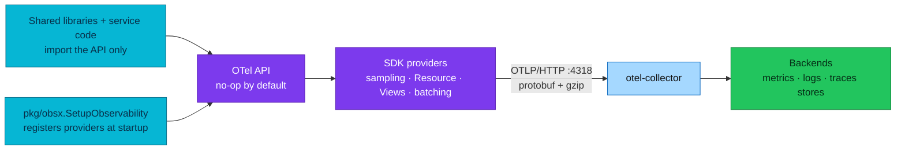
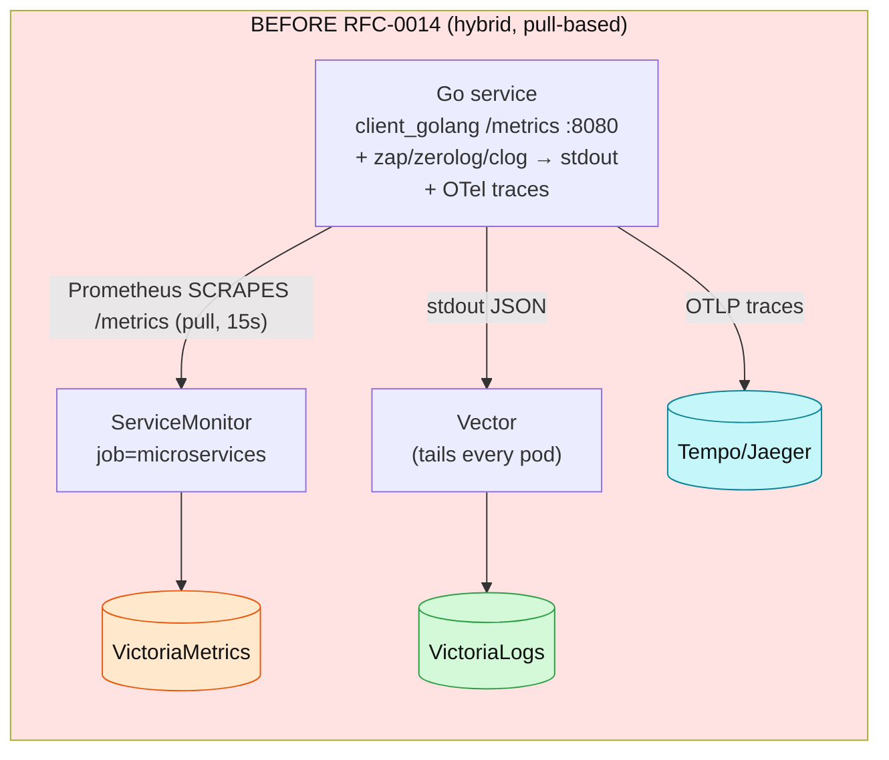
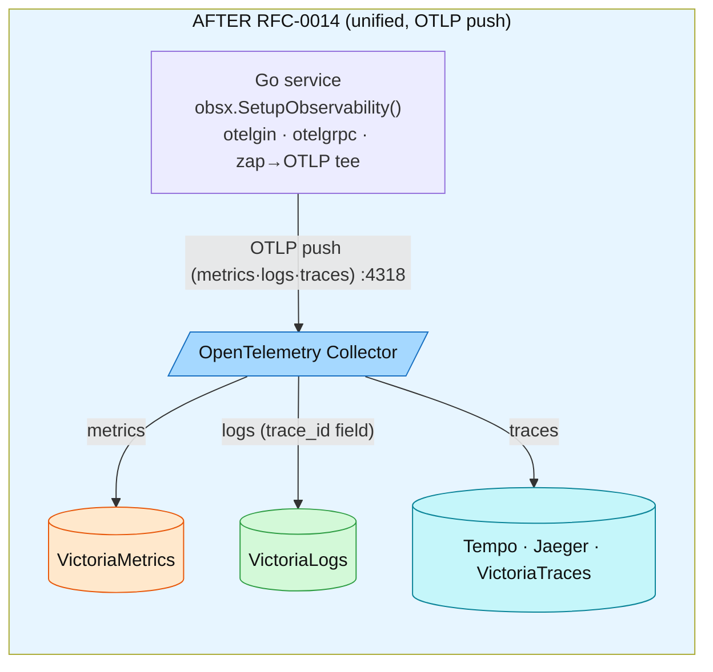
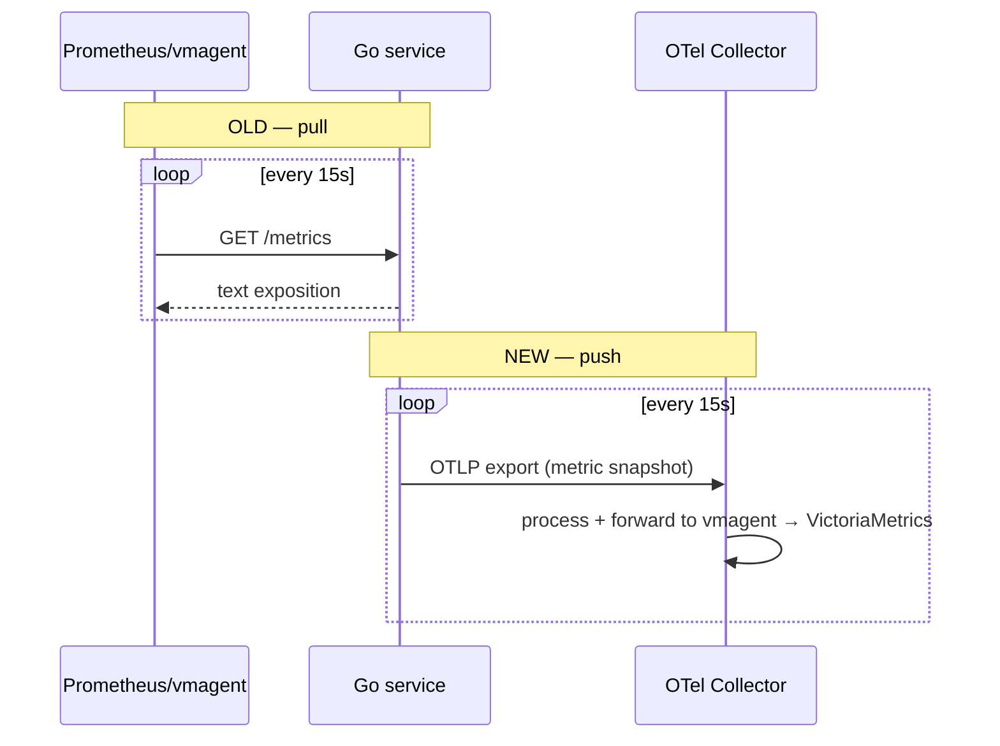
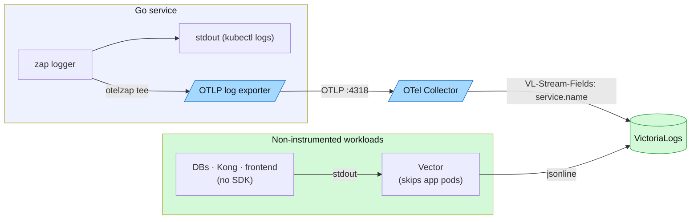
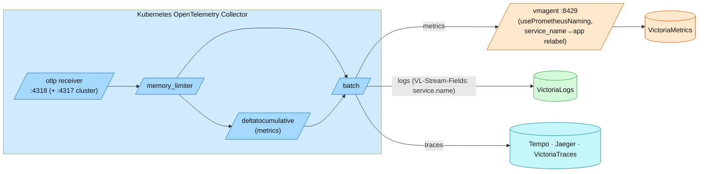
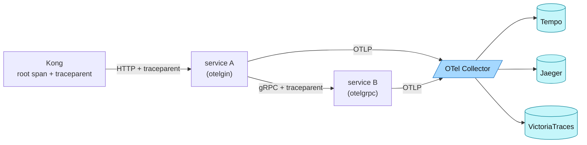
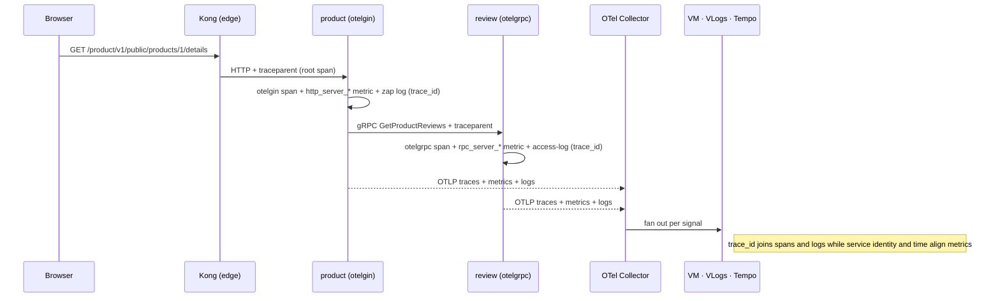

# OpenTelemetry Fundamentals

> Plain-English primer on **what OpenTelemetry actually is** — the API/SDK
> split, signals and when to use each, the OTLP wire protocol, context
> propagation — plus **how this platform got here**: the RFC-0014 old-vs-new
> migration story, told in diagrams. Start here if the stack is new to you.
> Platform wiring lives in [README.md](README.md); the day-to-day rules
> service authors follow are in
> [`docs/api/observability.md`](../../api/observability.md).

One sentence to anchor everything: **every service and worker hands its
telemetry to one in-process SDK, which pushes it to a central Collector; the
Collector processes each signal and forwards it to the right backend.** The
rest is detail.

| Item | Value |
|------|-------|
| **What OTel is** | A framework to **generate, collect, and export** telemetry — not a backend, not a UI |
| **Signals here** | Traces, metrics, logs (+ continuous profiling via a separate SDK) |
| **Wire protocol** | OTLP/HTTP + protobuf + gzip, `:4318` (gRPC `:4317` exposed, unused by apps) |
| **Propagation** | W3C `traceparent` + `baggage` (composite propagator in `pkg/obsx`) |
| **Who registers providers** | `pkg/obsx.SetupObservability` — exactly once per process |
| **How we got here** | RFC-0014 P0–P5 (2026-07): metrics pull→push at P3, logs Vector-only→OTLP tee at P4 — [the story](#how-this-platform-got-here--rfc-0014-in-pictures) |

---

## What OpenTelemetry is (and is not)

OpenTelemetry is the **plumbing** of observability: a specification plus
per-language libraries that standardize how telemetry is *produced* and
*moved*. It was formed in 2019 by merging OpenTracing (a tracing API) and
OpenCensus (metrics + tracing libraries), and is developed specification-first
under the CNCF — every language SDK implements the same data model, so a trace
started in Go looks identical to one started in Java.

What it deliberately does **not** do: store data or draw dashboards. Storage
and query belong to backends (here: VictoriaMetrics, VictoriaLogs, Tempo,
ClickHouse, Pyroscope), and visualization to Grafana. Choosing OTel is what
lets this platform swap backends (Loki → VictoriaLogs, the VictoriaTraces
pilot, the ClickHouse OLAP path) **without touching a single service**.

A mental model that survives all the jargon — the **central post office**:

- Your service writes a "letter" (a metric point, a log line, a span). The
  **SDK** (`obsx`) is the mailbox on your desk — it sticks the return address
  on (`service.name`, `trace_id`, k8s pod) and hands the letter to a courier.
- The **exporter** is the courier — it drives the letter over OTLP to the
  post office.
- The **Collector** is the central post office: letters arrive at the
  **receiver** (drop-off counter), pass through **processors** (sorting,
  batching, franking), and leave via **exporters** (delivery routes) to the
  right warehouse.
- The **backends** are the warehouses that store and index the mail so
  Grafana can look it up.

## The design concept everything sits on: context

All signals are built on one shared **context propagation** mechanism:

- **Context** — a per-execution key-value store. In Go it is literally
  `context.Context`; every instrumented call passes it down.
- **Propagators** — serialize the context into carriers (HTTP headers, gRPC
  metadata) on the way out and deserialize it on the way in, so telemetry
  emitted in service B can point at the request that started in service A.

This is why one rule in [`docs/api/`](../../api/observability.md) — *always
propagate `context.Context` into `logic/v1`* — powers everything: trace
continuity, log↔trace correlation, and baggage all ride the same object.

## Client architecture: API vs SDK

The instrumentation libraries split into two deliberately separate layers:

| Layer | What it is | Weight & stability | Who imports it here |
|-------|------------|--------------------|---------------------|
| **API** | Interfaces only (`otel.Tracer`, `otel.Meter`, …) — Go module `go.opentelemetry.io/otel`. **No-op without an SDK** — calls run, nothing is emitted | Lightweight, minimal deps; the **stable contract** instrumentation is written against | Everything: `pkg/grpcx`, `pkg/dbx`, middleware, service code |
| **SDK** | The implementation: sampling, Resource, batching, Views, exporters — `go.opentelemetry.io/otel/sdk*` + exporter modules | Heavier dependency tree; evolves faster than the API | **Only `pkg/obsx`** |

The API is the contract; the SDK is one implementation of it — so **swapping
or upgrading the SDK touches only setup code, never instrumentation**. That
asymmetry (stable API, fast-moving SDK) is why `pkg/obsx` pins the
SDK/contrib/semconv triple and bumps it as a deliberate `obsx` release: one
module absorbs SDK churn for the whole fleet.

The SDK plugs in by **registering a provider per signal** — `TracerProvider`,
`MeterProvider`, `LoggerProvider` — at process start. Until a provider is
registered, the API defaults to a no-op, which is exactly why shared libraries
can safely embed instrumentation: consumers who don't configure an SDK pay
nothing. On this platform `obsx.SetupObservability` is the single place
providers are built and installed as the OTel globals; a package-level
`otel.Meter("checkout")` created before setup is safe for the same reason —
it is a no-op until the provider lands.

The classic mistakes are all violations of that API/SDK line:

- **A shared library importing the SDK** — it drags exporters and config into
  every consumer and invites version conflicts; `pkg` deliberately keeps the
  SDK out of `grpcx`/`dbx`/`httpx`.
- **Registering global providers more than once, or from inside a library** —
  last write wins and telemetry silently splits; here only
  `obsx.SetupObservability` registers, exactly once per process.
- **Instrumenting against SDK types instead of API interfaces** — it compiles
  today and blocks every future SDK upgrade.



## Signals — and how to choose one

| | Metrics | Traces | Logs |
|---|---------|--------|------|
| **Question** | *What/when* — is something wrong, since when | *Where* — which hop of which request | *Why* — the detail at the failure point |
| **Granularity** | Aggregated over time | Per request, per operation | Per event |
| **Cardinality/cost** | Cheapest — bounded label sets | Higher — every span stored (sampled) | Highest per byte — but only what you write |
| **Time scope** | Long-term trends, alerting, SLOs | Short-term debugging | Short-term debugging + audit |
| **Starts an incident** | Yes (alerts fire on metrics) | Rarely | Rarely |

The working loop on this platform: an **alert on a metric** scopes the problem
("checkout error rate is burning budget"), a **trace** localizes it ("the
inventory gRPC hop takes 4 s"), and the **logs** on that `trace_id` explain it
("reservation conflict on SKU …"). Profiling adds a fourth step — *which line
of code* — see [Profiling](../profiling/README.md).

Don't emit the same fact on two signals: an HTTP request's status belongs to
the auto-instrumented RED metric and the access log — never also a
hand-written counter ([`docs/api/metrics.md`](../../api/metrics.md)).

### Events vs logs

In the OTel data model an **event is a log record with a non-empty
`EventName`** — same pipeline, same LogRecord fields, plus a stable name that
identifies the event structure. That is exactly what the platform's `event`
log field convention approximates today
([`docs/api/logs.md § Event and field naming`](../../api/logs.md#event-and-field-naming)).
Distinguish these from **span events** (`AddSpanEvent`), which live inside a
span and die with its sampling decision — use span events for
trace-local milestones (`payment.authorized`), log events for
machine-queryable facts that must survive independently of sampling.

## How this platform got here — RFC-0014 in pictures

The concepts above land harder against the world this platform migrated away
from. **Before RFC-0014**, each Go service hand-wrote Prometheus metrics with
`client_golang`, exposed them on an HTTP `/metrics` endpoint, and waited to be
**scraped**. Logs were written to stdout in three different shapes (zap,
zerolog, clog) and a Vector agent tailed every container. Traces already used
OpenTelemetry. Three instrumentation styles, and metric→trace correlation
depended on **exemplars** (which our metrics database never supported).



**After RFC-0014**, every service calls one function,
`obsx.SetupObservability()`. That wires the OpenTelemetry SDK for **all three
signals** and **pushes** them over OTLP to the Collector. No `/metrics`
endpoint, no scraping of app services, no hand-written metrics. Logs ride the
same SDK (a zap→OTLP bridge). Correlation is a real `trace_id` field on every
log line.



What actually moved: **metrics** (pull → push, P3) and **logs** (Vector-only →
OTLP push, P4). **Traces** were already OTel; RFC-0014 folded their wiring into
the same one-call setup. At the P3 cutover, checkout-service had not yet been
deployed to the cluster, so the planned `legacy-checkout` fence was dropped
([ADR-016](../../proposals/adr/ADR-016-otel-metrics-cutover/)). RFC-0015 P5
later deployed checkout and checkout-worker directly on the unified OTel path,
so there is no exempt application today.

### Metrics — pull vs push

**Old (pull).** The service kept counters in memory and exposed them at
`/metrics`. Prometheus/vmagent connected **in** every 15 s and scraped them.
The service had to run an HTTP handler and register every metric by hand.

```go
// BEFORE — retired client_golang middleware.
// This old checkout path never shipped.
var reqDuration = promauto.NewHistogramVec(prometheus.HistogramOpts{
    Name:    "request_duration_seconds",
    Buckets: []float64{0.005, 0.01, /* … */, 10},
}, []string{"method", "path", "code"})
// + r.GET("/metrics", gin.WrapH(promhttp.Handler()))   // scraped by ServiceMonitor job=microservices
```

**New (push).** The service builds nothing by hand. `otelgin` records the
semconv histogram automatically; the SDK's `PeriodicReader` **pushes** a
snapshot to the Collector every 15 s. There is no `/metrics` endpoint on the
app anymore.

```go
// AFTER — one call in main(), that's it
obs, _ := obsx.SetupObservability(ctx, obsx.ConfigFromEnv())
// otelgin (wired by the tracing middleware) emits http_server_request_duration_seconds automatically.
// No promauto, no /metrics handler, no ServiceMonitor.
```



The metric **names** changed too (`request_duration_seconds` →
`http_server_request_duration_seconds`, labels `code/path/method` →
`http_response_status_code/http_route/http_request_method`) because OTel uses
**semantic conventions**. vmagent translates the OTLP names to Prometheus
style on ingest. Authoring detail: [Application metrics](../../api/metrics.md);
alert map and ops: [metrics-apps.md](../metrics/metrics-apps.md).

### Logs — Vector-only vs OTLP tee

**Old.** Three services used three logging libraries; all wrote JSON to
stdout; one Vector DaemonSet tailed every container and shipped the lines to
VictoriaLogs. The catch: `trace_id` was **not** a queryable field, so "show me
the logs for this trace" silently returned nothing.

**New (P4).** The fleet converged on `zapx`. The logger is **teed**: the same
lines still go to stdout (for `kubectl logs`), and a second core
(`obs.ZapCore`, an `otelzap` bridge) sends them over OTLP to the Collector →
VictoriaLogs, where `trace_id` **is** a real field. Vector stays — but only
for things without an SDK (databases, Kong access log, Postgres `auto_explain`
plans, the frontend). It skips the app pods so no line is ingested twice.



Detail and the dual-path rationale: [logging/README.md](../logging/README.md).

### The governance pipeline at the cutover (historical)

The Collector is where platform-wide policy lives — one config governs every
service and worker. This is the pipeline **as shipped at the RFC-0014
cutover** (historical): the **current** deployed pipelines, including the
ClickHouse fan-out on traces and logs, are walked in
[collector.md](collector.md). Cluster RED metrics come from the applications'
own SDK metrics, not from span derivation — the cluster config has no
connectors; local-stack intentionally keeps a spanmetrics connector as a
compatibility path ([cluster vs local](README.md#cluster-and-local-stack-differences)).



**vmagent** is the single place name-translation, relabeling and cardinality
control happen (RFC-0014 D-1/2/3) — one choke point instead of ten opinions.

### Push vs pull — the tradeoffs

Moving from pull to push isn't free; it's a deliberate trade. This table is
the "why" behind D-1…D-14 in the RFC.

| | Pull (old) | Push (new) |
|---|-----------|------------|
| Who connects | the monitoring system reaches **in** to each service | the service reaches **out** to the Collector |
| Liveness signal | `up{}` is free — a failed scrape = down | `up{}` doesn't exist; we synthesize **D-4 heartbeat-absence** on `go_goroutine_count` (~5 min staleness lag) |
| Discovery | ServiceMonitor must find every target | no target list — services just push |
| Network direction | monitoring → services (needs scrape reachability) | services → Collector (fits egress/NetworkPolicy) |
| Cardinality control | at scrape/relabel | at **vmagent** (one choke point) + SDK Views |
| Failure mode | missed scrape = gap | Collector/pipeline down = gap (so we alert on the pipeline itself) |

The big win isn't push for its own sake — it's **one instrumentation
standard** for all three signals and a **real `trace_id` correlation** that
exemplars never gave us on VictoriaMetrics (unsupported; accepted as D-14).

### Migration summary

| Signal | Old (client_golang / Vector) | New (OpenTelemetry) | Transport | Backend | Correlation key |
|---|---|---|---|---|---|
| Metrics | `request_duration_seconds`, scraped `/metrics` | `http_server_request_duration_seconds`, otelgin | OTLP push → vmagent | VictoriaMetrics | `service.name`, time |
| Logs | 3 log schemas → stdout → Vector | zap + `otelzap` tee | OTLP push (Vector for infra) | VictoriaLogs | `trace_id` field |
| Traces | already OTel | otelgin/otelgrpc, W3C `traceparent` | OTLP push | Tempo · Jaeger · VictoriaTraces | `trace_id` |
| Profiles | already Pyroscope | `obsx.SetupProfiling()` | pprof push | Pyroscope | `pyroscope.profile.id` |
| Liveness | `up{}` (free with pull) | D-4 heartbeat-absence | — | VictoriaMetrics | `app` |

**Golden rule:** instrument once, in `pkg/obsx.SetupObservability`. A service
never imports the OTel SDK or a metrics library directly — that's what killed
the drift the old three-style world suffered from.

## OTLP: the wire protocol

OTLP is OTel's native protocol — the same protobuf payload over two
transports:

| | OTLP/gRPC | OTLP/HTTP |
|---|-----------|-----------|
| Default port | `4317` | `4318` |
| Encoding | protobuf over HTTP/2 | protobuf **or** JSON, paths `/v1/traces` · `/v1/metrics` · `/v1/logs` |
| Strengths | Connection reuse/multiplexing at very high volume | Works through anything (LBs, proxies, firewalls), trivially debuggable, browser-capable |
| Watch out | Some proxies/LBs can't speak HTTP/2; more dependencies | Slightly more per-request overhead at extreme volume |

Two practical notes that cut through most gRPC-vs-HTTP debates:

- OTLP export is a **unary request/response** (`Export`) — gRPC streaming is
  not part of it, so "gRPC has streaming" is not an argument here.
- Both transports compress with gzip and both carry protobuf; at this
  platform's volume the difference is operational, not performance.

**Platform decision:** every Go process exports **OTLP/HTTP + protobuf +
gzip to `:4318`** (`pkg/obsx`, all three signals, one code path). The
collector also listens on gRPC `:4317` for compatible platform tools, but the
application path never uses it. Switching transports would be an
exporter-config change in `pkg/obsx`, not a service change.

## Context propagation and baggage on the wire

Two W3C headers carry the cross-service context:

- **`traceparent`** (+ optional `tracestate`) — trace ID, parent span ID, and
  the sampling flag. Kong **forces** injection at the edge
  (`inject: [w3c]`), so even header-less browser requests join one trace.
- **`baggage`** — application key-value pairs that propagate on every hop.
  The composite propagator `obsx` installs handles both automatically.

The `traceparent` thread in motion: a request enters at Kong, which starts the
root span and injects the header. Every hop (HTTP via `otelgin`, gRPC via
`otelgrpc`) reads it, continues the same trace, and injects it onward. The SDK
samples with **ParentBased(10%)** — if the parent was sampled, the child is
too, so a trace is never half-captured.



Baggage is powerful and dangerous in equal measure — it rides *every*
outbound call including third-party ones, and backends don't store it. The
application contract (default: no baggage without review, never PII/secrets)
is in [`docs/api/tracing.md § Baggage`](../../api/tracing.md#baggage).

## One request, end to end

Putting it together — a single browser request, and where each signal goes.
Spans and in-context logs share one `trace_id`; metrics align through the same
service identity and time window because this platform has no exemplars.



In Grafana you land on a metric spike, pivot to the trace by time+service,
open the trace, click **traces→logs** (filters VictoriaLogs by `trace_id`),
and **traces→profiles** (Pyroscope, via the per-span `pyroscope.profile.id`).

## Correlation — the fields that stitch signals

Correlation starts with the **same resource identity** on every signal. Spans
and logs emitted inside an active span also carry the same `trace_id`; metrics
do not carry it because this platform has no exemplars. Resource attributes
come from the SDK Resource (semconv v1.41); `trace_id` comes from the active
span. Both are wired centrally in `obsx`.

| Field | Set by | Joins |
|---|---|---|
| `trace_id` | active span (W3C) | trace ↔ in-context logs in VictoriaLogs |
| `service.name` | `OTEL_SERVICE_NAME` | all signals by producer; metrics correlate to traces by service + time |
| `k8s.namespace.name` / `k8s.pod.name` | Downward API env | which pod; log/metric/trace all agree |
| `deployment.environment.name` | `DEPLOYMENT_ENVIRONMENT` | local vs production separation |
| `pyroscope.profile.id` | `otel-profiling-go` span attr | span ↔ its CPU flame graph |

Grafana wires the pivots: Tempo `tracesToLogsV2` (tag `trace_id`),
`tracesToProfiles` (`service.name`→`service_name`), and `tracesToMetrics`.
Exemplars are **not** used because VictoriaMetrics does not support them —
trace-to-log navigation is exact by `trace_id`; metric-to-trace navigation is
a scoped search by service and time (D-14). Normative correlation fields:
[`docs/api/observability.md § Correlation fields`](../../api/observability.md#correlation-fields).

## Semantic conventions

Semconv is the shared vocabulary: `http.request.method`, `http.route`,
`db.system`, `service.name` mean the same thing from every language and
library. That's what makes one Grafana dashboard work for every service,
and why the platform pins **semconv v1.41** in `pkg/obsx` and treats
SDK/semconv bumps as a deliberate `obsx` release —
never set `OTEL_SEMCONV_STABILITY_OPT_IN`
([`docs/api/observability.md`](../../api/observability.md#platform-instrumentation-policy-rfc-0014--normative)).

## What this maps to in this platform

| Concept | Realized by |
|---------|-------------|
| SDK setup + providers | `pkg/obsx.SetupObservability` (one call per process) |
| Auto-instrumentation | `otelgin` (HTTP), `otelgrpc` via `pkg/grpcx`, `otelpgx` via `pkg/dbx`, `runtime` metrics |
| Log bridge | otelzap tee (`obs.ZapCore`) — [`docs/api/logs.md`](../../api/logs.md) |
| Collector | [collector.md](collector.md) — pipelines, processors, fan-out |
| Metrics ingest | **vmagent** `:8429` — translates OTLP names to Prometheus style, relabels, remote-writes to VictoriaMetrics; also scrapes infra exporters |
| Non-SDK logs | **Vector** DaemonSet — ships logs for everything without an OTel SDK (DBs, Kong access log, PG plans, frontend); skips app pods |
| Backends | VictoriaMetrics (PromQL) · VictoriaLogs (LogsQL, `trace_id` first-class) · Tempo/Jaeger/VictoriaTraces · ClickHouse OLAP · Pyroscope |
| UI | **Grafana** — one pane over all backends; pivots between signals via `trace_id` |
| Sampling | `ParentBased(TraceIDRatioBased)`, `OTEL_SAMPLE_RATE` — [README.md § Sampling](README.md#sampling) |
| Views | Pinned histogram buckets — [histograms.md](../metrics/histograms.md) |

## References

- [OpenTelemetry specification](https://opentelemetry.io/docs/specs/otel/) · [Log data model](https://opentelemetry.io/docs/specs/otel/logs/data-model/) · [OTLP](https://opentelemetry.io/docs/specs/otlp/)
- [W3C Trace Context](https://www.w3.org/TR/trace-context/) · [W3C Baggage](https://www.w3.org/TR/baggage/)
- In-house: [OpenTelemetry (platform)](README.md) · [Collector](collector.md) · [Application observability](../../api/observability.md) · [RFC-0014](../../proposals/rfc/RFC-0014/) (design record)

---

_Last updated: 2026-07-29 — absorbed the RFC-0014 explainer (all diagrams preserved; cutover pipeline diagram kept as historical, superseded by collector.md); facts audited against the OTel specification._
