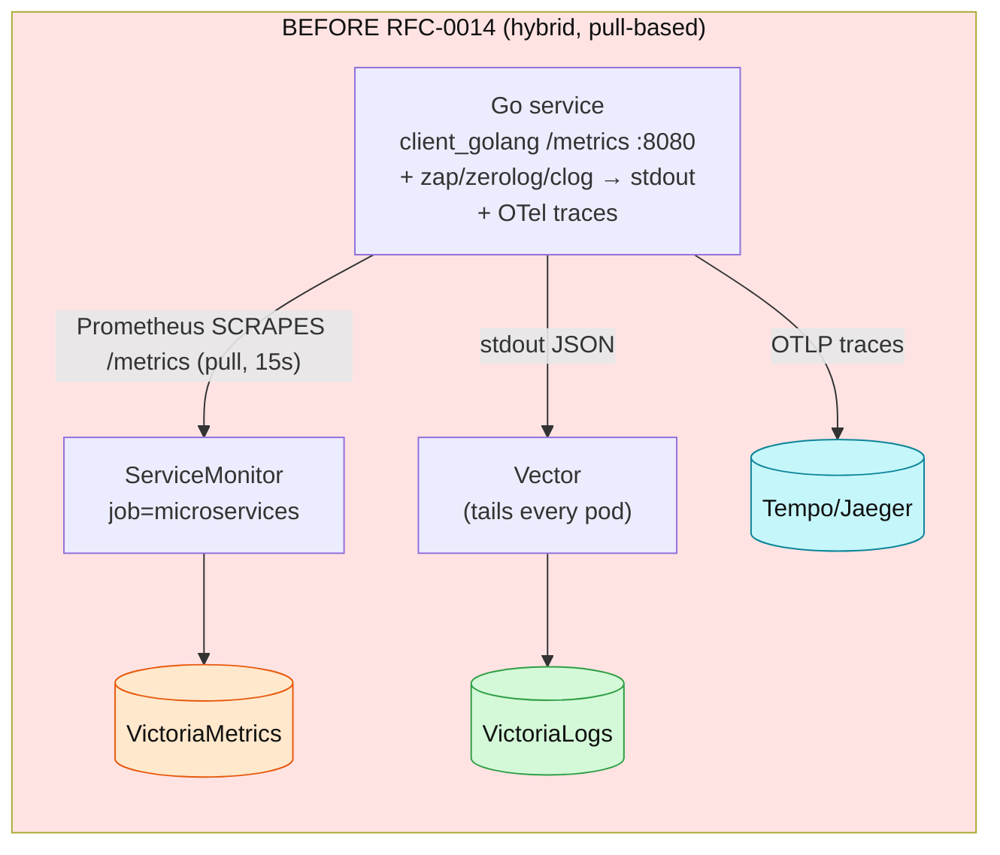
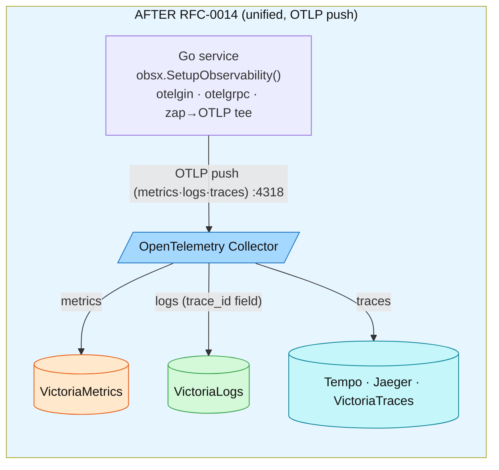
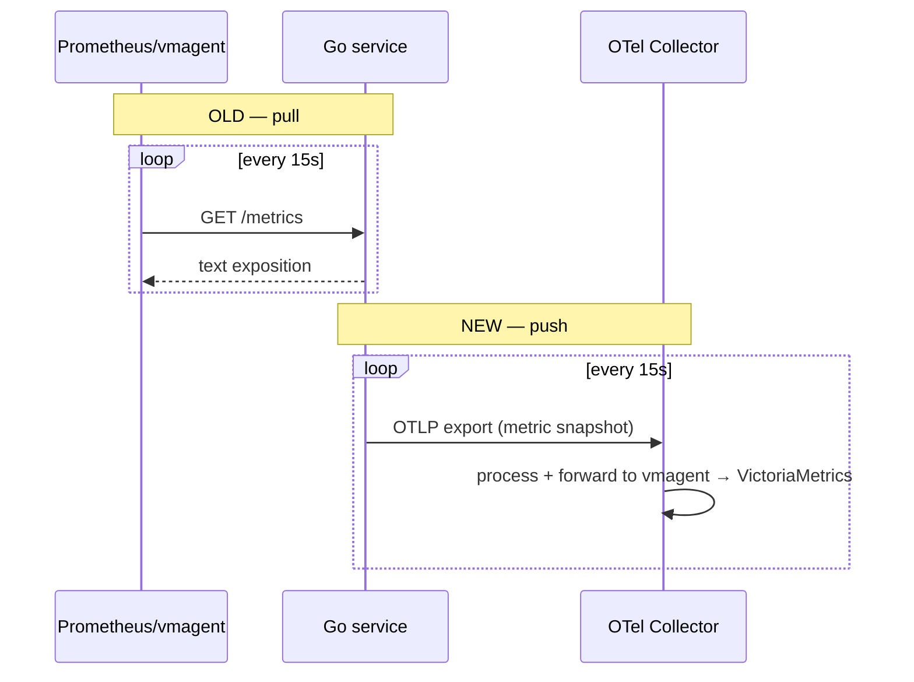
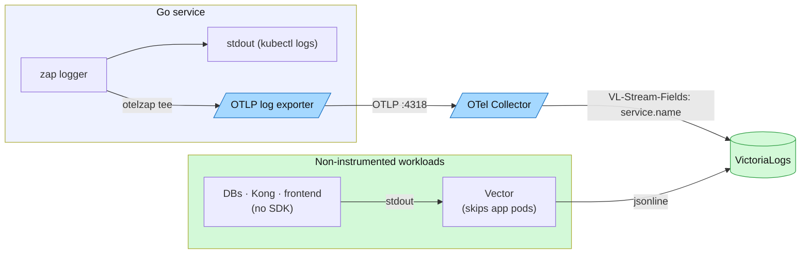
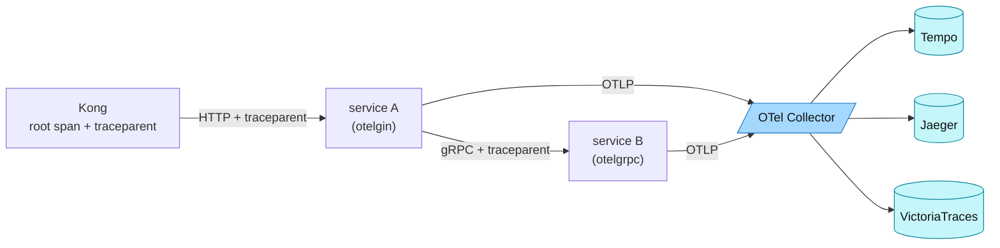
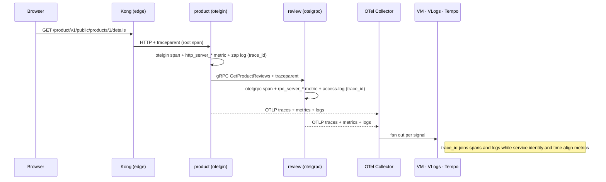
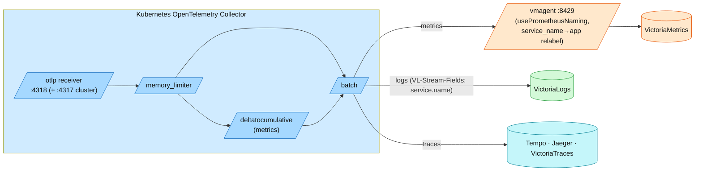

# RFC-0014 explained: from client_golang to OpenTelemetry

A from-zero walkthrough of **why and how** the platform moved its observability
from the old hand-rolled Prometheus setup to **OpenTelemetry (OTLP push)** —
told with old-vs-new diagrams and plain-language analogies. Start here if the
stack is new to you; the deep-dives ([Application metrics](../../api/metrics.md),
[metrics platform ops](../metrics/metrics-apps.md), [traces](../tracing/README.md),
[logs](../logging/README.md), [platform OTel](README.md)) assume you already know this story.

| | |
|---|---|
| **What changed** | Metrics + logs moved from pull/Vector to **OTLP push**; traces were already OTel. One SDK wires all three. |
| **When** | RFC-0014 P0–P5 (2026-07); metrics cutover P3, logs wave P4 |
| **In-process** | `obsx.SetupObservability()` (`duynhlab/pkg`) — one call, all signals |
| **Transport** | OTLP/HTTP → OpenTelemetry Collector → backends |
| **Backends** | VictoriaMetrics (metrics), VictoriaLogs (logs), Tempo/Jaeger/VictoriaTraces (traces), Pyroscope (profiles) |
| **The one rule** | Instrument once, in `pkg/obsx`; services never touch the SDK directly |
| **Current coverage** | 10 Go services + order-worker + checkout-worker; Kong starts edge traces and exports runtime logs |

---

## Why this doc exists

Observability has a lot of moving parts and a lot of jargon (SDK, exporter,
collector, OTLP, semconv, pull vs push…). If you have never set it up before,
the manifests and the policy page are hard to read cold. This doc builds the
mental model **once**, comparing the old world we came from with the new one, so
the rest of the docs make sense.

One sentence to anchor everything: **every service and worker now hands its
telemetry to one in-process SDK, which pushes it to a central Collector; the
Collector processes each signal and forwards it to the right backend.** The
rest is detail.

---

## 1. The big picture — old vs new

**Before RFC-0014.** Each Go service hand-wrote Prometheus metrics with
`client_golang`, exposed them on an HTTP `/metrics` endpoint, and waited to be
**scraped**. Logs were written to stdout in three different shapes (zap,
zerolog, clog) and a Vector agent tailed every container. Traces already used
OpenTelemetry. Three different instrumentation styles, and metric→trace
correlation depended on **exemplars** (which our metrics database never
supported).



**After RFC-0014.** Every service calls one function, `obsx.SetupObservability()`.
That wires the OpenTelemetry SDK for **all three signals** and **pushes** them
over OTLP to the Collector. No `/metrics` endpoint, no scraping of app services,
no hand-written metrics. Logs ride the same SDK (a zap→OTLP bridge). Correlation
is now a real `trace_id` field on every log line.



What actually moved: **metrics** (pull → push, P3) and **logs** (Vector-only →
OTLP push, P4). **Traces** were already OTel; RFC-0014 folded their wiring into
the same one-call setup. At the P3 cutover, checkout-service had not yet been
deployed to the cluster, so the planned `legacy-checkout` fence was dropped
([ADR-016](../../proposals/adr/ADR-016-otel-metrics-cutover/)). RFC-0015 P5
later deployed checkout and checkout-worker directly on the unified OTel path,
so there is still no exempt application today.

---

## 2. Who's who — components and their jobs

Think of the whole pipeline as a **central post office**:

- Your service writes a "letter" (a metric point, a log line, a span). The
  **SDK** (`obsx`) is the mailbox on your desk — it sticks the return address on
  (`service.name`, `trace_id`, k8s pod) and hands the letter to a courier.
- The **exporter** is the courier — it drives the letter over OTLP to the post
  office.
- The **Collector** is the central post office: letters arrive at the
  **receiver** (drop-off counter), pass through **processors** (sorting,
  batching, franking), and leave via **exporters** (delivery routes) to the
  right warehouse.
- The **backends** (VictoriaMetrics/Logs/Traces, Tempo, Pyroscope) are the
  warehouses that store and index the mail so Grafana can look it up.

| Component | Where | Job |
|---|---|---|
| `pkg/obsx` (SDK wiring) | in every Go service | One call builds the Tracer/Meter/Logger providers, the resource labels, and the exporters. The only place instrumentation is configured. |
| `otelgin` / `otelgrpc` | in the HTTP/gRPC middleware | Auto-record spans **and** the semconv HTTP/RPC metrics — no hand-written middleware. |
| zap + `otelzap` tee | in the logger | Application logs go to stdout **and** are teed into the OTLP log pipeline. |
| **OpenTelemetry Collector** | `monitoring` ns (cluster) / compose (local) | The post office: receive OTLP, process, fan out each signal to its backend. |
| **vmagent** | `monitoring` ns | Receives app metrics over OTLP, translates names to Prometheus style, relabels, and remote-writes to VictoriaMetrics. Also scrapes **infra** exporters. |
| **VictoriaMetrics** | backend | Stores metrics; PromQL. |
| **VictoriaLogs** | backend | Stores logs; LogsQL; `trace_id` is a first-class field. |
| **Tempo / Jaeger / VictoriaTraces** | backend | Store traces (cluster fans out to all three; VictoriaTraces is the local + pilot store). |
| **Pyroscope** | backend | Continuous profiles; linked from spans. |
| **Vector** | DaemonSet | Ships logs for everything that has **no** OTel SDK (databases, Kong access log, Postgres query plans, the frontend, infra pods). |
| **Grafana** | UI | One pane over all backends; pivots between signals via `trace_id`. |

---

## 3. Metrics — pull vs push

**Old (pull).** The service kept counters in memory and exposed them at
`/metrics`. Prometheus/vmagent connected **in** every 15 s and scraped them. The
service had to run an HTTP handler and register every metric by hand.

```go
// BEFORE — retired client_golang middleware.
// This old checkout path never shipped.
var reqDuration = promauto.NewHistogramVec(prometheus.HistogramOpts{
    Name:    "request_duration_seconds",
    Buckets: []float64{0.005, 0.01, /* … */, 10},
}, []string{"method", "path", "code"})
// + r.GET("/metrics", gin.WrapH(promhttp.Handler()))   // scraped by ServiceMonitor job=microservices
```

**New (push).** The service builds nothing by hand. `otelgin` records the
semconv histogram automatically; the SDK's `PeriodicReader` **pushes** a
snapshot to the Collector every 15 s. There is no `/metrics` endpoint on the app
anymore.

```go
// AFTER — one call in main(), that's it
obs, _ := obsx.SetupObservability(ctx, obsx.ConfigFromEnv())
// otelgin (wired by the tracing middleware) emits http_server_request_duration_seconds automatically.
// No promauto, no /metrics handler, no ServiceMonitor.
```



The metric **names** changed too (`request_duration_seconds` →
`http_server_request_duration_seconds`, labels `code/path/method` →
`http_response_status_code/http_route/http_request_method`) because OTel uses
**semantic conventions**. vmagent translates the OTLP names to Prometheus style
on ingest. Authoring detail: [Application metrics](../../api/metrics.md); alert map and ops: [metrics-apps.md](../metrics/metrics-apps.md).

---

## 4. Logs — Vector-only vs OTLP tee

**Old.** Three services used three logging libraries; all wrote JSON to stdout;
one Vector DaemonSet tailed every container and shipped the lines to
VictoriaLogs. The catch: `trace_id` was **not** a queryable field, so "show me
the logs for this trace" silently returned nothing.

**New (P4).** The fleet converged on `zapx`. The logger is **teed**: the same
lines still go to stdout (for `kubectl logs`), and a second core
(`obs.ZapCore`, an `otelzap` bridge) sends them over OTLP to the Collector →
VictoriaLogs, where `trace_id` **is** a real field. Vector stays — but only for
things without an SDK (databases, Kong access log, Postgres `auto_explain`
plans, the frontend). It skips the app pods so no line is ingested twice.



Detail and the dual-path rationale: [logging/README.md](../logging/README.md).

---

## 5. Traces — the `traceparent` thread

Traces were OpenTelemetry from the start, so nothing structural changed — but
they're the thread that ties the other signals together, so here's how they
flow. A request enters at Kong, which starts the root span and injects a **W3C
`traceparent`** header. Every hop (HTTP via `otelgin`, gRPC via `otelgrpc`)
reads that header, continues the same trace, and injects it onward. The SDK
samples with **ParentBased(10%)** — if the parent was sampled, the child is too,
so a trace is never half-captured. All spans push over OTLP to the Collector,
which fans out to Tempo + Jaeger + VictoriaTraces (cluster) or VictoriaTraces
(local).



Detail: [tracing/README.md](../tracing/README.md).

---

## 6. Push vs pull — the tradeoffs

Moving from pull to push isn't free; it's a deliberate trade. The table is the
"why" behind D-1…D-14 in the RFC.

| | Pull (old) | Push (new) |
|---|---|---|
| Who connects | the monitoring system reaches **in** to each service | the service reaches **out** to the Collector |
| Liveness signal | `up{}` is free — a failed scrape = down | `up{}` doesn't exist; we synthesize **D-4 heartbeat-absence** on `go_goroutine_count` (~5 min staleness lag) |
| Discovery | ServiceMonitor must find every target | no target list — services just push |
| Network direction | monitoring → services (needs scrape reachability) | services → Collector (fits egress/NetworkPolicy) |
| Cardinality control | at scrape/relabel | at **vmagent** (one choke point) + SDK Views |
| Failure mode | missed scrape = gap | Collector/pipeline down = gap (so we alert on the pipeline itself) |

The big win isn't push for its own sake — it's **one instrumentation standard**
for all three signals and a **real `trace_id` correlation** that exemplars never
gave us on VictoriaMetrics (exemplars are unsupported; accepted as D-14).

---

## 7. One request, end to end

Putting it together — a single browser request, and where each signal goes.
Spans and in-context logs share one `trace_id`; metrics align through the same
service identity and time window because this platform has no exemplars.



In Grafana you land on a metric spike, pivot to the trace by time+service, open
the trace, click **traces→logs** (filters VictoriaLogs by `trace_id`), and
**traces→profiles** (Pyroscope, via the per-span `pyroscope.profile.id`).

---

## 8. Inside the Collector — the governance pipeline

The Kubernetes Collector is where platform-wide policy lives, so one config
governs every service and worker. Each signal has its own pipeline:
**receiver → processors → exporters**. The cluster config has no connectors;
its RED metrics come from the application's own OTel SDK metrics, not from
span derivation. Local-stack intentionally keeps a spanmetrics connector as a
compatibility path, explained in the
[current platform guide](README.md#cluster-and-local-stack-differences).



Why each processor matters: **memory_limiter** protects the Collector from OOM
under a telemetry burst; **deltatocumulative** normalizes metric temporality so
`rate()` stays correct; **batch** amortizes network cost; **vmagent** is the
single place name-translation, relabeling and cardinality control happen (D-1/2/3).
(Tempo's metrics-generator is configured but writes nowhere — `remote_write: []` —
so cluster RED metrics come exclusively from the services' SDK metrics.)

---

## 9. Correlation — the fields that stitch the pillars together

Correlation starts with the **same resource identity** on every signal. Spans
and logs emitted inside an active span also carry the same `trace_id`; metrics
do not carry it because this platform has no exemplars. Resource attributes
come from the SDK Resource (semconv v1.41), while `trace_id` comes from the
active span. Both are wired centrally in `obsx`.

| Field | Set by | Joins |
|---|---|---|
| `trace_id` | active span (W3C) | trace ↔ in-context logs in VictoriaLogs |
| `service.name` | `OTEL_SERVICE_NAME` | all signals by producer; metrics correlate to traces by service + time |
| `k8s.namespace.name` / `k8s.pod.name` | Downward API env | which pod; log/metric/trace all agree |
| `deployment.environment.name` | `DEPLOYMENT_ENVIRONMENT` | local vs production separation |
| `pyroscope.profile.id` | `otel-profiling-go` span attr | span ↔ its CPU flame graph |

Grafana wires the pivots: Tempo `tracesToLogsV2` (tag `trace_id`),
`tracesToProfiles` (`service.name`→`service_name`), and `tracesToMetrics`.
Exemplars are **not** used because VictoriaMetrics does not support them.
Trace-to-log navigation is exact by `trace_id`; metric-to-trace navigation is
a scoped search by service and time (D-14).

---

## 10. Summary

| Signal | Old (client_golang / Vector) | New (OpenTelemetry) | Transport | Backend | Correlation key |
|---|---|---|---|---|---|
| Metrics | `request_duration_seconds`, scraped `/metrics` | `http_server_request_duration_seconds`, otelgin | OTLP push → vmagent | VictoriaMetrics | `service.name`, time |
| Logs | 3 log schemas → stdout → Vector | zap + `otelzap` tee | OTLP push (Vector for infra) | VictoriaLogs | `trace_id` field |
| Traces | already OTel | otelgin/otelgrpc, W3C `traceparent` | OTLP push | Tempo · Jaeger · VictoriaTraces | `trace_id` |
| Profiles | already Pyroscope | `obsx.SetupProfiling()` | pprof push | Pyroscope | `pyroscope.profile.id` |
| Liveness | `up{}` (free with pull) | D-4 heartbeat-absence | — | VictoriaMetrics | `app` |

**Golden rule:** instrument once, in `pkg/obsx.SetupObservability`. A service
never imports the OTel SDK or a metrics library directly — that's what killed
the drift the old three-style world suffered from.

## References

- [Application observability (normative)](../../api/observability.md) — the rules this doc explains informally
- [Application metrics](../../api/metrics.md) · [metrics platform ops](../metrics/metrics-apps.md) · [Tracing](../tracing/README.md) · [Logging](../logging/README.md) · [Profiling](../profiling/README.md)
- [Observability hub](../README.md) · [RFC-0014](../../proposals/rfc/RFC-0014/)

_Last updated: 2026-07-14 — moved beside the canonical OTel policy; clarified checkout chronology, environment-specific Collector behavior, and correlation without exemplars._
