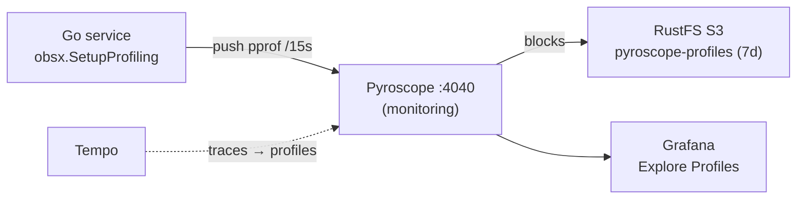

# Continuous Profiling (Pyroscope)

Continuous profiling for the Go services via **Grafana Pyroscope**, correlated
with traces (Tempo) and metrics (VictoriaMetrics) so a slow span links straight
to the flame graph of the code that ran during it.

- **Backend:** Grafana Pyroscope `2.1.0`, single-binary, installed via the
  official Helm chart (`kubernetes/infra/controllers/profiling/pyroscope/`).
- **Storage:** profile blocks on the in-cluster **RustFS (S3)** `pyroscope-profiles`
  bucket, **7-day** retention (`compactor_blocks_retention_period: 168h`); a PVC
  holds the v2 metastore (raft) so it survives restarts.
- **Client:** the shared `obsx.SetupProfiling()` helper (`duynhlab/pkg`) in every service.
- **Datasource:** Grafana `Pyroscope` (`uid: pyroscope`, `grafana-pyroscope-datasource`).

## Profile types

CPU, alloc objects/space, inuse objects/space, goroutines, and mutex/block
(count + duration). The mutex/block types require Go runtime sampling, which
`obsx.SetupProfiling` turns on (`SetMutexProfileFraction(100)` +
`SetBlockProfileRate(1e8)` — production-safe; without them those four ship empty).

## Architecture

Push model — each service's Go SDK pushes pprof data every 15s directly to
Pyroscope (no agent/scrape):



## Enabling profiling in a service

Profiling is **on by default** (`PROFILING_ENABLED: "true"`). The app `ResourceSet`
manifests inject the env (`kubernetes/apps/domains/*-rs.yaml`):

| Env | Purpose | Default |
|-----|---------|---------|
| `PROFILING_ENABLED` | Toggle profiling | `true` |
| `PYROSCOPE_ENDPOINT` | Pyroscope server | `http://pyroscope.monitoring.svc.cluster.local:4040` |
| `OTEL_SERVICE_NAME` | Identity (= `service_name`) | `<< inputs.name >>` |
| `OTEL_RESOURCE_ATTRIBUTES` | `service.namespace` / `deployment.environment` → tags | set by ResourceSet |

The service wires it in `cmd/main.go` (mirrors `obsx.SetupMetrics`):

```go
if cfg.Profiling.Enabled {
    stop, err := obsx.SetupProfiling()
    if err != nil {
        log.Warn().Err(err).Msg("Failed to initialize profiling")
    } else {
        log.Info().Msg("Profiling initialized")
        defer func() { _ = stop(context.Background()) }()
    }
}
```

### Naming / labels

`OTEL_SERVICE_NAME` is the single identity shared by profiles, traces, and
metrics — the Pyroscope application name becomes the `service_name` series.
Extra labels come from `OTEL_RESOURCE_ATTRIBUTES` and are **underscored**
(Pyroscope labels cannot contain dots): `service_namespace`,
`deployment_environment`, `service_version`. Filter on these in the Grafana UI.

### Local-stack

Profiling is **disabled in `local-stack`** (`PROFILING_ENABLED: "false"` in
`local-stack/compose.yaml`) — there is no local Pyroscope. Flip the flag and run
a Pyroscope container only if you specifically want to exercise it locally.

## Traces → Profiles correlation

The Tempo datasource has a `tracesToProfiles` link
(`datasource-tempo.yaml`) to the Pyroscope datasource, joining on `service.name`
→ `service_name` with `profileTypeId: process_cpu:cpu:nanoseconds:cpu:nanoseconds`.
Span-level linking (the `pyroscope.profile.id` attribute on spans) is wired by
`obsx.TracerProviderWithProfiles`, which wraps the tracer provider with
`otel-profiling-go`. Open a trace in Grafana → a span → **Profiles for this span**.

## Viewing profiles

- **Grafana → Explore → Profiles** (Drilldown) is the primary tool: all-services
  overview → service → flame graph → diff/comparison → top functions.
- Direct UI: `kubectl port-forward -n monitoring svc/pyroscope 4040:4040` →
  http://localhost:4040 (or the `pyroscope.duynh.me` ingress).

## Runbook — profiles not appearing

1. Is the flag on? Check the service env `PROFILING_ENABLED` and its startup log
   line `Profiling initialized`.
2. Pyroscope healthy?
   ```bash
   kubectl get pods -n monitoring -l app.kubernetes.io/name=pyroscope
   kubectl logs -n monitoring -l app.kubernetes.io/name=pyroscope --tail=100
   ```
3. Backend reachable from the service? `PYROSCOPE_ENDPOINT` resolves to
   `pyroscope.monitoring.svc.cluster.local:4040`.
4. Storage/creds: the `pyroscope-rustfs-credentials` secret exists in `monitoring`
   (ClusterExternalSecret `pyroscope-rustfs`) and the `pyroscope-profiles` bucket
   exists on RustFS.
5. Datasource: Grafana `Pyroscope` datasource is healthy (Connections → Data sources).
6. `PyroscopeDown` alert fires when `up{job=~".*pyroscope.*"} == 0` for 5m.

## References

- [Grafana Pyroscope docs](https://grafana.com/docs/pyroscope/latest/)
- [pyroscope-go SDK](https://github.com/grafana/pyroscope-go)
- [otel-profiling-go (span profiles)](https://github.com/grafana/otel-profiling-go)
- [Traces to profiles](https://grafana.com/docs/grafana/latest/datasources/pyroscope/configure-traces-to-profiles/)

---
_Last updated: 2026-06-25 — Pyroscope 2.1.0 (Helm), RustFS S3 7d retention, obsx.SetupProfiling._
