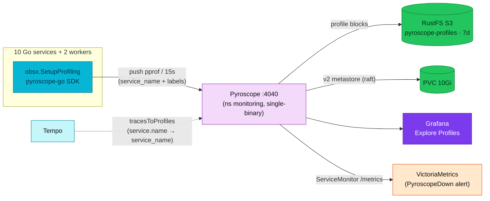

# Continuous Profiling (Pyroscope)

Continuous, always-on profiling for the platform's Go services with **Grafana
Pyroscope**, correlated with traces (Tempo) and metrics (VictoriaMetrics) so a slow
span links straight to the flame graph of the code that ran during it.

| | |
|---|---|
| **Backend** | Grafana Pyroscope `2.1.0`, single-binary, v2 storage — official Helm chart |
| **Client** | `obsx.SetupProfiling()` (`duynhlab/pkg`), `pyroscope-go` SDK — push model |
| **Storage** | RustFS (S3) bucket `pyroscope-profiles`, 7-day retention; PVC for the v2 metastore |
| **Datasource** | Grafana `Pyroscope` (`uid: pyroscope`, `grafana-pyroscope-datasource`) |
| **Correlation** | Tempo `tracesToProfiles` + per-span `pyroscope.profile.id` (`otel-profiling-go`) |
| **Default** | On in the cluster **and** in local-stack (`PROFILING_ENABLED=true`) |

---

## Overview

Profiling is the **fourth observability pillar** here, alongside metrics, logs, and
traces (see [`../README.md`](../README.md)). Metrics tell you *that* a service is slow,
traces tell you *where* in the request path the time went, and **profiles tell you
*which line of code* burned the CPU or allocated the memory**. Every Go service pushes
pprof data to a central Pyroscope backend every 15 seconds; the data is queryable as
flame graphs in Grafana, time-travel to any point in the retention window, and is
linked from individual trace spans.

## Purpose

- **Attribute cost to code, in production.** Find the function/line responsible for CPU
  burn, heap growth, goroutine leaks, or lock contention — on live traffic, not a staged
  microbenchmark.
- **Close the trace → profile loop.** From a slow span in Tempo, jump to the flame graph
  of exactly the code that executed during that span.
- **Catch regressions over time.** Because profiles are continuous and labelled, you can
  diff "today vs last week" or "version A vs version B" for a service.
- **Keep overhead negligible.** Sampling-based profiling is cheap enough to leave on
  permanently in every service.

## Continuous Profiling (concept)

Traditional profiling is *ad-hoc*: you reproduce a problem, attach a profiler, capture a
single snapshot, and analyze it offline. Continuous profiling adds two dimensions that
make it an observability signal rather than a debugging session:

- **Time** — data is collected continuously, so you can query the profile for *any past
  moment* (e.g. "CPU profile during yesterday's 14:05 latency spike"), not just now.
- **Metadata** — every profile is tagged with labels (`service_name`, namespace,
  environment, version), so you slice and compare the way you would a Prometheus query.

It is designed to run **always-on in production** at low overhead, turning "profile when
something breaks" into "the profile is already there when something breaks."

> **Service authors:** profile types, `obsx.SetupProfiling()`, env vars,
> per-service wiring, and span correlation are canonical in
> [**Application profiling**](../../api/profiling.md). This doc keeps the
> **platform view** — Pyroscope deployment, storage, Grafana, and runbooks.

See [**Application profiling**](../../api/profiling.md) for the client contract
(profile types table, `initProfiling` gate, mutex/block runtime sampling, and
`pyroscope.profile.id` on spans).

## Architecture

Pyroscope uses a **push model**: each service's Go SDK sends pprof data directly to the
Pyroscope server every 15s — there is no scrape and no sidecar agent.



Pyroscope is deployed in **v2 single-binary mode** (one pod runs all components). The
chart also supports a microservices mode (separate distributor / segment-writer /
metastore / compaction-worker / query-frontend / query-backend deployments) for
horizontal scale — overkill for this platform. Profiles are stored as **blocks**
(Parquet tables + a TSDB index for series + a symbols table) on **object storage**; the
local PVC only holds the v2 metastore (raft) and scratch, so a pod restart loses nothing.

## Trace correlation (platform) {#trace-correlation-platform}

Grafana links Tempo spans to Pyroscope via the datasource config
(`datasource-tempo.yaml`: `tracesToProfiles` maps `service.name` →
`service_name`, `profileTypeId: process_cpu:cpu:nanoseconds:cpu:nanoseconds`).
In Explore → Tempo, open a span → **Profiles for this span** → CPU flame graph
for that service/time window.

## What this platform applies

Verified inventory of the actual deployment:

| Area | Applied |
|---|---|
| **Backend** | Grafana Pyroscope Helm `2.1.0`, single-binary, `fullnameOverride: pyroscope`, ns `monitoring` (`kubernetes/infra/controllers/profiling/pyroscope/helmrelease.yaml`) |
| **Block storage** | RustFS S3 `rustfs-svc.rustfs.svc.cluster.local:9000`, bucket `pyroscope-profiles`, `force_path_style` + `insecure` (plain HTTP in-cluster), `compactor_blocks_retention_period: 168h` (7d, matches Tempo/VM) |
| **Metastore** | PVC `10Gi` (`standard`) for the v2 raft metastore — survives restarts |
| **Credentials** | `pyroscope-rustfs` `ClusterExternalSecret` → `pyroscope-rustfs-credentials` (from OpenBAO); bucket created at bring-up by the run-once `rustfs-setup-buckets-init` Job (idempotently kept present by the `*/30` RustFS bucket CronJob) |
| **Security** | `runAsNonRoot`, `runAsUser: 10001`, `allowPrivilegeEscalation: false`, drop `ALL` caps, `seccompProfile: RuntimeDefault` |
| **Self-monitoring** | `serviceMonitor.enabled: true`; `PyroscopeDown` alert — `up{job=~".*pyroscope.*"} == 0` for 5m |
| **Resources** | requests `100m` / `256Mi`, limit `512Mi` |
| **Access** | Grafana datasource `uid: pyroscope` (`http://pyroscope.monitoring.svc.cluster.local:4040`); Kong ingress `pyroscope.duynh.me` |
| **Client** | `obsx.SetupProfiling` in all 10 services + both workers; **on by default** (`PROFILING_ENABLED=true`, `PYROSCOPE_ENDPOINT=http://pyroscope.monitoring.svc.cluster.local:4040`) |
| **local-stack** | `grafana/pyroscope:2.1.0` container + Grafana Pyroscope datasource; `PROFILING_ENABLED: "true"` in the `x-svc-env` anchor; storage is an **ephemeral** volume (`pyroscope-data`), no S3 |

> Migrated from a hand-vendored raw manifest (`pyroscope/pyroscope:latest`, `emptyDir`
> with 24h TTL so profiles vanished on restart, an unmounted legacy ConfigMap, no
> `securityContext`, no `ServiceMonitor`) to the official Helm chart with durable S3
> storage, a persistent metastore, PSS-restricted security, and self-monitoring.

## Comparison

**Continuous vs traditional (ad-hoc) profiling**

| | Traditional (pprof on demand) | Continuous (Pyroscope) |
|---|---|---|
| When | Reproduce, then capture a snapshot | Always-on, every 15s |
| History | Only "now" | Query any point in the 7d window |
| Context | Bare profile | Labelled (`service_name`, ns, env, version) |
| Correlation | Manual | Linked from Tempo spans |
| Prod use | Risky / manual | Designed for it, low overhead |

**SDK push (what we use) vs eBPF auto-instrumentation**

| | SDK push (pyroscope-go) | eBPF agent (Grafana Alloy / Beyla) |
|---|---|---|
| Setup | Import the SDK, set 2 env vars | DaemonSet, kernel privileges |
| Granularity | Rich Go runtime profiles (alloc/mutex/block/goroutine) | Mostly CPU, language-agnostic |
| Code change | Yes (one helper) | Zero |
| Fit here | ✅ Go-only fleet, already wired via `obsx` | Better for polyglot / unowned binaries |

**Single-binary vs microservices mode** — we run single-binary (one pod, simplest to
operate); microservices mode scales the read/write paths independently and is the choice
once ingest or query volume outgrows one pod.

## Benefits

- **Production bottleneck hunting** — pinpoint the exact function burning CPU or leaking
  memory on live traffic.
- **Trace-to-flame correlation** — one click from a slow span to the responsible code.
- **Durable history** — 7-day, S3-backed profiles survive pod restarts (no data loss like
  the old `emptyDir`); the metastore is PVC-backed.
- **Low, constant overhead** — sampling-based; safe to leave on everywhere.
- **Unified identity** — `OTEL_SERVICE_NAME` ties profiles to the same service's traces,
  logs, and metrics.
- **Regression & cost analysis** — diff profiles across time or versions.

## Operations

### Enable / disable in a service

Per-service env vars and the `PROFILING_ENABLED` toggle:
[**Application profiling § Configuration**](../../api/profiling.md#configuration).

### Viewing profiles

- **Grafana → Explore → Profiles** (Drilldown) — all-services overview → service → flame
  graph → diff/comparison → top functions. The primary tool.
- **Direct UI** — `kubectl port-forward -n monitoring svc/pyroscope 4040:4040` →
  http://localhost:4040, or the `pyroscope.duynh.me` ingress.
- **local-stack** — http://localhost:4040 (Pyroscope) and Grafana's Explore → Pyroscope;
  a checkout generates profiles for all services.

### Runbook — profiles not appearing {#troubleshooting}

1. **Flag on?** Check the service env `PROFILING_ENABLED` and its startup log
   `Profiling initialized`.
2. **Backend healthy?**
   ```bash
   kubectl get pods -n monitoring -l app.kubernetes.io/name=pyroscope
   kubectl logs  -n monitoring -l app.kubernetes.io/name=pyroscope --tail=100
   ```
3. **Endpoint reachable?** `PYROSCOPE_ENDPOINT` resolves to `pyroscope.monitoring.svc.cluster.local:4040`.
4. **Storage/creds?** Secret `pyroscope-rustfs-credentials` exists in `monitoring`
   (ClusterExternalSecret `pyroscope-rustfs`) and the `pyroscope-profiles` bucket exists on RustFS
   (created at bring-up by the run-once `rustfs-setup-buckets-init` Job in namespace `rustfs`;
   the `*/30` RustFS bucket CronJob only keeps it present thereafter).
5. **Datasource healthy?** Grafana `Pyroscope` (Connections → Data sources).
6. **Alert** — `PyroscopeDown` fires when `up{job=~".*pyroscope.*"} == 0` for 5m.

## References

- [Grafana Pyroscope docs](https://grafana.com/docs/pyroscope/latest/)
- [Pyroscope v2 architecture & deployment modes](https://grafana.com/docs/pyroscope/latest/reference-pyroscope-v2-architecture/)
- [Available profile types](https://grafana.com/docs/pyroscope/latest/configure-client/profile-types/)
- [pyroscope-go SDK](https://github.com/grafana/pyroscope-go)
- [otel-profiling-go (span profiles)](https://github.com/grafana/otel-profiling-go)
- [Traces to profiles](https://grafana.com/docs/grafana/latest/datasources/pyroscope/configure-traces-to-profiles/)

---
_Last updated: 2026-07-14 — Pyroscope 2.1.0 (Helm, v2/single-binary), RustFS S3 7d retention, `obsx.SetupProfiling` (pkg v0.18.1), local-stack profiling enabled._
