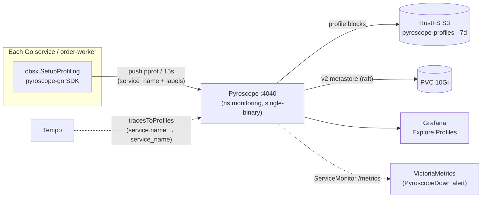
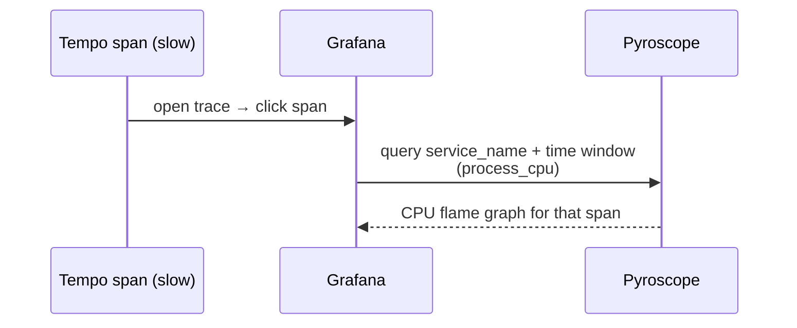

# Continuous Profiling (Pyroscope)

Continuous, always-on profiling for the platform's Go services with **Grafana
Pyroscope**, correlated with traces (Tempo) and metrics (VictoriaMetrics) so a slow
span links straight to the flame graph of the code that ran during it.

| | |
|---|---|
| **Backend** | Grafana Pyroscope `2.1.0`, single-binary, v2 storage — official Helm chart |
| **Client** | `obsx.SetupProfiling()` (`duynhlab/pkg`), `pyroscope-go` SDK — push model |
| **Storage** | RustFS (S3) bucket `pyroscope-profiles`, 7-day retention; PVC for the v2 metastore |
| **Datasource** | Grafana `Pyroscope` (`uid: pyroscope`, `grafana-pyroscope-datasource`) |
| **Correlation** | Tempo `tracesToProfiles` + per-span `pyroscope.profile.id` (`otel-profiling-go`) |
| **Default** | On in the cluster **and** in local-stack (`PROFILING_ENABLED=true`) |

---

## Overview

Profiling is the **fourth observability pillar** here, alongside metrics, logs, and
traces (see [`../README.md`](../README.md)). Metrics tell you *that* a service is slow,
traces tell you *where* in the request path the time went, and **profiles tell you
*which line of code* burned the CPU or allocated the memory**. Every Go service pushes
pprof data to a central Pyroscope backend every 15 seconds; the data is queryable as
flame graphs in Grafana, time-travel to any point in the retention window, and is
linked from individual trace spans.

## Purpose

- **Attribute cost to code, in production.** Find the function/line responsible for CPU
  burn, heap growth, goroutine leaks, or lock contention — on live traffic, not a staged
  microbenchmark.
- **Close the trace → profile loop.** From a slow span in Tempo, jump to the flame graph
  of exactly the code that executed during that span.
- **Catch regressions over time.** Because profiles are continuous and labelled, you can
  diff "today vs last week" or "version A vs version B" for a service.
- **Keep overhead negligible.** Sampling-based profiling is cheap enough to leave on
  permanently in every service.

## Continuous Profiling (concept)

Traditional profiling is *ad-hoc*: you reproduce a problem, attach a profiler, capture a
single snapshot, and analyze it offline. Continuous profiling adds two dimensions that
make it an observability signal rather than a debugging session:

- **Time** — data is collected continuously, so you can query the profile for *any past
  moment* (e.g. "CPU profile during yesterday's 14:05 latency spike"), not just now.
- **Metadata** — every profile is tagged with labels (`service_name`, namespace,
  environment, version), so you slice and compare the way you would a Prometheus query.

It is designed to run **always-on in production** at low overhead, turning "profile when
something breaks" into "the profile is already there when something breaks."

## How sampling works — a worked example

Say a checkout takes **2 s** and you don't know which function is slow:

```go
func Checkout() {
    ValidateUser()
    GetCart()
    CalculateTax()
    GenerateInvoice()
}
```

Pyroscope does **not** read your code or time every function call. It relies on the Go
runtime's **sampling CPU profiler**: ~100 times per second (every ~10 ms) it records
*which function is currently on the CPU* — a stack snapshot. Over a few seconds that's
thousands of cheap snapshots:


Each snapshot names whichever function was executing — e.g. `GenerateInvoice`,
`GenerateInvoice`, `CalculateTax`, `GenerateInvoice`, `GenerateInvoice`, … After ~1,000
samples you simply **count** them:

| Function | Samples | ≈ CPU time |
|---|---:|---:|
| `GenerateInvoice()` | 700 | **70%** |
| `CalculateTax()` | 150 | 15% |
| `GetCart()` | 100 | 10% |
| `ValidateUser()` | 50 | 5% |

The conclusion isn't "the API is slow" — it's "**`GenerateInvoice()` is burning ~70% of
the CPU**." In Grafana that function is the widest frame in the flame graph, so you spot
it at a glance.

Two consequences fall out of this design:

- **Low overhead** — counting periodic snapshots costs far less than instrumenting every
  call, which is why it's safe to leave on in production.
- **Statistical, not exact** — a single request gives few samples; accuracy comes from
  *continuous* sampling across many requests (hence "continuous profiling"). The same
  mechanism applies to the other profile types below (e.g. heap samples by allocation
  site instead of CPU time).

## What Pyroscope can analyze

`obsx.SetupProfiling()` registers **10 Go profile types**. Each answers a different
performance question:

| Profile type | pprof source | Answers |
|---|---|---|
| `ProfileCPU` | CPU | Which functions burn CPU time? |
| `ProfileAllocObjects` | alloc | What allocates the most *objects* (GC pressure)? |
| `ProfileAllocSpace` | alloc | What allocates the most *bytes*? |
| `ProfileInuseObjects` | heap | What is holding live objects (leaks)? |
| `ProfileInuseSpace` | heap | What is holding live bytes (resident heap)? |
| `ProfileGoroutines` | goroutine | Where are goroutines piling up (leaks/stalls)? |
| `ProfileMutexCount` / `ProfileMutexDuration` | mutex | Where is lock *contention* (count + wait time)? |
| `ProfileBlockCount` / `ProfileBlockDuration` | block | Where do goroutines *block* (chan/IO/sync)? |

CPU, alloc, and inuse are on by default in the SDK; goroutine, mutex, and block are
explicitly enabled. The **mutex/block** types additionally require Go runtime sampling
to be turned on (see [How it works](#how-it-works-in-this-platform)) — without it, those
four ship empty.

## Architecture

Pyroscope uses a **push model**: each service's Go SDK sends pprof data directly to the
Pyroscope server every 15s — there is no scrape and no sidecar agent.



Pyroscope is deployed in **v2 single-binary mode** (one pod runs all components). The
chart also supports a microservices mode (separate distributor / segment-writer /
metastore / compaction-worker / query-frontend / query-backend deployments) for
horizontal scale — overkill for this platform. Profiles are stored as **blocks**
(Parquet tables + a TSDB index for series + a symbols table) on **object storage**; the
local PVC only holds the v2 metastore (raft) and scratch, so a pod restart loses nothing.

## How it works in this platform

**Client (`pkg/obsx/profiling.go`, pkg `v0.10.0`)** — `obsx.SetupProfiling()` wraps the
`pyroscope-go` SDK (`v1.3.1`; span linking via `otel-profiling-go` `v0.6.0`):

- **Identity** = `OTEL_SERVICE_NAME` → the Pyroscope `service_name` series (the same
  identity used by traces and metrics, so all three signals join on one name).
- **Labels** come from `OTEL_RESOURCE_ATTRIBUTES`, with dotted keys underscored (Pyroscope
  labels can't contain dots): `service.namespace` → `service_namespace`,
  `deployment.environment` → `deployment_environment`, `service.version` → `service_version`.
- **Runtime sampling** for mutex/block is enabled **after** a successful start —
  `runtime.SetMutexProfileFraction(100)` and `runtime.SetBlockProfileRate(100_000_000)`
  (record blocking events ≥ 100 ms). Setting them only on success avoids paying the
  overhead when the profiler is misconfigured.
- **Fail-closed & idempotent** — an empty `PYROSCOPE_ENDPOINT` returns an error instead
  of silently no-op'ing; startup is guarded by `sync.Once`; the returned shutdown func
  flushes and stops the profiler on exit.

**Per-service wiring** — every service (all 8 + the `order-worker`) calls the same gate in
`cmd/main.go`; profiling is a config flag, not bespoke code:

```go
func initProfiling(cfg *config.Config, logger *zap.Logger) func() {
    if !cfg.Profiling.Enabled {            // PROFILING_ENABLED=false
        return func() {}
    }
    stop, err := obsx.SetupProfiling()
    if err != nil {
        logger.Warn("Failed to initialize profiling", zap.Error(err))
        return func() {}
    }
    logger.Info("Profiling initialized", zap.String("endpoint", cfg.Profiling.Endpoint))
    return func() { _ = stop(context.Background()) }
}
```

**Traces → profiles correlation** — two layers:

1. **Datasource link** (`datasource-tempo.yaml`): the Tempo datasource's `tracesToProfiles`
   points at the Pyroscope datasource, maps the span's `service.name` → `service_name`, and
   uses `profileTypeId: process_cpu:cpu:nanoseconds:cpu:nanoseconds`. In a trace, open a span
   → **Profiles for this span** → CPU flame graph for that service/time window.
2. **Span-level id** (`obsx.TracerProviderWithProfiles`): wraps the OTel `TracerProvider`
   with `otel-profiling-go` so spans carry a `pyroscope.profile.id` attribute (CPU profiles
   are span-scoped; heap/goroutine/mutex/block are service-scoped).



## What this platform applies

Verified inventory of the actual deployment:

| Area | Applied |
|---|---|
| **Backend** | Grafana Pyroscope Helm `2.1.0`, single-binary, `fullnameOverride: pyroscope`, ns `monitoring` (`kubernetes/infra/controllers/profiling/pyroscope/helmrelease.yaml`) |
| **Block storage** | RustFS S3 `rustfs-svc.rustfs.svc.cluster.local:9000`, bucket `pyroscope-profiles`, `force_path_style` + `insecure` (plain HTTP in-cluster), `compactor_blocks_retention_period: 168h` (7d, matches Tempo/VM) |
| **Metastore** | PVC `10Gi` (`standard`) for the v2 raft metastore — survives restarts |
| **Credentials** | `pyroscope-rustfs` `ClusterExternalSecret` → `pyroscope-rustfs-credentials` (from OpenBAO); bucket created by the RustFS setup CronJob |
| **Security** | `runAsNonRoot`, `runAsUser: 10001`, `allowPrivilegeEscalation: false`, drop `ALL` caps, `seccompProfile: RuntimeDefault` |
| **Self-monitoring** | `serviceMonitor.enabled: true`; `PyroscopeDown` alert — `up{job=~".*pyroscope.*"} == 0` for 5m |
| **Resources** | requests `100m` / `256Mi`, limit `512Mi` |
| **Access** | Grafana datasource `uid: pyroscope` (`http://pyroscope.monitoring.svc.cluster.local:4040`); Kong ingress `pyroscope.duynh.me` |
| **Client** | `obsx.SetupProfiling` in all 8 services + `order-worker`; **on by default** (`PROFILING_ENABLED=true`, `PYROSCOPE_ENDPOINT=http://pyroscope.monitoring.svc.cluster.local:4040`) |
| **local-stack** | `grafana/pyroscope:2.1.0` container + Grafana Pyroscope datasource; `PROFILING_ENABLED: "true"` in the `x-svc-env` anchor; storage is an **ephemeral** volume (`pyroscope-data`), no S3 |

> Migrated from a hand-vendored raw manifest (`pyroscope/pyroscope:latest`, `emptyDir`
> with 24h TTL so profiles vanished on restart, an unmounted legacy ConfigMap, no
> `securityContext`, no `ServiceMonitor`) to the official Helm chart with durable S3
> storage, a persistent metastore, PSS-restricted security, and self-monitoring.

## Comparison

**Continuous vs traditional (ad-hoc) profiling**

| | Traditional (pprof on demand) | Continuous (Pyroscope) |
|---|---|---|
| When | Reproduce, then capture a snapshot | Always-on, every 15s |
| History | Only "now" | Query any point in the 7d window |
| Context | Bare profile | Labelled (`service_name`, ns, env, version) |
| Correlation | Manual | Linked from Tempo spans |
| Prod use | Risky / manual | Designed for it, low overhead |

**SDK push (what we use) vs eBPF auto-instrumentation**

| | SDK push (pyroscope-go) | eBPF agent (Grafana Alloy / Beyla) |
|---|---|---|
| Setup | Import the SDK, set 2 env vars | DaemonSet, kernel privileges |
| Granularity | Rich Go runtime profiles (alloc/mutex/block/goroutine) | Mostly CPU, language-agnostic |
| Code change | Yes (one helper) | Zero |
| Fit here | ✅ Go-only fleet, already wired via `obsx` | Better for polyglot / unowned binaries |

**Single-binary vs microservices mode** — we run single-binary (one pod, simplest to
operate); microservices mode scales the read/write paths independently and is the choice
once ingest or query volume outgrows one pod.

## Benefits

- **Production bottleneck hunting** — pinpoint the exact function burning CPU or leaking
  memory on live traffic.
- **Trace-to-flame correlation** — one click from a slow span to the responsible code.
- **Durable history** — 7-day, S3-backed profiles survive pod restarts (no data loss like
  the old `emptyDir`); the metastore is PVC-backed.
- **Low, constant overhead** — sampling-based; safe to leave on everywhere.
- **Unified identity** — `OTEL_SERVICE_NAME` ties profiles to the same service's traces,
  logs, and metrics.
- **Regression & cost analysis** — diff profiles across time or versions.

## Operations

### Enable / disable in a service

On by default. The env is injected by the app ResourceSets (`kubernetes/apps/`) and the
worker manifest:

| Env | Purpose | Default |
|-----|---------|---------|
| `PROFILING_ENABLED` | Toggle | `true` |
| `PYROSCOPE_ENDPOINT` | Pyroscope server | `http://pyroscope.monitoring.svc.cluster.local:4040` |
| `OTEL_SERVICE_NAME` | Identity (`service_name`) | service name |
| `OTEL_RESOURCE_ATTRIBUTES` | `service.namespace` / `deployment.environment` / `service.version` → labels | set by ResourceSet |

Set `PROFILING_ENABLED=false` to opt a service out.

### Viewing profiles

- **Grafana → Explore → Profiles** (Drilldown) — all-services overview → service → flame
  graph → diff/comparison → top functions. The primary tool.
- **Direct UI** — `kubectl port-forward -n monitoring svc/pyroscope 4040:4040` →
  http://localhost:4040, or the `pyroscope.duynh.me` ingress.
- **local-stack** — http://localhost:4040 (Pyroscope) and Grafana's Explore → Pyroscope;
  a checkout generates profiles for all services.

### Runbook — profiles not appearing

1. **Flag on?** Check the service env `PROFILING_ENABLED` and its startup log
   `Profiling initialized`.
2. **Backend healthy?**
   ```bash
   kubectl get pods -n monitoring -l app.kubernetes.io/name=pyroscope
   kubectl logs  -n monitoring -l app.kubernetes.io/name=pyroscope --tail=100
   ```
3. **Endpoint reachable?** `PYROSCOPE_ENDPOINT` resolves to `pyroscope.monitoring.svc.cluster.local:4040`.
4. **Storage/creds?** Secret `pyroscope-rustfs-credentials` exists in `monitoring`
   (ClusterExternalSecret `pyroscope-rustfs`) and the `pyroscope-profiles` bucket exists on RustFS.
5. **Datasource healthy?** Grafana `Pyroscope` (Connections → Data sources).
6. **Alert** — `PyroscopeDown` fires when `up{job=~".*pyroscope.*"} == 0` for 5m.

## References

- [Grafana Pyroscope docs](https://grafana.com/docs/pyroscope/latest/)
- [Pyroscope v2 architecture & deployment modes](https://grafana.com/docs/pyroscope/latest/reference-pyroscope-v2-architecture/)
- [Available profile types](https://grafana.com/docs/pyroscope/latest/configure-client/profile-types/)
- [pyroscope-go SDK](https://github.com/grafana/pyroscope-go)
- [otel-profiling-go (span profiles)](https://github.com/grafana/otel-profiling-go)
- [Traces to profiles](https://grafana.com/docs/grafana/latest/datasources/pyroscope/configure-traces-to-profiles/)

---
_Last updated: 2026-06-27 — Pyroscope 2.1.0 (Helm, v2/single-binary), RustFS S3 7d retention, `obsx.SetupProfiling` (pkg v0.10.0), local-stack profiling enabled._
