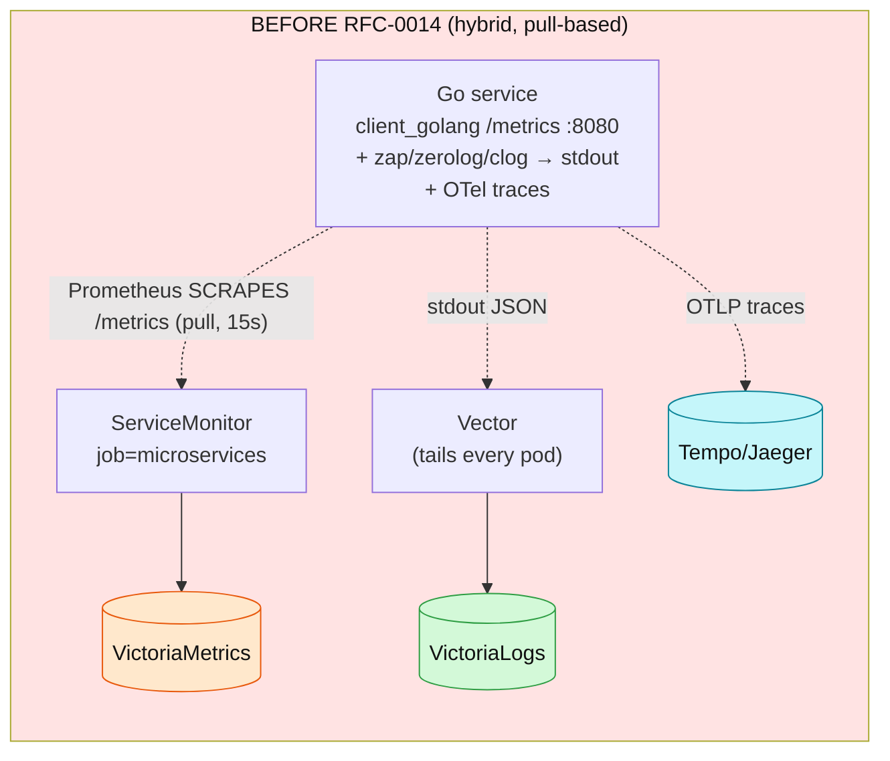
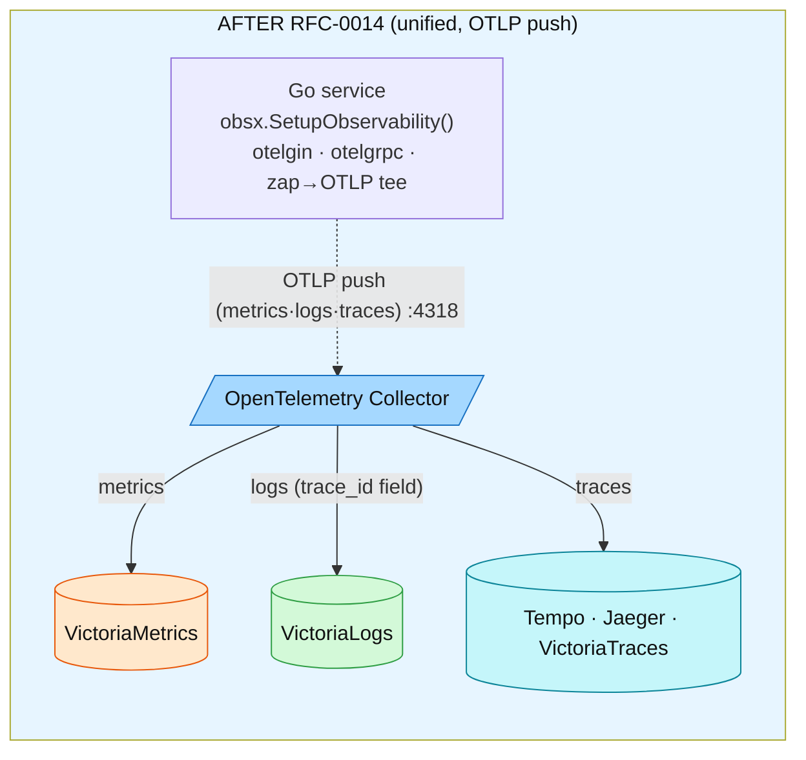
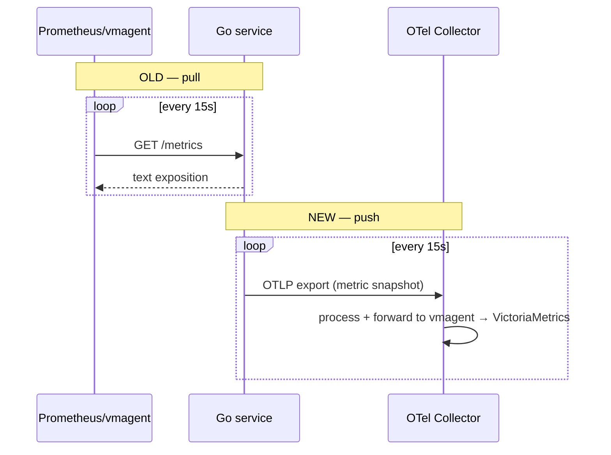
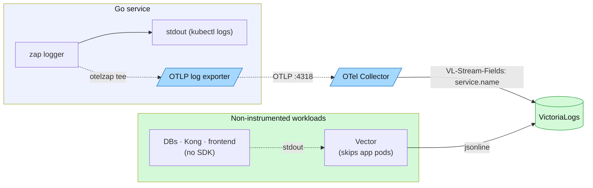
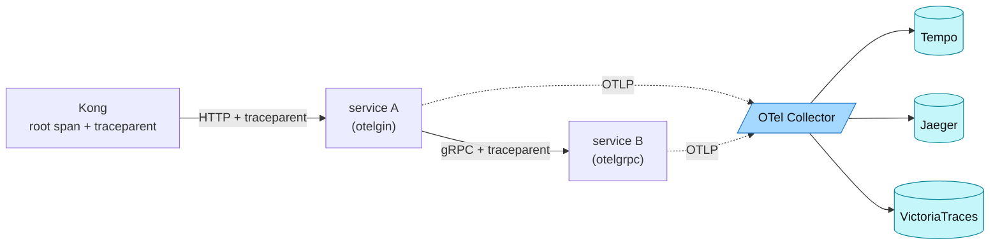
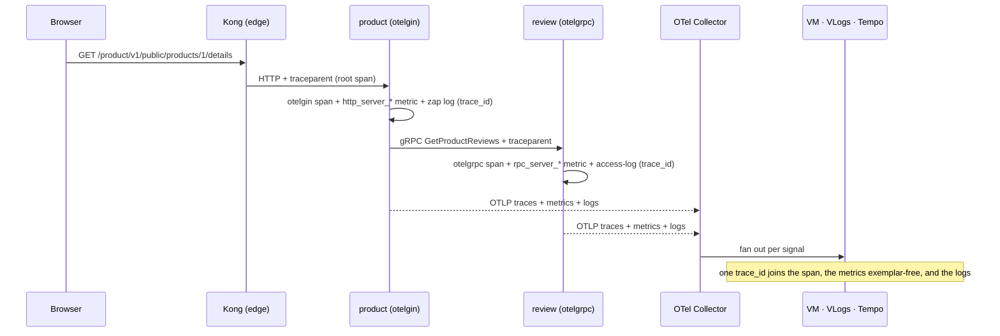
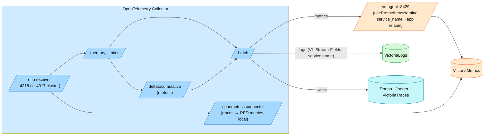

# RFC-0014 giải thích: từ client_golang đến OpenTelemetry

> Bản dịch tiếng Việt để đọc — bản chính thức (source of truth) là
> [rfc-0014-explainer.md](rfc-0014-explainer.md) (English).

Một bài đi từ đầu về **tại sao và bằng cách nào** platform chuyển observability
từ setup Prometheus tự viết tay cũ sang **OpenTelemetry (OTLP push)** — kể qua
các diagram cũ-vs-mới và các phép so sánh đời thường. Bắt đầu ở đây nếu stack
còn mới với bạn; các bài deep-dive ([metrics](metrics/metrics-apps.md),
[traces](tracing/README.md), [logs](logging/README.md),
[policy](opentelemetry.md)) đều giả định bạn đã nắm câu chuyện này.

| | |
|---|---|
| **Đã thay đổi gì** | Metrics + logs chuyển từ pull/Vector sang **OTLP push**; traces vốn đã dùng OTel. Một SDK wire cả ba. |
| **Khi nào** | RFC-0014 P0–P5 (2026-07); metrics cutover ở P3, logs wave ở P4 |
| **In-process** | `obsx.SetupObservability()` (`duynhlab/pkg`) — một lời gọi, đủ mọi signal |
| **Transport** | OTLP/HTTP → OpenTelemetry Collector → backends |
| **Backends** | VictoriaMetrics (metrics), VictoriaLogs (logs), Tempo/Jaeger/VictoriaTraces (traces), Pyroscope (profiles) |
| **Một quy tắc duy nhất** | Instrument một lần, trong `pkg/obsx`; service không bao giờ đụng trực tiếp vào SDK |

---

## Vì sao có bài này

Observability có rất nhiều bộ phận chuyển động và rất nhiều thuật ngữ (SDK,
exporter, collector, OTLP, semconv, pull vs push…). Nếu bạn chưa từng dựng nó,
đọc thẳng vào manifest và trang policy sẽ rất khó nuốt. Bài này dựng **mental
model một lần**, so sánh thế giới cũ mà ta xuất phát với thế giới mới, để phần
còn lại của tài liệu trở nên dễ hiểu.

Một câu để làm điểm neo cho mọi thứ: **mỗi service giờ đưa toàn bộ telemetry của
nó cho một SDK cục bộ, SDK này push tới một Collector trung tâm, và Collector
phân loại rồi chuyển từng signal về đúng database.** Phần còn lại chỉ là chi
tiết.

---

## 1. Bức tranh tổng thể — cũ vs mới

**Trước RFC-0014.** Mỗi Go service tự viết tay metrics Prometheus bằng
`client_golang`, expose chúng ở một HTTP endpoint `/metrics`, rồi chờ được
**scrape**. Logs được ghi ra stdout theo ba hình dạng khác nhau (zap, zerolog,
clog) và một Vector agent tail mọi container. Traces thì đã dùng OpenTelemetry.
Ba kiểu instrumentation khác nhau, và việc correlate metric→trace phụ thuộc vào
**exemplars** (mà database metrics của ta chưa bao giờ hỗ trợ).



**Sau RFC-0014.** Mỗi service gọi một hàm duy nhất, `obsx.SetupObservability()`.
Hàm đó wire OpenTelemetry SDK cho **cả ba signal** và **push** chúng qua OTLP
tới Collector. Không còn endpoint `/metrics`, không còn scrape các app service,
không còn metrics viết tay. Logs đi chung cùng SDK (một bridge zap→OTLP).
Correlation giờ là một field `trace_id` thật trên mỗi dòng log.



Thứ thực sự đã dịch chuyển: **metrics** (pull → push, P3) và **logs**
(chỉ-Vector → OTLP push, P4). **Traces** vốn đã là OTel; RFC-0014 chỉ gộp phần
wiring của chúng vào cùng một lời gọi setup. `checkout-service` là ngoại lệ duy
nhất — nó chưa bao giờ được migrate và vẫn chạy code client_golang cũ, nên là
một tham chiếu sống tiện lợi cho "before".

---

## 2. Ai là ai — các component và vai trò của chúng

Hãy hình dung cả pipeline như một **bưu điện trung tâm**:

- Service của bạn viết một "lá thư" (một metric point, một dòng log, một span).
  **SDK** (`obsx`) là hộp thư trên bàn làm việc của bạn — nó dán địa chỉ người
  gửi lên (`service.name`, `trace_id`, k8s pod) và giao thư cho người đưa thư.
- **Exporter** là người đưa thư — nó chở lá thư qua OTLP tới bưu điện.
- **Collector** là bưu điện trung tâm: thư đến quầy **receiver** (quầy tiếp
  nhận), đi qua **processors** (phân loại, gộp lô, đóng dấu), rồi rời đi qua
  **exporters** (các tuyến giao hàng) về đúng kho.
- **Backends** (VictoriaMetrics/Logs/Traces, Tempo, Pyroscope) là các kho lưu
  và đánh index thư từ để Grafana tra cứu được.

| Component | Ở đâu | Vai trò |
|---|---|---|
| `pkg/obsx` (SDK wiring) | trong mọi Go service | Một lời gọi dựng các provider Tracer/Meter/Logger, resource labels, và các exporter. Nơi duy nhất cấu hình instrumentation. |
| `otelgin` / `otelgrpc` | trong middleware HTTP/gRPC | Tự ghi span **và** các metric HTTP/RPC theo semconv — không middleware viết tay. |
| zap + `otelzap` tee | trong logger | Log của ứng dụng đi ra stdout **và** đồng thời được tee vào pipeline log OTLP. |
| **OpenTelemetry Collector** | ns `monitoring` (cluster) / compose (local) | Bưu điện: nhận OTLP, xử lý, fan out mỗi signal về backend của nó. |
| **vmagent** | ns `monitoring` | Nhận metrics ứng dụng qua OTLP, dịch tên sang kiểu Prometheus, relabel, và remote-write vào VictoriaMetrics. Cũng scrape các exporter **infra**. |
| **VictoriaMetrics** | backend | Lưu metrics; PromQL. |
| **VictoriaLogs** | backend | Lưu logs; LogsQL; `trace_id` là field hạng nhất. |
| **Tempo / Jaeger / VictoriaTraces** | backend | Lưu traces (cluster fan out ra cả ba; VictoriaTraces là store local + pilot). |
| **Pyroscope** | backend | Profile liên tục; link từ span. |
| **Vector** | DaemonSet | Ship log cho mọi thứ **không** có OTel SDK (database, Kong access log, Postgres query plan, frontend, infra pod). |
| **Grafana** | UI | Một mặt kính nhìn qua mọi backend; pivot giữa các signal qua `trace_id`. |

---

## 3. Metrics — pull vs push

**Cũ (pull).** Service giữ counter trong memory và expose chúng ở `/metrics`.
Prometheus/vmagent kết nối **vào** mỗi 15 s và scrape chúng. Service phải chạy
một HTTP handler và register từng metric bằng tay.

```go
// BEFORE — checkout-service/middleware/prometheus.go (client_golang, still live there)
var reqDuration = promauto.NewHistogramVec(prometheus.HistogramOpts{
    Name:    "request_duration_seconds",
    Buckets: []float64{0.005, 0.01, /* … */, 10},
}, []string{"method", "path", "code"})
// + r.GET("/metrics", gin.WrapH(promhttp.Handler()))   // scraped by ServiceMonitor job=microservices
```

**Mới (push).** Service không dựng gì bằng tay. `otelgin` tự ghi histogram
theo semconv; `PeriodicReader` của SDK **push** một snapshot lên Collector mỗi
15 s. App không còn endpoint `/metrics` nữa.

```go
// AFTER — one call in main(), that's it
obs, _ := obsx.SetupObservability(ctx, obsx.ConfigFromEnv())
// otelgin (wired by the tracing middleware) emits http_server_request_duration_seconds automatically.
// No promauto, no /metrics handler, no ServiceMonitor.
```



**Tên** metric cũng đổi (`request_duration_seconds` →
`http_server_request_duration_seconds`, label `code/path/method` →
`http_response_status_code/http_route/http_request_method`) vì OTel dùng
**semantic conventions**. vmagent dịch tên OTLP sang kiểu Prometheus lúc ingest.
Chi tiết đầy đủ: [metrics/metrics-apps.md](metrics/metrics-apps.md).

---

## 4. Logs — chỉ-Vector vs OTLP tee

**Cũ.** Ba service dùng ba thư viện logging; tất cả ghi JSON ra stdout; một
Vector DaemonSet tail mọi container và ship các dòng về VictoriaLogs. Điểm gãy:
`trace_id` **không** phải field query được, nên "cho tôi xem logs của trace này"
lặng lẽ trả về rỗng.

**Mới (P4).** Cả fleet hội tụ về `zapx`. Logger được **tee**: cùng những dòng
đó vẫn ra stdout (cho `kubectl logs`), và một core thứ hai (`obs.ZapCore`, một
bridge `otelzap`) gửi chúng qua OTLP tới Collector → VictoriaLogs, nơi
`trace_id` **là** một field thật. Vector ở lại — nhưng chỉ cho những thứ không
có SDK (database, Kong access log, Postgres `auto_explain` plans, frontend). Nó
bỏ qua các app pod nên không dòng nào bị ingest hai lần.



Chi tiết và lý do đường dual-path: [logging/README.md](logging/README.md).

---

## 5. Traces — sợi chỉ `traceparent`

Traces đã là OpenTelemetry ngay từ đầu, nên về mặt cấu trúc không có gì đổi —
nhưng chúng là sợi chỉ buộc các signal khác lại với nhau, nên đây là cách chúng
chảy. Một request vào tại Kong, Kong bắt đầu root span và inject một header
**W3C `traceparent`**. Mỗi chặng (HTTP qua `otelgin`, gRPC qua `otelgrpc`) đọc
header đó, tiếp tục cùng trace, rồi inject nó đi tiếp. SDK sample bằng
**ParentBased(10%)** — nếu parent được sample thì child cũng được, nên một trace
không bao giờ bị bắt nửa vời. Mọi span push qua OTLP tới Collector, Collector
fan out ra Tempo + Jaeger + VictoriaTraces (cluster) hoặc VictoriaTraces
(local).



Chi tiết: [tracing/README.md](tracing/README.md).

---

## 6. Push vs pull — các tradeoff

Chuyển từ pull sang push không miễn phí; đó là một đánh đổi có chủ đích. Bảng
này là phần "vì sao" đằng sau D-1…D-14 trong RFC.

| | Pull (cũ) | Push (mới) |
|---|---|---|
| Ai kết nối | hệ thống monitoring vươn **vào** từng service | service vươn **ra** tới Collector |
| Tín hiệu liveness | `up{}` là miễn phí — một lần scrape hỏng = down | `up{}` không tồn tại; ta tổng hợp **D-4 heartbeat-absence** trên `go_goroutine_count` (~5 phút độ trễ staleness) |
| Discovery | ServiceMonitor phải tìm mọi target | không có danh sách target — service cứ push |
| Hướng mạng | monitoring → services (cần scrape reachability) | services → Collector (khớp egress/NetworkPolicy) |
| Kiểm soát cardinality | tại scrape/relabel | tại **vmagent** (một điểm nghẽn duy nhất) + SDK Views |
| Chế độ hỏng | miss scrape = gap | Collector/pipeline chết = gap (nên ta alert trên chính pipeline) |

Cái được lớn không phải push vì bản thân push — mà là **một chuẩn
instrumentation** duy nhất cho cả ba signal và một **`trace_id` correlation
thật** mà exemplars chưa bao giờ cho ta được trên VictoriaMetrics (exemplars
không được hỗ trợ; chấp nhận là D-14).

---

## 7. Một request, từ đầu tới cuối

Ghép lại — một request trình duyệt duy nhất, và mỗi signal đi về đâu. Chú ý mọi
thứ chia sẻ cùng một `trace_id`.



Trong Grafana bạn hạ cánh xuống một metric spike, pivot sang trace theo
time+service, mở trace, click **traces→logs** (lọc VictoriaLogs theo `trace_id`),
và **traces→profiles** (Pyroscope, qua `pyroscope.profile.id` của từng span).

---

## 8. Bên trong Collector — pipeline quản trị

Collector là nơi policy toàn platform sinh sống, nên một config cai quản mọi
service. Mỗi signal có pipeline riêng: **receiver → processors → exporters**,
với một **connector** (spanmetrics) suy ra metrics từ traces ngay tại chỗ.



Vì sao mỗi processor quan trọng: **memory_limiter** bảo vệ Collector khỏi OOM
khi telemetry bùng nổ; **deltatocumulative** chuẩn hoá temporality của metric để
`rate()` vẫn đúng; **batch** khấu hao chi phí mạng; **vmagent** là nơi duy nhất
việc dịch tên, relabel và kiểm soát cardinality diễn ra (D-1/2/3). Trên cluster,
các RED metric suy ra từ span đến từ metrics-generator của Tempo thay vì
spanmetrics connector local.

---

## 9. Correlation — các field khâu các trụ cột lại với nhau

Correlation chạy được vì mỗi signal mang cùng **resource identity** và cùng
**trace id**. Chúng đến từ `Resource` của SDK (semconv v1.41) và span đang hoạt
động — set một lần trong `obsx`, gắn vào mọi thứ.

| Field | Set bởi | Nối |
|---|---|---|
| `trace_id` | active span (W3C) | trace ↔ logs của nó (field VictoriaLogs) ↔ span metrics của nó |
| `service.name` | `OTEL_SERVICE_NAME` | service nào tạo ra signal; Grafana traces→metrics/profiles |
| `k8s.namespace.name` / `k8s.pod.name` | Downward API env | pod nào; log/metric/trace đều nhất quán |
| `deployment.environment.name` | `DEPLOYMENT_ENVIRONMENT` | tách local vs production |
| `pyroscope.profile.id` | span attr `otel-profiling-go` | span ↔ flame graph CPU của nó |

Grafana wire các pivot: Tempo `tracesToLogsV2` (tag `trace_id`),
`tracesToProfiles` (`service.name`→`service_name`), `tracesToMetrics`. Exemplars
(đường metric→trace cũ) **không** được dùng — VictoriaMetrics không hỗ trợ
chúng; field log `trace_id` thay thế đường đó (D-14).

---

## 10. Tóm tắt

| Signal | Cũ (client_golang / Vector) | Mới (OpenTelemetry) | Transport | Backend | Correlation key |
|---|---|---|---|---|---|
| Metrics | `request_duration_seconds`, scrape `/metrics` | `http_server_request_duration_seconds`, otelgin | OTLP push → vmagent | VictoriaMetrics | `service.name`, time |
| Logs | 3 log schema → stdout → Vector | zap + `otelzap` tee | OTLP push (Vector cho infra) | VictoriaLogs | `trace_id` field |
| Traces | đã là OTel | otelgin/otelgrpc, W3C `traceparent` | OTLP push | Tempo · Jaeger · VictoriaTraces | `trace_id` |
| Profiles | đã là Pyroscope | `obsx.SetupProfiling()` | pprof push | Pyroscope | `pyroscope.profile.id` |
| Liveness | `up{}` (miễn phí với pull) | D-4 heartbeat-absence | — | VictoriaMetrics | `app` |

**Quy tắc vàng:** instrument một lần, trong `pkg/obsx.SetupObservability`. Một
service không bao giờ import trực tiếp OTel SDK hay một thư viện metrics — đó
chính là thứ đã diệt sự drift mà thế giới ba-kiểu cũ phải chịu.

## References

- [OpenTelemetry policy (normative)](opentelemetry.md) — các quy tắc mà bài này giải thích một cách không chính thức
- [Metrics deep-dive](metrics/metrics-apps.md) · [Tracing](tracing/README.md) · [Logging](logging/README.md) · [Profiling](profiling/README.md)
- [Observability hub](README.md) · [RFC-0014](../proposals/rfc/RFC-0014/)

_Last updated: 2026-07-09 — bản dịch tiếng Việt của rfc-0014-explainer.md._
