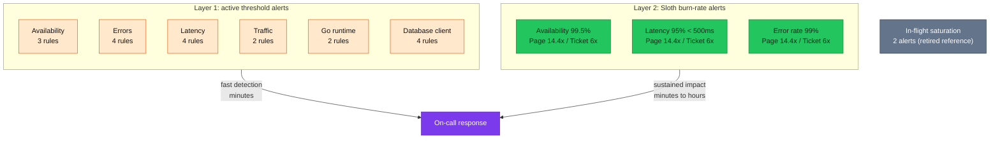
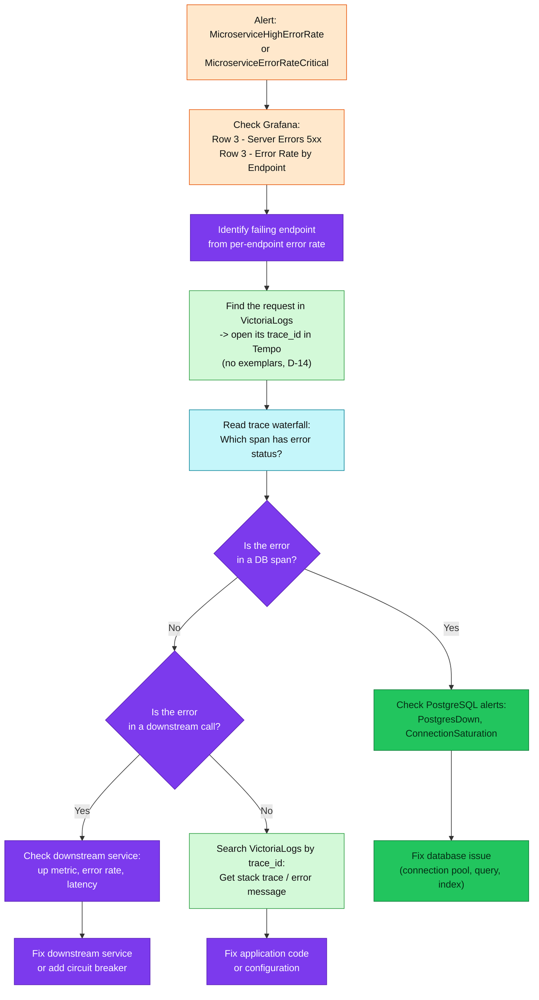
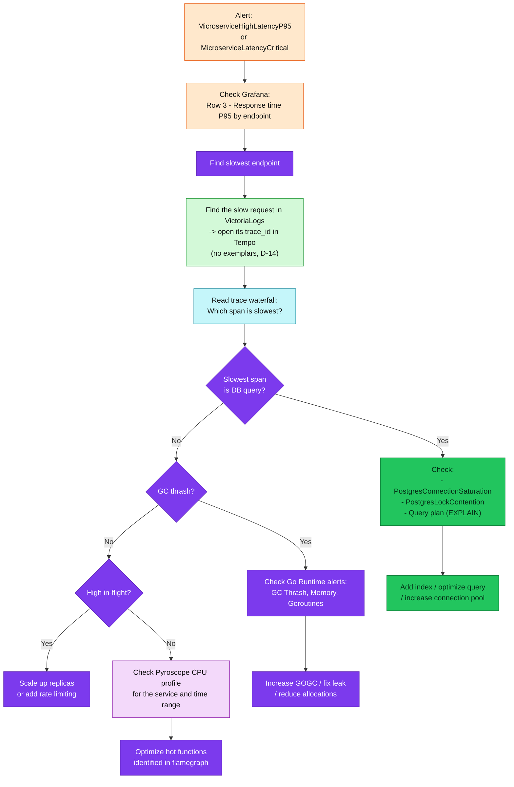
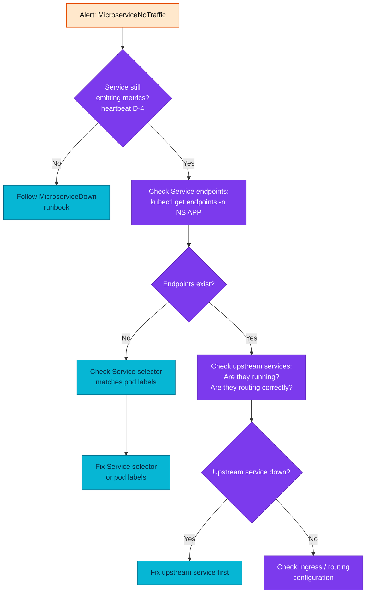
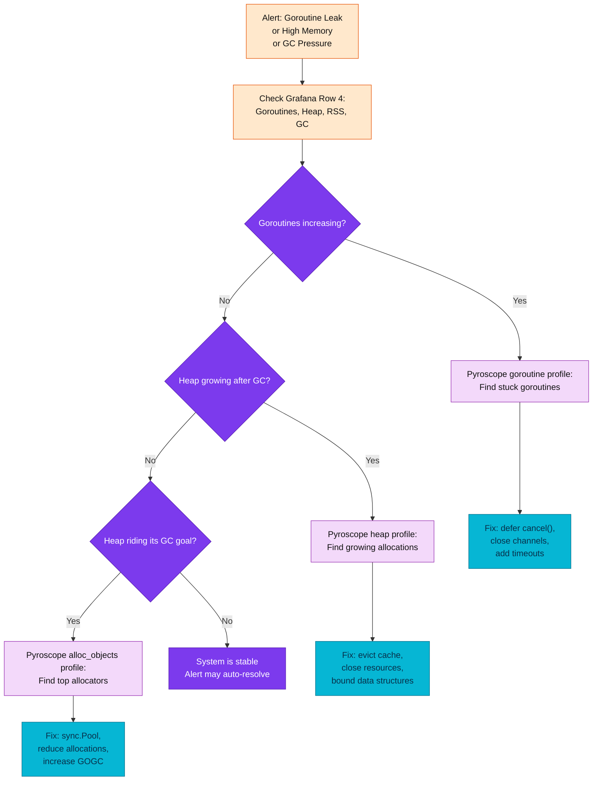

# Runbook: Microservices Application Alerts (Hub)

> **Purpose**: Workflows, threshold tuning, and design context for OTLP-based
> application alerts. **Per-alert investigation** lives in
> [`microservices/`](microservices/README.md) (one file per alert).
>
> **Manifest**: [`kubernetes/infra/configs/observability/metrics/prometheusrules/microservices/alerts.yaml`](../../../kubernetes/infra/configs/observability/metrics/prometheusrules/microservices/alerts.yaml)
>
> **Recording Rules**: [`kubernetes/infra/configs/observability/metrics/prometheusrules/microservices/recording-rules.yaml`](../../../kubernetes/infra/configs/observability/metrics/prometheusrules/microservices/recording-rules.yaml)
>
> **Metrics reference**: [`../metrics/metrics-apps.md`](../metrics/metrics-apps.md)

---

## Table of Contents

1. [Alert Architecture](#1-alert-architecture)
2. [Per-Alert Runbooks](#2-per-alert-runbooks)
3. [Saturation Alerts (retired)](#3-saturation-alerts-retired)
4. [Investigation Workflows](#4-investigation-workflows)
5. [Threshold Tuning Guide](#5-threshold-tuning-guide)
6. [Future Expansion](#6-future-expansion)
7. [Interview Reference](#7-interview-reference)

---

## 1. Alert Architecture

### Two-Layer Alerting Strategy

This platform uses a two-layer alerting approach, following the pattern used by Google, Uber, and Grab:



| Layer | Purpose | Detection Speed | Signal Quality |
|-------|---------|----------------|----------------|
| **Layer 1** (threshold) | Catch obvious, immediate failures | Fast (1-10 min) | May have false positives under brief spikes |
| **Layer 2** (SLO burn-rate) | Catch sustained degradation | Slower (5-60 min) | High signal-to-noise, error-budget aware |

**When both fire**: Layer 1 fires first for immediate awareness, Layer 2 confirms sustained impact on error budget. If only Layer 1 fires briefly and resolves, it was a transient spike -- no action needed.

### Alert Summary

| Group | Alert | Severity | For | Framework | State |
|---|---|---|---|---|---|
| **Availability** | `MicroserviceDown` | critical | 2m | Golden: Errors | Active |
| | `MicroserviceAllInstancesDown` | critical | 2m | Golden: Errors | Active |
| | `OtelMetricsPipelineExportFailures` | critical | 5m | Pipeline health | Active |
| **Errors** | `MicroserviceHighErrorRate` | warning | 5m | RED: Errors | Active |
| | `MicroserviceErrorRateCritical` | critical | 5m | RED: Errors | Active |
| | `MicroserviceNoSuccessfulRequests` | critical | 10m | RED: Errors | Active |
| | `GrpcServerHighErrorRate` | warning | 5m | RED: Errors | Active |
| **Latency** | `MicroserviceHighLatencyP95` | warning | 10m | RED: Duration | Active |
| | `MicroserviceHighLatencyP99` | warning | 10m | RED: Duration | Active |
| | `MicroserviceLatencyCritical` | critical | 5m | RED: Duration | Active |
| | `GrpcServerHighLatencyP95` | warning | 10m | RED: Duration | Active |
| **Traffic** | `MicroserviceNoTraffic` | warning | 10m | RED: Rate | Active |
| | `MicroserviceApdexCritical` | critical | 10m | Golden: Latency | Active |
| **Runtime** | `MicroserviceGoroutineLeak` | warning | 15m | USE: Saturation | Active |
| | `MicroserviceHighMemoryUsage` | warning | 15m | USE: Utilization | Active |
| | `MicroserviceGCThrash` | warning | 15m | USE: Saturation | Retired |
| **Saturation** | `MicroserviceHighRequestsInFlight` | warning | 5m | Golden: Saturation | Retired |
| | `MicroserviceRequestsInFlightCritical` | critical | 2m | Golden: Saturation | Retired |
| **Database client** | `DBClientQueryP95High` | warning | 10m | App-side DB latency | Active |
| | `DBClientErrorRate` | warning | 5m | App-side DB errors | Active |
| | `PgxPoolNearExhaustion` | warning | 5m | Pool saturation | Active |
| | `PgxPoolAcquireWaitHigh` | warning | 10m | Pool contention | Active |

Per-alert files: [`microservices/README.md`](microservices/README.md).

---

## 2. Per-Alert Runbooks

All **19 active** alerts have dedicated runbooks under
[`microservices/`](microservices/README.md). Alertmanager `runbook_url` annotations
point to the matching `<AlertName>.md` file.

| Group | Alerts |
|-------|--------|
| Availability | [MicroserviceDown](microservices/MicroserviceDown.md), [MicroserviceAllInstancesDown](microservices/MicroserviceAllInstancesDown.md), [OtelMetricsPipelineExportFailures](microservices/OtelMetricsPipelineExportFailures.md) |
| Errors | [MicroserviceHighErrorRate](microservices/MicroserviceHighErrorRate.md), [MicroserviceErrorRateCritical](microservices/MicroserviceErrorRateCritical.md), [MicroserviceNoSuccessfulRequests](microservices/MicroserviceNoSuccessfulRequests.md), [GrpcServerHighErrorRate](microservices/GrpcServerHighErrorRate.md) |
| Latency | [MicroserviceHighLatencyP95](microservices/MicroserviceHighLatencyP95.md), [MicroserviceHighLatencyP99](microservices/MicroserviceHighLatencyP99.md), [MicroserviceLatencyCritical](microservices/MicroserviceLatencyCritical.md), [GrpcServerHighLatencyP95](microservices/GrpcServerHighLatencyP95.md) |
| Traffic | [MicroserviceNoTraffic](microservices/MicroserviceNoTraffic.md), [MicroserviceApdexCritical](microservices/MicroserviceApdexCritical.md) |
| Runtime | [MicroserviceGoroutineLeak](microservices/MicroserviceGoroutineLeak.md), [MicroserviceHighMemoryUsage](microservices/MicroserviceHighMemoryUsage.md) |
| Database client | [DBClientQueryP95High](microservices/DBClientQueryP95High.md), [DBClientErrorRate](microservices/DBClientErrorRate.md), [PgxPoolNearExhaustion](microservices/PgxPoolNearExhaustion.md), [PgxPoolAcquireWaitHigh](microservices/PgxPoolAcquireWaitHigh.md) |

Retired alerts (`MicroserviceGCThrash`, in-flight saturation) remain documented below
for design context only.

---

## 3. Saturation Alerts (retired)

> **Retired (RFC-0014 — otelgin exposes no equivalent):** The in-flight saturation signal (`requests_in_flight`) is no longer emitted -- otelgin exposes no `http_server_active_requests` equivalent, so the `MicroserviceHighRequestsInFlight` and `MicroserviceRequestsInFlightCritical` alerts and the `app:requests_in_flight:sum` recording rule were retired. The subsections below are kept for design context; the in-flight queries return no data on the OTLP pipeline. Use latency and traffic rate as the saturation proxy instead.

### MicroserviceHighRequestsInFlight

**Fires when**: More than 50 concurrent requests in flight for 5 minutes.

**Severity**: warning

**Possible causes**:
- Traffic spike (legitimate or attack)
- Slow downstream dependency causing request pile-up
- Resource starvation (CPU, memory, connections)
- Insufficient replicas for current load

**Investigation**:

```promql
# Current in-flight requests -- NOT EMITTED under OTLP (record retired):
# job_app:requests_in_flight:sum was removed; there is no http_server_active_requests

# Correlate with traffic rate
app:http_server_request_duration_seconds:rate5m{app="$APP"}

# Correlate with latency (slow responses = more in-flight)
app:http_server_request_duration_seconds:p95_5m{app="$APP"}
```

**Resolution**:
1. If traffic spike: scale up replicas, consider rate limiting
2. If slow downstream: fix the root cause (see latency alerts)
3. If steady increase: capacity plan for more replicas

---

### MicroserviceRequestsInFlightCritical

**Fires when**: More than 100 concurrent requests in flight for 2 minutes.

**Severity**: critical

At 100+ in-flight requests, the service is likely overloaded. Responses will be slow or timing out. Cascading failures to upstream services are possible.

**Immediate actions**:
1. Scale up: `kubectl scale deployment/$APP -n $NAMESPACE --replicas=4`
2. If load is illegitimate: apply rate limiting
3. If caused by slow DB: check PostgreSQL alerts

---

## 4. Investigation Workflows

### Workflow A: "Service is returning 5xx"



### Workflow B: "Service is slow"



### Workflow C: "Service has no traffic"



### Workflow D: "Go runtime issue"



---

## 5. Threshold Tuning Guide

Alert thresholds are intentionally conservative. Tune them based on your service's characteristics.

### Current Thresholds vs Dashboard

| Alert | Alert Threshold | Dashboard Yellow | Dashboard Red | Notes |
|-------|----------------|-----------------|---------------|-------|
| Error Rate | warning: 5%, critical: 15% | 1% | 5% | Alert is looser than dashboard red to reduce noise |
| P95 Latency | warning: 1s, critical: 2s | 0.3s | 0.5s | Alert uses higher thresholds for fewer false positives |
| P99 Latency | warning: 2s | 0.5s | 1s | Tail latency is naturally more variable |
| Apdex | warning: 0.5 | 0.5 | -- | Aligned with dashboard red threshold |
| Restarts | warning: 3 in 15m | 1 | 5 | Alert between dashboard yellow and red |
| In-flight | warning: 50, critical: 100 | -- | -- | No dashboard threshold; tune per service |
| Memory RSS | warning: 512Mi | -- | -- | Tune based on container resource limits |
| Goroutines | warning: 1000 + increasing | -- | -- | Tune based on service's normal range |

### How to Tune

**Per-service override**: If a specific service needs different thresholds, create a separate PrometheusRule with service-specific expressions:

```yaml
- alert: ProductServiceHighLatencyP95
  expr: |
    histogram_quantile(0.95,
      sum by (le) (rate(http_server_request_duration_seconds_bucket{app="product"}[5m]))
    ) > 0.5
  for: 10m
  labels:
    severity: warning
```

**Finding the right threshold**:

```promql
# Check historical P95 range for a service
histogram_quantile(0.95,
  sum by (le) (rate(http_server_request_duration_seconds_bucket{app="$APP"}[5m]))
)

# Check historical error rate range
app:http_server_request_duration_seconds:error_ratio5m{app="$APP"}

# Check normal goroutine count range
go_goroutine_count{app="$APP"}
```

Set thresholds at **2-3x the normal peak** for warning and **5x** for critical.

---

## 6. Future Expansion

### Phase 2: Database Connection Alerts (from Application Side)

> **✅ Realized (RFC-0017 W4)** as `DBClientQueryP95High` / `DBClientErrorRate` /
> `PgxPoolNearExhaustion` / `PgxPoolAcquireWaitHigh` on the real otelpgx metric
> names — see [DB client runbooks](microservices/README.md#index). The sketch below is
> kept as the original design note (its hypothetical metric names never existed).

Add alerts for application-side database health signals:

```yaml
# Connection pool exhaustion (if exposed via metrics)
- alert: MicroserviceDBConnectionPoolExhausted
  expr: db_pool_active_connections / db_pool_max_connections > 0.9
  for: 5m

# Slow query rate (if SQL duration histogram exposed)
- alert: MicroserviceSlowQueries
  expr: rate(db_query_duration_seconds_count{le="+Inf"}[5m]) - rate(db_query_duration_seconds_count{le="1"}[5m]) > 0.1
  for: 10m
```

### Phase 3: Caching Alerts (Valkey/Redis)

```yaml
# Cache hit rate too low
- alert: MicroserviceLowCacheHitRate
  expr: cache_hit_total / (cache_hit_total + cache_miss_total) < 0.7
  for: 15m

# Cache latency high
- alert: MicroserviceCacheLatencyHigh
  expr: histogram_quantile(0.95, rate(cache_duration_seconds_bucket[5m])) > 0.01
  for: 10m
```

### Phase 4: Cross-Service Dependency Alerts

```yaml
# Downstream service call failure rate
- alert: MicroserviceDownstreamFailureRate
  expr: rate(http_client_requests_total{status=~"5.."}[5m]) / rate(http_client_requests_total[5m]) > 0.1
  for: 5m

# Circuit breaker open
- alert: MicroserviceCircuitBreakerOpen
  expr: circuit_breaker_state == 1
  for: 1m
```

### Phase 5: Kubernetes Infrastructure Alerts

```yaml
# Node not ready
- alert: KubernetesNodeNotReady
  expr: kube_node_status_condition{condition="Ready", status="true"} == 0
  for: 5m

# PVC almost full
- alert: PersistentVolumeAlmostFull
  expr: kubelet_volume_stats_used_bytes / kubelet_volume_stats_capacity_bytes > 0.9
  for: 15m
```

### Expansion Checklist

| Phase | What | Depends On | Effort |
|-------|------|-----------|--------|
| Phase 1 (done) | Application RED/Golden alerts | `http_server_request_duration_seconds` | This PR |
| Phase 2 | DB connection pool from app side | Application-level DB metrics | Medium |
| Phase 3 | Valkey cache alerts | Cache metrics in product service | Medium |
| Phase 4 | Cross-service dependency alerts | HTTP client instrumentation | High |
| Phase 5 | Kubernetes infrastructure alerts | kube-state-metrics | Low |

---

## 7. Interview Reference

### Mapping Alerts to Frameworks

| Framework | Signal | Alerts Covering It |
|-----------|--------|-------------------|
| **RED** | Rate | `MicroserviceNoTraffic` |
| **RED** | Errors | `MicroserviceHighErrorRate`, `MicroserviceErrorRateCritical`, `MicroserviceNoSuccessfulRequests`, `GrpcServerHighErrorRate` |
| **RED** | Duration | `MicroserviceHighLatencyP95`, `MicroserviceHighLatencyP99`, `MicroserviceLatencyCritical`, `MicroserviceApdexCritical`, `GrpcServerHighLatencyP95` |
| **USE** | Utilization | `MicroserviceHighMemoryUsage` |
| **USE** | Saturation | `MicroserviceHighRequestsInFlight`, `MicroserviceRequestsInFlightCritical` (retired — otelgin gap), `MicroserviceGoroutineLeak`, `MicroserviceGCThrash` |
| **USE** | Errors | `MicroserviceDown`, `MicroserviceAllInstancesDown`, `KubePodCrashLooping` |
| **Golden** | Latency | All RED Duration alerts |
| **Golden** | Traffic | `MicroserviceNoTraffic` |
| **Golden** | Errors | All RED Errors alerts + Availability alerts |
| **Golden** | Saturation | All USE Saturation alerts |

### Interview Answer: "How do you design alerting for microservices?"

**Before**: No application-level alerts. Only SLO burn-rate alerts from Sloth. When a service crashed, we relied on SLO burn-rate which could take 30-60 minutes to detect a sudden failure.

**What you did**: Added Layer 1 threshold alerts to complement Layer 2 SLO alerts. Designed 5 active alert groups covering RED/Golden Signals plus Go runtime health; retained the retired saturation design as reference.

**How**:
- 19 active alert rules in 6 groups: availability, errors, latency, traffic, runtime, database client
- Recording rules pre-aggregate common queries (5 groups, ~15 rules) for fast evaluation
- Thresholds aligned with Grafana dashboard thresholds but more conservative to reduce noise
- Every alert has `runbook_url` annotation pointing to investigation steps
- Two-layer approach: Layer 1 (threshold, 1-10 min detection) + Layer 2 (SLO burn-rate, 5-60 min detection)

**Result**: Complete-outage detection now follows VictoriaMetrics staleness plus the 2-minute alert hold, typically about 5-7 minutes instead of waiting for a slow SLO burn. Layer 1 catches obvious failures; Layer 2 catches sustained degradation with higher signal quality. Four-pillar correlation (`trace_id` in logs -> trace -> profile; no exemplars, RFC-0014 D-14) then guides the investigation.

---


## Related Documentation

- [Microservices runbook index](microservices/README.md)
- [Observability Deep Dive Runbook](observability-deep-dive.md) — RED/USE/Golden theory, middleware chain
- [SLO Documentation](../slo/README.md)
- [SLO Burn-Rate Alerts](../alerting/slo-burn-rate-alerts.md)
- [PostgreSQL runbooks](postgresql/README.md) — server-side CNPG alerts
- [Metrics Reference](../metrics/metrics-apps.md)
- [Grafana Dashboard Guide](../grafana/dashboard-reference.md)

---
_Last updated: 2026-07-18_
