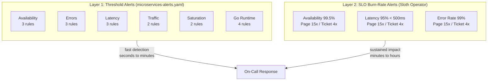
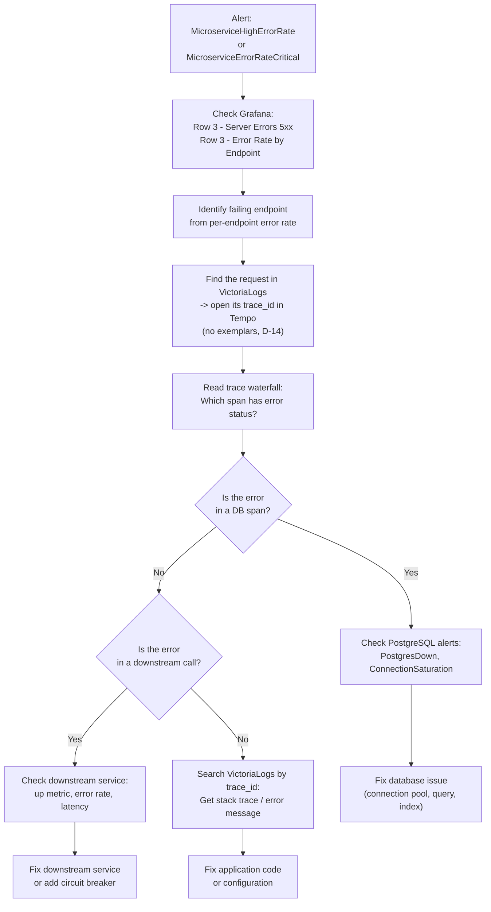
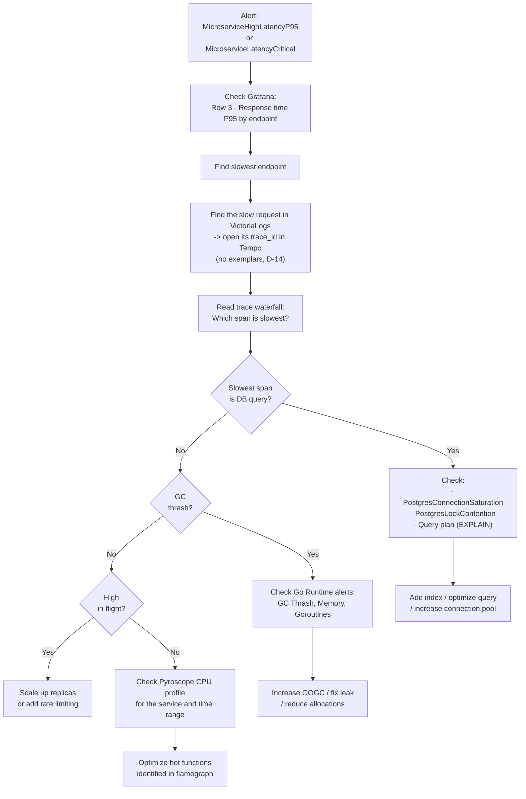
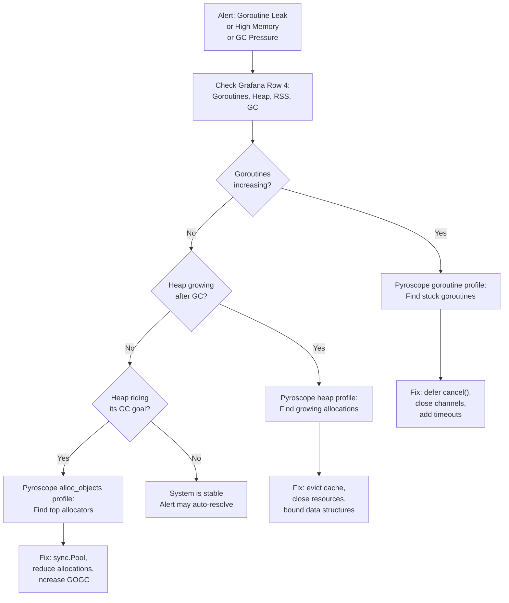

# Runbook: Microservices Application Alerts

> **Purpose**: Per-alert investigation guide for the 18 application-level PrometheusRules covering RED/Golden Signals, Go runtime, and saturation.
>
> **Manifest**: [`kubernetes/infra/configs/monitoring/prometheusrules/microservices/alerts.yaml`](../../../kubernetes/infra/configs/monitoring/prometheusrules/microservices/alerts.yaml)
>
> **Recording Rules**: [`kubernetes/infra/configs/monitoring/prometheusrules/microservices/recording-rules.yaml`](../../../kubernetes/infra/configs/monitoring/prometheusrules/microservices/recording-rules.yaml)
>
> **Last Updated**: 2026-07-09

---

## Table of Contents

1. [Alert Architecture](#1-alert-architecture)
2. [Availability Alerts](#2-availability-alerts)
3. [Error Alerts](#3-error-alerts)
4. [Latency Alerts](#4-latency-alerts)
5. [Traffic Alerts](#5-traffic-alerts)
6. [Saturation Alerts](#6-saturation-alerts)
7. [Go Runtime Alerts](#7-go-runtime-alerts)
8. [Investigation Workflows](#8-investigation-workflows)
9. [Threshold Tuning Guide](#9-threshold-tuning-guide)
10. [Future Expansion](#10-future-expansion)
11. [Interview Reference](#11-interview-reference)

---

## 1. Alert Architecture

### Two-Layer Alerting Strategy

This platform uses a two-layer alerting approach, following the pattern used by Google, Uber, and Grab:



| Layer | Purpose | Detection Speed | Signal Quality |
|-------|---------|----------------|----------------|
| **Layer 1** (threshold) | Catch obvious, immediate failures | Fast (1-10 min) | May have false positives under brief spikes |
| **Layer 2** (SLO burn-rate) | Catch sustained degradation | Slower (5-60 min) | High signal-to-noise, error-budget aware |

**When both fire**: Layer 1 fires first for immediate awareness, Layer 2 confirms sustained impact on error budget. If only Layer 1 fires briefly and resolves, it was a transient spike -- no action needed.

### Alert Summary

| Group | Alert | Severity | For | Framework |
|-------|-------|----------|-----|-----------|
| **Availability** | `MicroserviceDown` | critical | 1m | Golden: Errors |
| | `MicroserviceAllInstancesDown` | critical | 1m | Golden: Errors |
| | `MicroserviceHighRestartRate` | warning | 5m | Golden: Errors |
| **Errors** | `MicroserviceHighErrorRate` | warning | 5m | RED: Errors |
| | `MicroserviceErrorRateCritical` | critical | 5m | RED: Errors |
| | `MicroserviceNoSuccessfulRequests` | critical | 10m | RED: Errors |
| **Latency** | `MicroserviceHighLatencyP95` | warning | 10m | RED: Duration |
| | `MicroserviceHighLatencyP99` | warning | 10m | RED: Duration |
| | `MicroserviceLatencyCritical` | critical | 5m | RED: Duration |
| **Traffic** | `MicroserviceNoTraffic` | warning | 10m | RED: Rate |
| | `MicroserviceApdexCritical` | warning | 10m | Golden: Latency |
| **Saturation** | `MicroserviceHighRequestsInFlight` | warning | 5m | Golden: Saturation |
| | `MicroserviceRequestsInFlightCritical` | critical | 2m | Golden: Saturation |
| **Runtime** | `MicroserviceGoroutineLeak` | warning | 15m | USE: Saturation |
| | `MicroserviceHighMemoryUsage` | warning | 15m | USE: Utilization |
| | `MicroserviceGCThrash` | warning | 15m | USE: Saturation |

---

## 2. Availability Alerts

### MicroserviceDown

**Fires when**: A microservice stops emitting metrics for more than 1 minute. The apps push OTLP (SDK -> otel-collector -> vmagent) and no longer expose a `/metrics` scrape target, so there is no `up` series -- liveness is inferred from **heartbeat absence** (no fresh `go_goroutine_count` samples). Detection lags a pod kill by ~5 minutes due to VictoriaMetrics staleness (accepted, RFC-0014 D-4).

**Severity**: critical

**Possible causes**:
- Pod crashed (OOMKilled, application panic, segfault)
- Pod evicted (node resource pressure)
- Deployment rollout in progress
- NetworkPolicy or collector outage breaking the OTLP push path (SDK -> otel-collector -> vmagent)

**Investigation**:

```bash
# Check pod status
kubectl get pods -n $NAMESPACE -l app=$APP

# Check events
kubectl describe pod -n $NAMESPACE $POD_NAME

# Check recent logs
kubectl logs -n $NAMESPACE -l app=$APP --tail=100

# Check if deployment rollout in progress
kubectl rollout status deployment/$APP -n $NAMESPACE
```

```promql
# Verify: which pods stopped emitting metrics? (heartbeat absence, D-4)
count by (app, namespace, k8s_pod_name) (last_over_time(go_goroutine_count{app="$APP"}[15m]))
  unless count by (app, namespace, k8s_pod_name) (go_goroutine_count{app="$APP"})

# Check restart history
increase(kube_pod_container_status_restarts_total{namespace="$NAMESPACE", pod=~"$APP.*"}[1h])
```

**Resolution**:
1. If rollout in progress: wait for completion, monitor new pods
2. If OOMKilled: check Pyroscope heap profiles, increase memory limits
3. If CrashLoopBackOff: check application logs for startup errors
4. If network issue: check NetworkPolicy and Service endpoints

**Related alerts**: `MicroserviceAllInstancesDown`, `MicroserviceHighRestartRate`

---

### MicroserviceAllInstancesDown

**Fires when**: Every instance of a service is down simultaneously. Complete outage.

**Severity**: critical (page)

**Possible causes**:
- Failed deployment (bad image, broken config)
- Shared dependency failure (database down, secret missing)
- Namespace-wide issue (ResourceQuota exhausted, namespace deleted)
- Node failure (all pods scheduled on same node)

**Investigation**:

```bash
# Check all pods in namespace
kubectl get pods -n $NAMESPACE

# Check deployment spec
kubectl describe deployment/$APP -n $NAMESPACE

# Check events in namespace
kubectl get events -n $NAMESPACE --sort-by=.metadata.creationTimestamp | tail -20

# Check HelmRelease status
kubectl get helmrelease -n $NAMESPACE
flux get helmrelease -n $NAMESPACE
```

**Resolution**:
1. If bad deployment: `kubectl rollout undo deployment/$APP -n $NAMESPACE`
2. If dependency failure: check database alerts (`PostgresDown`, `CnpgDown`)
3. If resource issue: check `kubectl describe namespace $NAMESPACE` for quotas

**Escalation**: This is a full outage. If not resolved in 15 minutes, escalate to team lead.

---

### MicroserviceHighRestartRate

**Fires when**: A container restarts more than 3 times in 15 minutes.

**Severity**: warning

**Possible causes**:
- Application crash on startup (missing config, DB connection failure)
- OOMKilled (memory limit too low for workload)
- Liveness probe failure (probe too aggressive, application slow to start)
- Init container failure (migration failed)

**Investigation**:

```bash
# Check restart count and reason
kubectl get pods -n $NAMESPACE -o wide
kubectl describe pod -n $NAMESPACE $POD_NAME | grep -A5 "Last State"

# Check for OOMKilled
kubectl get pods -n $NAMESPACE -o jsonpath='{range .items[*]}{.metadata.name}{"\t"}{.status.containerStatuses[0].lastState.terminated.reason}{"\n"}{end}'

# Check previous container logs
kubectl logs -n $NAMESPACE $POD_NAME --previous --tail=50
```

**Resolution**:
1. If OOMKilled: increase memory limits in HelmRelease values, check Pyroscope for memory leaks
2. If startup crash: fix application config, check OpenBAO secrets
3. If liveness probe: increase `initialDelaySeconds` or probe timeout

---

## 3. Error Alerts

### MicroserviceHighErrorRate

**Fires when**: 5xx error rate exceeds 5% of total traffic for 5 minutes.

**Severity**: warning

**Possible causes**:
- Application bug (nil pointer, unhandled error)
- Downstream dependency failure (database, external API)
- Resource exhaustion (connection pool, file descriptors)
- Bad deployment (new code with regression)

**Investigation**:

```promql
# Error rate by service
app:http_server_request_duration_seconds:error_ratio5m{app="$APP"}

# Error rate by endpoint (find the hot path)
app_route:http_server_request_duration_seconds:error_rate5m{app="$APP"} > 0

# Was there a deployment recently?
kube_pod_container_status_restarts_total{namespace="$NAMESPACE"}
```

```bash
# Check application logs for errors
kubectl logs -n $NAMESPACE -l app=$APP --tail=200 | grep -i error

# Check recent deployments
kubectl rollout history deployment/$APP -n $NAMESPACE
```

**Grafana panels to check**:
- Row 1: Error Rate %
- Row 3: Server Errors (5xx), Error Rate by Method and Endpoint

**Resolution**:
1. Identify failing endpoint from per-endpoint error rate
2. Search the `trace_id` field in VictoriaLogs for the error logs, then open the linked trace in Tempo (traces<->logs correlation). Exemplars are not available -- VictoriaMetrics does not support them (RFC-0014 D-14)
3. If new deployment: rollback with `kubectl rollout undo`
4. If DB issue: check PostgreSQL alerts

---

### MicroserviceErrorRateCritical

**Fires when**: 5xx error rate exceeds 15% of total traffic for 5 minutes.

**Severity**: critical

Same investigation as `MicroserviceHighErrorRate` but with higher urgency. At 15% error rate, a significant portion of users are impacted.

**Escalation**: If not identified within 10 minutes, consider rolling back the most recent deployment.

---

### MicroserviceNoSuccessfulRequests

**Fires when**: Zero 2xx responses for 10 minutes, but the service had traffic in the prior hour.

**Severity**: critical

**Possible causes**:
- Complete application failure (all requests returning 5xx)
- Misconfigured routing (Ingress/Service pointing to wrong port)
- Database connection pool exhausted
- Panic recovery returning 500 for every request

**Investigation**:

```promql
# Check status code distribution
sum by (http_response_status_code) (rate(http_server_request_duration_seconds_count{app="$APP"}[5m]))

# Is there traffic at all?
app:http_server_request_duration_seconds:rate5m{app="$APP"}
```

**Resolution**:
1. If all 5xx: follow `MicroserviceErrorRateCritical` runbook
2. If no traffic at all: follow `MicroserviceNoTraffic` runbook
3. If all 4xx: check for authentication/authorization issues

---

## 4. Latency Alerts

### MicroserviceHighLatencyP95

**Fires when**: P95 latency exceeds 1 second for 10 minutes.

**Severity**: warning

**Possible causes**:
- Slow database queries (missing index, table scan)
- Downstream service latency (cascading slowness)
- Resource contention (CPU throttling, GC pressure)
- Connection pool exhaustion (waiting for connections)

**Investigation**:

```promql
# P95 latency by service
app:http_server_request_duration_seconds:p95_5m{app="$APP"}

# P95 by endpoint (find slow endpoints)
app_route:http_server_request_duration_seconds:p95_5m{app="$APP"}

# Check saturation: the in-flight signal is no longer emitted -- otelgin exposes no
# http_server_active_requests, so the requests-in-flight alerts retired (RFC-0014 D-14)

# Check GC thrash (GC churn causing latency?). There is no GC-pause metric under OTLP;
# instead watch the heap riding its GC goal (>0.95 = thrashing):
go_memory_used_bytes{app="$APP"} / go_memory_gc_goal_bytes{app="$APP"}
```

**Grafana panels to check**:
- Row 1: P95 Response Time (stat panel)
- Row 3: Response time 95th percentile (per endpoint)
- Row 5: Requests In Flight

**Resolution**:
1. Identify slow endpoint from per-endpoint P95
2. Find the slow request in VictoriaLogs (filter on high latency), then open its `trace_id` in Tempo (traces<->logs correlation). Exemplars are not available -- VictoriaMetrics does not support them (RFC-0014 D-14)
3. In the trace waterfall, find the slowest span (DB query? external API?)
4. If DB: add index, optimize query, check `PostgresConnectionSaturation` alert
5. If GC: check `MicroserviceGCThrash` alert, review Pyroscope CPU profile
6. If saturation: scale up replicas

---

### MicroserviceHighLatencyP99

**Fires when**: P99 latency exceeds 2 seconds for 10 minutes.

**Severity**: warning

P99 captures tail latency -- the worst 1% of requests. High P99 with normal P95 indicates occasional outlier requests.

**Additional causes** (beyond P95 causes):
- Retry storms from downstream clients
- Lock contention in database
- Cold start after idle (first request warming up caches)

---

### MicroserviceLatencyCritical

**Fires when**: P95 latency exceeds 2 seconds for 5 minutes.

**Severity**: critical

When P95 (not just P99) exceeds 2 seconds, the majority of requests are severely slow. This is a widespread performance degradation.

**Escalation**: If DB-related, check `PostgresLockContention` and `PostgresConnectionSaturation`. If not resolved in 15 minutes, scale up replicas as a stopgap.

---

## 5. Traffic Alerts

### MicroserviceNoTraffic

**Fires when**: Zero requests for 10 minutes, but the service had traffic in the prior hour.

**Severity**: warning

**Possible causes**:
- Upstream service stopped calling this service
- Ingress/Service misconfiguration (endpoints removed)
- DNS resolution failure
- Network policy blocking traffic
- Deployment deleted the Service resource

**Investigation**:

```bash
# Check Service endpoints
kubectl get endpoints -n $NAMESPACE $APP

# Check Service exists
kubectl get svc -n $NAMESPACE $APP

# Check if pods are ready
kubectl get pods -n $NAMESPACE -l app=$APP -o wide

# Check Ingress/route
kubectl get ingress -n $NAMESPACE
```

```promql
# Verify zero traffic
app:http_server_request_duration_seconds:rate5m{app="$APP"}

# Check if the service is still emitting metrics (heartbeat, D-4) -- the apps push
# OTLP and expose no scrape target, so there is no `up` series
count by (app, namespace, k8s_pod_name) (go_goroutine_count{app="$APP"})
```

**Resolution**:
1. If endpoints empty: check Service selector matches pod labels
2. If pods not ready: check readiness probe failures
3. If upstream issue: check upstream service health
4. May be expected during maintenance windows -- verify with team

---

### MicroserviceApdexCritical

**Fires when**: Apdex score drops below 0.5 for 10 minutes.

**Severity**: warning

Apdex below 0.5 means the majority of users are experiencing "frustrating" response times (> 2 seconds). This is worse than a simple latency alert because it accounts for the full distribution, not just a percentile.

**Investigation**:

```promql
# Current Apdex
app:http_server_request_duration_seconds:apdex5m{app="$APP"}

# Breakdown: what percentage of requests are satisfied/tolerating/frustrating?
# Satisfied (< 0.5s)
sum(rate(http_server_request_duration_seconds_bucket{app="$APP", le="0.5"}[5m]))
/ sum(rate(http_server_request_duration_seconds_count{app="$APP"}[5m]))

# Frustrating (> 2s)
1 - (
  sum(rate(http_server_request_duration_seconds_bucket{app="$APP", le="2"}[5m]))
  / sum(rate(http_server_request_duration_seconds_count{app="$APP"}[5m]))
)
```

**Resolution**: Follow the latency investigation workflow. Low Apdex usually means widespread latency, not just tail latency.

---

## 6. Saturation Alerts

> **Retired (RFC-0014 D-14):** The in-flight saturation signal (`requests_in_flight`) is no longer emitted -- otelgin exposes no `http_server_active_requests` equivalent, so the `MicroserviceHighRequestsInFlight` and `MicroserviceRequestsInFlightCritical` alerts and the `app:requests_in_flight:sum` recording rule were retired. The subsections below are kept for design context; the in-flight queries return no data on the OTLP pipeline. Use latency and traffic rate as the saturation proxy instead.

### MicroserviceHighRequestsInFlight

**Fires when**: More than 50 concurrent requests in flight for 5 minutes.

**Severity**: warning

**Possible causes**:
- Traffic spike (legitimate or attack)
- Slow downstream dependency causing request pile-up
- Resource starvation (CPU, memory, connections)
- Insufficient replicas for current load

**Investigation**:

```promql
# Current in-flight requests -- NOT EMITTED under OTLP (record retired, D-14):
# job_app:requests_in_flight:sum was removed; there is no http_server_active_requests

# Correlate with traffic rate
app:http_server_request_duration_seconds:rate5m{app="$APP"}

# Correlate with latency (slow responses = more in-flight)
app:http_server_request_duration_seconds:p95_5m{app="$APP"}
```

**Resolution**:
1. If traffic spike: scale up replicas, consider rate limiting
2. If slow downstream: fix the root cause (see latency alerts)
3. If steady increase: capacity plan for more replicas

---

### MicroserviceRequestsInFlightCritical

**Fires when**: More than 100 concurrent requests in flight for 2 minutes.

**Severity**: critical

At 100+ in-flight requests, the service is likely overloaded. Responses will be slow or timing out. Cascading failures to upstream services are possible.

**Immediate actions**:
1. Scale up: `kubectl scale deployment/$APP -n $NAMESPACE --replicas=4`
2. If load is illegitimate: apply rate limiting
3. If caused by slow DB: check PostgreSQL alerts

---

## 7. Go Runtime Alerts

### MicroserviceGoroutineLeak

**Fires when**: Goroutine count exceeds 1,000 AND is steadily increasing for 15 minutes.

**Severity**: warning

**Possible causes**:
- Forgotten `defer cancel()` on context
- Unclosed channels (goroutine blocked on send/receive forever)
- HTTP client without timeout (goroutine waiting on response indefinitely)
- Goroutine spawned in loop without bound

**Investigation**:

```promql
# Current goroutine count
go_goroutine_count{app="$APP"}

# Rate of increase (should be ~0 in healthy state)
rate(go_goroutine_count{app="$APP"}[15m])
```

```bash
# Get goroutine dump (if pprof exposed)
kubectl port-forward -n $NAMESPACE svc/$APP 6060:6060
curl http://localhost:6060/debug/pprof/goroutine?debug=2
```

**Grafana panels**: Row 4: Goroutines & Threads

**Resolution**:
1. Check Pyroscope goroutine profile for the service
2. Look for goroutines stuck in `runtime.gopark` or `chan receive`
3. Review recent code changes for missing context cancellation
4. Restart the pod as a temporary fix: `kubectl delete pod -n $NAMESPACE $POD_NAME`

---

### MicroserviceHighMemoryUsage

**Fires when**: Process RSS exceeds 512 MiB for 15 minutes.

**Severity**: warning

**Possible causes**:
- Memory leak (growing maps, slices, or caches without eviction)
- Large response bodies held in memory
- Goroutine leak (each goroutine uses ~8KB stack)
- Insufficient GOGC value (too much live data)

**Investigation**:

> **Metric remap (RFC-0014 P3 cutover):** `process_resident_memory_bytes` and the
> `go_memstats_*` series were `client_golang` names retired with the scrape. The OTLP
> Go-runtime set is `go_memory_used_bytes` (label `go_memory_type=stack|other`),
> `go_memory_allocated_bytes_total`, `go_memory_allocations_total`, `go_memory_gc_goal_bytes`.
> Container RSS now comes from cAdvisor (`container_memory_working_set_bytes`), which is
> labelled `namespace`/`pod`/`container` (not `app`), so select by namespace + pod regex.

```promql
# Working-set memory (limits-aware RSS, cAdvisor -- retired process_resident_memory_bytes)
container_memory_working_set_bytes{namespace=~"$NAMESPACE", pod=~"$APP.*", container!=""}

# Go heap in use (retired go_memstats_alloc_bytes / go_memstats_heap_inuse_bytes)
sum by (app) (go_memory_used_bytes{app="$APP"})

# Split by region (stack vs other) to spot which segment grows
go_memory_used_bytes{app="$APP"}

# Allocation rate (no frees counter in OTel; watch churn instead)
rate(go_memory_allocations_total{app="$APP"}[5m])

# If go_memory_used_bytes grows steadily post-GC = memory leak
```

**Grafana panels**: Row 4: Go Memory Used (by type), Working-Set Memory (container)

**Resolution**:
1. Check Pyroscope heap profile (alloc_space, inuse_space) for the service
2. If `go_memory_used_bytes` grows post-GC: memory leak -- identify the growing data structure
3. If working-set is high but Go heap is stable: non-Go memory (CGO, mmap) -- check with `pprof`
4. Increase memory limit as stopgap, fix the leak in code

---

### MicroserviceGCThrash

**Fires when**: Heap in use (`go_memory_used_bytes`) stays within 5% of the GC goal (`go_memory_gc_goal_bytes`) for 15 minutes -- the collector fires back-to-back because live data keeps pushing the heap up against its target, so throughput and latency suffer.

**Severity**: warning

> **Why not GC pause / frequency?** The OTLP Go runtime instrumentation exposes **no** GC-pause or GC-cycle-count metric (`go_gc_duration_seconds_*` was a `client_golang` series that disappeared with the scrape). The former `MicroserviceHighGCPressure` and `MicroserviceHighGCFrequency` alerts were replaced by this single **GC-thrash** signal (RFC-0014 D-14).

**Possible causes**:
- Very high allocation rate (creating many short-lived objects)
- Heap size too small for workload
- GOGC too low (default 100, forces frequent GC)

**Investigation**:

```promql
# Heap riding its GC goal (>0.95 = thrashing)
go_memory_used_bytes{app="$APP"} / go_memory_gc_goal_bytes{app="$APP"}

# Heap growth trend
rate(go_memory_used_bytes{app="$APP"}[5m])
```

**Resolution**:
1. Check Pyroscope CPU profile -- look for `runtime.gcBgMarkWorker`
2. Check Pyroscope alloc_objects profile -- find top allocators
3. Set `GOGC=200` to reduce GC frequency (trade memory for CPU)
4. Use `sync.Pool` for frequently allocated objects
5. Reduce allocation rate in hot paths

---

## 8. Investigation Workflows

### Workflow A: "Service is returning 5xx"



### Workflow B: "Service is slow"



### Workflow C: "Service has no traffic"

```mermaid
flowchart TD
    Start["Alert: MicroserviceNoTraffic"] --> IsUp{Service still\nemitting metrics?\n(heartbeat, D-4)}

    IsUp -->|No| FollowDown["Follow MicroserviceDown\nrunbook"]
    IsUp -->|Yes| CheckEndpoints["Check Service endpoints:\nkubectl get endpoints -n NS APP"]

    CheckEndpoints --> HasEndpoints{Endpoints\nexist?}
    HasEndpoints -->|No| CheckService["Check Service selector\nmatches pod labels"]
    HasEndpoints -->|Yes| CheckUpstream["Check upstream services:\nAre they running?\nAre they routing correctly?"]

    CheckService --> FixSelector["Fix Service selector\nor pod labels"]
    CheckUpstream --> IsUpstreamDown{Upstream\nservice down?}

    IsUpstreamDown -->|Yes| FixUpstream["Fix upstream service first"]
    IsUpstreamDown -->|No| CheckIngress["Check Ingress / routing\nconfiguration"]
```

### Workflow D: "Go runtime issue"



---

## 9. Threshold Tuning Guide

Alert thresholds are intentionally conservative. Tune them based on your service's characteristics.

### Current Thresholds vs Dashboard

| Alert | Alert Threshold | Dashboard Yellow | Dashboard Red | Notes |
|-------|----------------|-----------------|---------------|-------|
| Error Rate | warning: 5%, critical: 15% | 1% | 5% | Alert is looser than dashboard red to reduce noise |
| P95 Latency | warning: 1s, critical: 2s | 0.3s | 0.5s | Alert uses higher thresholds for fewer false positives |
| P99 Latency | warning: 2s | 0.5s | 1s | Tail latency is naturally more variable |
| Apdex | warning: 0.5 | 0.5 | -- | Aligned with dashboard red threshold |
| Restarts | warning: 3 in 15m | 1 | 5 | Alert between dashboard yellow and red |
| In-flight | warning: 50, critical: 100 | -- | -- | No dashboard threshold; tune per service |
| Memory RSS | warning: 512Mi | -- | -- | Tune based on container resource limits |
| Goroutines | warning: 1000 + increasing | -- | -- | Tune based on service's normal range |

### How to Tune

**Per-service override**: If a specific service needs different thresholds, create a separate PrometheusRule with service-specific expressions:

```yaml
- alert: ProductServiceHighLatencyP95
  expr: |
    histogram_quantile(0.95,
      sum by (le) (rate(http_server_request_duration_seconds_bucket{app="product"}[5m]))
    ) > 0.5
  for: 10m
  labels:
    severity: warning
```

**Finding the right threshold**:

```promql
# Check historical P95 range for a service
histogram_quantile(0.95,
  sum by (le) (rate(http_server_request_duration_seconds_bucket{app="$APP"}[5m]))
)

# Check historical error rate range
app:http_server_request_duration_seconds:error_ratio5m{app="$APP"}

# Check normal goroutine count range
go_goroutine_count{app="$APP"}
```

Set thresholds at **2-3x the normal peak** for warning and **5x** for critical.

---

## 10. Future Expansion

### Phase 2: Database Connection Alerts (from Application Side)

Add alerts for application-side database health signals:

```yaml
# Connection pool exhaustion (if exposed via metrics)
- alert: MicroserviceDBConnectionPoolExhausted
  expr: db_pool_active_connections / db_pool_max_connections > 0.9
  for: 5m

# Slow query rate (if SQL duration histogram exposed)
- alert: MicroserviceSlowQueries
  expr: rate(db_query_duration_seconds_count{le="+Inf"}[5m]) - rate(db_query_duration_seconds_count{le="1"}[5m]) > 0.1
  for: 10m
```

### Phase 3: Caching Alerts (Valkey/Redis)

```yaml
# Cache hit rate too low
- alert: MicroserviceLowCacheHitRate
  expr: cache_hit_total / (cache_hit_total + cache_miss_total) < 0.7
  for: 15m

# Cache latency high
- alert: MicroserviceCacheLatencyHigh
  expr: histogram_quantile(0.95, rate(cache_duration_seconds_bucket[5m])) > 0.01
  for: 10m
```

### Phase 4: Cross-Service Dependency Alerts

```yaml
# Downstream service call failure rate
- alert: MicroserviceDownstreamFailureRate
  expr: rate(http_client_requests_total{status=~"5.."}[5m]) / rate(http_client_requests_total[5m]) > 0.1
  for: 5m

# Circuit breaker open
- alert: MicroserviceCircuitBreakerOpen
  expr: circuit_breaker_state == 1
  for: 1m
```

### Phase 5: Kubernetes Infrastructure Alerts

```yaml
# Node not ready
- alert: KubernetesNodeNotReady
  expr: kube_node_status_condition{condition="Ready", status="true"} == 0
  for: 5m

# PVC almost full
- alert: PersistentVolumeAlmostFull
  expr: kubelet_volume_stats_used_bytes / kubelet_volume_stats_capacity_bytes > 0.9
  for: 15m
```

### Expansion Checklist

| Phase | What | Depends On | Effort |
|-------|------|-----------|--------|
| Phase 1 (done) | Application RED/Golden alerts | `http_server_request_duration_seconds` | This PR |
| Phase 2 | DB connection pool from app side | Application-level DB metrics | Medium |
| Phase 3 | Valkey cache alerts | Cache metrics in product service | Medium |
| Phase 4 | Cross-service dependency alerts | HTTP client instrumentation | High |
| Phase 5 | Kubernetes infrastructure alerts | kube-state-metrics | Low |

---

## 11. Interview Reference

### Mapping Alerts to Frameworks

| Framework | Signal | Alerts Covering It |
|-----------|--------|-------------------|
| **RED** | Rate | `MicroserviceNoTraffic` |
| **RED** | Errors | `MicroserviceHighErrorRate`, `MicroserviceErrorRateCritical`, `MicroserviceNoSuccessfulRequests` |
| **RED** | Duration | `MicroserviceHighLatencyP95`, `MicroserviceHighLatencyP99`, `MicroserviceLatencyCritical`, `MicroserviceApdexCritical` |
| **USE** | Utilization | `MicroserviceHighMemoryUsage` |
| **USE** | Saturation | `MicroserviceHighRequestsInFlight`, `MicroserviceRequestsInFlightCritical` (retired, D-14), `MicroserviceGoroutineLeak`, `MicroserviceGCThrash` |
| **USE** | Errors | `MicroserviceDown`, `MicroserviceAllInstancesDown`, `MicroserviceHighRestartRate` |
| **Golden** | Latency | All RED Duration alerts + `MicroserviceApdexCritical` |
| **Golden** | Traffic | `MicroserviceNoTraffic` |
| **Golden** | Errors | All RED Errors alerts + Availability alerts |
| **Golden** | Saturation | All USE Saturation alerts |

### Interview Answer: "How do you design alerting for microservices?"

**Before**: No application-level alerts. Only SLO burn-rate alerts from Sloth. When a service crashed, we relied on SLO burn-rate which could take 30-60 minutes to detect a sudden failure.

**What you did**: Added Layer 1 threshold alerts to complement Layer 2 SLO alerts. Designed 6 alert groups covering all 4 Golden Signals plus Go runtime health.

**How**:
- 18 PrometheusRules in 6 groups: availability, errors, latency, traffic, saturation, runtime
- Recording rules pre-aggregate common queries (5 groups, ~15 rules) for fast evaluation
- Thresholds aligned with Grafana dashboard thresholds but more conservative to reduce noise
- Every alert has `runbook_url` annotation pointing to investigation steps
- Two-layer approach: Layer 1 (threshold, 1-10 min detection) + Layer 2 (SLO burn-rate, 5-60 min detection)

**Result**: Detection time for complete outages dropped from 30+ minutes (SLO burn-rate detection) to 1-2 minutes (threshold detection). Layer 1 catches obvious failures fast; Layer 2 catches subtle degradation with high signal quality. Combined with 4-pillar correlation (`trace_id` in logs -> trace -> profile; exemplars are not used since VictoriaMetrics does not support them, RFC-0014 D-14), total investigation time is under 10 minutes for most incidents.

---

## Related Documentation

- [Observability Deep Dive Runbook](observability-deep-dive.md) -- RED/USE/Golden theory, middleware chain, interview answers
- [SLO Documentation](../slo/README.md) -- SLO definitions, Sloth integration (Layer 2 alerts)
- [SLO Burn-Rate Alerts](../alerting/slo-burn-rate-alerts.md) -- Multi-window multi-burn-rate methodology
- [Error Budget Policy](../slo/error_budget_policy.md) -- Budget gates and deployment decisions
- [PostgreSQL Alerts](../../../kubernetes/infra/configs/monitoring/prometheusrules/postgres/README.md) -- Database-level alerts (`cnpg/` + `zalando/`)
- [Metrics Reference](../metrics/README.md) -- RED method, label strategy, cardinality
- [Grafana Dashboard Guide](../grafana/dashboard-reference.md) -- Dashboard panel reference
