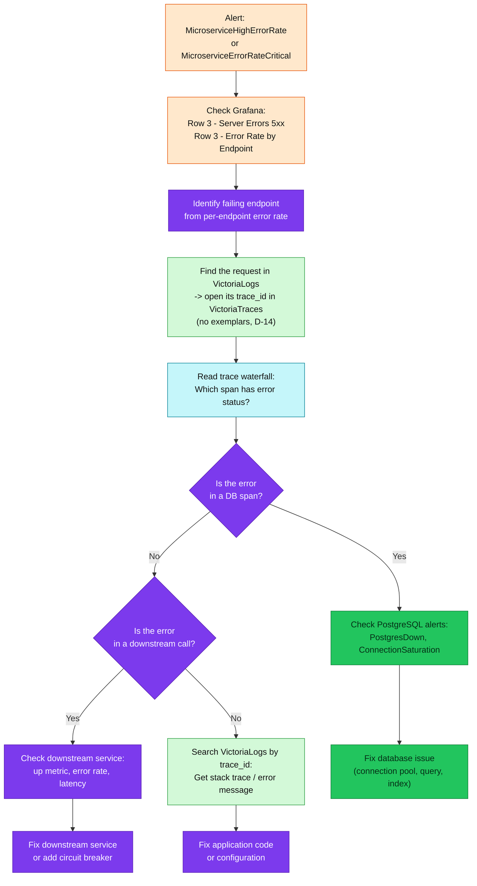
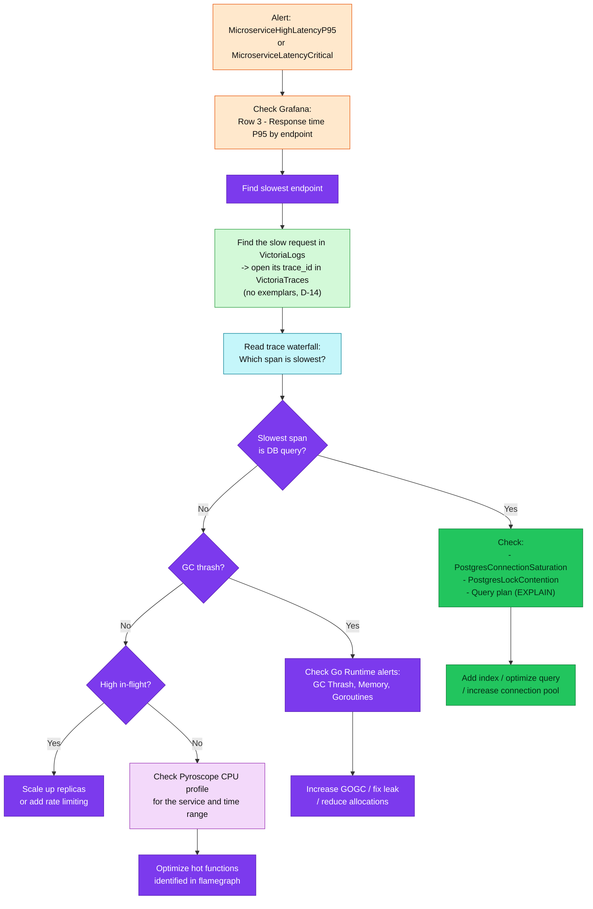
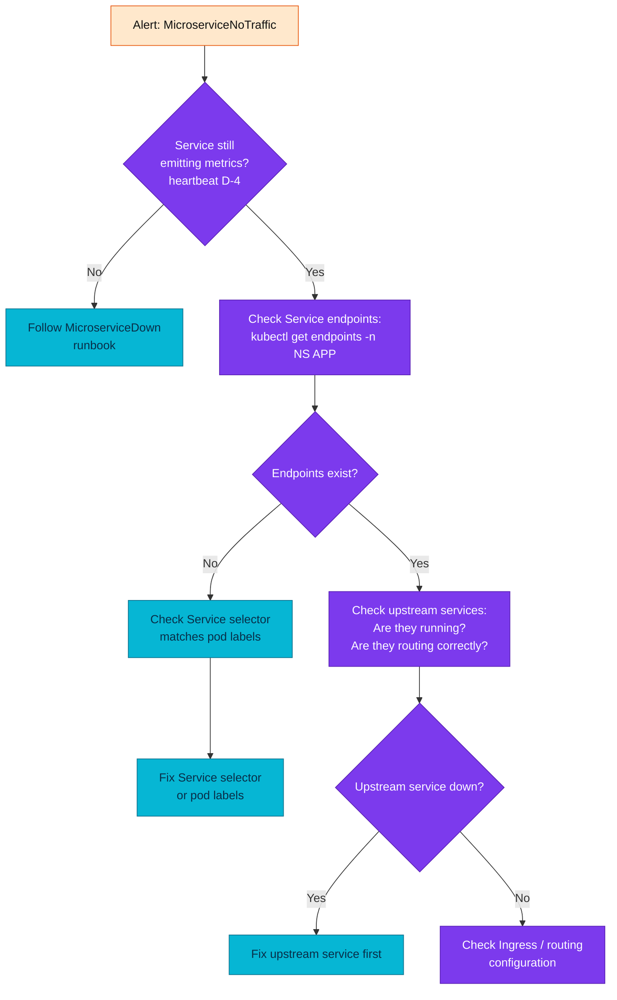
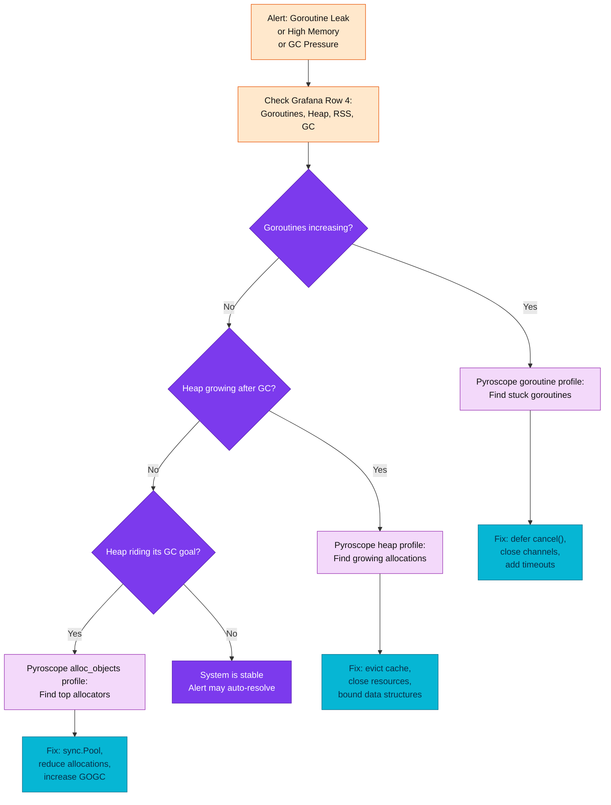

# Microservices Application Alert Runbooks

Per-alert investigation guides for OTLP-based RED/Golden Signal alerts on the
10 cluster-deployed Go microservices. One file per alert name.

| Quick facts | |
|---|---|
| Alert rules | [`prometheusrules/microservices/alerts.yaml`](../../../../kubernetes/infra/configs/observability/metrics/prometheusrules/microservices/alerts.yaml) |
| Recording rules | [`prometheusrules/microservices/recording-rules.yaml`](../../../../kubernetes/infra/configs/observability/metrics/prometheusrules/microservices/recording-rules.yaml) |
| Metrics reference | [`metrics-apps.md`](../../metrics/metrics-apps.md) |
| Alert catalog | [§1 Microservices](../../alerting/alert-catalog.md#1-microservices-red-metrics) |
| Recording rules | [`prometheusrules/microservices/recording-rules.yaml`](../../../../kubernetes/infra/configs/observability/metrics/prometheusrules/microservices/recording-rules.yaml) |
| Alerting strategy | [2-layer architecture](../../alerting/README.md) (threshold + SLO burn-rate) |

## Index

| Alert | Sev | Category | Runbook |
|-------|-----|----------|---------|
| MicroserviceDown | critical | availability | [MicroserviceDown.md](MicroserviceDown.md) |
| KubeStateMetricsAbsent | critical | observability | [KubeStateMetricsAbsent.md](KubeStateMetricsAbsent.md) |
| MicroserviceAllInstancesDown | critical | availability | [MicroserviceAllInstancesDown.md](MicroserviceAllInstancesDown.md) |
| OtelMetricsPipelineExportFailures | critical | availability | [OtelMetricsPipelineExportFailures.md](OtelMetricsPipelineExportFailures.md) |
| MicroserviceHighErrorRate | warning | errors | [MicroserviceHighErrorRate.md](MicroserviceHighErrorRate.md) |
| MicroserviceErrorRateCritical | critical | errors | [MicroserviceErrorRateCritical.md](MicroserviceErrorRateCritical.md) |
| MicroserviceNoSuccessfulRequests | critical | errors | [MicroserviceNoSuccessfulRequests.md](MicroserviceNoSuccessfulRequests.md) |
| GrpcServerHighErrorRate | warning | errors | [GrpcServerHighErrorRate.md](GrpcServerHighErrorRate.md) |
| MicroserviceHighLatencyP95 | warning | latency | [MicroserviceHighLatencyP95.md](MicroserviceHighLatencyP95.md) |
| MicroserviceHighLatencyP99 | warning | latency | [MicroserviceHighLatencyP99.md](MicroserviceHighLatencyP99.md) |
| MicroserviceLatencyCritical | warning | latency | [MicroserviceLatencyCritical.md](MicroserviceLatencyCritical.md) |
| GrpcServerHighLatencyP95 | warning | latency | [GrpcServerHighLatencyP95.md](GrpcServerHighLatencyP95.md) |
| MicroserviceNoTraffic | warning | traffic | [MicroserviceNoTraffic.md](MicroserviceNoTraffic.md) |
| MicroserviceApdexCritical | critical | traffic | [MicroserviceApdexCritical.md](MicroserviceApdexCritical.md) |
| MicroserviceGoroutineLeak | warning | runtime | [MicroserviceGoroutineLeak.md](MicroserviceGoroutineLeak.md) |
| MicroserviceHighMemoryUsage | warning | runtime | [MicroserviceHighMemoryUsage.md](MicroserviceHighMemoryUsage.md) |
| DBClientQueryP95High | warning | database | [DBClientQueryP95High.md](DBClientQueryP95High.md) |
| DBClientErrorRate | warning | database | [DBClientErrorRate.md](DBClientErrorRate.md) |
| PgxPoolNearExhaustion | warning | database | [PgxPoolNearExhaustion.md](PgxPoolNearExhaustion.md) |
| PgxPoolAcquireWaitHigh | warning | database | [PgxPoolAcquireWaitHigh.md](PgxPoolAcquireWaitHigh.md) |

### RFC-0021 stock migration (write path)

Rules: [`prometheusrules/microservices/rfc0021-write-migration.yaml`](../../../../kubernetes/infra/configs/observability/metrics/prometheusrules/microservices/rfc0021-write-migration.yaml) ·
catalog: [§9 RFC-0021 overhaul](../../alerting/alert-catalog.md#9-rfc-0021-overhaul-stock-migration)

These cover a failure class the RED alerts above cannot see: an order and its stock
can disagree while every service reports perfectly healthy.

| Alert | Sev | Category | Runbook |
|-------|-----|----------|---------|
| OrderReconcilerInvariantBreach | critical | correctness | [OrderReconcilerInvariantBreach.md](OrderReconcilerInvariantBreach.md) |
| FulfillmentStartOutboxStalled | critical | availability | [FulfillmentStartOutboxStalled.md](FulfillmentStartOutboxStalled.md) |
| FulfillmentStartOutboxFailed | critical | correctness | [FulfillmentStartOutboxFailed.md](FulfillmentStartOutboxFailed.md) |
| CheckoutAvailabilityErrors | critical | availability | [CheckoutAvailabilityErrors.md](CheckoutAvailabilityErrors.md) |
| CheckoutAvailabilityRefusingEverything | warning | correctness | [CheckoutAvailabilityRefusingEverything.md](CheckoutAvailabilityRefusingEverything.md) |
| CheckoutAvailabilityUnknownSKU | critical | correctness (operator data gap — ADR-053) | [CheckoutAvailabilityUnknownSKU.md](CheckoutAvailabilityUnknownSKU.md) |
| OrderSagaCompensationFailing | critical | correctness | [OrderSagaCompensationFailing.md](OrderSagaCompensationFailing.md) |
| OrderSagaNotCompleting | critical | availability | [OrderSagaNotCompleting.md](OrderSagaNotCompleting.md) |
| OrderReconcilerBacklogNotDraining | warning | database | [OrderReconcilerBacklogNotDraining.md](OrderReconcilerBacklogNotDraining.md) |
| OrderReconcilerBacklogUnreadable | warning | observability | [OrderReconcilerBacklogUnreadable.md](OrderReconcilerBacklogUnreadable.md) |
| OrderReconcilerDependencyUnreadable | warning | availability | [OrderReconcilerDependencyUnreadable.md](OrderReconcilerDependencyUnreadable.md) |
| OrderReconcilerPassTruncated | warning | correctness | [OrderReconcilerPassTruncated.md](OrderReconcilerPassTruncated.md) |
| OrderParticipantDisagreement | warning | correctness | [OrderParticipantDisagreement.md](OrderParticipantDisagreement.md) |
| OrderStartParticipantUnrecognised | warning | correctness | [OrderStartParticipantUnrecognised.md](OrderStartParticipantUnrecognised.md) |
| OrderInventoryCommitLagHigh | warning | latency | [OrderInventoryCommitLagHigh.md](OrderInventoryCommitLagHigh.md) |

### Inventory stock authority

Rules: [`prometheusrules/microservices/inventory.yaml`](../../../../kubernetes/infra/configs/observability/metrics/prometheusrules/microservices/inventory.yaml)

Inventory is the stock authority on the money path — these watch its
reservation outcomes and gRPC surface directly.

| Alert | Sev | Category | Runbook |
|-------|-----|----------|---------|
| InventoryReserveUnknownSKU | critical | errors | [InventoryReserveUnknownSKU.md](InventoryReserveUnknownSKU.md) |
| InventoryReservationInfraErrors | warning | errors | [InventoryReservationInfraErrors.md](InventoryReservationInfraErrors.md) |
| InventoryGrpcErrorRatio | warning | errors | [InventoryGrpcErrorRatio.md](InventoryGrpcErrorRatio.md) |

### RFC-0021 phase 5 (order aggregate)

Rules: [`prometheusrules/microservices/rfc0021-phase5.yaml`](../../../../kubernetes/infra/configs/observability/metrics/prometheusrules/microservices/rfc0021-phase5.yaml) ·
catalog: [§9 RFC-0021 overhaul](../../alerting/alert-catalog.md#9-rfc-0021-overhaul-stock-migration)

Two order states mean **somebody is owed work**, and neither is visible to a RED
alert: the order is not erroring, it is waiting.

| Alert | Sev | Category | Runbook |
|-------|-----|----------|---------|
| OrderStuckCancelling | critical | correctness | [OrderStuckCancelling.md](OrderStuckCancelling.md) |
| OrderManualReviewBacklog | warning | correctness | [OrderManualReviewBacklog.md](OrderManualReviewBacklog.md) |
| OrderCancellationOutboxStalled | warning | availability | [OrderCancellationOutboxStalled.md](OrderCancellationOutboxStalled.md) |
| OrderProjectionWritesFailing | warning | observability | [OrderProjectionWritesFailing.md](OrderProjectionWritesFailing.md) |

`OrderCancellationOutboxFailed` and `OrderCompleteFailures` have no runbook file
yet — both are covered by the alert's own annotations and by the sibling
stalled/projection runbooks. Noted here rather than linked, so the index stays
true.

### RFC-0021 phase 6 (payment doubt)

Rules: [`prometheusrules/microservices/rfc0021-phase6.yaml`](../../../../kubernetes/infra/configs/observability/metrics/prometheusrules/microservices/rfc0021-phase6.yaml) ·
catalog: [§9b RFC-0021 phase 6](../../alerting/alert-catalog.md#9b-rfc-0021-phase-6-payment-doubt)

Payment can now record that it does **not know** what the provider did. These
alerts are what make that state safe rather than a place payments disappear
into: they watch how much doubt exists, how old the oldest is, and whether the
automatic resolution paths are working.

| Alert | Sev | Category | Runbook |
|-------|-----|----------|---------|
| PaymentDoubtStale | critical | correctness | [PaymentDoubtStale.md](PaymentDoubtStale.md) |
| PaymentAttemptEvidenceLost | critical | correctness | [PaymentAttemptEvidenceLost.md](PaymentAttemptEvidenceLost.md) |
| PaymentReconciliationDiscrepancy | critical | correctness | [PaymentReconciliationDiscrepancy.md](PaymentReconciliationDiscrepancy.md) |
| PaymentReconciliationStale | critical | observability | [PaymentReconciliationStale.md](PaymentReconciliationStale.md) |
| PaymentReconciliationWindowViolation | warning | errors | [PaymentReconciliationWindowViolation.md](PaymentReconciliationWindowViolation.md) |
| PaymentDoubtBacklogGrowing | warning | correctness | [PaymentDoubtBacklogGrowing.md](PaymentDoubtBacklogGrowing.md) |
| PaymentDoubtSweepFailing | warning | availability | [PaymentDoubtSweepFailing.md](PaymentDoubtSweepFailing.md) |
| PaymentProviderUnknownRate | warning | availability | [PaymentProviderUnknownRate.md](PaymentProviderUnknownRate.md) |

## Investigation workflows

Cross-signal triage for when a single per-alert file is not enough — which
signal to pivot to next, and where the fix usually lands.

### "Service is returning 5xx"



### "Service is slow"



### "Service has no traffic"



### "Go runtime issue"



## Threshold tuning

Alert thresholds are intentionally conservative — looser than the dashboard
thresholds so the pager stays quiet under brief spikes. Tune per service when
its normal range is known.

| Alert | Alert Threshold | Dashboard Yellow | Dashboard Red | Notes |
|-------|----------------|-----------------|---------------|-------|
| Error Rate | warning: 5%, critical: 15% | 1% | 5% | Alert is looser than dashboard red to reduce noise |
| P95 Latency | warning: 1s, critical: 2s | 0.3s | 0.5s | Alert uses higher thresholds for fewer false positives |
| P99 Latency | warning: 2s | 0.5s | 1s | Tail latency is naturally more variable |
| Apdex | warning: 0.5 | 0.5 | -- | Aligned with dashboard red threshold |
| Memory RSS | warning: 512Mi | -- | -- | Tune based on container resource limits |
| Goroutines | warning: 1000 + increasing | -- | -- | Tune based on service's normal range |

**Per-service override** — a service that needs different thresholds gets its
own PrometheusRule with a label-scoped expression:

```yaml
- alert: ProductServiceHighLatencyP95
  expr: |
    histogram_quantile(0.95,
      sum by (le) (rate(http_server_request_duration_seconds_bucket{app="product"}[5m]))
    ) > 0.5
  for: 10m
  labels:
    severity: warning
```

**Finding the right threshold** — measure the normal range first:

```promql
# Historical P95 range for a service
histogram_quantile(0.95,
  sum by (le) (rate(http_server_request_duration_seconds_bucket{app="$APP"}[5m]))
)

# Historical error rate range
app:http_server_request_duration_seconds:error_ratio5m{app="$APP"}

# Normal goroutine count range
go_goroutine_count{app="$APP"}
```

Set thresholds at **2-3x the normal peak** for warning and **5x** for critical.

## Retired alerts (reference only)

Retired under RFC-0014: the in-flight saturation pair
(`MicroserviceHighRequestsInFlight` warning >50 / `MicroserviceRequestsInFlightCritical`
critical >100) rated `requests_in_flight`, which is no longer emitted — otelgin
exposes no `http_server_active_requests` equivalent, so the alerts and the
`app:requests_in_flight:sum` recording rule were removed; latency + traffic
rate are the stated saturation proxy. Also retired: `MicroserviceGCThrash`
(same RFC) and `MicroserviceHighRestartRate` (use `KubePodCrashLooping`).

## Template

New runbooks follow the canonical [`../_TEMPLATE.md`](../_TEMPLATE.md) — one
template for every runbooks folder; the rows and dialect below are this
domain's additions.

## Domain specifics

- **Extra quick-facts rows:** `Applies to` (which of the 11 services the alert
  can select) when the expr is label-scoped rather than fleet-wide.
- **Diagnosis dialect:** start from the alert's `app` label — `$APP` in every
  query; pivot metric → trace by taking a `trace_id` from a log line into VictoriaTraces (there are no exemplars), and
  metric → log via `{app="$APP"} | trace_id` in VictoriaLogs.
- **Dashboards:** Microservices folder (RED per service) plus the Checkout
  funnel board for order-path alerts.

---
_Last updated: 2026-08-19 — absorbed the investigation workflows, threshold tuning, and retired-alert context from the dissolved microservices-alerts.md hub_
