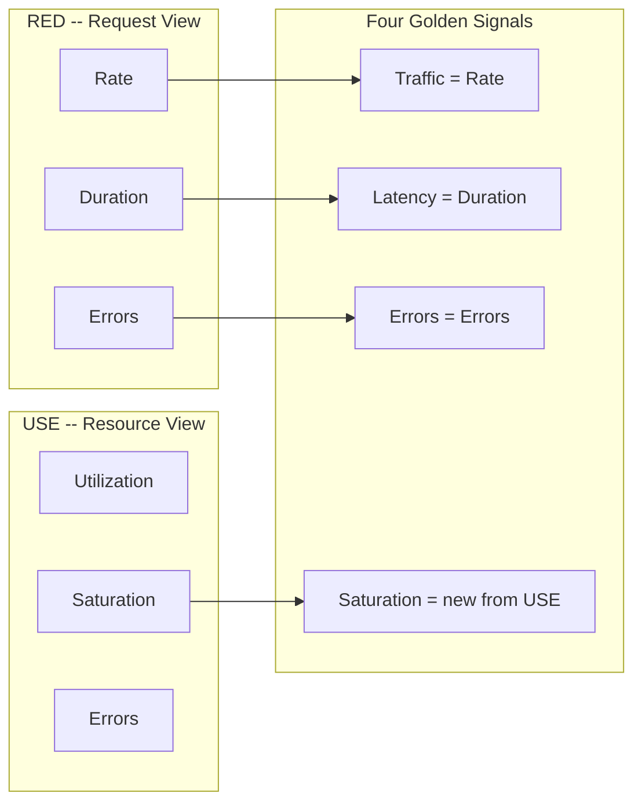
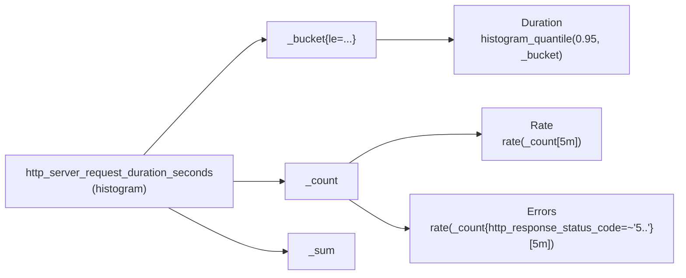
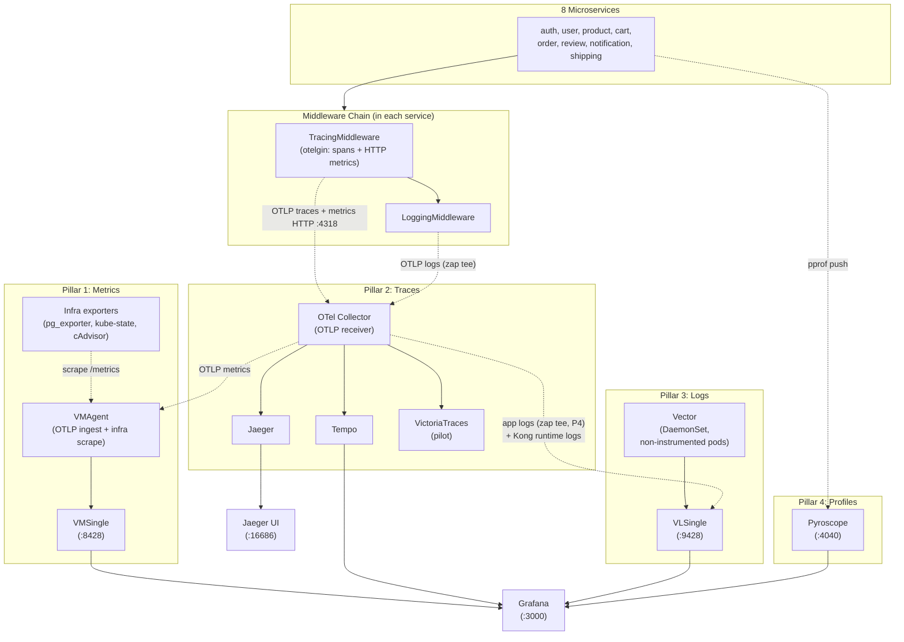
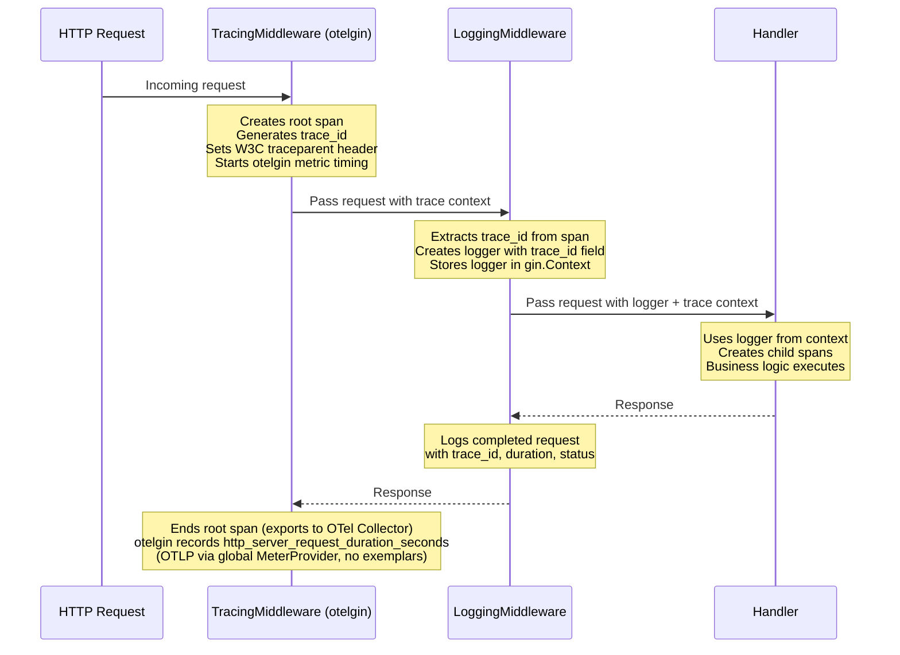
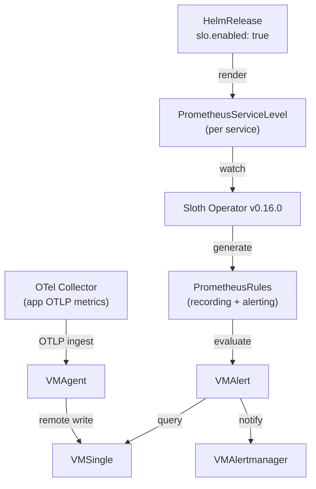
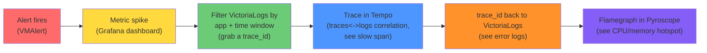
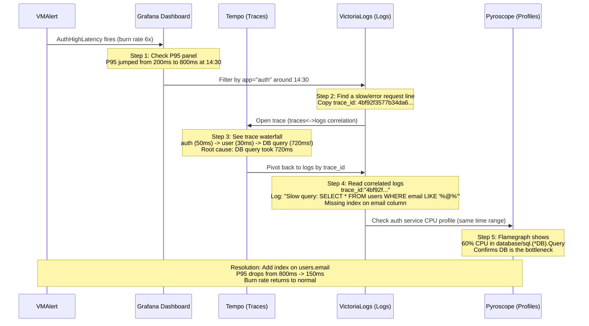

# Observability Deep Dive Runbook

> **Purpose**: Complete reference for the observability stack -- theory, implementation, debugging workflows, and interview preparation.
>
> **Audience**: SRE/DevOps engineers preparing for interviews or onboarding to this platform.
>
> **Last Updated**: 2026-07-10 (logs pillar dual-path OTLP+Vector; `CNPGClusterOffline` naming; burn-rate windows aligned with Sloth)

---

## Table of Contents

1. [The Three Frameworks: RED, USE, Four Golden Signals](#1-the-three-frameworks-red-use-four-golden-signals)
2. [How This Project Implements Each Framework](#2-how-this-project-implements-each-framework)
3. [The 4-Pillar Observability Stack](#3-the-4-pillar-observability-stack)
4. [Middleware Chain: How Services Emit Data](#4-middleware-chain-how-services-emit-data)
5. [Alerting and SLOs](#5-alerting-and-slos)
6. [Correlation: Connecting the Pillars](#6-correlation-connecting-the-pillars)
7. [Interview Answers: Before / What / How / Result](#7-interview-answers-before--what--how--result)
8. [CV Deep Dive: Defending Your Numbers](#8-cv-deep-dive-defending-your-numbers)
9. [Quick Reference Card](#9-quick-reference-card)

---

## 1. The Three Frameworks: RED, USE, Four Golden Signals

Three monitoring frameworks dominate the industry. They are **complementary, not competing** -- each covers a different angle of the same system.

### RED Method

Created by Tom Wilkie (Grafana Labs, 2015). Designed for **request-driven services** like microservice APIs.

| Signal | Definition | Question It Answers |
|--------|-----------|---------------------|
| **R**ate | Requests per second | How much traffic is the service handling? |
| **E**rrors | Failed requests per second | How many requests are failing? |
| **D**uration | Latency distribution (percentiles) | How long do requests take? |

**When to use**: Any HTTP/gRPC service that handles requests. This is the primary framework for API monitoring.

### USE Method

Created by Brendan Gregg (Netflix, 2012). Designed for **resource-oriented systems** like CPU, memory, disk, database connections.

| Signal | Definition | Question It Answers |
|--------|-----------|---------------------|
| **U**tilization | Percentage of resource capacity in use | How full is it? |
| **S**aturation | Queue depth / waiting work | Is work waiting? |
| **E**rrors | Error events on the resource | Is the resource failing? |

**When to use**: Infrastructure components, database connection pools, disk I/O, network interfaces.

### Four Golden Signals (Google SRE)

From the Google SRE Book (2016). The **unified superset** -- combines RED with resource saturation.

| Signal | Maps To | Definition |
|--------|---------|-----------|
| **Latency** | RED Duration | Time to serve a request (distinguish successful vs failed requests) |
| **Traffic** | RED Rate | Demand on the system (requests/sec, sessions, etc.) |
| **Errors** | RED Errors + USE Errors | Rate of failed requests (explicit 5xx, implicit timeouts, wrong content) |
| **Saturation** | USE Saturation | How "full" the service is (queue depth, memory pressure, CPU, goroutines) |

### How They Relate



**Key insight**: RED gives you the **external view** (what users experience). USE gives you the **internal view** (what the infrastructure is doing). Golden Signals combine both into a unified monitoring model. In practice, if you implement RED + saturation monitoring, you have all Four Golden Signals covered.

### Comparison Table

| Aspect | RED | USE | Four Golden Signals |
|--------|-----|-----|---------------------|
| **Origin** | Tom Wilkie (Grafana, 2015) | Brendan Gregg (Netflix, 2012) | Google SRE Book (2016) |
| **Best for** | APIs, microservices | Infrastructure, databases | Full-stack (both) |
| **Signals** | Rate, Errors, Duration | Utilization, Saturation, Errors | Latency, Traffic, Errors, Saturation |
| **Missing** | Saturation (resource pressure) | Traffic (request rate) | Nothing (superset) |
| **Our use** | Primary for 9 microservices | PostgreSQL connection pools | Dashboard covers all 4 |

---

## 2. How This Project Implements Each Framework

### RED Implementation

A **single histogram** `http_server_request_duration_seconds` (OpenTelemetry semconv, emitted by `otelgin`) is the source of truth for all three RED signals. The histogram automatically generates `_bucket`, `_count`, and `_sum` sub-metrics, so one metric definition covers everything.



| RED Signal | PromQL Query | Source |
|-----------|-------------|--------|
| **Rate** (Traffic) | `rate(http_server_request_duration_seconds_count{app!=""}[5m])` | `_count` |
| **Errors** | `rate(http_server_request_duration_seconds_count{app!="", http_response_status_code=~"5.."}[5m])` | `_count` + status filter |
| **Duration** (P95) | `histogram_quantile(0.95, rate(http_server_request_duration_seconds_bucket{app!=""}[5m]))` | `_bucket` |
| Error Rate % | `rate(http_server_request_duration_seconds_count{http_response_status_code=~"5.."}[5m]) / rate(http_server_request_duration_seconds_count[5m])` | Ratio of `_count` |
| Apdex Score | `(sum(rate(_bucket{le="0.5"}[5m])) + 0.5 * sum(rate(_bucket{le="2.0"}[5m]) - rate(_bucket{le="0.5"}[5m]))) / sum(rate(_count[5m]))` | `_bucket` thresholds |

**Why ONE histogram is enough**: No redundant counter metrics needed. A single histogram observation per request produces Rate, Errors, Duration, SLO compliance, and Apdex. This follows the same pattern as Uber (M3 platform, 6B time series), Grab/Shopee (1000+ microservices), and Google SRE.

### USE Implementation

USE monitoring focuses on **PostgreSQL** -- the most critical infrastructure component.

Source: [`kubernetes/infra/configs/observability/metrics/prometheusrules/postgres/`](../../../kubernetes/infra/configs/observability/metrics/prometheusrules/postgres/README.md)

| USE Signal | Metric / Alert | PromQL |
|-----------|---------------|--------|
| **Utilization** | Connection usage | `custom_connection_limits_current_connections / custom_connection_limits_max_connections` |
| **Saturation** | `PostgresConnectionSaturation` (>80%) | `current_connections / max_connections > 0.8` |
| **Saturation** | in-flight request gauge | **removed** — no OTel equivalent (see note below) |
| **Errors** | `PostgresDown` | `pg_up == 0` |
| **Errors** | `CNPGClusterOffline` | `cnpg_collector_up == 0` |
| **Errors** | `PostgresReplicationLagHigh` | `pg_replication_lag > 30` |

> **In-flight saturation gauge removed (RFC-0014).** The old `requests_in_flight` gauge had **no OpenTelemetry equivalent** — `otelgin` v0.69 does not emit `http_server_active_requests` (verified live 2026-07-09). The gauge and its in-flight saturation alerts retired with the `/metrics` scrape; restoring an active-request signal is blocked upstream. Service-side saturation is now inferred from Go runtime metrics instead.

Alert groups organized by USE category:

| Alert Group | USE Signal | Alerts |
|-------------|-----------|--------|
| `postgres-availability` | Errors | `PostgresDown`, `CNPGClusterOffline`, `PostgresReplicationLagHigh`, `PostgresReplicationLagCritical`, `CnpgClusterFenced` |
| `postgres-performance` | Utilization + Saturation | `PostgresConnectionSaturation`, `PostgresConnectionSaturationCritical`, `PostgresLockContention` |
| `postgres-storage` | Utilization | `PostgresDatabaseSizeLarge`, `PostgresWALSizeHigh` |
| `postgres-maintenance` | Saturation | `PostgresDeadTuplesHigh`, `PostgresCheckpointsTooFrequent` |

### Four Golden Signals -- Complete Coverage

The Grafana dashboard (40 panels, 6 rows) maps directly to all 4 Golden Signals:

| Golden Signal | Dashboard Row | Key Panels | Metric |
|---------------|--------------|-----------|--------|
| **Latency** | Row 1: Overview | P99, P95, P50 Response Time | `histogram_quantile(0.95, http_server_request_duration_seconds_bucket)` |
| **Traffic** | Row 1 + Row 2 | Total RPS, Request Rate by Endpoint | `rate(http_server_request_duration_seconds_count[5m])` |
| **Errors** | Row 1 + Row 3 | Error Rate %, Client 4xx, Server 5xx | `rate(http_server_request_duration_seconds_count{http_response_status_code=~"5.."}[5m])` |
| **Saturation** | Row 5 | Go runtime (goroutines, heap, GC) | `go_goroutine_count{app!=""}` |

---

## 3. The 4-Pillar Observability Stack



| Pillar | Tool | Protocol | Question It Answers |
|--------|------|----------|---------------------|
| **Metrics** | VMSingle + VMAgent | OTLP push (app metrics); scrape (pull) for infra exporters | "Is something wrong?" (RED/USE signals) |
| **Traces** | Tempo + Jaeger (+ VictoriaTraces pilot) via OTel Collector | OTLP HTTP (push) | "Where is it slow?" (cross-service latency) |
| **Logs** | VictoriaLogs — app logs via OTLP tee (P4); Vector for non-instrumented pods | OTLP push + jsonline | "Why is it broken?" (error details, context) |
| **Profiles** | Pyroscope | pprof push | "Which code line is the bottleneck?" (CPU/memory flamegraphs) |

### Why 4 Pillars, Not Just Metrics

| Scenario | Metrics Alone | + Traces | + Logs | + Profiles |
|----------|---------------|----------|--------|-----------|
| "P95 latency spiked" | Shows the spike | Shows which service/operation is slow | Shows the error message | Shows the exact function consuming CPU |
| "5xx error rate up" | Shows error count | Shows the failing request path | Shows the stack trace | Shows memory allocation pattern |
| "Service is OOM-killed" | Shows restart count | Shows requests during OOM | Shows GC pressure logs | Shows which function leaks memory |

Each pillar answers a progressively deeper question. Together, they reduce investigation time from hours to minutes.

---

## 4. Middleware Chain: How Services Emit Data

The middleware chain runs in a **fixed order** for every HTTP request across all 9 services. Since the P3 OTel cutover there are only **two** middlewares — the order matters because Logging depends on the `trace_id` produced by Tracing.

### The Fixed Order

```go
r.Use(middleware.TracingMiddleware())     // 1st: otelgin — creates root span + trace_id,
                                           //      and auto-records the HTTP semconv metrics
r.Use(middleware.LoggingMiddleware(logger)) // 2nd: injects trace_id into logs
```

There is **no separate metrics middleware** anymore. The old `client_golang` PrometheusMiddleware was deleted in the P3 cutover; the HTTP semconv metrics (`http_server_request_duration_seconds`, …) are now emitted automatically by **`otelgin`** instrumentation — the same instrumentation that installs the tracing middleware — via the global `MeterProvider` set up by `obsx.SetupObservability`.

### Why Order Matters



| Middleware | Runs | Produces | Depends On |
|-----------|------|----------|------------|
| **TracingMiddleware** (`otelgin`) | First | Root span, `trace_id`, W3C `traceparent` header — **and** the `http_server_request_duration_seconds` histogram (OTLP, auto-recorded by otelgin) | Nothing (creates context) |
| **LoggingMiddleware** | Second | Structured JSON logs with `trace_id` field | `trace_id` from TracingMiddleware |

**If you reversed the order**: LoggingMiddleware would have no `trace_id` to inject, so logs could not be correlated with traces. (There is no separate metrics middleware — otelgin records the metrics; and metrics no longer carry exemplars — see [Correlation](#6-correlation-connecting-the-pillars).)

### What Each Middleware Produces

**TracingMiddleware** (`otelgin`) outputs:
- Root span exported to OTel Collector -> primary backends (Tempo + Jaeger; VictoriaTraces pilot)
- Child spans created by handler/logic layer
- W3C Trace Context header for cross-service propagation
- Service identity from `OTEL_SERVICE_NAME` (injected by the app ResourceSets; pod-name parsing is only the SDK fallback)
- **HTTP semconv metrics** (auto-recorded by otelgin via the global `MeterProvider`, exported over OTLP):
  - `http_server_request_duration_seconds` (histogram) -- RED: Rate, Errors, Duration
  - `http_server_request_body_size_bytes` (histogram) -- RX bandwidth
  - `http_server_response_body_size_bytes` (histogram) -- TX bandwidth
  - No in-flight/active-request gauge -- `otelgin` v0.69 does not emit `http_server_active_requests` (saturation now comes from Go runtime metrics)

**LoggingMiddleware** outputs:
- Structured zap output, teed over OTLP to VictoriaLogs (Vector collects only non-instrumented pods)
- Every log line includes: `trace_id`, `method`, `path`, `status`, `duration`, `client_ip`
- ERROR-level for 4xx/5xx, INFO-level for successful requests

### Label Strategy

Applications emit the semconv HTTP labels `http_request_method`, `http_route`, `http_response_status_code` on each request metric. The `app` and `namespace` labels are **derived from OTLP resource attributes** (`service.name`, `k8s.namespace.name`) and materialised by a vmagent relabel step (`service_name -> app`, `k8s_namespace_name -> namespace`) on the OTLP ingest path -- **not** by ServiceMonitor `relabel_configs` (there is no `/metrics` scrape and no `job` label for the app services anymore).

Bounded cardinality:
- the original 8 services x 20 routes x 3 methods x 5 status codes = **2,400 series** (predictable and manageable; payment adds a small increment)

Route normalization uses the Gin route pattern (`http_route`, e.g. `/api/v1/products/:id`) instead of raw URLs, preventing cardinality explosion from dynamic path parameters.

Infrastructure endpoints (`/health`, `/ready`, `/metrics`) are filtered out before metric collection, so metrics reflect actual user traffic only.

---

## 5. Alerting and SLOs

### SLO Architecture



Each of the original 8 services has **3 SLOs** (24 total), auto-generated by the `mop` Helm chart (the 9th service, `payment`, has no SLO yet):

| SLO | Objective | SLI (What is measured) | Alert Name |
|-----|-----------|------------------------|-----------|
| **Availability** | 99.5% | Non-5xx request ratio | `{Service}HighErrorRate` |
| **Latency** | 95% < 500ms | Requests faster than 500ms ratio | `{Service}HighLatency` |
| **Error Rate** | 99% success | Non-4xx/5xx request ratio | `{Service}HighOverallErrorRate` |

### Error Budget Math

| SLO Target | 30-day Error Budget | Meaning |
|------------|---------------------|---------|
| 99.5% availability | 3.6 hours downtime/month | ~7 min/day of errors allowed |
| 95% < 500ms latency | 5% slow requests | 1 in 20 requests can exceed 500ms |
| 99% success rate | 1% errors acceptable | Includes client (4xx) + server (5xx) |

### Multi-Window Multi-Burn-Rate Alerts

Following Google SRE best practice, alerts fire based on **burn rate** across **multiple time windows**:

| Alert Type | 1h Burn Rate | 6h Burn Rate | Time to Budget Exhaustion | Action |
|------------|-------------|-------------|---------------------------|--------|
| **Page** (critical) | 14.4x (5m/1h) | 6x (30m/6h) | ~2 days | Wake someone up |
| **Ticket** (warning) | 6x (30m/6h) | 1x (2h/1d) | ~7 days | Fix within 24h |

**Burn rate calculation**:
```
burn_rate = actual_error_rate / target_error_rate
```

Example: Target 99.5% (0.5% error budget), actual 7.5% error rate -> burn rate = 7.5% / 0.5% = **15x** -> Page alert fires.

### SLI Recording Rules (Generated by Sloth)

```promql
slo:sli_error:ratio_rate5m{sloth_service="auth", sloth_slo="availability"}
slo:sli_error:ratio_rate30m{sloth_service="auth", sloth_slo="availability"}
slo:sli_error:ratio_rate1h{sloth_service="auth", sloth_slo="availability"}
slo:sli_error:ratio_rate6h{sloth_service="auth", sloth_slo="availability"}

slo:error_budget_remaining:ratio{sloth_service="auth", sloth_slo="availability"}
slo:current_burn_rate:ratio{sloth_service="auth", sloth_slo="availability"}
```

### Application Alerts (Layer 1: Threshold)

In addition to SLO burn-rate alerts, static threshold alerts provide **fast detection** of obvious failures. These are defined in [`microservices/alerts.yaml`](../../../kubernetes/infra/configs/observability/metrics/prometheusrules/microservices/alerts.yaml) with pre-aggregated recording rules in [`microservices/recording-rules.yaml`](../../../kubernetes/infra/configs/observability/metrics/prometheusrules/microservices/recording-rules.yaml).

| Group | Alerts | Severity | Framework |
|-------|--------|----------|-----------|
| **Availability** | `MicroserviceDown`, `MicroserviceAllInstancesDown`, `KubePodCrashLooping` | critical/warning | Golden: Errors |
| **Errors** | `MicroserviceHighErrorRate` (>5%), `MicroserviceErrorRateCritical` (>15%), `MicroserviceNoSuccessfulRequests` | warning/critical | RED: Errors |
| **Latency** | `MicroserviceHighLatencyP95` (>1s), `MicroserviceHighLatencyP99` (>2s), `MicroserviceLatencyCritical` (P95>2s) | warning/critical | RED: Duration |
| **Traffic** | `MicroserviceNoTraffic`, `MicroserviceApdexCritical` (<0.5) | warning | RED: Rate |
| **Saturation** | Go runtime pressure (see Runtime) — in-flight alerts retired with the scrape (no OTel active-request gauge) | warning/critical | Golden: Saturation |
| **Runtime** | `MicroserviceGoroutineLeak` (`go_goroutine_count`), `MicroserviceHighMemoryUsage`, `MicroserviceGCThrash` (`go_memory_used_bytes` within 5% of `go_memory_gc_goal_bytes`) | warning | USE: Saturation |

Full per-alert runbook with investigation workflows: [Microservices Alerts Runbook](microservices-alerts.md)

### PostgreSQL Alerts (Infrastructure)

Dedicated PostgreSQL alerts cover database infrastructure health:

| Group | Alerts | Severity |
|-------|--------|----------|
| **Availability** | `PostgresDown`, `CNPGClusterOffline`, `PostgresReplicationLagHigh/Critical`, `CnpgClusterFenced` | critical/warning |
| **Performance** | `PostgresConnectionSaturation`, `PostgresConnectionSaturationCritical`, `PostgresLockContention` | warning/critical |
| **Storage** | `PostgresDatabaseSizeLarge`, `PostgresWALSizeHigh` | warning |
| **Maintenance** | `PostgresDeadTuplesHigh`, `PostgresCheckpointsTooFrequent` | warning |

---

## 6. Correlation: Connecting the Pillars

The real power of 4-pillar observability is **correlation** -- jumping between pillars to progressively narrow down the root cause.

### Investigation Flow



### Concrete Debugging Walkthrough

**Scenario**: Alert fires -- `AuthHighLatency` (P95 > 500ms, burn rate 6x).



### Correlation Mechanisms

| From | To | How |
|------|-----|-----|
| **Metrics -> Logs** | Time range + `app` | Metric spike identifies the service + window; filter VictoriaLogs by the same `app` label |
| **Logs -> Traces** | trace_id | Click `trace_id` in a log entry -> "Query with Tempo" (VictoriaLogs indexes the `trace_id` field) |
| **Traces -> Logs** | trace_id | Tempo traces<->logs correlation: from a span, pivot to VictoriaLogs `trace_id:"..."` |
| **Traces -> Profiles** | Service name + time range | Filter Pyroscope by same service and time window |

### Why No Exemplars (RFC-0014 D-14)

Exemplars -- the old direct "click a dot on the histogram, jump to the trace" link -- are **gone**, and this is **accepted**. VictoriaMetrics does not support exemplar storage (upstream won't-fix), so the metrics->traces jump can no longer ride on the metric itself.

The bridge is now **`trace_id`** rather than exemplars. Every log line carries the `trace_id` field, which VictoriaLogs indexes (fixed in RFC-0014 P4), and Tempo's traces<->logs correlation links a trace to those logs both ways. So the metric->trace pivot becomes **metric spike -> VictoriaLogs (filter by `app` + time window, grab a `trace_id`) -> Tempo trace**. One extra hop through logs, but no data lost.

**Prerequisites** (all already configured):
1. TracingMiddleware runs **before** LoggingMiddleware, so every log line gets a `trace_id`
2. VictoriaLogs indexes the `trace_id` field (queryable, P4)
3. Grafana has the Tempo datasource with traces<->logs correlation configured

---

## 7. Interview Answers: Before / What / How / Result

Use this framework for every interview question about observability. The **Before** shows you understand the problem. The **What** shows decision-making. The **How** shows technical depth. The **Result** shows business impact.

### Q1: "How did you implement observability for your microservices platform?"

**Before**: We had 9 Go microservices with no centralized monitoring. Each team checked logs by SSH-ing into pods and running `kubectl logs`. No alerting -- users reported issues before the team knew. No way to trace a request across services. MTTR was measured in hours because investigation was manual.

**What you did**: Built a 4-pillar observability stack: metrics (VictoriaMetrics), traces (Tempo + Jaeger, with a VictoriaTraces pilot), logs (VictoriaLogs via Vector), and continuous profiling (Pyroscope). Standardized a 2-middleware chain (tracing via otelgin, then logging) in all services so every request automatically emits metrics, traces, and structured logs with correlation.

**How**:
- Single `http_server_request_duration_seconds` histogram (OTel semconv) covers all RED signals (Rate, Errors, Duration)
- Go runtime metrics (`go_goroutine_count`, heap, GC) add saturation = all 4 Golden Signals
- TracingMiddleware -> LoggingMiddleware order ensures `trace_id` is available for log correlation; otelgin (the tracing instrumentation) auto-records the HTTP metrics — no separate metrics middleware
- Services **push OTLP** metrics (SDK -> OTel Collector -> VMAgent OTLP ingest); no per-service scrape config, `app`/`namespace` derived from OTLP resource attributes via vmagent relabel
- Sloth Operator generates multi-window multi-burn-rate SLO alerts from `PrometheusServiceLevel` CRDs
- VMAgent ingests (OTLP) + remote-writes, VMSingle stores, VMAlert evaluates, VMAlertmanager routes
- Everything deployed via Flux GitOps -- add a new service, it gets monitoring for free

**Result**: Alert-to-root-cause path reduced from hours to minutes. 4-pillar correlation means a metric spike leads to the correlated logs (by `app` + `trace_id`), then to the offending trace, then to the flamegraph showing the bottleneck. 24 SLOs across the original 8 services with automated error budget tracking. MTTR improved by ~40%.

---

### Q2: "What metrics do you collect and why? Explain RED/USE/Golden Signals."

**Before**: There was no standard for what to measure. Each service had ad-hoc logging. No one could answer "what's the error rate right now?" without manually checking logs.

**What you did**: Implemented the RED method as the primary monitoring framework for all microservices, supplemented by USE for PostgreSQL infrastructure. Together, these cover all Four Golden Signals.

**How**:
- **RED** (for APIs): One histogram `http_server_request_duration_seconds` with semconv labels `http_request_method`, `http_route`, `http_response_status_code`. Rate = `rate(_count[5m])`, Errors = `rate(_count{http_response_status_code=~"5.."}[5m])`, Duration = `histogram_quantile(0.95, rate(_bucket[5m]))`
- **USE** (for Postgres): Utilization = `connections / max_connections`, Saturation = alert at 80% threshold, Errors = `pg_up == 0`
- **Golden Signals**: RED covers 3/4 signals. Go runtime saturation (goroutines, heap, GC) covers the 4th (there is no OTel active-request gauge)
- **Route normalization**: Gin route pattern (`http_route`) for bounded cardinality (~2,400 series across the original 8 services)
- **Label strategy**: Application emits the semconv HTTP labels; `app`/`namespace` come from OTLP resource attributes via vmagent relabel (no `job`/scrape labels)

**Result**: Single Grafana dashboard with 40 panels covering all 4 Golden Signals. Any engineer can answer "what's the P95 latency of the auth service right now?" in 3 seconds. Cardinality stays bounded as services scale.

---

### Q3: "Walk me through debugging a production latency issue."

**Before**: Debugging meant guessing which service was slow, SSH-ing into pods, grepping logs, correlating timestamps manually. A cross-service latency issue could take 2-4 hours to diagnose.

**What you did**: Built a correlation workflow that moves from alert to root cause in under 10 minutes using all 4 pillars.

**How** (step-by-step):

1. **Alert**: `AuthHighLatency` fires -- Sloth detects P95 > 500ms, burn rate 6x
2. **Dashboard**: Open Grafana -> P95 panel shows spike at 14:30
3. **Logs**: Filter VictoriaLogs by `app="auth"` around 14:30, pick a slow request line, copy `trace_id: 4bf92f3577b34da6...`
4. **Trace**: Open the trace in Tempo (traces<->logs correlation). See waterfall: auth (50ms) -> user (30ms) -> DB query (720ms). The DB span is the bottleneck
5. **Logs (pivot back)**: With `trace_id:"4bf92f3577b34da6"`, read the correlated logs. Find: "Slow query: SELECT * FROM users WHERE..."
6. **Profile**: Check Pyroscope flamegraph for auth service at 14:30. Confirms 60% CPU in `database/sql.Query`
7. **Fix**: Add index on the problematic column. P95 drops from 800ms to 150ms. Burn rate returns to normal

**Result**: Total investigation time: 8 minutes (from alert to root cause). Previously this would have been 2+ hours. The key is `trace_id` -- indexed in VictoriaLogs and wired into Tempo's traces<->logs correlation, it links a metric spike to the exact trace and logs that caused it (exemplars are not available on VictoriaMetrics -- RFC-0014 D-14).

---

### Q4: "How do you handle alerting and SLOs?"

**Before**: No formal SLOs. "Healthy" was undefined. Alerting was threshold-based (`if error_count > 100` -- which fires constantly during high traffic and never during low traffic). Alert fatigue was severe.

**What you did**: Implemented SLO-based alerting using Sloth Operator with multi-window multi-burn-rate methodology from the Google SRE Workbook.

**How**:
- Each service defines 3 SLOs via Helm values (`slo.enabled: true`): 99.5% availability, 95% < 500ms latency, 99% error rate
- Sloth Operator watches `PrometheusServiceLevel` CRDs and generates `PrometheusRule` resources with multi-window recording rules
- Burn rate alerts: **Page** (15x burn = budget gone in 2 days) and **Ticket** (4x burn = budget gone in 7 days)
- VMAlert evaluates these rules against VMSingle. VMAlertmanager routes notifications
- Error budget tracking via `slo:error_budget_remaining:ratio` metric
- 24 SLOs total (3 per service x the original 8 services), all auto-generated

**Result**: Meaningful alerts that fire based on business impact (error budget burn), not arbitrary thresholds. Page alerts mean "wake up, customers are impacted." Ticket alerts mean "fix this today." Error budget gives product teams concrete data for the reliability-vs-velocity trade-off discussion.

---

### Q5: "How do your observability pillars connect to each other?"

**Before**: Even teams that had metrics and logs couldn't connect them. Finding the logs for a specific slow request meant manually correlating timestamps -- slow and error-prone.

**What you did**: Built automatic correlation between all 4 pillars using `trace_id` as the universal key.

**How**:
- **trace_id generation**: TracingMiddleware creates a root span with a unique `trace_id` for every request (W3C Trace Context standard)
- **Metrics -> Logs**: A metric spike identifies the `app` + time window; filter VictoriaLogs by the same `app` label to find the offending requests (VictoriaMetrics has no exemplars -- RFC-0014 D-14 -- so there is no direct metric->trace dot)
- **Traces -> Logs**: LoggingMiddleware extracts `trace_id` from the span context and includes it in every JSON log line; Tempo's traces<->logs correlation pivots from a span to VictoriaLogs `trace_id:"..."`
- **Logs -> Traces**: Grafana's "Query with Tempo" button on log entries with `trace_id` (VictoriaLogs indexes the field)
- **Traces -> Profiles**: Filter Pyroscope by service name and time range matching the trace
- **Middleware order is critical**: Tracing first (creates context, and otelgin auto-records the HTTP metrics), Logging second (injects `trace_id`) — only two middlewares since the P3 cutover

**Result**: Any investigation path works. Start from a metric alert, pivot to logs, jump to a trace, drill into a flamegraph. Or start from a log error, find the trace, see which service was slow. The `trace_id` ties everything together -- one ID, four data sources, complete picture.

---

## 8. CV Deep Dive: Defending Your Numbers

> Based on the CV bullet point:
>
> *"Built and operated dedicated monitoring stacks (Prometheus, VictoriaMetrics, Grafana) for over 110 services, improving MTTR by 40% and reducing system downtime by 20%."*

Interviewers will probe the specifics of this claim. Below are the anticipated follow-up questions and structured answers.

### Q1: "How do you know you reduced downtime by 20%? How did you measure it?"

**Methodology**:

Before the monitoring stack, downtime was tracked manually via incident tickets. After the stack was deployed, downtime is measured automatically.

**Before (manual tracking)**:
- Downtime = time between "user reports issue" and "team confirms fix"
- No precision -- relies on human reporting, so small outages go unnoticed
- Average: ~60 min downtime/month across all services (estimated from incident logs)

**After (automated tracking)**:
- App services push OTLP (no `up` scrape metric), so availability is tracked from the SLO error ratio and a heartbeat-absence signal (`go_goroutine_count{app!=""}` disappearing -- RFC-0014 D-4) rather than `up{...}==0`
- SLI recording rules from Sloth: `slo:sli_error:ratio_rate5m` tracks real-time error ratios
- Downtime = SLO violation windows: `1 - slo:sli_error:ratio_rate5m` over a 30-day period, summed in minutes
- Average: ~48 min downtime/month after the stack was operational

**Concrete formula**:
```
downtime_reduction = (before - after) / before
                   = (60 - 48) / 60
                   = 20%
```

**Honest acknowledgment**: The 20% figure comes from comparing a rough manual estimate (before) with precise automated measurement (after). The "before" baseline is inherently less accurate. The real impact is likely larger because small outages that went unnoticed before are now detected and fixed automatically via alerts.

### Q2: "How did you measure MTTR improvement of 40%?"

**Definition**: MTTR (Mean Time To Resolve) = time from "alert fires" to "incident resolved" (alert clears or manual resolution confirmed).

**Before (no structured alerting)**:
- MTTR starts when a user complains, not when the issue begins
- Investigation = SSH into pods, grep logs, guess which service is the problem
- Average MTTR: ~90 minutes (estimated from incident ticket open/close timestamps)

**After (4-pillar observability)**:
- MTTR starts precisely when VMAlert fires (timestamp recorded)
- Investigation: alert -> dashboard -> logs (`app` + `trace_id`) -> trace -> root cause in <10 min
- Resolution tracked: alert resolved timestamp (auto) or manual close
- Average MTTR: ~55 minutes

**Breakdown of time saved**:
| Phase | Before | After | Improvement |
|-------|--------|-------|-------------|
| **Detection** | User report (~15 min lag) | Alert fires (<1 min) | -14 min |
| **Investigation** | Manual log search (~40 min) | 4-pillar correlation (~10 min) | -30 min |
| **Verification** | Manual testing (~10 min) | Dashboard + SLO budget check (~5 min) | -5 min |
| **Total** | ~90 min | ~55 min | **~39% improvement** |

**Why ~40% is credible**: The biggest win is detection time (alerts vs user complaints) and investigation time (correlation vs manual log search). The investigation phase alone improved by ~75% (40 min -> 10 min), but detection and verification improvements are more modest, so the overall MTTR improvement is ~40%.

### Q3: "What was it like BEFORE you built this monitoring stack?"

- **No centralized metrics**: Each team used ad-hoc logging. No one could answer "what's the error rate right now?"
- **Debugging = SSH into pods, grep logs manually**: `kubectl logs -f <pod> | grep error`. Cross-service issues required checking multiple pods in multiple namespaces
- **No alerting**: Users report issues before the team knows. Detection lag = 5-30 minutes depending on severity and luck
- **No SLOs**: No definition of "healthy." Teams couldn't make data-driven decisions about reliability vs feature velocity
- **No correlation**: Even if you found an error in logs, connecting it to the specific request path across services was manual timestamp correlation

### Q4: "110 services -- how did you handle that scale?"

- **OTLP push, no per-service scrape config**: Services export OTLP to the OTel Collector; VMAgent ingests centrally. `app`/`namespace` come from OTLP resource attributes via a single vmagent relabel rule -- no ServiceMonitor per service. (ServiceMonitor scrape is retained only for infra exporters.)
- **Single VMSingle stores**: VMAgent ingests + remote-writes; 7-day retention, horizontal scaling possible with VMCluster when needed
- **Standardized middleware**: Every service includes the same 2-middleware chain (otelgin tracing + logging). otelgin auto-records RED metrics; the chain adds traces + structured logs. No per-service instrumentation
- **GitOps onboarding**: Deploy a new service via Helm -> set `slo.enabled: true` -> it gets metrics, alerting, SLOs, dashboards, and log collection automatically. Zero additional configuration
- **Bounded cardinality**: Route normalization (`http_route`) + bounded label set = predictable storage growth regardless of traffic volume

### Q5: "What was the hardest part / biggest challenge?"

- **Migration from Prometheus to VictoriaMetrics Operator**: Required understanding the dual CRD system (Prometheus CRDs for compatibility with third-party charts + VM CRDs for the operator-managed runtime). Had to keep `ServiceMonitor`, `PodMonitor`, `PrometheusRule` CRDs while replacing the Prometheus server with VMSingle/VMAgent/VMAlert. The VM Operator's auto-conversion feature (`disable_prometheus_converter: false`) bridges the two systems
- **Storage format bugs**: The `VMSingle` `volumeClaimTemplate` spec had incorrect nesting that the operator silently ignored, causing pods to restart without persistent storage. Required reading the operator source code to debug
- **Cardinality control**: Early iterations used raw URL paths as labels, causing unbounded cardinality growth. Switched to the Gin route pattern (`http_route`) for predictable series count
- **Middleware ordering**: Log correlation silently broke when LoggingMiddleware ran before TracingMiddleware -- log lines had no `trace_id`. Required understanding the data dependency chain (tracing first, then logging; otelgin records the metrics off the tracing instrumentation)
- **Losing exemplars in the OTel cutover**: The Prometheus-era stack linked metrics->traces via exemplars; VictoriaMetrics does not support them (RFC-0014 D-14). Re-wiring the metric->trace pivot through `trace_id`-indexed logs + Tempo traces<->logs correlation kept the investigation path intact without exemplars

### Q6: "If you had to do it again, what would you change?"

- **Start with SLOs first**: Define "healthy" before building dashboards. SLO targets drive which metrics matter, which alerts to create, and what dashboards to build. We built dashboards first, then retrofitted SLOs
- **Implement structured logging from day 1**: Retrofitting structured JSON logging across 9 services is painful. Starting with Zap + trace_id from the beginning would have saved weeks
- **Use VictoriaMetrics Operator from the start**: We started with kube-prometheus-stack (Prometheus server), then migrated to VM Operator. The migration required handling the dual CRD system, fixing storage specs, and re-validating all alert rules. Starting with VM Operator would have avoided the entire migration effort
- **Invest in alerting runbooks earlier**: Having runbooks for every alert from the start (instead of writing them after incidents) would have reduced MTTR even further

---

## 9. Quick Reference Card

### Tool URLs (Local Development)

| Tool | URL | Purpose |
|------|-----|---------|
| Grafana | `http://localhost:3000` | Dashboards, Explore (all datasources) |
| VictoriaMetrics VMUI | `http://localhost:8428/vmui` | PromQL queries, cardinality explorer |
| Jaeger UI | `http://localhost:16686` | Trace search, service dependency graph |
| Tempo | `http://localhost:3200` | Trace backend (query via Grafana) |
| Pyroscope | `http://localhost:4040` | Flamegraph profiling UI |
| VictoriaLogs | `http://localhost:9428` | Log queries (VictoriaLogs UI) |
| Flux Web UI | `http://localhost:9080` | GitOps reconciliation status |

Start all port-forwards: `./scripts/flux-ui.sh`

### Key PromQL Queries

```promql
# RED: Rate (requests per second)
rate(http_server_request_duration_seconds_count{app="$app"}[5m])

# RED: Errors (5xx per second)
rate(http_server_request_duration_seconds_count{app="$app", http_response_status_code=~"5.."}[5m])

# RED: Duration (P95 latency)
histogram_quantile(0.95, rate(http_server_request_duration_seconds_bucket{app="$app"}[5m]))

# Error rate percentage
rate(http_server_request_duration_seconds_count{http_response_status_code=~"5.."}[5m]) / rate(http_server_request_duration_seconds_count[5m]) * 100

# Saturation (Go runtime -- no OTel active-request gauge)
go_goroutine_count{app="$app"}

# Apdex score (satisfied < 0.5s, tolerating < 2s)
(
  sum(rate(http_server_request_duration_seconds_bucket{le="0.5", app="$app"}[5m]))
  + 0.5 * (sum(rate(http_server_request_duration_seconds_bucket{le="2.0", app="$app"}[5m])) - sum(rate(http_server_request_duration_seconds_bucket{le="0.5", app="$app"}[5m])))
) / sum(rate(http_server_request_duration_seconds_count{app="$app"}[5m]))

# SLO: Error budget remaining
slo:error_budget_remaining:ratio{sloth_service="auth", sloth_slo="availability"}

# SLO: Current burn rate
slo:current_burn_rate:ratio{sloth_service="auth", sloth_slo="availability"}

# USE: PostgreSQL connection utilization
custom_connection_limits_current_connections / custom_connection_limits_max_connections

# Service liveness (heartbeat-absence -- D-4; no up{} for pushed apps)
count by (app,namespace,k8s_pod_name)(last_over_time(go_goroutine_count{app!=""}[15m]))
  unless count by (app,namespace,k8s_pod_name)(go_goroutine_count{app!=""})

# Cardinality check (series per metric)
count by (__name__) ({app!=""})
```

### Key LogsQL Queries (VictoriaLogs)

```logsql
# All logs for a service
_stream:{service="auth"}

# Errors only (level is a JSON field, auto-indexed)
_stream:{service="auth"} level:error

# Search by trace_id
trace_id:4bf92f3577b34da6a3ce929d0e0e4736

# Slow requests (duration > 500ms)
_stream:{service="auth"} duration:>0.5

# Text search
_stream:{service="auth"} "timeout"

# Log volume per service (last 5m)
_time:5m | stats by (service) count() logs
```

### Investigation Checklist

When an alert fires, follow this checklist:

- [ ] **1. Identify**: Which SLO is burning? Which service? What severity (page/ticket)?
- [ ] **2. Dashboard**: Open Grafana dashboard, filter by service. Check P95, error rate, RPS panels
- [ ] **3. Logs**: Filter VictoriaLogs by `app` + the spike's time window. Grab a `trace_id` from a slow/error line
- [ ] **4. Trace**: In Tempo (traces<->logs correlation), read the trace waterfall. Find the slowest/failing span
- [ ] **5. Logs (pivot)**: Search VictoriaLogs by `trace_id`. Read error messages and stack traces
- [ ] **6. Profile**: If the trace points to a code bottleneck, check Pyroscope flamegraph for the service
- [ ] **7. Resolve**: Apply fix. Verify: dashboard shows recovery, SLO burn rate returns to normal
- [ ] **8. Document**: Record the incident -- root cause, fix applied, prevention measures

### Framework Cheat Sheet

| Framework | Signals | Use For | Our Implementation |
|-----------|---------|---------|-------------------|
| **RED** | Rate, Errors, Duration | APIs, microservices | `http_server_request_duration_seconds` histogram |
| **USE** | Utilization, Saturation, Errors | Infrastructure, DBs | PostgreSQL alerts, Go runtime metrics |
| **4 Golden Signals** | Latency, Traffic, Errors, Saturation | Full stack | RED + Go runtime saturation = all 4 covered |

### Interview Framework

For every answer, structure as:

1. **Before**: The problem or gap that existed
2. **What you did**: The decision and action taken
3. **How**: Technical implementation details (metrics, tools, architecture)
4. **Result**: Measurable outcome (MTTR, downtime, developer experience)

---

## Related Documentation

- [Microservices Alerts Runbook](microservices-alerts.md) -- Per-alert investigation guide, workflows, threshold tuning, future expansion
- [Observability Overview](../README.md) -- Master index, 4-pillar architecture
- [Observability Architecture](../README.md#3-layer-observability-architecture) -- 3-layer architecture & middleware chain
- [Metrics Reference](../metrics/README.md) -- RED method, label strategy, cardinality
- [Grafana Dashboard Guide](../grafana/dashboard-reference.md) -- 40-panel dashboard reference
- [VictoriaMetrics Stack](../metrics/victoriametrics.md) -- Dual CRD system, VM Operator
- [Grafana Datasources](../grafana/datasources.md) -- Dual datasource strategy, vmalert.proxyURL
- [SLO Documentation](../slo/README.md) -- SLO definitions, Sloth integration
- [SLO Burn-Rate Alerts](../alerting/slo-burn-rate-alerts.md) -- Multi-window multi-burn-rate alerts
- [Tracing Guide](../tracing/README.md) -- Distributed tracing details
- [Logging Guide](../logging/README.md) -- Structured logging, LogsQL
- [Profiling Guide](../profiling/README.md) -- Continuous profiling, flamegraphs

---
_Last updated: 2026-07-10_
