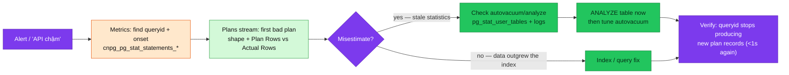

# Plan regression investigation

<!-- Not a per-alert runbook: an investigation workflow. Entry points below. -->

| | |
|---|---|
| **Type** | Investigation workflow (cross-signal), not a per-alert runbook |
| **Entry points** | A microservice latency/SLO-burn alert whose slow span is a DB call · [`CNPGAutovacuumFallingBehind`](CNPGAutovacuumFallingBehind.md) · a human saying "API chậm" |
| **Signals used** | `cnpg_pg_stat_statements_*` (VictoriaMetrics, per-`queryid`) · the auto_explain plans stream (VictoriaLogs) · `pg_stat_user_tables` (live) |
| **Window** | 7 days — the plans stream rides the Vector path only (no ClickHouse copy) |
| **Sources** | [`vector.yaml` PG pipeline](../../logging/vector.md#postgresql-pipeline) · `auto_explain.*` in [`platform-db`](../../../../kubernetes/infra/configs/databases/clusters/platform-db/instance.yaml) / [`product-db`](../../../../kubernetes/infra/configs/databases/clusters/product-db/instance.yaml) `instance.yaml` |
| **Applies to** | `platform-db` (ns `platform`), `product-db` (ns `product`) — the clusters that preload `auto_explain` |

## What problem this solves

The classic 2am incident: an "API slow" alert fires.
`cnpg_pg_stat_statements_*` can tell you **what** — *queryid `8675309`'s mean
exec time is 10× what it was yesterday afternoon* — but metrics cannot tell you
**why**. The usual root cause is a **plan flip**: the table grew past the point
where the planner prefers an Index Scan (switch to Seq Scan), or autovacuum
fell behind so statistics went stale and the planner works from wrong row
estimates. Running `EXPLAIN ANALYZE` *now* testifies about *today's* plan —
which may already differ from the plan that ran during the incident.

The auto_explain → VictoriaLogs pipeline is the time machine that closes this
gap: every execution slower than `1s` is logged **with the full plan it
actually ran**, keyed by the *same* `queryid` the metrics carry
(`compute_query_id` stamps both sides). "What plan did this query run at 3pm
yesterday?" is one LogsQL query.

**Know the machine's honest limits before trusting it:**

- **It records only the bad side of the flip.** `auto_explain.log_min_duration:
  1s` means executions faster than 1s are never logged. History gives you the
  **onset** (when bad plans started appearing), the **bad plan's shape**, and
  the misestimate evidence — not a good-vs-bad pair. The "good" plan comes from
  `EXPLAIN` after the fix.
- **Success is silence.** A fixed query drops back under 1s and *disappears
  from the history* — the verification signal is the absence of new records.
- **7-day window.** Older incidents need the metrics side only.



## Diagnosis

Cheapest first. Every query below was executed on this cluster (2026-08-25).

### 1. Metrics — which queryid, and when did it turn (VictoriaMetrics)

Both `_time_milliseconds` and `_calls` are counters — always `rate()` them
([PromQL guide](../../metrics/promql-guide.md)). Mean-per-call is the signal;
raw totals just reward frequent queries.

```promql
# Top offenders by mean exec time per call, right now
topk(5,
  sum by (queryid, datname) (rate(cnpg_pg_stat_statements_time_milliseconds[15m]))
/ sum by (queryid, datname) (rate(cnpg_pg_stat_statements_calls[15m])))

# Regression ratio vs a known-good window (yesterday: offset 1d; catches the 10× jump)
topk(5,
  (sum by (queryid) (rate(cnpg_pg_stat_statements_time_milliseconds[15m]))
 / sum by (queryid) (rate(cnpg_pg_stat_statements_calls[15m])))
/ ((sum by (queryid) (rate(cnpg_pg_stat_statements_time_milliseconds[15m] offset 1d))
 / sum by (queryid) (rate(cnpg_pg_stat_statements_calls[15m] offset 1d))) > 0))
```

Graph the first query over the incident range in Grafana to read the **onset
time** off the chart. The series carry `queryid`, `datname`,
`cnpg_io_cluster`, and the (truncated) `query` text — you leave this step with
a queryid, a database, and a time.

### 2. Logs — the time machine (VictoriaLogs)

Pivot on the queryid. In Grafana → Explore → VictoriaLogs:

```logsql
# Every slow execution of this query, oldest first — the first record is the onset
_stream:{query_id="8675309"}
  | fields _time, database, duration_ms, query_text | sort by (_time)

# Read the actual plan (the plan JSON is the record body)
_stream:{query_id="8675309"} | sort by (_time) | limit 1
```

Read the plan JSON for:

- **The access path**: `"Node Type": "Seq Scan"` on a table that has a usable
  index → the flip itself.
- **The misestimate smoking gun**: `Plan Rows` (planner's estimate) wildly
  different from `Actual Rows` (reality, present because `log_analyze: on`) —
  the signature of stale statistics.
- **Wasted work**: large `Rows Removed by Filter` → the chosen path scans and
  throws away.

No records for a queryid the metrics say is slow? Either it is slow-but-under-1s
(metrics mean can rise while every call stays <1s), or the pipeline itself is
broken — check the failure stream first:
[`vector.md § troubleshooting`](../../logging/vector.md#postgresql-plans-not-appearing).

### 3. Statistics — did the planner have current numbers?

Authoritative check (live, per database):

```bash
kubectl exec -n product product-db-1 -c postgres -- psql -U postgres -d product -Atc \
  "SELECT relname, last_autoanalyze, last_autovacuum, n_live_tup, n_dead_tup
   FROM pg_stat_user_tables ORDER BY n_live_tup DESC LIMIT 10;"
```

`last_autoanalyze` **before** the onset from step 2, on a table the plan
touches, while `n_dead_tup`/`n_live_tup` grew → stale statistics confirmed.

The log-side view exists but is partial: `log_autovacuum_min_duration: 1000`
logs only autovacuum/analyze runs that took ≥1s, so on small tables the
VictoriaLogs search below being empty proves nothing — `pg_stat_user_tables`
is the truth:

```logsql
_stream:{namespace=~"platform|product"} "automatic analyze" _time:7d
```

### 4. Optional — tie it back to the user-facing symptom

From a slow request's trace (VictoriaTraces), the DB span's time window should
overlap the plan records from step 2; `trace_id:<id>` in VictoriaLogs pulls
the request's app logs alongside.

## Mitigation

Cheapest first:

1. **`ANALYZE <table>;`** on the affected database — refreshes statistics
   immediately; the planner re-plans on the next execution. This is the 2am
   fix.
2. **Tune autovacuum for the table** so it doesn't recur — per-table storage
   options (`autovacuum_analyze_scale_factor`, `autovacuum_vacuum_scale_factor`)
   for large or fast-churning tables; the cluster-wide baseline lives in
   `instance.yaml` `postgresql.parameters`.
3. **Fix the access path** when the flip is legitimate growth, not stale stats:
   add/adjust the index the query needs, or rewrite the query — that work
   belongs in the owning service repo (schema migrations), not homelab.

**Verify**: the queryid stops producing new records in the plans stream
(back under 1s — success is silence), and the step-1 mean-per-call series
drops back to its baseline.

## Escalation & related

- Locks, not plans: slow + `pg_locks` waiters → [`CNPGBlockedQueries`](CNPGBlockedQueries.md).
- Vacuum debt as the alert, not the investigation → [`CNPGAutovacuumFallingBehind`](CNPGAutovacuumFallingBehind.md).
- Plans stream silent / suspect → the pipeline's own runbook path:
  [`vector.md § PostgreSQL plans not appearing`](../../logging/vector.md#postgresql-plans-not-appearing)
  (format contract first).
- Query-language reference for the pivots used here:
  [LogsQL guide § PostgreSQL plans](../../logging/logsql-guide.md#postgresql-plans-from-the-vector-pg-pipeline).

---

_Last updated: 2026-08-25 — first version. Every PromQL/LogsQL/psql command was
executed on the live cluster the day the auto_explain pipeline was fixed
(PR #912); the honest-limits section reflects what the 1s threshold actually
records._
