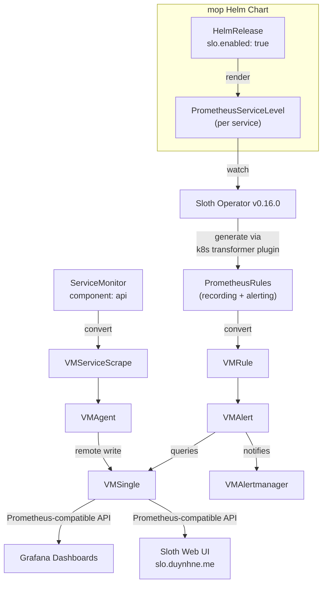

# SLO System Documentation

## Overview

The SLO (Service Level Objective) system provides automated monitoring and alerting for all microservices using [Sloth](https://sloth.dev) **v0.16.0**, following Google SRE best practices with multi-window multi-burn-rate alerts.

**Key Features**:
- Automated SLO generation via Helm chart (`slo.enabled: true`)
- Kubernetes-native using PrometheusServiceLevel CRDs
- Automatic PrometheusRule generation via Sloth Operator
- Multi-window multi-burn-rate alerts (Google SRE pattern)
- Error budget tracking
- Grafana dashboards (auto-deployed)
- **Built-in Sloth Web UI** at [http://slo.duynhne.me](http://slo.duynhne.me) — service/SLO browser, live SLI charts, burn-rate views, alert state filtering (new in v0.16.0)
- **K8s transformer plugins** — Sloth now renders the prometheus-operator `PrometheusRule` via a dynamic `unstructured` transformer plugin (`sloth.dev/k8stransform/prom-operator-prometheus-rule/v1`), and one SLO can emit multiple K8s objects (new in v0.16.0)

## Architecture

Full metrics and alerting topology (converter, VMAgent, VMSingle, VMAlert): see **[VictoriaMetrics Operator stack](../metrics/victoriametrics.md)**.



**How it works**:
1. Each service HelmRelease sets `slo.enabled: true`
2. The `mop` Helm chart renders a `PrometheusServiceLevel` CRD
3. Sloth Operator watches the CRD and generates PrometheusRules
4. The VictoriaMetrics Operator converts those rules to VMRules; VMAlert evaluates PromQL-compatible rules against VMSingle, tracks error budgets, and sends alerts to VMAlertmanager
5. ServiceMonitors auto-discover targets via `component: api`; VMAgent scrapes metrics (after ServiceMonitor → VMServiceScrape conversion) and remote-writes to VMSingle
6. The standalone **Sloth UI** Deployment (separate from the controller) reads SLI/error-budget series back from VMSingle to render its dashboards

## SLO Definitions

Each service has **3 SLOs** with default targets (overridable per-service via Helm values):

| SLO | Objective | SLI | Alert |
|---|---|---|---|
| **Availability** | 99.5% | Non-5xx request ratio | `{Service}HighErrorRate` |
| **Latency** | 95.0% | Requests < 500ms ratio | `{Service}HighLatency` |
| **Error Rate** | 99.0% | Non-4xx/5xx request ratio | `{Service}HighOverallErrorRate` |

### SLI Queries (PromQL)

All SLIs use the same base metric `request_duration_seconds` with Sloth's `{{.window}}` template:

**Availability** (5xx only):
```promql
# errorQuery
sum(rate(request_duration_seconds_count{app="<service>", namespace="<ns>", job=~"microservices", code=~"5.."}[{{.window}}]))
# totalQuery
sum(rate(request_duration_seconds_count{app="<service>", namespace="<ns>", job=~"microservices"}[{{.window}}]))
```

**Latency** (total - fast = slow):
```promql
# errorQuery (requests slower than threshold)
sum(rate(request_duration_seconds_count{...}[{{.window}}])) - sum(rate(request_duration_seconds_bucket{..., le="0.5"}[{{.window}}]))
# totalQuery
sum(rate(request_duration_seconds_count{...}[{{.window}}]))
```

**Error Rate** (4xx + 5xx):
```promql
# errorQuery
sum(rate(request_duration_seconds_count{..., code=~"4..|5.."}[{{.window}}]))
# totalQuery
sum(rate(request_duration_seconds_count{...}[{{.window}}]))
```

### Query Labels

| Label | Source | Example |
|---|---|---|
| `app` | Helm chart `name` | `auth` |
| `namespace` | Kubernetes namespace | `auth` |
| `job` | ServiceMonitor relabeling | `microservices` |
| `code` | Application metric | `200`, `404`, `500` |

## SLO Targets

All services use the same default targets for consistency:

| SLO Type | 30-day Target | Error Budget | Rationale |
|---|---|---|---|
| Availability | 99.5% | 3.6 hours/month | Industry standard for production APIs |
| Latency | 95% < 500ms | 5% slow requests | Users notice delays > 500ms |
| Error Rate | 99% success | 1% errors acceptable | Includes client (4xx) + server (5xx) |

Per-service overrides are supported via Helm values:
```yaml
slo:
  enabled: true
  availability:
    objective: 99.9  # stricter for critical service
```

## Services

| Service | Namespace | SLOs | Source |
|---|---|---|---|
| auth | auth | 3 | HelmRelease `slo.enabled: true` |
| user | user | 3 | HelmRelease `slo.enabled: true` |
| product | product | 3 | HelmRelease `slo.enabled: true` |
| cart | cart | 3 | HelmRelease `slo.enabled: true` |
| order | order | 3 | HelmRelease `slo.enabled: true` |
| review | review | 3 | HelmRelease `slo.enabled: true` |
| notification | notification | 3 | HelmRelease `slo.enabled: true` |
| shipping | shipping | 3 | HelmRelease `slo.enabled: true` |

**Total: 24 SLOs** across 8 services, auto-generated by the `mop` Helm chart.

## SLO metrics (PromQL on VictoriaMetrics)

Sloth still emits **PrometheusRule** CRDs; evaluation runs in **VMAlert**, and time series live in **VMSingle**. Queries remain PromQL-compatible (Grafana uses the VictoriaMetrics datasource against the same backend). Example recording-series names from Sloth:

```promql
# Error rate over multiple windows
slo:sli_error:ratio_rate5m{sloth_service="auth", sloth_slo="availability"}
slo:sli_error:ratio_rate30m{sloth_service="auth", sloth_slo="availability"}
slo:sli_error:ratio_rate1h{sloth_service="auth", sloth_slo="availability"}
slo:sli_error:ratio_rate6h{sloth_service="auth", sloth_slo="availability"}

# Error budget remaining
slo:error_budget_remaining:ratio{sloth_service="auth", sloth_slo="availability"}

# Current burn rate
slo:current_burn_rate:ratio{sloth_service="auth", sloth_slo="availability"}
```

## Sloth Web UI (v0.16.0)

The `sloth server` sub-command ships a built-in read-only web UI. We run it as a separate Deployment in `monitoring` (the upstream Helm chart only deploys the controller) and expose it through Kong.

**URL**: [http://slo.duynhne.me](http://slo.duynhne.me)

Features:

- Service listing + free-text search
- SLO listing — filter by service, by alert firing, by burn-rate-over-budget, by budget consumed in period
- SLO detail page — current stats, alert state, SLI ratio chart, error-budget burn-in-period chart
- Grouped SLO support (labels)
- Sortable service list (name / alert status)

**Backend**: queries the same VMSingle (`http://vmsingle-victoria-metrics.monitoring.svc:8428`) as VMAlert and Grafana — VictoriaMetrics' Prometheus-compatible API is fully supported. The UI itself is stateless; restart-safe.

**Manifest**: [`kubernetes/infra/configs/monitoring/sloth/sloth-ui.yaml`](../../../kubernetes/infra/configs/monitoring/sloth/sloth-ui.yaml). Image tag is pinned alongside the controller HelmRelease — bump both together.

**Local DNS**: add `127.0.0.1 slo.duynhne.me` to `/etc/hosts` (see [main README access points](../../../README.md#access-points)).

## Grafana Dashboards

Auto-deployed via Grafana Operator:

- **Sloth SLO Overview** (ID: 14643) -- high-level summary of all SLOs
- **Sloth SLO Detailed** (ID: 14348) -- per-service SLO metrics and error budgets

Access: http://grafana.duynhne.me (folder: SLO).

The Grafana dashboards and the Sloth UI are complementary: Grafana for long-form, customizable panels and cross-stack correlation; Sloth UI for the canonical SLO/error-budget view straight from upstream.

## Documentation

- **[Fundamentals](./fundamentals.md)** -- SLA / SLO / SLI / Error Budget / Burn Rate primer (read this first)
- **[Getting Started](./getting_started.md)** -- Enable SLOs for a service
- **[Burn-Rate Alerts](../alerting/slo-burn-rate-alerts.md)** -- Multi-window multi-burn-rate alert configuration (lives under `alerting/`)
- **[Error Budget Policy](./error_budget_policy.md)** -- Budget management guidelines
- **[Annotation-Driven Controller](./annotation-driven-slo-controller.md)** -- Future approach for large-scale SLO automation

### Manifests

- SLO Template: [`duyhenryer/charts` repo](https://github.com/duyhenryer/charts/blob/main/charts/mop/templates/slo.yaml)
- Sloth Operator (controller): `kubernetes/infra/controllers/metrics/sloth-operator.yaml`
- Sloth Web UI (Deployment + Service + PodMonitor): `kubernetes/infra/configs/monitoring/sloth/sloth-ui.yaml`
- Sloth UI Ingress: `kubernetes/infra/configs/kong/ingress-monitoring.yaml` (`slo.duynhne.me`)
- ServiceMonitor: `kubernetes/infra/configs/monitoring/servicemonitors/microservices.yaml`

### External References

- [Sloth Documentation](https://sloth.dev/)
- [Sloth v0.16.0 release notes](https://github.com/slok/sloth/releases/tag/v0.16.0) -- Web UI + K8s transformer plugins
- [Sloth `server` command source](https://github.com/slok/sloth/blob/main/cmd/sloth/commands/server.go) -- all CLI flags for the UI (Prometheus address, basic auth, mTLS, custom headers, cache refresh)
- [Google SRE Book -- SLOs](https://sre.google/sre-book/service-level-objectives/)
- [Google SRE Workbook -- Alerting on SLOs](https://sre.google/workbook/alerting-on-slos/)
