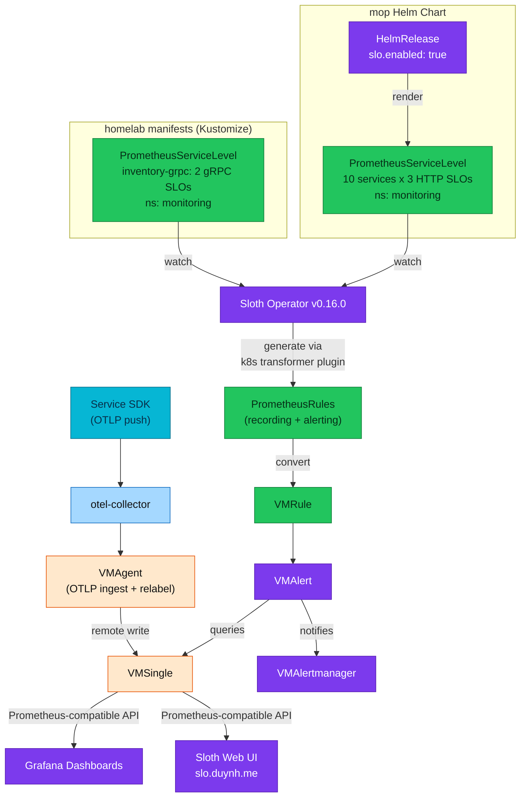

# SLO System Documentation

## Overview

The SLO (Service Level Objective) system provides automated monitoring and alerting for all microservices using [Sloth](https://sloth.dev) **v0.16.0**, following Google SRE best practices with multi-window multi-burn-rate alerts.

> **Where are the `PrometheusServiceLevel` manifests?** Almost nowhere in this
> repo — and that surprises everyone once. The **external `mop` chart** renders
> one per service from `slo.enabled: true`, which the five domain ResourceSets
> set for every service they template. So `grep -r PrometheusServiceLevel` in
> homelab returns a single file
> ([`inventory-grpc-slo.yaml`](../../../kubernetes/infra/configs/observability/sloth/inventory-grpc-slo.yaml)),
> while the cluster has eleven. To see the real specs, read them from the
> cluster: `kubectl get psl -A`, or
> [`charts/mop/templates/slo.yaml`](https://github.com/duynhlab/helm-charts/blob/main/charts/mop/templates/slo.yaml)
> in the chart repo.

**Key Features**:
- Automated SLO generation via Helm chart (`slo.enabled: true`)
- Kubernetes-native using PrometheusServiceLevel CRDs
- Automatic PrometheusRule generation via Sloth Operator
- Multi-window multi-burn-rate alerts (Google SRE pattern)
- Error budget tracking
- Grafana dashboards (auto-deployed)
- **Built-in Sloth Web UI** at [http://slo.duynh.me](http://slo.duynh.me) — service/SLO browser, live SLI charts, burn-rate views, alert state filtering (new in v0.16.0)
- **K8s transformer plugins** — Sloth now renders the prometheus-operator `PrometheusRule` via a dynamic `unstructured` transformer plugin (`sloth.dev/k8stransform/prom-operator-prometheus-rule/v1`), and one SLO can emit multiple K8s objects (new in v0.16.0)

## Architecture

Full metrics and alerting topology (converter, VMAgent, VMSingle, VMAlert): see **[VictoriaMetrics Operator stack](../metrics/victoriametrics.md)**.


```mermaid
flowchart TD
    subgraph helmChart ["mop Helm Chart"]
        HR["HelmRelease<br/>slo.enabled: true"] -->|render| PSL["PrometheusServiceLevel<br/>10 services x 3 HTTP SLOs<br/>ns: monitoring"]
    end

    subgraph handWritten ["homelab manifests (Kustomize)"]
        GRPC["PrometheusServiceLevel<br/>inventory-grpc: 2 gRPC SLOs<br/>ns: monitoring"]
    end

    PSL -->|watch| Sloth["Sloth Operator v0.16.0"]
    GRPC -->|watch| Sloth
    Sloth -->|generate via<br/>k8s transformer plugin| PR["PrometheusRules<br/>(recording + alerting)"]
    PR -->|convert| VMR["VMRule"]
    VMR --> VMA["VMAlert"]
    VMA -->|queries| VMS["VMSingle"]
    VMA -->|notifies| VMAM["VMAlertmanager"]
    VMS -->|Prometheus-compatible API| Grafana["Grafana Dashboards"]
    VMS -->|Prometheus-compatible API| SlothUI["Sloth Web UI<br/>slo.duynh.me"]

    App["Service SDK<br/>(OTLP push)"] --> OC["otel-collector"]
    OC --> VMAgent["VMAgent<br/>(OTLP ingest + relabel)"]
    VMAgent -->|remote write| VMS
    classDef service fill:#06b6d4,color:#082f49,stroke:#0e7490;
    classDef data fill:#22c55e,color:#052e16,stroke:#15803d;
    classDef metric fill:#ffe8cc,color:#111,stroke:#e8590c;
    classDef collector fill:#a5d8ff,color:#111,stroke:#1971c2;
    classDef platform fill:#7c3aed,color:#fff,stroke:#5b21b6;
    class App service;
    class OC collector;
    class PSL,GRPC,PR,VMR data;
    class VMS,VMAgent metric;
    class HR,Sloth,VMA,VMAM,Grafana,SlothUI platform;
```

**How it works**:
1. Each service HelmRelease sets `slo.enabled: true` (set in the five domain
   ResourceSets, not per HelmRelease by hand)
2. The `mop` Helm chart renders a `PrometheusServiceLevel` CRD **into the
   `monitoring` namespace**. That namespace is load-bearing: the Sloth
   controller runs with `values.sloth.namespace: "monitoring"`, so a
   `PrometheusServiceLevel` anywhere else is **silently ignored** — no error
   event, no rules, no SLO. inventory's gRPC SLOs are hand-written into the same
   namespace for that reason
3. Sloth Operator watches the CRD and generates PrometheusRules
4. The VictoriaMetrics Operator converts those rules to VMRules; VMAlert evaluates PromQL-compatible rules against VMSingle, tracks error budgets, and sends alerts to VMAlertmanager
5. The 10 Go services and 2 workers push metrics via OTLP (SDK → otel-collector → VMAgent OTLP ingest); VMAgent relabels the OTLP resource attributes (`service_name`→`app`, `k8s_namespace_name`→`namespace`) and remote-writes to VMSingle. There is no `/metrics` scrape for the app services anymore — VMAgent's ServiceMonitor/VMServiceScrape path now covers only infra exporters (postgres, kube-state, cAdvisor, etc.)
6. The standalone **Sloth UI** Deployment (separate from the controller) reads SLI/error-budget series back from VMSingle to render its dashboards

## SLO Definitions

Each HTTP service has **3 SLOs** with default targets (overridable per-service via Helm values):

| SLO | Objective | SLI | Alert |
|---|---|---|---|
| **Availability** | 99.5% | Non-5xx request ratio | `{Service}HighErrorRate` |
| **Latency** | 95.0% | Requests < 500ms ratio | `{Service}HighLatency` |
| **Error Rate** | 99.0% | Non-4xx/5xx request ratio | `{Service}HighOverallErrorRate` |

inventory is gRPC-only and has its own two, on `rpc_server_call_duration_seconds`:

| SLO | Objective | SLI | Alert |
|---|---|---|---|
| **grpc-availability** | 99.9% | Calls answered without a server fault (business refusals excluded) | `InventoryGrpcHighErrorRate` |
| **reserve-latency** | 95.0% | `Reserve` calls < 250ms | `InventoryReserveHighLatency` |

### SLI Queries (PromQL)

Chart-rendered SLIs all use the same base metric `http_server_request_duration_seconds` (OTel semconv) with Sloth's `{{.window}}` template:

**Availability** (5xx only):
```promql
# errorQuery
sum(rate(http_server_request_duration_seconds_count{app="<service>", namespace="<ns>", http_response_status_code=~"5.."}[{{.window}}]))
# totalQuery
sum(rate(http_server_request_duration_seconds_count{app="<service>", namespace="<ns>"}[{{.window}}]))
```

**Latency** (total - fast = slow):
```promql
# errorQuery (requests slower than threshold)
sum(rate(http_server_request_duration_seconds_count{...}[{{.window}}])) - sum(rate(http_server_request_duration_seconds_bucket{..., le="0.5"}[{{.window}}]))
# totalQuery
sum(rate(http_server_request_duration_seconds_count{...}[{{.window}}]))
```

**Error Rate** (4xx + 5xx):
```promql
# errorQuery
sum(rate(http_server_request_duration_seconds_count{..., http_response_status_code=~"4..|5.."}[{{.window}}]))
# totalQuery
sum(rate(http_server_request_duration_seconds_count{...}[{{.window}}]))
```

### Query Labels

| Label | Source | Example |
|---|---|---|
| `app` | OTLP resource attr `service_name`, VMAgent relabel → `app` | `auth` |
| `namespace` | OTLP resource attr `k8s_namespace_name`, VMAgent relabel → `namespace` | `auth` |
| `http_response_status_code` | Application metric (OTel semconv) | `200`, `404`, `500` |

## SLO Targets

The ten HTTP services use the same default targets for consistency:

| SLO Type | 30-day Target | Error Budget | Rationale |
|---|---|---|---|
| Availability | 99.5% | 3.6 hours/month | Industry standard for production APIs |
| Latency | 95% < 500ms | 5% slow requests | Users notice delays > 500ms |
| Error Rate | 99% success | 1% errors acceptable | Includes client (4xx) + server (5xx) |

inventory is stricter, from RFC-0021's own numbers rather than the chart defaults:

| SLO Type | 30-day Target | Error Budget | Rationale |
|---|---|---|---|
| grpc-availability | 99.9% | ~43 min/month | It is the synchronous dependency inside the 99.9% checkout confirm handoff, so it cannot have a looser target than the flow it gates. Checkout fails **closed**: one server fault is one 503 to a shopper |
| reserve-latency | 95% < 250ms | 5% slow `Reserve` calls | East-west budget, not an edge one — `Reserve` runs inside a shopper's confirm request and composes with its timeout |

Per-service overrides are supported via Helm values:
```yaml
slo:
  enabled: true
  availability:
    objective: 99.9  # stricter for critical service
```

## Services

All eleven services are SLO-enabled. Ten take the chart's HTTP SLOs; inventory
is the one exception, and the reason is in the row.

| Service | Namespace | SLOs | SLI metric | Source |
|---|---|---|---|---|
| auth | auth | 3 | HTTP | chart, `slo.enabled: true` |
| user | user | 3 | HTTP | chart, `slo.enabled: true` |
| product | product | 3 | HTTP | chart, `slo.enabled: true` |
| cart | cart | 3 | HTTP | chart, `slo.enabled: true` |
| order | order | 3 | HTTP | chart, `slo.enabled: true` |
| review | review | 3 | HTTP | chart, `slo.enabled: true` |
| notification | notification | 3 | HTTP | chart, `slo.enabled: true` |
| shipping | shipping | 3 | HTTP | chart, `slo.enabled: true` |
| checkout | checkout | 3 | HTTP | chart, `slo.enabled: true` |
| payment | payment | 3 | HTTP | chart, `slo.enabled: true` |
| **inventory** | inventory | **2** | **gRPC** | hand-written [`inventory-grpc-slo.yaml`](../../../kubernetes/infra/configs/observability/sloth/inventory-grpc-slo.yaml); chart SLO off via `slo_disabled` |

**Total: 32 SLOs → 64 burn-rate alerts** — 30 chart-rendered (10 services × 3)
plus inventory's 2 hand-written ones, through the five domain ResourceSets.

Until 2026-08-06 the count was 33 (11 × 3), but inventory's three were **dead**:
the chart builds HTTP SLIs and inventory serves gRPC only (no Kong route,
health/ready not instrumented), so `http_server_request_duration_seconds{app="inventory"}`
had no series at all — a 0/0 SLI, no error budget, and a burn-rate alert that
could never fire on the platform's only stock authority. They were replaced by
two gRPC SLOs with RFC-0021's targets (availability 99.9%, `Reserve` p95 <
250 ms). The chart's third SLO (4xx+5xx) has no honest gRPC analogue: the
closest thing is a business refusal, which already has precise named alerts in
[`checkout-availability.yaml`](../../../kubernetes/infra/configs/observability/metrics/prometheusrules/microservices/checkout-availability.yaml).

**Adding a gRPC-only service:** set `slo_disabled: "true"` on its
`ResourceSetInputProvider` and add a hand-written `PrometheusServiceLevel` in
`monitoring` next to inventory's. The opt-out is deliberately an opt-**out**:
the ResourceSet guard is truthiness-based, so an input of `"false"` would read
as true.

## SLO metrics (PromQL on VictoriaMetrics)

Sloth still emits **PrometheusRule** CRDs; evaluation runs in **VMAlert**, and time series live in **VMSingle**. Queries remain PromQL-compatible (Grafana uses the VictoriaMetrics datasource against the same backend). Example recording-series names from Sloth:

```promql
# Error rate over multiple windows
slo:sli_error:ratio_rate5m{sloth_service="auth", sloth_slo="availability"}
slo:sli_error:ratio_rate30m{sloth_service="auth", sloth_slo="availability"}
slo:sli_error:ratio_rate1h{sloth_service="auth", sloth_slo="availability"}
slo:sli_error:ratio_rate6h{sloth_service="auth", sloth_slo="availability"}

# Error budget remaining
slo:error_budget_remaining:ratio{sloth_service="auth", sloth_slo="availability"}

# Current burn rate
slo:current_burn_rate:ratio{sloth_service="auth", sloth_slo="availability"}
```

## Sloth Web UI (v0.16.0)

The `sloth server` sub-command ships a built-in read-only web UI. We run it as a separate Deployment in `monitoring` (the upstream Helm chart only deploys the controller) and expose it through Kong.

**URL**: [http://slo.duynh.me](http://slo.duynh.me)

Features:

- Service listing + free-text search
- SLO listing — filter by service, by alert firing, by burn-rate-over-budget, by budget consumed in period
- SLO detail page — current stats, alert state, SLI ratio chart, error-budget burn-in-period chart
- Grouped SLO support (labels)
- Sortable service list (name / alert status)

**Backend**: queries the same VMSingle (`http://vmsingle-victoria-metrics.monitoring.svc:8428`) as VMAlert and Grafana — VictoriaMetrics' Prometheus-compatible API is fully supported. The UI itself is stateless; restart-safe.

**Manifest**: [`kubernetes/infra/configs/observability/sloth/sloth-ui.yaml`](../../../kubernetes/infra/configs/observability/sloth/sloth-ui.yaml). Image tag is pinned alongside the controller HelmRelease — bump both together. The Deployment ships at **0 replicas** — SLO rules are generated by the controller and read in Grafana, so the UI is optional browsing; scale it to 1 (`kubectl scale deploy/sloth-ui -n monitoring --replicas=1`) when you want the interactive view.

**Local DNS**: add `127.0.0.1 slo.duynh.me` to `/etc/hosts` (see [main README access points](../../../README.md#local-access)).

## Grafana Dashboards

Auto-deployed via Grafana Operator:

- **Sloth SLO Overview** (ID: 14643) -- high-level summary of all SLOs
- **Sloth SLO Detailed** (ID: 14348) -- per-service SLO metrics and error budgets

Access: http://grafana.duynh.me (folder: SLO).

The Grafana dashboards and the Sloth UI are complementary: Grafana for long-form, customizable panels and cross-stack correlation; Sloth UI for the canonical SLO/error-budget view straight from upstream.

## Documentation

- **[Fundamentals](./fundamentals.md)** -- SLA / SLO / SLI / Error Budget / Burn Rate primer (read this first)
- **[Getting Started](./getting_started.md)** -- Enable SLOs for a service
- **[Burn-Rate Alerts](../alerting/slo-burn-rate-alerts.md)** -- Multi-window multi-burn-rate alert configuration (lives under `alerting/`)
- **[Error Budget Policy](./error_budget_policy.md)** -- Budget management guidelines
- **[Annotation-Driven Controller](./annotation-driven-slo-controller.md)** -- Future approach for large-scale SLO automation

### Manifests

- SLO Template: [`duynhlab/helm-charts` repo](https://github.com/duynhlab/helm-charts/blob/main/charts/mop/templates/slo.yaml)
- inventory gRPC SLOs (the only `PrometheusServiceLevel` in this repo): `kubernetes/infra/configs/observability/sloth/inventory-grpc-slo.yaml`
- Sloth Operator (controller): `kubernetes/infra/controllers/metrics/sloth-operator.yaml`
- Sloth Web UI (Deployment + Service + PodMonitor): `kubernetes/infra/configs/observability/sloth/sloth-ui.yaml`
- Sloth UI Ingress: `kubernetes/infra/configs/kong/ingress-monitoring.yaml` (`slo.duynh.me`)
- OTLP metrics pipeline (app services push, no scrape): `kubernetes/infra/controllers/tracing/otel-collector/otel-collector.yaml`

### External References

- [Sloth Documentation](https://sloth.dev/)
- [Sloth v0.16.0 release notes](https://github.com/slok/sloth/releases/tag/v0.16.0) -- Web UI + K8s transformer plugins
- [Sloth `server` command source](https://github.com/slok/sloth/blob/main/cmd/sloth/commands/server.go) -- all CLI flags for the UI (Prometheus address, basic auth, mTLS, custom headers, cache refresh)
- [Google SRE Book -- SLOs](https://sre.google/sre-book/service-level-objectives/)
- [Google SRE Workbook -- Alerting on SLOs](https://sre.google/workbook/alerting-on-slos/)

---
_Last updated: 2026-08-06_
