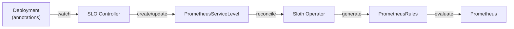

# Annotation-Driven SLO Controller (Future Reference)

> **Status**: Research/design document. Not implemented. Documented for future use when the platform scales beyond ~50 services or requires multi-team SLO ownership.

## When to Use This Approach

Use an annotation-driven controller instead of Helm chart integration when:

- Multiple Helm charts exist (not just `mop`) with different structures
- Teams own their Deployments and want to define SLO targets independently
- SLO lifecycle must be decoupled from deployment lifecycle (change SLO without re-deploy)
- Per-environment overrides are needed without Helm values (e.g., production vs staging)
- Service count exceeds ~50 and centralized chart management becomes a bottleneck

## Architecture



The controller watches Deployments with `slo.platform/*` annotations and automatically creates/updates/deletes `PrometheusServiceLevel` CRDs. Sloth Operator then generates PrometheusRules as usual.

## Annotation Design

```yaml
apiVersion: apps/v1
kind: Deployment
metadata:
  name: auth
  namespace: auth
  annotations:
    slo.platform/enabled: "true"

    # Availability SLO (5xx errors)
    slo.platform/availability-objective: "99.5"

    # Latency SLO
    slo.platform/latency-objective: "95.0"
    slo.platform/latency-threshold: "0.5"

    # Error rate SLO (4xx + 5xx)
    slo.platform/error-rate-objective: "99.0"

    # Optional overrides (defaults from controller config)
    slo.platform/team: "platform"
    slo.platform/metric-name: "request_duration_seconds"
    slo.platform/job-label: "microservices"
```

### Annotation Reference

| Annotation | Required | Default | Description |
|---|---|---|---|
| `slo.platform/enabled` | Yes | - | Enable SLO generation |
| `slo.platform/availability-objective` | No | `99.5` | Availability target (%) |
| `slo.platform/latency-objective` | No | `95.0` | Latency target (%) |
| `slo.platform/latency-threshold` | No | `0.5` | Latency threshold (seconds) |
| `slo.platform/error-rate-objective` | No | `99.0` | Error rate target (%) |
| `slo.platform/team` | No | `platform` | Team label on PrometheusServiceLevel |
| `slo.platform/metric-name` | No | `request_duration_seconds` | Base metric name |
| `slo.platform/job-label` | No | `microservices` | Prometheus job label |

## Implementation Outline

### Tech Stack

- **Language**: Go
- **Framework**: kubebuilder v4 + controller-runtime v0.19+
- **CRD**: No new CRD needed -- generates existing `PrometheusServiceLevel`

### Controller Logic

```go
func (r *SLOReconciler) Reconcile(ctx context.Context, req ctrl.Request) (ctrl.Result, error) {
    var deploy appsv1.Deployment
    if err := r.Get(ctx, req.NamespacedName, &deploy); err != nil {
        return ctrl.Result{}, client.IgnoreNotFound(err)
    }

    if deploy.Annotations["slo.platform/enabled"] != "true" {
        return r.cleanupSLO(ctx, deploy)
    }

    psl := r.buildPrometheusServiceLevel(deploy)

    // Server-side apply ensures idempotent updates
    return ctrl.Result{}, r.Patch(ctx, psl,
        client.Apply, client.FieldOwner("slo-controller"))
}

func (r *SLOReconciler) buildPrometheusServiceLevel(
    deploy appsv1.Deployment,
) *slothv1.PrometheusServiceLevel {
    ann := deploy.Annotations
    name := deploy.Name
    ns := deploy.Namespace

    availObj := parseFloat(ann, "slo.platform/availability-objective", 99.5)
    latObj := parseFloat(ann, "slo.platform/latency-objective", 95.0)
    latThreshold := getString(ann, "slo.platform/latency-threshold", "0.5")
    errObj := parseFloat(ann, "slo.platform/error-rate-objective", 99.0)
    team := getString(ann, "slo.platform/team", "platform")
    metric := getString(ann, "slo.platform/metric-name", "request_duration_seconds")
    job := getString(ann, "slo.platform/job-label", "microservices")

    psl := &slothv1.PrometheusServiceLevel{
        ObjectMeta: metav1.ObjectMeta{
            Name:      name,
            Namespace: "monitoring",
        },
        Spec: slothv1.PrometheusServiceLevelSpec{
            Service: name,
            Labels: map[string]string{
                "team": team, "env": "monitoring",
                "service": name, "namespace": ns,
            },
            SLOs: []slothv1.SLO{
                buildAvailabilitySLO(name, ns, metric, job, availObj),
                buildLatencySLO(name, ns, metric, job, latObj, latThreshold),
                buildErrorRateSLO(name, ns, metric, job, errObj),
            },
        },
    }

    // Owner reference for garbage collection
    ctrl.SetControllerReference(&deploy, psl, r.Scheme)
    return psl
}
```

### RBAC Requirements

```go
// +kubebuilder:rbac:groups=apps,resources=deployments,verbs=get;list;watch
// +kubebuilder:rbac:groups=sloth.slok.dev,resources=prometheusservicelevels,verbs=get;list;watch;create;update;patch;delete
```

### Setup (main.go)

```go
func main() {
    mgr, _ := ctrl.NewManager(ctrl.GetConfigOrDie(), ctrl.Options{
        Scheme: scheme,
    })

    // Watch Deployments, filter by annotation
    ctrl.NewControllerManagedBy(mgr).
        For(&appsv1.Deployment{}).
        Owns(&slothv1.PrometheusServiceLevel{}).
        WithEventFilter(predicate.NewPredicateFuncs(func(obj client.Object) bool {
            return obj.GetAnnotations()["slo.platform/enabled"] == "true"
        })).
        Complete(&SLOReconciler{
            Client: mgr.GetClient(),
            Scheme: mgr.GetScheme(),
        })

    mgr.Start(ctrl.SetupSignalHandler())
}
```

### Deployment

```yaml
apiVersion: apps/v1
kind: Deployment
metadata:
  name: slo-controller
  namespace: monitoring
spec:
  replicas: 1
  template:
    spec:
      serviceAccountName: slo-controller
      containers:
        - name: controller
          image: ghcr.io/duynhlab/slo-controller:v1
          resources:
            requests:
              memory: "64Mi"
              cpu: "10m"
            limits:
              memory: "128Mi"
              cpu: "50m"
```

## Real-World References

### Coroot

[Coroot](https://docs.coroot.com/inspections/slo/) uses the same annotation pattern for SLO auto-discovery:

```yaml
annotations:
  coroot.com/slo-availability-objective: 99.9%
  coroot.com/slo-latency-objective: 99.9%
  coroot.com/slo-latency-threshold: 100ms
```

Coroot also uses annotations for database monitoring:

```yaml
annotations:
  coroot.com/postgres-scrape: "true"
  coroot.com/postgres-scrape-credentials-secret-name: pg-cluster
```

### Datadog

Datadog uses service auto-discovery via container labels/annotations to automatically create SLOs when services are detected.

## Comparison: Helm Chart vs Annotation Controller

| Aspect | Helm Chart (current) | Annotation Controller |
|---|---|---|
| **Complexity** | Low (Helm template only) | Medium (build + deploy controller) |
| **Maintenance** | Chart update = SLO update | Controller may not need updates for new services |
| **Flexibility** | Override via Helm values | Override via annotations (more granular) |
| **Multi-chart** | Each chart needs its own template | One controller for all charts/deployments |
| **GitOps** | SLO = part of HelmRelease | SLO = part of Deployment manifest |
| **Failure mode** | Helm render fail = no SLO | Controller down = existing SLOs preserved |
| **Decoupling** | SLO tied to deployment lifecycle | SLO can change without re-deploy |
| **Scale sweet spot** | 1-50 services, single shared chart | 50+ services, multiple charts, multi-team |

## Migration Path (Helm to Annotation)

When the time comes to migrate:

1. Deploy the SLO controller alongside Sloth Operator
2. Add annotations to Deployments (can coexist with Helm-generated SLOs initially)
3. Verify controller-generated `PrometheusServiceLevel` matches Helm-generated ones
4. Remove `slo.enabled: true` from Helm values
5. Remove the SLO template from the mop chart

The migration is safe because:
- Both approaches generate the same `PrometheusServiceLevel` CRDs
- Sloth Operator processes them identically
- Controller uses server-side apply for idempotent updates
