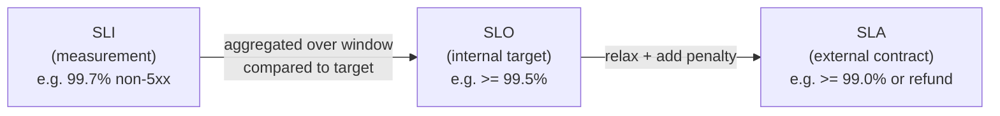
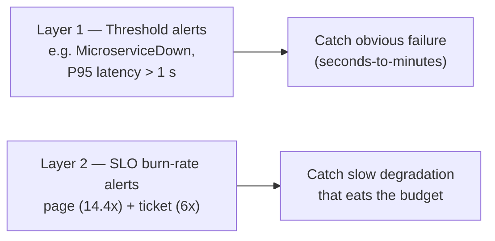

# SLO Fundamentals

> Plain-English primer on SLA / SLO / SLI / Error Budget / Burn Rate, written
> against this platform's actual stack (Sloth v0.16.0 + VictoriaMetrics +
> 8 microservices on Kong). Read this **before**
> [`getting_started.md`](./getting_started.md) and the
> [SLO system overview](./README.md). Once you've internalised it, jump to
> [`alerting/slo-burn-rate-alerts.md`](../alerting/slo-burn-rate-alerts.md)
> for the alerting math and to
> [`error_budget_policy.md`](./error_budget_policy.md) for the policy.

---

## TL;DR

| Term | What it is | Owns | Example (this repo) |
|---|---|---|---|
| **SLI** | A *measurement*. A number between 0 and 1 (or %) that says "what fraction of events succeeded?" | Engineering | `successful_requests / total_requests` for `auth` |
| **SLO** | A *target* on an SLI over a *window*. Internal commitment. | Engineering + Product | `availability >= 99.5%` over rolling 30 days |
| **SLA** | A *contract* with an external party. Usually weaker than the SLO and has financial / legal consequences. | Legal + Sales | We don't have one — internal platform |
| **Error Budget** | `1 - SLO`. The acceptable failure quota inside the window. | SRE + Product | `0.5%` of 30 days = 3.6 hours of "down" |
| **Burn Rate** | How fast you are spending the budget *right now*, normalised so `1x` = "you'll exhaust it exactly at the end of the window" | Alerts | `15x` → budget gone in ~2 days, page someone |

If you remember nothing else: **SLI is what you measure, SLO is the line you draw, error budget is the room between them, burn rate is how fast you're eating that room.**

---

## 1. Why SLOs at all?

You can't ship "100% uptime" — networks drop packets, kernels panic, GC pauses happen. Trying to is infinitely expensive and **kills feature velocity** because every change is a risk to perfection. SRE flips the question:

> *How much unreliability can our users tolerate before they care?*

That tolerable amount becomes the **error budget**. As long as you stay inside it, you ship features. When you bust it, you slow down and stabilise. SLOs make that trade-off **explicit and measurable** instead of a tribal argument between Dev and Ops.

---

## 2. SLA vs SLO vs SLI — the three-letter zoo



**Hard rule:** `SLA target < SLO target < 100%`. The SLO must be *stricter* than the SLA so that you have a buffer to detect and fix problems before you owe a customer money.

This platform is internal — we maintain SLOs only. There is no SLA.

---

## 3. SLI — pick a good one

A good SLI is a **ratio of good events to total events**, evaluated over a window. The "ratio" form is what Sloth (and Google's burn-rate maths) require.

### The four classics (Google "Golden Signals")

| Type | Good event | Bad event | Use for |
|---|---|---|---|
| **Availability** | HTTP 2xx/3xx/4xx | HTTP 5xx | Anything served over HTTP |
| **Latency** | response < threshold | response >= threshold | User-facing requests |
| **Quality** | request returned full data | request returned degraded data | Search, recommendations |
| **Throughput** | message processed | message dropped | Async / streaming |

### What we use

All 8 microservices share the same metric — `request_duration_seconds` — emitted by the standard middleware (see [`docs/observability/tracing/architecture.md`](../tracing/architecture.md)). From it we derive **3 SLIs per service**:

| SLI | Good = | Bad = | PromQL skeleton |
|---|---|---|---|
| **Availability** | not 5xx | 5xx | `count{code=~"5.."}` / `count` |
| **Latency** | served in < 500 ms | took >= 500 ms | `(count - bucket{le="0.5"})` / `count` |
| **Error Rate** | not 4xx & not 5xx | any 4xx or 5xx | `count{code=~"4..|5.."}` / `count` |

(Full PromQL forms are in [`README.md`](./README.md#sli-queries-promql).)

### Why a *ratio* over a window, not "current p95"?

Because **error budgets need to add up**. If your SLI is "p95 right now", two consecutive windows where it's marginally bad don't accumulate into anything you can budget against. Ratios do:

> 1,000 requests and 3 were errors → SLI in this window = 99.7%. Tomorrow, 1,000 / 5 errors → 99.5%. Add the windows: 2,000 / 8 errors → 99.6%. The maths composes.

---

## 4. SLO — the line you draw

```
SLO = "X% of events should be good, measured over window W"
```

For us: **99.5% of `auth` requests must be non-5xx, measured over a rolling 30-day window.**

Two knobs:

1. **The objective (`X%`)** — start lower than feels right. 99.5% is a fine starting point for a non-payment-critical HTTP service. 99.99% sounds aspirational and turns into background pain as soon as a noisy neighbour blips. Tighten *only after* you've consistently beaten the looser target for two cycles.
2. **The window (`W`)** — short windows are noisy (one bad lunch hour blows your whole budget); long windows are sluggish to react. **30 days rolling** is the industry default and what we use.

### The 99.x cheatsheet (per 30 days)

| SLO | Error budget | "Allowed downtime" / 30 d |
|---|---|---|
| 99% | 1% | **7.2 hours** |
| 99.5% | 0.5% | 3.6 hours |
| 99.9% | 0.1% | 43 minutes |
| 99.95% | 0.05% | 21.6 minutes |
| 99.99% | 0.01% | 4.3 minutes |
| 99.999% | 0.001% | **26 seconds** |

Each extra 9 costs roughly **10× more engineering** for ~10× less budget. Do not chase 9s for fun.

---

## 5. Error budget — the *because*

**Error budget = `1 - SLO`**, expressed as the share of bad events you're allowed.

### Two ways to look at it

1. **As time** (intuitive but only correct for availability): "we may be down 3.6 h / month".
2. **As events** (always correct): "out of 10 M requests this month, 50 K may fail".

For non-availability SLIs (latency, error-rate) the *event* view is the only honest one — it doesn't matter when the slow requests happened, only how many.

### What the budget unlocks

The budget is a **policy lever**, not a vanity stat. The repo's policy lives in [`error_budget_policy.md`](./error_budget_policy.md). Summary:

| Budget remaining | What changes |
|---|---|
| > 50% | Ship freely. |
| 20–50% | Code reviews scrutinise risky changes. |
| < 20% | Deploys require approval; bias to reliability work. |
| < 10% | Freeze feature deploys; only fixes go out. |

### Reading it from VictoriaMetrics

Sloth records the budget remaining as a recording rule:

```promql
slo:error_budget_remaining:ratio{sloth_service="auth", sloth_slo="availability"}
```

`1.0` = budget untouched. `0.0` = budget exhausted. Negative = SLO already missed.

---

## 6. Burn rate — the *how fast*

Burn rate is the **multiplier on your steady-state spend**. By construction:

```
burn_rate = (actual error fraction in the lookback window)
            ─────────────────────────────────────────────
                 (target error fraction = 1 - SLO)
```

* `burn_rate = 1` → you're spending the budget exactly at the rate it replenishes; you'll exit the 30-day window with budget = 0.
* `burn_rate = 14.4` → you'll burn the **whole 30-day budget in `30 / 14.4 ≈ 2 days`**. Wake someone up.
* `burn_rate = 6` → you'll burn the whole budget in `30 / 6 = 5 days`. Open a ticket.

### Worked example (this repo)

`auth` SLO: availability 99.5% (target error fraction `0.005`).

* In the last hour, `auth` returned `7.5%` 5xx.
* Burn rate = `0.075 / 0.005` = **15×**.
* Time-to-exhaustion if it stays this bad: `30 days / 15 = 2 days`.

That's exactly the regime the **page** alert is calibrated for (see next section).

### Why not just alert on raw 5xx %?

Because 7.5% 5xx is catastrophic for `auth` (99.5% target → budget evaporates in 2 d) but completely fine for an experimental analytics endpoint with a 95% SLO. Burn rate **normalises by the target** so the same threshold works everywhere.

---

## 7. Multi-window, multi-burn-rate alerts (Google SRE method)

Two failure modes you must distinguish:

| Failure mode | Looks like | Detect with |
|---|---|---|
| **Sudden** | Outage at 14:03; 5xx spikes from 0 to 90% | **Short window** (5 min) + **high burn rate** (≥14.4×) |
| **Slow** | Memory leak; 5xx drift from 0.1 → 1.5% over a day | **Long window** (1–6 h) + **moderate burn rate** (≥6×) |

A single threshold can't satisfy both: low threshold = noisy, high threshold = misses slow burns. The standard answer is **two thresholds, each AND-gated across two windows** so you get both fast detection *and* low false positives.

| Alert | Short window | Long window | Burn rate | What it means |
|---|---|---|---|---|
| **Page** | 5 min | 1 h | 14.4× | Will exhaust 30-day budget in ~2 days. Wake somebody. |
| **Ticket** | 30 min | 6 h | 6× | Will exhaust in ~5 days. Fix in business hours. |

Both windows must agree the budget is burning before the alert fires — that's what kills false positives without sacrificing speed.

Sloth generates these alerts for us automatically. Numbers and on-call procedure are in
[`alerting/slo-burn-rate-alerts.md`](../alerting/slo-burn-rate-alerts.md).

---

## 8. SLO ↔ "regular" alerts: how they coexist

This repo runs **two alerting layers** on purpose:



**They're not redundant.** Threshold alerts answer *"is something broken right now?"*. SLO alerts answer *"are we on track to break our promise to users this month?"*. You need both.

Full layering and pipeline diagrams: [`alerting/README.md`](../alerting/README.md).

---

## 9. Common pitfalls (and how this repo avoids them)

| Pitfall | Why it bites | Our defence |
|---|---|---|
| Picking an SLO no human ever picked. *"99.99% sounds good."* | Burns engineering effort with nothing to show. | Defaults are 99.5% / 95% / 99% — concrete numbers in [`README.md`](./README.md#slo-targets). Bump only after sustained over-performance. |
| Mixing SLA and SLO numbers | Causes panic when the SLO trips even though the SLA is fine. | We only have SLOs. SLA = N/A. |
| Alerting on raw error % | Same threshold can't serve a 99% and a 99.99% service. | We alert on **burn rate**, not error %. |
| Single-window alerts | Either flap on transient blips or miss slow burns. | Sloth uses **two windows × two thresholds**. |
| Ignoring the policy when budget burns | Alerts fire forever; team learns to mute. | [`error_budget_policy.md`](./error_budget_policy.md) — explicit gates on deploys. |
| "We can't measure it" | True for some custom flows; engineering punts on SLOs. | Standard `request_duration_seconds` middleware in every service — every microservice automatically gets 3 SLOs. |

---

## 10. Where to go next

| You want to… | Read |
|---|---|
| Enable / customise SLOs for a service | [`getting_started.md`](./getting_started.md) |
| Understand the full architecture (CRDs, Sloth, VMAlert) | [`README.md`](./README.md) |
| Understand the burn-rate alert maths and on-call flow | [`../alerting/slo-burn-rate-alerts.md`](../alerting/slo-burn-rate-alerts.md) |
| Decide whether to deploy when budget is low | [`error_budget_policy.md`](./error_budget_policy.md) |
| See the SLOs / SLIs in a UI | [http://slo.duynh.me](http://slo.duynh.me) (Sloth UI) or Grafana SLO dashboards |

## External references

- Google SRE Book — [Service Level Objectives](https://sre.google/sre-book/service-level-objectives/)
- Google SRE Workbook — [Implementing SLOs](https://sre.google/workbook/implementing-slos/)
- Google SRE Workbook — [Alerting on SLOs](https://sre.google/workbook/alerting-on-slos/) (origin of multi-window multi-burn-rate)
- Google SRE Workbook — [Error Budget Policy template](https://sre.google/workbook/error-budget-policy/)
- Sloth — [Introduction & concepts](https://sloth.dev/introduction/)
