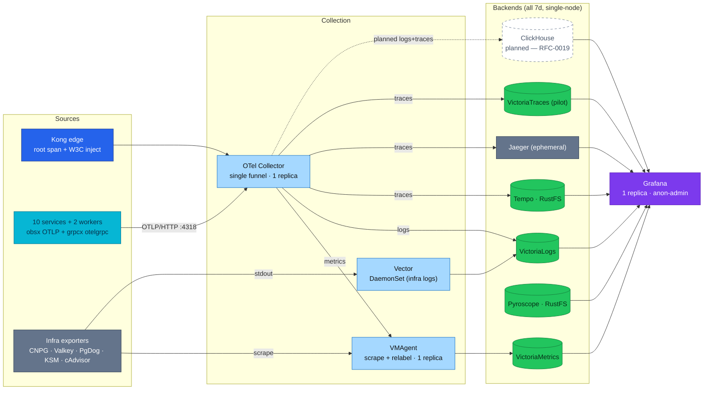

# Observability Stack Review

A whole-stack assessment of the platform's observability — the four signals
(metrics, logs, traces, profiles), their pipelines and backends, cross-signal
correlation, and production-readiness — with a per-signal maturity scorecard and a
ranked gap list. Point-in-time review; verify against manifests before acting.

| Quick facts | |
|---|---|
| Scope | Apps (10 services + 2 workers) + infra backends |
| Signals | Metrics · Logs · Traces · Profiles (+ `trace_id` correlation) |
| Instrumentation | OpenTelemetry via `pkg/obsx` (OTLP/HTTP) + `pkg/grpcx` (otelgrpc); Kong edge |
| Backends | VictoriaMetrics · VictoriaLogs · Tempo (+Jaeger, VictoriaTraces) · Pyroscope |
| Collection | OTel Collector (app push) + VMAgent (infra scrape) + Vector (infra logs) |
| Retention | **7 days** across all signals |
| Overall verdict | **Signals are standards-correct and coherent; the gaps are operational (HA/security), not architectural** |
| Reviewed | 2026-07-19 |

## Overview

The platform instruments everything with **OpenTelemetry** and treats the storage
backend as **pluggable** — the "narrow-waist" model. App code (`pkg/obsx`,
`pkg/grpcx`) emits OTLP and knows nothing about the backend; swapping or adding a
backend is a **collector-config change, not an app change**. That is the correct,
standard shape, and it is why adding ClickHouse ([RFC-0019](../proposals/rfc/RFC-0019/))
for long-retention log/trace SQL is a one-exporter change.

The important nuance this review makes explicit: **uniform telemetry does not make
backends equivalent.** Backends differ in query model (LogsQL vs PromQL/MetricsQL
vs TraceQL vs SQL), retention economics, correlation features, and HA — so "which
backend is optimal" is a real, per-signal question, answered below.

Method: reviewed from GitOps manifests + docs (the source of truth) across
`kubernetes/infra/{configs,controllers}` and `docs/observability/`, cross-checked
with two live-cluster alert audits (`alert-audit-2026-07-16/18`).

## Architecture

## Per-signal review

### Metrics — VictoriaMetrics ✅ optimal
- **Apps (RED):** OTLP push (`obsx`) → collector → VMAgent → VMSingle. Recording rules
  `app:` / `app_route:` (rate/error/p50-99/apdex); HTTP + gRPC + Go-runtime + otelpgx
  `db_client_*` + `pgxpool_*`. Alerts: availability/errors/latency/traffic/runtime/DB-client.
- **Infra (USE):** KSM, cAdvisor/kubelet, CNPG `:9187`, Valkey `:9121`, Kong `:8100`,
  PgDog `:9090`, otel-collector `:8888`, apiserver, CoreDNS, external-secrets, Tempo, Flux.
- **Verdict:** VM is the right choice for metrics (TSDB economics, PromQL/MetricsQL,
  operator, streaming-agg headroom). **Do not** put metrics in ClickHouse.
- **Gaps:** VMSingle single-node (no HA, PVC-only); VMAgent single replica (no persistent
  queue); **node-exporter absent** (Kind-scoped → no OS-level USE; also etcd/scheduler);
  **streaming aggregation documented but not deployed** (real guard today = the D-2 promote
  allowlist); **no exemplars** (VM won't-fix, RFC-0014 D-14 — metric→trace is an indirect
  `trace_id` hop); push-path liveness lags a hard pod kill ~5m; no `http.server.active_requests`
  / GC-pause metric (upstream instrumentation gaps).

### Logs — VictoriaLogs ✅ ops-primary (ClickHouse ➕ complements)
- **Dual path (no double-ingest):** Vector DaemonSet (DB/Kong/frontend/system, incl. CNPG
  pgaudit + auto_explain parsing) + app OTLP tee (zap→otelzap→collector→VictoriaLogs). App
  pods carry `platform.duynhlab.dev/otlp-logs=true` to exclude them from Vector.
- **Verdict:** VLogs is the right live-ops log store (LogsQL, cheap ingest). **Gap it cannot
  close:** cross-day **SQL** analytics + retention beyond 7d → ClickHouse Phase B complements.
- **Gaps:** 7d / 20Gi single-node (OOMKilled at 128Mi historically); **LogsQL-only, no SQL**;
  Vector buffers are memory + `drop_newest` → **lossy under backpressure** exactly when
  VLogs is stressed; **Logs→Traces pivot not wired** in Grafana (no `derivedFields`).

### Traces — Tempo ✅ prod-primary; Jaeger + VictoriaTraces are learning/pilot
- **Triple fan-out** (one pipeline): Tempo 2.10.5 (durable, RustFS S3, TraceQL) + Jaeger
  (in-memory 100k, ephemeral UI) + VictoriaTraces v0.9.4 (pilot, VLogs engine).
- **Sampling:** head-based `ParentBased(TraceIDRatioBased)` 10% prod / 100% local, rooted at
  Kong; ParentBased keeps traces whole. **No tail sampling** (listed as future work).
- **Verdict:** running three in parallel is an **intentional learning choice** on this platform
  (compare Tempo vs Jaeger vs VictoriaTraces side by side) — kept **on purpose**, and ClickHouse is
  **added as another parallel logs+traces backend**, not a replacement. For a real production
  cutover you would converge on **Tempo** (Jaeger is ephemeral-by-design; VictoriaTraces is pre-GA);
  here they stay. Correlation is uneven: only Tempo has `tracesToProfiles`/serviceMap.
- **Gaps (prod-only concern):** 3 concurrent backends cost/UX drift *if* this went to real prod;
  head-10% means trace SQL undercounts errors (see ClickHouse fit + sampling); Tempo/VT single-replica.

### Profiles — Pyroscope ✅ optimal
- Push model; `PROFILING_ENABLED=true` fleet-wide; RustFS S3 backend + 10Gi PVC (raft
  metastore); 7d. Span→profile link via Tempo datasource.
- **Verdict:** Pyroscope is the de-facto standard and Grafana-native — keep.
- **Gaps:** single replica + single PVC metastore (SPOF); **span→profile links CPU-only**
  (heap/goroutine/mutex not reachable from a trace); no per-service kill switch; only a
  `PyroscopeDown` alert (no ingestion/no-data/backend-write alert); profile-type config lives
  in external `pkg/obsx` (not GitOps-reviewable).

## Cross-signal correlation (`trace_id`)

The model is **trace-centric**, tied by `trace_id`:
- **Trace → Logs** (`tracesToLogsV2` → VictoriaLogs): all three trace backends ✅
- **Trace → Metrics** (`tracesToMetrics` → VictoriaMetrics): all three ✅ (scoped by service+time)
- **Trace → Profiles** (`tracesToProfiles` → Pyroscope): **Tempo only** 🟡
- **Logs → Traces:** **missing** 🔴 — VictoriaLogs datasource has no `derivedFields`; pivot is manual copy of `trace_id`
- **Metrics → Traces (exemplars):** **absent** (VM limitation, D-14 accepted) — indirect via `trace_id` in logs

## Production-readiness

### HA / SPOF (everything is single-instance)
| Component | Replicas | Storage | SPOF / loss |
|---|---|---|---|
| OTel Collector | 1 | none | **all app metrics+logs+traces** through one pod |
| VMSingle | 1 | PVC 20Gi | metrics + history lost on node/PVC loss |
| VMAgent | 1 | in-mem queue | buffered samples lost on restart |
| VictoriaLogs (VLSingle) | 1 | PVC 20Gi | logs lost on node/PVC loss |
| Tempo | 1 | RustFS S3 (blocks durable) | ingest/query SPOF |
| VictoriaTraces | 1 | PVC 10Gi | traces lost on loss |
| Jaeger | 1 | in-memory | all traces lost on restart (by design) |
| Pyroscope | 1 | PVC 10Gi + RustFS | metastore SPOF |
| VMAlert | 1 | none | evaluation stops if down |
| VMAlertmanager | 1 | none | silences/dedup lost on restart |
| Grafana | 1 | none (provisioned) | stateless SPOF |
| Vector | per-node | mem buffer | not SPOF; lossy under backpressure |

> `*Single` (VM/VL/VT) variants are single-node **by design** — true HA needs the clustered
> editions (VMCluster etc.), an architecture change, not a replica bump.

### Security
- **No inter-component TLS** (`tls.insecure: true` on every collector exporter; RustFS plain HTTP).
- **No backend API auth** — VM/VL/VT/Tempo/Jaeger/Pyroscope/VMAlert are open in-cluster.
- **No NetworkPolicy on the `monitoring` namespace** (no ingress **or** egress) — Kyverno
  default-deny targets only `tier: app` namespaces and is ingress-only.
- Edge is protected: Kong applies TLS + IP-allowlist + rate-limit on every UI Ingress. Note the
  VMSingle Ingress proxies the whole `:8428` incl. `/api/v1/write` (not read-only).
- **Grafana is anonymous-Admin with the login form disabled** — anyone past Kong's IP filter has full admin.

### Retention & cost
- **7d everywhere** (VMSingle, VLSingle, VT, Tempo 168h, Pyroscope 168h) — a deliberate,
  consistent strength. No backup of observability data (PVC-only for VM/VL/VT ⇒ up to 7d loss on node/PVC loss).
- Cardinality: the working guard is the **D-2 promote-allowlist** + obsx deny-keys (server.address/port)
  + otelgrpc health/reflection filter. Streaming aggregation is **not** deployed.

## Maturity scorecard

Rating: ✅ strong · 🟡 partial · 🔴 gap.

| Signal | Collection | Pipeline | Backend fit | Query/Viz | Alerting | Correlation | HA |
|---|---|---|---|---|---|---|---|
| **Metrics** | ✅ | ✅ (no streamAggr 🟡) | ✅ VM | ✅ | ✅ | 🟡 no exemplars | 🔴 single-node |
| **Logs** | ✅ | 🟡 lossy Vector | ✅ VLogs (SQL gap) | 🟡 LogsQL-only | 🟡 no VLogs self-alert | 🔴 no L→T | 🔴 single-node |
| **Traces** | ✅ | 🟡 head-10% only | 🟡 3 backends | ✅ | ✅ | ✅ (T→P Tempo-only) | 🔴 single-replica |
| **Profiles** | ✅ | ✅ | ✅ Pyroscope | ✅ | 🔴 only Down alert | 🟡 CPU-only span link | 🔴 single-replica |
| **Cross-cut** | — | — | — | 🔴 Grafana anon-admin | 🔴 Slack placeholder | — | 🔴 collector funnel |

## Ranked gaps

**Critical (fix before real production):**
1. **OTel Collector single-replica funnel** — one pod carries all app metrics+logs+traces; its loss blackholes them together.
2. **Grafana anonymous-Admin, login disabled** — no authn/authz on the viz layer.
3. **No NetworkPolicy on `monitoring`** (no ingress/egress) — all backend write/ingest APIs reachable pod-to-pod cluster-wide.
4. **Alertmanager Slack webhook is a committed dev placeholder** — every alert (≈165 static + ~60 SLO) is undelivered until the real URL is injected; no `AlertmanagerFailedToSendAlerts` safety net.

**High:**
5. **No HA on the alert path** (VMAlert/VMAlertmanager/Karma all single) + Alertmanager loses silences on restart.
6. **No inter-component TLS / open backend APIs** — security rests entirely on the Kong edge.
7. **Missing self-alerts** for VictoriaLogs, VictoriaTraces, Vector, Jaeger, Grafana (VLogs has OOM history yet no `up`/disk alert). *(otel-collector is covered: `OtelCollectorDown` + `OtelMetricsPipelineExportFailures`.)*
8. **Logs→Traces pivot not wired** (no `derivedFields`) — half the correlation is manual.
9. **Vector lossy buffers** (`drop_newest`, memory only) — logs dropped exactly when VLogs is stressed.

**Medium:**
10. Three trace backends concurrently — **intentional for learning here**; converge on Tempo only for a real prod cutover.
11. Streaming aggregation inert; only the promote-allowlist bounds cardinality.
12. node-exporter absent (Kind) — no OS-level USE; also etcd/scheduler/CoreDNS gaps.
13. Head-only 10% sampling — error/slow traces dropped at the same rate; no tail sampling.
14. Known dead/false-positive alerts from prior live audits (e.g. `CoreDNSDown` false-positive; `TemporalPersistenceErrorRateHigh` wrong metric; `KongUpstreamTargetUnhealthy` never fires; duplicate CNPG/WAL rules) — re-verify on next `make up`.
15. SLO objectives/SLIs live in the external `mop` chart (enabled via `slo.enabled: true`) — not GitOps-reviewable here.

## ClickHouse fit (RFC-0019 Phase B — planned)

ClickHouse is **supplementary OLAP for observability only** (commerce Phase A dropped): a
collector exporter fans **logs + traces** into `otel_logs` / `otel_traces` for **long-retention
SQL**, queried via the Grafana ClickHouse datasource. It **runs alongside** all existing backends
(VictoriaLogs, Tempo, Jaeger, VictoriaTraces stay); **metrics remain on VictoriaMetrics** — never
ClickHouse. It fills exactly the gaps above:
the **7-day wall**, the **no-SQL** limitation, and the inability to **JOIN logs↔traces** in one
store (on `trace_id`). It does **not** replace VictoriaMetrics/VictoriaLogs/Tempo (ops
primaries) and needs **no app change**. Recommended first step: **logs-first** (logs are 100%,
unsampled → the analytics workhorse; traces are 10% exemplars) so the pilot is decoupled from
the trace-sampling decision. See [RFC-0019](../proposals/rfc/RFC-0019/) and
[clickhouse/README.md](clickhouse/README.md).

## Recommendations (priority order)

1. **Security/access:** put real authn on Grafana (drop anon-admin) + a `monitoring`
   NetworkPolicy; inject the real Alertmanager webhook + `AlertmanagerFailedToSendAlerts`.
2. **Resilience:** collector 2+ replicas (or per-node) to remove the single funnel; add self-alerts
   for VLogs/VT/Vector/Grafana; give Vector a disk buffer.
3. **Traces (only if going to real prod):** converge on Tempo; on this learning platform the
   parallel backends (Tempo/Jaeger/VictoriaTraces + ClickHouse) are kept **on purpose**.
4. **Correlation quick win:** wire Logs→Traces `derivedFields` (`trace_id` → Tempo).
5. **ClickHouse Phase B (logs-first)** for long-retention SQL — per RFC-0019.
6. **Longer term:** clustered VM/VL for real HA; tail sampling (or consistent-probability +
   adjusted-count) if trace-level analytics is needed; deploy streaming aggregation at scale.

## References

- [Observability hub](README.md) · [OpenTelemetry](opentelemetry/README.md) · [Metrics](metrics/README.md)
- [VictoriaMetrics stack](metrics/victoriametrics.md) · [VictoriaLogs](logging/victorialogs.md) · [Tracing](tracing/architecture.md)
- [Alert catalog](alerting/alert-catalog.md) · [SLO](slo/README.md)
- [RFC-0014](../proposals/rfc/RFC-0014/) (OTel adoption) · [RFC-0019](../proposals/rfc/RFC-0019/) (ClickHouse)

---
_Last updated: 2026-07-19_
