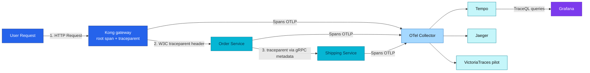

# Distributed Tracing Guide

## Quick Summary

**What is Distributed Tracing?**
Track requests as they flow through multiple microservices to understand performance bottlenecks, debug errors, and visualize service dependencies.

**Key Capabilities:**
- ✅ Track request journeys across all 10 microservices
- ✅ Identify slow services and bottlenecks
- ✅ Debug cross-service errors with full context
- ✅ Correlate traces with logs (via trace_id)
- ✅ 10% sampling (configurable) for cost-effectiveness

**Technologies:**
- **OpenTelemetry**: Industry-standard tracing instrumentation
- **Grafana Tempo**: primary tracing backend (v2.10.5; metrics-generator configured but inert — `remote_write: []`) — durable on **RustFS S3** (`tempo-traces` bucket, **7-day** block retention)
- **Jaeger**: secondary UI (Helm chart, all-in-one) — **in-memory / ephemeral** (lost on restart)
- **VictoriaTraces**: pilot 3rd backend (`v0.9.4`, VM-operator-managed, VictoriaLogs engine) — same OTel fan-out; see [victoriatraces.md](victoriatraces.md)
- **W3C Trace Context**: Standard for trace propagation between services

---

## Table of Contents

1. [Why Distributed Tracing?](#why-distributed-tracing) - Real-world use cases
2. [How It Works](#how-it-works) - System architecture
3. [Configuration, usage, and best practices](#configuration-usage-and-best-practices) - App contract → [api/tracing.md](../../api/tracing.md)
4. [Troubleshooting](#troubleshooting) - Common issues

---

## Why Distributed Tracing?

### Real-World Use Cases

#### 1. **Debugging Cross-Service Issues** 🔍
**Problem**: User reports "checkout is slow" but the request crosses several services and workers.

**Without tracing**: Check logs from every service and worker manually, then guess which hop is slow.

**With Tracing**: 
- See the entire request flow: `Kong → Order → Shipping / Notification`
- Identify bottleneck: **Shipping service took 2000ms** (everything else < 100ms)
- Jump to Shipping logs using `trace_id` to see exact error

#### 2. **Performance Optimization** ⚡
**Scenario**: Dashboard shows `/api/v1/orders` P95 latency = 800ms (SLO target: 500ms).

**With Tracing**:
- Find slowest spans: Database query (600ms), External API call (150ms)
- Add database index → latency drops to 300ms
- Verify improvement with trace comparison

#### 3. **Error Budget Investigation** 🚨
**Alert**: `order` service SLO burn rate critical (1.5% error rate, budget: 1%).

**With Tracing**:
- Filter traces with `http.status_code=500`
- See error pattern: `Order → Shipping → TIMEOUT`
- Root cause: Shipping service timeout (30s → need circuit breaker)

#### 4. **Service Dependency Mapping** 🗺️
**Question**: "If I update `shipping` service, which services will be affected?"

**With Tracing (Service Graph)**:
- Visualize dependencies: `Order → Shipping`, `Order → Notification`, `Product → Review` (gRPC east-west)
- Plan deployment order: update `Shipping` before `Order`
- Monitor impact with trace sampling

---

## How It Works

### Architecture



### Trace Flow

1. **Request arrives** at **Kong** (edge), which creates the **root span** with `trace_id` and injects the W3C `traceparent` (its `opentelemetry` plugin)
2. **W3C Trace Context** header (`traceparent`) propagated to the services and downstream
3. Each service creates **child spans** for its operations (Kong forces a W3C `traceparent` via `inject: [w3c]` — see [edge→service linkage](architecture.md#edge--service-linkage))
4. **10% sampling** — Kong (root) decides by ratio; each service wraps its ratio in `ParentBased` (`ParentBased(TraceIDRatioBased(rate))`), so downstream hops honour the root's `sampled` flag and traces stay whole — a service's own ratio only applies when it is itself the root (see the [sampling note](architecture.md#edge--service-linkage))
5. Spans exported via OTLP HTTP (batch export every 5s) to the **OTel Collector**, which fans out to **Tempo**, **Jaeger**, and **VictoriaTraces**
6. **Grafana** queries Tempo for trace visualization

> **Three backends, by design.** **Tempo** is the primary backend (queried in Grafana via TraceQL) and the **durable** store — traces live in **RustFS S3** (`tempo-traces` bucket) with **7-day** retention. **Jaeger** is an alternative UI fed by the same OTel Collector fan-out, kept on **in-memory storage (ephemeral — traces are lost on pod restart)** because Jaeger has no S3/object-storage backend (see [jaeger.md](jaeger.md#storage--in-memory-here-and-why-vs-tempo-on-rustfs)). **VictoriaTraces** (`v0.9.4`) is a **pilot** 3rd fan-out target — VM-operator-managed, no object-storage dependency — evaluating tracing consolidation onto the VictoriaMetrics stack; Tempo stays primary/durable (see [victoriatraces.md](victoriatraces.md)). The multi-backend setup is intentional — Tempo for durable day-to-day Grafana workflows, Jaeger for its dedicated trace-search UI / learning, VictoriaTraces as a consolidation pilot. See [architecture.md](architecture.md), [jaeger.md](jaeger.md), and the [backend comparison](backends-comparison.md).

### Automatic Features

| Feature | What It Does | Benefit |
|---------|--------------|---------|
| **10% Sampling** | Only trace 10% of requests | Cost-effective, production-ready |
| **Request Filtering** | Skip `/health`, `/metrics` | Reduces noise by 30-40% |
| **Service Identity** | `OTEL_SERVICE_NAME` env injected by the app ResourceSets | Stable `service.name`, no per-service config |
| **Graceful Shutdown** | Flush pending spans on SIGTERM | Zero data loss during rollouts |
| **Error Recording** | Automatically mark error spans | Easy error filtering in Grafana |

### Accessing Traces

**Grafana Explore:**
```bash
kubectl port-forward -n monitoring svc/grafana-service 3000:3000
# Open http://localhost:3000 → Explore → Tempo datasource
```

**Search Options:**
- By service: `{resource.service.name="auth"}`
- By trace ID: `trace_id` from logs
- By status: `{status=error}`
- By duration: `{duration > 500ms}`

---

## Configuration, usage, and best practices

> **Service authors:** sampling env vars, span helpers, propagation rules, and
> production do/don't guidance are canonical in
> [**Application tracing**](../../api/tracing.md). This guide keeps the
> **platform view** — backends, Grafana queries, and on-call troubleshooting.

See [**Application tracing**](../../api/tracing.md) for:
- ResourceSet / env configuration (`OTEL_SAMPLE_RATE`, `TRACING_ENABLED`, …)
- Usage patterns (when to trace, helper functions)
- Best practices (sampling, error recording, log correlation)

## Troubleshooting

### Problem: No traces appearing in Grafana

**Possible Causes:**
1. **Sampling too low** → Temporarily increase to 100% for debugging:
   ```bash
   kubectl set env deployment/auth OTEL_SAMPLE_RATE=1.0 -n auth
   ```

2. **Tempo not running**:
   ```bash
   kubectl get pods -n monitoring -l app=tempo
   kubectl logs -n monitoring deployment/tempo
   ```

3. **Service not sending traces**:
   ```bash
   kubectl logs -n auth -l app=auth | grep -i "trace\|tempo"
   ```

### Problem: Trace volume too low

**Expected:** `trace_count ≈ request_count * sample_rate`

**Check:**
1. **Verify sampling rate**:
   ```bash
   kubectl get deployment auth -n auth -o yaml | grep OTEL_SAMPLE_RATE
   ```

2. **Check request filtering** (health checks automatically skipped)

3. **Monitor Tempo ingestion**:
   ```promql
   rate(tempo_distributor_spans_received_total[5m])
   ```

### Problem: High memory usage

**Solutions:**
1. **Reduce sampling**: `OTEL_SAMPLE_RATE=0.05` (5%)
2. **Verify no tracing in loops**: `grep -r "StartSpan.*for.*range" ~/Working/duynhlab/*-service`
3. **Check batch timeout** (default 5s is optimal)

### Problem: Missing traces during pod restarts

**Solution:** Graceful shutdown is already configured (automatic span flushing). If still missing:

1. **Check shutdown logs**:
   ```bash
   kubectl logs -n auth <pod> | grep -i shutdown
   ```

2. **Increase shutdown timeout** (if needed):
   ```go
   shutdownCtx, cancel := context.WithTimeout(context.Background(), 20*time.Second)
   ```

### Debugging Commands

```bash
# View traces in Grafana
kubectl port-forward -n monitoring svc/grafana-service 3000:3000

# Check Tempo metrics
kubectl port-forward -n monitoring svc/tempo 3200:3200
curl http://localhost:3200/metrics | grep tempo_spans

# View service logs with trace IDs
kubectl logs -n auth -l app=auth | jq '.trace_id'

# Check sampling config
kubectl describe deployment auth -n auth | grep -A 5 "Environment"
```

---

## Reference

### Key Concepts

| Term | Definition |
|------|------------|
| **Trace** | Complete journey of a request across services |
| **Span** | Single operation within a trace (e.g., HTTP request, DB query) |
| **Trace ID** | Unique identifier for entire trace (128-bit) |
| **Span ID** | Unique identifier for single span (64-bit) |
| **W3C Trace Context** | Standard header format: `traceparent: 00-<trace-id>-<span-id>-<flags>` |
| **Sampling** | Percentage of requests to trace (10% = 1 in 10 requests) |

### Semantic Conventions (OpenTelemetry)

**HTTP Attributes:**
```go
attribute.String("http.method", "POST")
attribute.String("http.route", "/api/v1/orders")
attribute.Int("http.status_code", 200)
```

**Database Attributes:**
```go
attribute.String("db.system", "postgresql")
attribute.String("db.operation", "SELECT")
attribute.String("db.table", "users")
```

### Performance Characteristics

| Metric | Value | Notes |
|--------|-------|-------|
| Sampling overhead | < 1% CPU | At 10% sampling |
| Memory overhead | < 50MB | Per service |
| Export latency | < 100ms P99 | To Tempo |
| Trace volume reduction | 90% | vs 100% sampling |
| Request filtering reduction | 30-40% | Health/metrics skipped |

### External Resources

- [OpenTelemetry Go SDK](https://opentelemetry.io/docs/instrumentation/go/)
- [Grafana Tempo Docs](https://grafana.com/docs/tempo/latest/)
- [W3C Trace Context Spec](https://www.w3.org/TR/trace-context/)
- [OpenTelemetry Semantic Conventions](https://opentelemetry.io/docs/specs/semconv/)

---

**Last Updated**: 2026-07-14 — metrics-generator noted configured-but-inert (`remote_write: []`); collector fan-out drawn end-to-end; `OTEL_SERVICE_NAME` injected by ResourceSets; sampling corrected to the shipped `ParentBased(TraceIDRatioBased)` (root decides, downstream honours; no auto ENV mapping); Tempo v2.10.5 on RustFS S3 (7d), Jaeger in-memory, VictoriaTraces v0.9.4 (pilot)

---
_Last updated: 2026-07-14_
