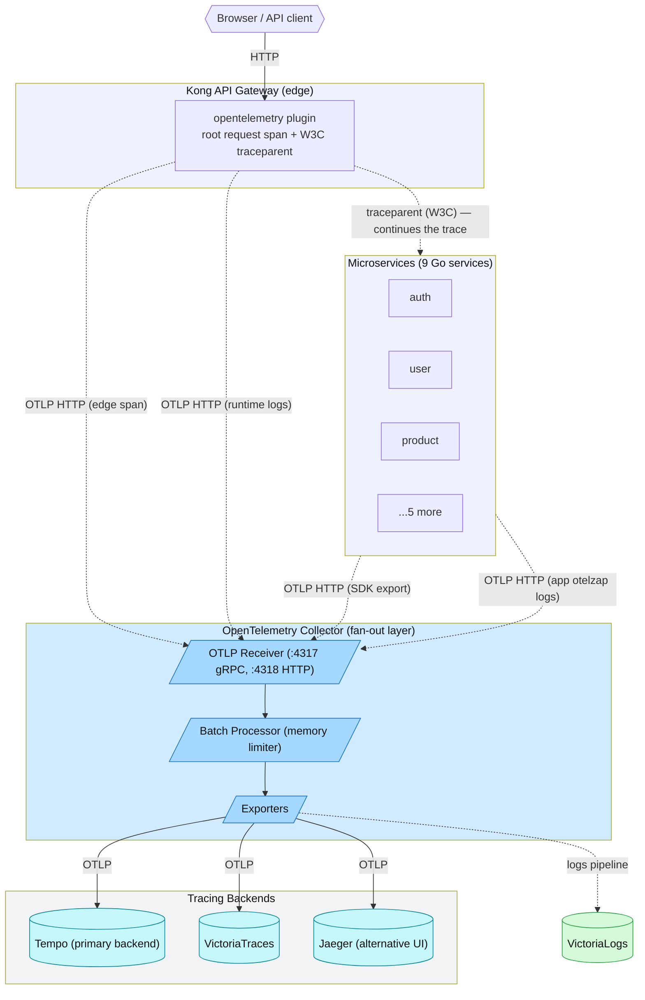
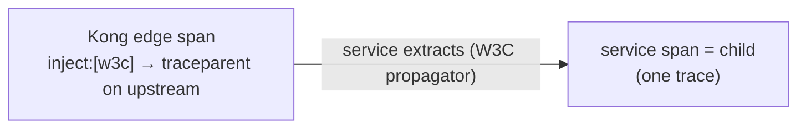

# Distributed Tracing Architecture

## Overview

This document explains the distributed tracing architecture used in this project, including the triple-backend fan-out (Tempo + Jaeger + VictoriaTraces pilot), OpenTelemetry Collector fan-out pattern, and SDK-based instrumentation approach.

## Architecture

### High-Level Flow



The trace now **begins at the gateway**: Kong's `opentelemetry` plugin creates
the root request span and injects the W3C `traceparent` so each service span is a
child of the edge span (previously traces started at the service — a blind first
hop). See [Edge → service linkage](#edge--service-linkage) for the propagation
config that makes this reliable.

### Component Details

**0. Kong API Gateway (edge)**
- **Technology**: Kong `opentelemetry` plugin (`plugin: opentelemetry`, global)
- **Enabled by**: `tracing_instrumentations: all` + `tracing_sampling_rate` in the Kong config (HelmRelease env for the cluster; `KONG_TRACING_*` for local-stack)
- **Export**: OTLP HTTP to the same collector endpoint the services use (`…:4318/v1/traces`), `service.name=kong`
- **Role**: creates the **root request span** for every proxied call and injects the W3C `traceparent` downstream, so the trace starts at the edge instead of the first service
- **Logs**: the same plugin also sets `logs_endpoint` (Kong ≥ 3.8) — Kong **runtime** logs ship via OTLP to the collector's `logs` pipeline → VictoriaLogs. That same pipeline also carries the **fleet-wide app `otelzap` tee** (every service's structured logs, since RFC-0014 P4), alongside Vector (see [../logging/README.md](../logging/README.md))
- **Config**: `kubernetes/infra/configs/kong/plugins.yaml` (`opentelemetry-tracing` KongClusterPlugin) + `kubernetes/infra/controllers/kong/helmrelease.yaml`; local mirror in `local-stack/gateway/kong.yml` + `local-stack/compose.yaml`

**1. Microservices (SDK Approach)**
- **Technology**: Go OpenTelemetry SDK
- **Export Protocol**: OTLP HTTP
- **Endpoint**: `otel-collector-opentelemetry-collector.monitoring.svc.cluster.local:4318`
- **Sampling**: `ParentBased(TraceIDRatioBased)`, ratio 10% (prod default; dev sets `OTEL_SAMPLE_RATE=1.0` explicitly)
- **Implementation**: `pkg/obsx.SetupObservability()` — one call in each service's `main()` wires the `TracerProvider` + W3C propagator; `otelgin`/`otelgrpc` create the spans (no per-repo `middleware/tracing.go`)

**2. OpenTelemetry Collector**
- **Deployment**: Kubernetes Deployment (1 replica, scalable)
- **Function**: Fan-out layer — a `traces` pipeline distributing to the three backends, plus a `logs` pipeline (fleet-wide app `otelzap` tee + Kong runtime-logs → VictoriaLogs)
- **Configuration**: `kubernetes/infra/controllers/tracing/otel-collector/otel-collector.yaml`
- **Ports**: 4317 (gRPC), 4318 (HTTP), 8888 (metrics)

**3. Tempo (Primary Backend)** — `grafana/tempo:2.10.5`
- **Purpose**: Durable tracing backend
- **Storage**: **RustFS S3** (`tempo-traces` bucket), **7-day** block retention
- **Query**: Via Grafana (TraceQL)
- **Integration**: Grafana datasource (+ traces↔logs↔metrics correlation)

**4. Jaeger v2 (Alternative Backend)** — `jaegertracing/jaeger` Helm chart, all-in-one
- **Purpose**: Alternative UI, learning / comparison
- **Storage**: **In-memory (100k traces max), ephemeral** — Jaeger has no S3/object-storage backend (persistence would need badger-PVC or external ES/ClickHouse)
- **Query**: Built-in Jaeger UI (port 16686, `jaeger-query` Service)
- **Integration**: Grafana datasource

## Why Multiple Backends?

The OTel Collector fans out to **three** backends, each with a distinct role:

### Use Cases

1. **Tempo — durable primary**
   - Day-to-day Grafana workflows (TraceQL, traces↔logs↔metrics correlation)
   - Durable store on RustFS S3 (`tempo-traces` bucket, 7-day retention)

2. **Jaeger — dedicated trace-search UI**
   - Alternative UI, learning / comparison
   - In-memory / ephemeral (no S3/object-storage backend)

3. **VictoriaTraces — pilot (3rd backend)**
   - Evaluates the **VM-operator consolidation** story: tracing managed by the
     *same* VictoriaMetrics Operator and storage engine as metrics (`VMSingle`)
     and logs (`VLSingle`), with **no object-storage dependency**
   - `v0.9.4` (0.x, pre-GA) — a pilot, not a replacement; any consolidation is a
     future ADR gated on ~1.0/GA. See [victoriatraces.md](victoriatraces.md) and
     the [backend comparison](backends-comparison.md)

### Current Status

This is a **POC/learning project**, so multiple backends allow:
- Learning each system
- Comparing approaches (UI, query language, storage model)
- Understanding trade-offs

## SDK vs Sidecar: Why SDK?

### Current Approach: OpenTelemetry SDK

**Implementation:** services never build the exporter, `TracerProvider`, or
propagator by hand. The shared **`pkg/obsx.SetupObservability()`** wires all of
that once (one call in `main()`); span instrumentation comes from the
`otelgin` (HTTP) and `otelgrpc` (east-west) contrib middlewares. See the
[OpenTelemetry policy page](../opentelemetry/README.md).

```go
// main() — one wiring point per service (pkg/obsx)
obs, err := obsx.SetupObservability(ctx, obsx.ConfigFromEnv())
if err != nil { /* fail startup */ }
defer obs.Shutdown(shutdownCtx)
```

Inside `SetupObservability`, `obsx` builds the OTLP trace exporter
(`otlptracehttp`), batches it into an `sdktrace.TracerProvider`, sets the W3C
`traceparent` propagator, and installs the sampler
`ParentBased(TraceIDRatioBased(rate))` — so downstream hops honour the root
(Kong) decision and a service's own ratio only applies when it is itself the
root of a trace.

**Advantages:**
- ✅ **Full Control**: Custom instrumentation, sampling, attributes
- ✅ **Resource Efficient**: No sidecar container overhead
- ✅ **Language Optimized**: Go-specific optimizations
- ✅ **Simple Deployment**: No additional containers per pod
- ✅ **Learning Value**: Better understanding of OpenTelemetry internals

**Disadvantages:**
- ❌ **Code Changes**: Requires instrumentation in code
- ❌ **Language Specific**: Need SDK for each language
- ❌ **Application Overhead**: Export processing in app process

### Alternative: Sidecar Collector

**How it works:**
- OTel Collector runs as sidecar container in same pod
- Applications send traces to localhost collector
- Collector handles export to backends

**When to use:**
- Polyglot environments (Java, Python, Node.js, Go)
- Zero-code instrumentation needed
- Large-scale production (100+ services)
- Centralized collector management

**Why we don't use it:**
- All services are Go (homogeneous stack)
- Need custom instrumentation
- Resource efficiency is important
- Learning/POC environment

## Edge → service linkage

For Kong's edge span and the downstream service span to land in the **same
trace**, Kong must inject a W3C `traceparent` onto the upstream request that the
service then extracts. The catch: the OpenTelemetry plugin's default
propagation is `inject: [preserve]`, which only re-injects a format it
*extracted* — so for a browser call (no inbound trace header) it injects
**nothing**, and the service starts a brand-new root (split traces).

**Fix (required config):** force W3C injection on the plugin. This needs
**Kong ≥ 3.5** (the `propagation` block):

```yaml
plugins:
  - name: opentelemetry
    config:
      traces_endpoint: http://…:4318/v1/traces
      propagation:
        default_format: w3c
        extract: [w3c, b3, jaeger, ot]
        inject: [w3c]        # ← forces traceparent onto every upstream request
```



**Verified:** local-stack (Kong **3.9**, sampling 1.0) links **100%** of proxied
requests Kong→service after adding `inject: [w3c]` (was intermittent on Kong 3.2,
which predates the `propagation` block). Service-to-service hops (the order saga
over gRPC) were already linking, confirming the service-side W3C propagator works
— no service change was needed.

> **Cluster sampling note:** Kong samples head-based at `0.1` as the trace root.
> Each service wraps its ratio in **`ParentBased`**
> (`ParentBased(TraceIDRatioBased(rate))`, set inside `obsx.SetupObservability`), so it honours
> Kong's `sampled` flag: a sampled remote parent → keep, an unsampled one → drop.
> A service's own `0.1` ratio therefore only applies when it is itself the root of
> a trace. This guarantees *sampling completeness* — a trace Kong keeps is kept
> whole downstream regardless of any per-service rate drift — on top of the
> `inject: [w3c]` linkage mechanism. Verified empirically: with a service forced to
> root-rate `0.0` behind a Kong root at `1.0`, the service still records 100% of
> its spans (it honours the parent), where a bare `TraceIDRatioBased(0.0)` would
> drop them all.

## Configuration

### Microservices Configuration

All microservices use consistent configuration via Helm values:

```yaml
# kubernetes/apps/domains/*-rs.yaml (env section, per service)
env:
  - name: OTEL_COLLECTOR_ENDPOINT
    value: "otel-collector-opentelemetry-collector.monitoring.svc.cluster.local:4318"
  - name: OTEL_SAMPLE_RATE
    value: "0.1"  # 10% sampling
  - name: OTEL_SERVICE_NAME
    value: << inputs.name >>  # authoritative service.name
  - name: TRACING_ENABLED
    value: "true"
```

**Key Points:**
- All services point to OTel Collector (not directly to backends)
- Single endpoint simplifies configuration
- Easy to change backends without app changes

### OpenTelemetry Collector Configuration

**Fan-out Configuration:**
```yaml
# kubernetes/infra/controllers/tracing/otel-collector/otel-collector.yaml (conceptual example)
exporters:
  otlp/tempo:
    endpoint: tempo.monitoring.svc.cluster.local:4317
  otlp/jaeger:
    endpoint: jaeger.monitoring.svc.cluster.local:4317
  otlphttp/victoriatraces:          # pilot 3rd backend (OTLP HTTP, :10428)
    traces_endpoint: http://vtsingle-victoria-traces.monitoring.svc.cluster.local:10428/insert/opentelemetry/v1/traces

  otlphttp/victorialogs:            # Kong runtime-logs (OTLP HTTP, :9428)
    logs_endpoint: http://vlsingle-victoria-logs.monitoring.svc.cluster.local:9428/insert/opentelemetry/v1/logs

service:
  pipelines:
    traces:
      receivers: [otlp]
      processors: [memory_limiter, batch]
      exporters: [otlp/tempo, otlp/jaeger, otlphttp/victoriatraces]
    logs:                           # Kong OTel runtime logs (runs alongside Vector)
      receivers: [otlp]
      processors: [memory_limiter, batch]
      exporters: [otlphttp/victorialogs]
```

**Benefits:**
- Single configuration point
- Easy to add/remove backends
- Consistent processing (batching, memory limiting)

## Data Flow

### Trace Lifecycle

0. **Request hits Kong** — the `opentelemetry` plugin opens the **root span** and injects `traceparent` upstream
1. **Request arrives** at the microservice carrying that `traceparent`
2. **SDK creates span** via Gin middleware (child of the edge span)
3. **Span attributes** added (service name, HTTP method, path)
4. **Span ends** and queued for export
5. **Batch export** every 5 seconds (or when batch full)
6. **OTLP HTTP** sent to OTel Collector
7. **Collector processes** (memory limit, batch)
8. **Fan-out** to Tempo + Jaeger (OTLP gRPC) and VictoriaTraces (OTLP HTTP)
9. **Backends store** traces
10. **Query** via Grafana (Tempo) or Jaeger UI

### Sampling Strategy

**Current:** `ParentBased(TraceIDRatioBased(OTEL_SAMPLE_RATE))` — the root decides
by ratio, downstream honours the parent.
- **Production**: `OTEL_SAMPLE_RATE=0.1` (10%; the SDK default when unset)
- **Development**: `OTEL_SAMPLE_RATE=1.0` set explicitly (e.g. `local-stack`) — there
  is no automatic ENV-based adjustment; the ratio is exactly `OTEL_SAMPLE_RATE`.

**Rationale:**
- Reduces storage and processing overhead
- Still captures representative sample
- `ParentBased` keeps sampled traces whole across services (no torn traces)

**Future Improvements:**
- Adaptive sampling based on error rate
- Head-based sampling in collector
- Tail-based sampling for errors

## Production Considerations

### Current Limitations

1. **Jaeger Storage**: in-memory **by design** (data lost on restart) — Jaeger has **no S3/object-storage backend**, and Tempo is the durable store (RustFS S3, 7-day retention), so Jaeger is kept ephemeral as the secondary/learning UI.
2. **Collector HA**: Single replica (no redundancy)
3. **Monitoring**: Limited collector metrics visibility
4. **Security**: No TLS between components

### Recommended Improvements

**1. Persistent storage for Jaeger (if ever needed):** Jaeger can't use S3/RustFS — the persistence options are **badger on a PVC** (single-node) or an external **Elasticsearch/OpenSearch/Cassandra/ClickHouse**:
```yaml
# kubernetes/infra/controllers/tracing/jaeger/jaeger.yaml (conceptual — NOT deployed)
backends:
  primary_store:
    badger:
      ephemeral: false      # persist to a PVC
      directory: /var/lib/jaeger-badger
```
- Requires a PVC; data survives pod restarts
- Currently we keep `memory` and let **Tempo** own durable storage — see [backends-comparison.md](backends-comparison.md)

**2. High Availability:**
```yaml
# kubernetes/infra/controllers/tracing/otel-collector/otel-collector.yaml (conceptual example)
replicaCount: 2
```
- Multiple collector replicas
- Load balancer for service
- Health checks and auto-restart

**3. Monitoring:**
- Expose collector metrics (port 8888)
- Create Grafana dashboard
- Alert on export failures
- Track trace volume and latency

**4. Security:**
- Enable TLS between collector and backends
- Network policies for pod communication
- Authentication for query endpoints

## Deployment Methods: Helm vs Operator

### Current Approach: Helm Chart

**What we use:**
- Jaeger Helm chart (`jaegertracing/jaeger`)
- GitOps-managed HelmRelease in this repo: `kubernetes/infra/controllers/tracing/jaeger/jaeger.yaml`
- Reconciled by Flux via the `tracing-local` Kustomization (path `./controllers/tracing`, `dependsOn: [secrets-local, storage-local]`)

**Why Helm:**
- ✅ Simple and straightforward
- ✅ No operator overhead
- ✅ Direct control over configuration
- ✅ Perfect for POC/learning environments
- ✅ Easy to understand and modify

### Alternative: OpenTelemetry Operator

**What it is:**
- Kubernetes Operator for managing OpenTelemetry Collectors
- CRD-based deployment (`OpenTelemetryCollector`)
- Can deploy Jaeger v2 as OTel Collector

**When to use:**
- Production with 10+ services
- Need auto-instrumentation (zero-code)
- GitOps workflow
- Multiple collectors across namespaces
- Dynamic scaling requirements

**Example CRD:**
```yaml
apiVersion: opentelemetry.io/v1beta1
kind: OpenTelemetryCollector
metadata:
  name: jaeger-instance
spec:
  image: jaegertracing/jaeger:latest
  ports:
  - name: jaeger
    port: 16686
  config:
    service:
      extensions: [jaeger_storage, jaeger_query]
      pipelines:
        traces:
          receivers: [otlp]
          exporters: [jaeger_storage_exporter]
    # ... rest of config
```

### Jaeger Operator v1 (Deprecated for v2)

**Status:**
- ❌ **Deprecated** for Jaeger v2
- Only for Jaeger v1 deployments
- Uses CRD: `apiVersion: jaegertracing.io/v1`

**Note:** Jaeger v2 uses OpenTelemetry Operator, not Jaeger Operator.

### Comparison

| Feature | Helm Chart (Current) | OpenTelemetry Operator |
|---------|---------------------|------------------------|
| **Complexity** | Low | Medium |
| **Setup** | Simple | Requires cert-manager |
| **Auto-instrumentation** | No | Yes |
| **Scaling** | Manual | Automatic |
| **GitOps** | Manual | Native CRD |
| **Best For** | POC, Dev | Production |

### Recommendation

**Current Setup (Helm):**
- ✅ **Perfect for current needs** - POC/learning project
- ✅ **No need to change** - Works well
- ✅ **Simple to maintain** - Easy to understand

**Consider Operator When:**
- Moving to production
- Need auto-instrumentation
- Want GitOps workflow
- Multiple services and namespaces

## Related Documentation

- OpenTelemetry Collector manifests: `kubernetes/infra/controllers/tracing/otel-collector/otel-collector.yaml`
- Jaeger manifests: `kubernetes/infra/controllers/tracing/jaeger/jaeger.yaml`
- [APM Overview](./README.md)
- [Jaeger Guide](./jaeger.md)

## References

- [OpenTelemetry Documentation](https://opentelemetry.io/docs/)
- [Jaeger Documentation](https://www.jaegertracing.io/docs/)
- [Grafana Tempo Documentation](https://grafana.com/docs/tempo/)
- [CNCF Observability Best Practices](https://www.cncf.io/blog/)
- [Jaeger v2 Deployment Guide](https://www.jaegertracing.io/docs/2.13/deployment/kubernetes/)
- [OpenTelemetry Operator](https://opentelemetry.io/docs/platforms/kubernetes/operator/)

_Last updated: 2026-07-14 — VictoriaTraces v0.9.4; SDK wiring consolidated into `pkg/obsx.SetupObservability` (one call in `main()`); `otelgin`/`otelgrpc` provide span instrumentation._
