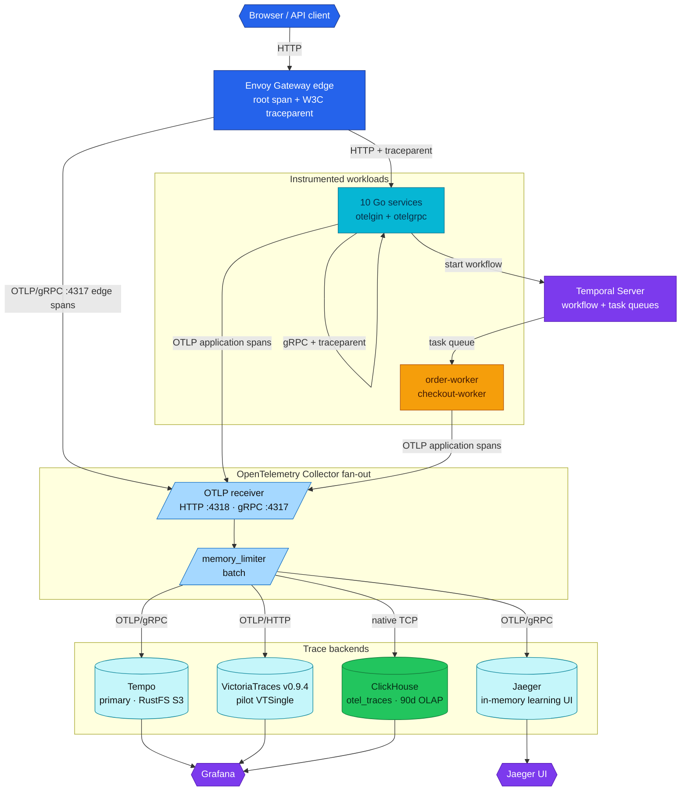
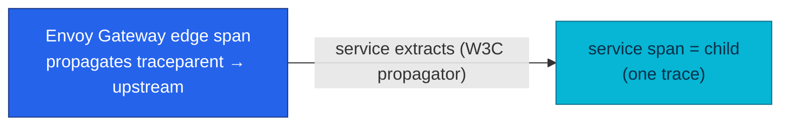

# Distributed Tracing Architecture

## Overview

This document explains the distributed tracing architecture used in this project, including the triple-backend fan-out (Tempo + Jaeger + VictoriaTraces pilot), OpenTelemetry Collector fan-out pattern, and SDK-based instrumentation approach.

## Architecture

### High-Level Flow


```mermaid
flowchart TB
    Client{{"Browser / API client"}}
    Edge["Envoy Gateway edge<br/>root span + W3C traceparent"]

    subgraph workloads["Instrumented workloads"]
        Services["10 Go services<br/>otelgin + otelgrpc"]
        Workers["order-worker<br/>checkout-worker"]
    end
    Temporal["Temporal Server<br/>workflow + task queues"]


    subgraph collectorNode["OpenTelemetry Collector fan-out"]
        Receiver[/"OTLP receiver<br/>HTTP :4318 · gRPC :4317"/]
        Processors[/"memory_limiter<br/>batch"/]
        Receiver --> Processors
    end

    subgraph backends["Trace backends"]
        Tempo[("Tempo<br/>primary · RustFS S3")]
        Jaeger[("Jaeger<br/>in-memory learning UI")]
        VT[("VictoriaTraces v0.9.4<br/>pilot VTSingle")]
        CH[("ClickHouse<br/>otel_traces · 90d OLAP")]
    end

    Grafana{{"Grafana"}}
    JaegerUI{{"Jaeger UI"}}

    Client -->|"HTTP"| Edge
    Edge -->|"HTTP + traceparent"| Services
    Services -->|"gRPC + traceparent"| Services
    Services -->|"start workflow"| Temporal
    Temporal -->|"task queue"| Workers
    Edge -->|"OTLP/gRPC :4317 edge spans"| Receiver
    Services & Workers -->|"OTLP application spans"| Receiver
    Processors -->|"OTLP/gRPC"| Tempo
    Processors -->|"OTLP/gRPC"| Jaeger
    Processors -->|"OTLP/HTTP"| VT
    Processors -->|"native TCP"| CH
    Tempo --> Grafana
    VT --> Grafana
    CH --> Grafana
    Jaeger --> JaegerUI

    classDef edge fill:#2563eb,color:#fff,stroke:#1e3a8a;
    classDef service fill:#06b6d4,color:#082f49,stroke:#0e7490;
    classDef worker fill:#f59e0b,color:#451a03,stroke:#b45309;
    classDef platform fill:#7c3aed,color:#fff,stroke:#5b21b6;
    classDef trace fill:#c5f6fa,color:#111,stroke:#0c8599;
    classDef collector fill:#a5d8ff,color:#111,stroke:#1971c2;
    classDef data fill:#22c55e,color:#052e16,stroke:#15803d;
    class Client,Edge edge;
    class Services service;
    class Workers worker;
    class Receiver,Processors collector;
    class Tempo,Jaeger,VT trace;
    class CH data;
    class Temporal,Grafana,JaegerUI platform;
```

The trace **begins at the edge**: Envoy Gateway's native tracing opens the root
request span and propagates the W3C `traceparent` so each service span is a
child of the edge span (previously traces started at the service — a blind first
hop). See [Edge → service linkage](#edge--service-linkage) for the propagation
behavior that makes this reliable.

### Component Details

**0. Envoy Gateway (edge)**
- **Technology**: `EnvoyProxy.spec.telemetry.tracing` — native Envoy tracing, no plugin
- **Enabled by**: the `platform` GatewayClass's `parametersRef` — cluster CR `kubernetes/infra/configs/envoy-gateway/envoyproxy.yaml` (`samplingRate: 10`, **planned** — not yet run on Kind); local overlay `local-stack/gateway/eg/envoyproxy.yaml` patches `samplingRate: 100` (verified in local-stack)
- **Export**: OTLP **gRPC** to the collector on `:4317` — the tracing provider speaks gRPC only, unlike the app SDKs which export over OTLP HTTP `:4318`; `service.name` is derived as `<gateway>.<namespace>` (locally `platform.envoy-gateway-system`)
- **Role**: opens the **root request span** for every proxied call and propagates the W3C `traceparent` downstream, so the trace starts at the edge instead of the first service. Envoy's sampler is `ParentBased`, so an inbound sampled `traceparent` is always honored regardless of `samplingRate`
- **Logs**: the edge has **no OTLP logs path** — its only log output is the JSON access log on stdout, tailed by Vector (see [../logging/README.md](../logging/README.md))
- **Config**: `kubernetes/infra/configs/envoy-gateway/envoyproxy.yaml` (cluster); local mirror `local-stack/gateway/eg/envoyproxy.yaml`

**1. Microservices (SDK Approach)**
- **Technology**: Go OpenTelemetry SDK
- **Export Protocol**: OTLP HTTP
- **Endpoint**: `otel-collector-opentelemetry-collector.monitoring.svc.cluster.local:4318`
- **Sampling**: `ParentBased(TraceIDRatioBased)`, ratio 10% (prod default; dev sets `OTEL_SAMPLE_RATE=1.0` explicitly)
- **Implementation**: `pkg/obsx.SetupObservability()` — one call in each service's `main()` wires the `TracerProvider` + W3C propagator; `otelgin`/`otelgrpc` create the spans (no per-repo `middleware/tracing.go`)

**2. OpenTelemetry Collector**
- **Deployment**: Kubernetes Deployment (1 replica, scalable)
- **Function**: Fan-out layer — a `traces` pipeline distributing to the three backends, plus a `logs` pipeline (fleet-wide app `otelzap` tee → VictoriaLogs). The edge has no OTLP logs path; its only log output is the JSON access log on stdout, tailed separately by Vector
- **Configuration**: `kubernetes/infra/controllers/tracing/otel-collector/otel-collector.yaml`
- **Ports**: 4317 (gRPC), 4318 (HTTP), 8888 (metrics)

**3. Tempo (Primary Backend)** — `grafana/tempo:2.10.8`
- **Purpose**: Durable tracing backend
- **Storage**: **RustFS S3** (`tempo-traces` bucket), **7-day** block retention
- **Query**: Via Grafana (TraceQL)
- **Integration**: Grafana datasource (+ traces↔logs↔metrics correlation)

**4. Jaeger v2 (Alternative Backend)** — `jaegertracing/jaeger` Helm chart, all-in-one
- **Purpose**: Alternative UI, learning / comparison
- **Storage**: **In-memory (100k traces max), ephemeral** — Jaeger has no S3/object-storage backend (persistence would need badger-PVC or external ES/ClickHouse)
- **Query**: Built-in Jaeger UI (port 16686, `jaeger` Service)
- **Integration**: Grafana datasource

## Why Multiple Backends?

The OTel Collector fans out to **three** backends, each with a distinct role:

### Use Cases

1. **Tempo — durable primary**
   - Day-to-day Grafana workflows (TraceQL, traces↔logs↔metrics correlation)
   - Durable store on RustFS S3 (`tempo-traces` bucket, 7-day retention)

2. **Jaeger — dedicated trace-search UI**
   - Alternative UI, learning / comparison
   - In-memory / ephemeral (no S3/object-storage backend)

3. **VictoriaTraces — pilot (3rd backend)**
   - Evaluates the **VM-operator consolidation** story: tracing managed by the
     *same* VictoriaMetrics Operator and storage engine as metrics (`VMSingle`)
     and logs (`VLSingle`), with **no object-storage dependency**
   - `v0.9.4` (0.x, pre-GA) — a pilot, not a replacement; any consolidation is a
     future ADR gated on ~1.0/GA. See [victoriatraces.md](victoriatraces.md) and
     the [backend comparison](backends-comparison.md)

### Current Status

This is a **POC/learning project**, so multiple backends allow:
- Learning each system
- Comparing approaches (UI, query language, storage model)
- Understanding trade-offs

## SDK vs Sidecar: Why SDK?

### Current Approach: OpenTelemetry SDK

**Implementation:** services never build the exporter, `TracerProvider`, or
propagator by hand. The shared **`pkg/obsx.SetupObservability()`** wires all of
that once (one call in `main()`); span instrumentation comes from the
`otelgin` (HTTP) and `otelgrpc` (east-west) contrib middlewares. See the
[OpenTelemetry policy page](../opentelemetry/README.md).

```go
// main() — one wiring point per service (pkg/obsx)
obs, err := obsx.SetupObservability(ctx, obsx.ConfigFromEnv())
if err != nil { /* fail startup */ }
defer obs.Shutdown(shutdownCtx)
```

Inside `SetupObservability`, `obsx` builds the OTLP trace exporter
(`otlptracehttp`), batches it into an `sdktrace.TracerProvider`, sets the W3C
`traceparent` propagator, and installs the sampler
`ParentBased(TraceIDRatioBased(rate))` — so downstream hops honour the root
(edge) decision and a service's own ratio only applies when it is itself the
root of a trace.

**Advantages:**
- ✅ **Full Control**: Custom instrumentation, sampling, attributes
- ✅ **Resource Efficient**: No sidecar container overhead
- ✅ **Language Optimized**: Go-specific optimizations
- ✅ **Simple Deployment**: No additional containers per pod
- ✅ **Learning Value**: Better understanding of OpenTelemetry internals

**Disadvantages:**
- ❌ **Code Changes**: Requires instrumentation in code
- ❌ **Language Specific**: Need SDK for each language
- ❌ **Application Overhead**: Export processing in app process

### Alternative: Sidecar Collector

**How it works:**
- OTel Collector runs as sidecar container in same pod
- Applications send traces to localhost collector
- Collector handles export to backends

**When to use:**
- Polyglot environments (Java, Python, Node.js, Go)
- Zero-code instrumentation needed
- Large-scale production (100+ services)
- Centralized collector management

**Why we don't use it:**
- All services are Go (homogeneous stack)
- Need custom instrumentation
- Resource efficiency is important
- Learning/POC environment

## Edge → service linkage

For the edge's root span and the downstream service span to land in the **same
trace**, the edge must propagate a W3C `traceparent` onto the upstream request
that the service then extracts. Envoy Gateway's tracing does this **natively** —
there is no propagation config to set or plugin to enable: every proxied
request carries `traceparent` upstream, whether or not the inbound request had
one.


```mermaid
flowchart LR
    E["Envoy Gateway edge span<br/>propagates traceparent → upstream"] -->|"service extracts (W3C propagator)"| L["service span = child<br/>(one trace)"]
    classDef edge fill:#2563eb,color:#fff,stroke:#1e3a8a;
    classDef service fill:#06b6d4,color:#082f49,stroke:#0e7490;
    class E edge;
    class L service;
```

**Verified:** local-stack (Envoy Gateway standalone, `samplingRate: 100`) links
**100%** of proxied requests edge→service. Service-to-service hops (the order
saga over gRPC) already link, confirming the service-side W3C propagator works
— no service change was needed.

> **Cluster sampling note:** the edge samples head-based at `samplingRate: 10`
> (10%, **planned** — the cluster CR has not yet run on Kind) as the trace
> root; the local overlay patches this to `100`. Each service wraps its ratio in
> **`ParentBased`** (`ParentBased(TraceIDRatioBased(rate))`, set inside
> `obsx.SetupObservability`), and so does the edge's own sampler — both honour
> whichever `traceparent.sampled` flag reaches them: a sampled remote parent →
> keep, an unsampled one → drop. A service's own ratio therefore only applies
> when it is itself the root of a trace. This guarantees *sampling
> completeness* — a trace the edge keeps is kept whole downstream regardless of
> any per-service rate drift — on top of the edge's native `traceparent`
> propagation.

## Configuration

### Microservices Configuration

All microservices use consistent configuration via Helm values:

```yaml
# kubernetes/apps/domains/*-rs.yaml (env section, per service)
env:
  - name: OTEL_COLLECTOR_ENDPOINT
    value: "otel-collector-opentelemetry-collector.monitoring.svc.cluster.local:4318"
  - name: OTEL_SAMPLE_RATE
    value: "0.1"  # 10% sampling
  - name: OTEL_SERVICE_NAME
    value: << inputs.name >>  # authoritative service.name
  - name: TRACING_ENABLED
    value: "true"
```

**Key Points:**
- All services point to OTel Collector (not directly to backends)
- Single endpoint simplifies configuration
- Easy to change backends without app changes

### OpenTelemetry Collector Configuration

The deployed pipelines (`kubernetes/infra/controllers/tracing/otel-collector/otel-collector.yaml`):

| Pipeline | Processors | Exporters |
|----------|------------|-----------|
| `traces` | `memory_limiter` → `batch` | Tempo (OTLP gRPC) · Jaeger (OTLP gRPC) · VictoriaTraces (OTLP HTTP `:10428`) · **ClickHouse** `otel_traces` |
| `logs` | `memory_limiter` → `batch` | VictoriaLogs (OTLP HTTP `:9428`) · **ClickHouse** `otel_logs` |
| `metrics` | `memory_limiter` → `deltatocumulative` → `batch` | vmagent OTLP ingest `:8429` |

Full walkthrough — component model, processor ordering, exporter durability,
the ClickHouse startup coupling, and the troubleshooting runbook:
[OpenTelemetry Collector](../opentelemetry/collector.md).

**Benefits:**
- Single configuration point
- Easy to add/remove backends
- Consistent processing (batching, memory limiting)

## Data Flow

### Trace Lifecycle

0. **Request hits the edge** — Envoy Gateway's tracing opens the **root span** and propagates `traceparent` upstream
1. **Request arrives** at the microservice carrying that `traceparent`
2. **SDK creates span** via Gin middleware (child of the edge span)
3. **Span attributes** added (service name, HTTP method, path)
4. **Span ends** and queued for export
5. **Batch export** every 5 seconds (or when batch full)
6. **OTLP HTTP** sent to OTel Collector
7. **Collector processes** (memory limit, batch)
8. **Fan-out** to Tempo + Jaeger (OTLP gRPC), VictoriaTraces (OTLP HTTP), and ClickHouse (`otel_traces`)
9. **Backends store** traces
10. **Query** via Grafana (Tempo) or Jaeger UI

### Sampling Strategy

**Current:** `ParentBased(TraceIDRatioBased(OTEL_SAMPLE_RATE))` — the root decides
by ratio, downstream honours the parent.
- **Production**: `OTEL_SAMPLE_RATE=0.1` (10%; the SDK default when unset)
- **Development**: `OTEL_SAMPLE_RATE=1.0` set explicitly (e.g. `local-stack`) — there
  is no automatic ENV-based adjustment; the ratio is exactly `OTEL_SAMPLE_RATE`.

**Rationale:**
- Reduces storage and processing overhead
- Still captures representative sample
- `ParentBased` keeps sampled traces whole across services (no torn traces)

**Future Improvements:**
- Adaptive sampling based on error rate
- Head-based sampling in collector
- Tail-based sampling for errors

## Production Considerations

### Current Limitations

1. **Jaeger Storage**: in-memory **by design** (data lost on restart) — Jaeger has **no S3/object-storage backend**, and Tempo is the durable store (RustFS S3, 7-day retention), so Jaeger is kept ephemeral as the secondary/learning UI.
2. **Collector HA**: Single replica (no redundancy); in-memory exporter queues drop on restart
3. **Security**: No TLS between components

### Recommended Improvements

**1. Persistent storage for Jaeger (if ever needed):** Jaeger can't use S3/RustFS — the persistence options are **badger on a PVC** (single-node) or an external **Elasticsearch/OpenSearch/Cassandra/ClickHouse**:
```yaml
# kubernetes/infra/controllers/tracing/jaeger/jaeger.yaml (conceptual — NOT deployed)
backends:
  primary_store:
    badger:
      ephemeral: false      # persist to a PVC
      directory: /var/lib/jaeger-badger
```
- Requires a PVC; data survives pod restarts
- Currently we keep `memory` and let **Tempo** own durable storage — see [backends-comparison.md](backends-comparison.md)

**2. High Availability:** raise `replicaCount` behind the existing Service —
head sampling means no trace-ID-aware routing is required. See
[Collector § Deployment patterns](../opentelemetry/collector.md#deployment-patterns--and-which-one-this-platform-runs).

**3. Monitoring (in place):** collector self-metrics on `:8888` are scraped and
alerted — [`OtelMetricsPipelineExportFailures`](../runbooks/microservices/OtelMetricsPipelineExportFailures.md).
Remaining: a dedicated collector dashboard.

**4. Security:**
- Enable TLS between collector and backends
- Network policies for pod communication
- Authentication for query endpoints

## Deployment Methods: Helm vs Operator

### Current Approach: Helm Chart

**What we use:**
- Jaeger Helm chart (`jaegertracing/jaeger`)
- GitOps-managed HelmRelease in this repo: `kubernetes/infra/controllers/tracing/jaeger/jaeger.yaml`
- Reconciled by Flux via the `tracing-local` Kustomization (path `./controllers/tracing`, `dependsOn: [secrets-local, storage-local, clickhouse-local]` — ClickHouse must be up before the collector's `create_schema` runs)

**Why Helm:**
- ✅ Simple and straightforward
- ✅ No operator overhead
- ✅ Direct control over configuration
- ✅ Perfect for POC/learning environments
- ✅ Easy to understand and modify

### Alternative: OpenTelemetry Operator

**What it is:**
- Kubernetes Operator for managing OpenTelemetry Collectors
- CRD-based deployment (`OpenTelemetryCollector`)
- Can deploy Jaeger v2 as OTel Collector

**When to use:**
- Production with 10+ services
- Need auto-instrumentation (zero-code)
- GitOps workflow
- Multiple collectors across namespaces
- Dynamic scaling requirements

**Example CRD:**
```yaml
apiVersion: opentelemetry.io/v1beta1
kind: OpenTelemetryCollector
metadata:
  name: jaeger-instance
spec:
  image: jaegertracing/jaeger:latest
  ports:
  - name: jaeger
    port: 16686
  config:
    service:
      extensions: [jaeger_storage, jaeger_query]
      pipelines:
        traces:
          receivers: [otlp]
          exporters: [jaeger_storage_exporter]
    # ... rest of config
```

### Jaeger Operator v1 (Deprecated for v2)

**Status:**
- ❌ **Deprecated** for Jaeger v2
- Only for Jaeger v1 deployments
- Uses CRD: `apiVersion: jaegertracing.io/v1`

**Note:** Jaeger v2 uses OpenTelemetry Operator, not Jaeger Operator.

### Comparison

| Feature | Helm Chart (Current) | OpenTelemetry Operator |
|---------|---------------------|------------------------|
| **Complexity** | Low | Medium |
| **Setup** | Simple | Requires cert-manager |
| **Auto-instrumentation** | No | Yes |
| **Scaling** | Manual | Automatic |
| **GitOps** | Manual | Native CRD |
| **Best For** | POC, Dev | Production |

### Recommendation

**Current Setup (Helm):**
- ✅ **Perfect for current needs** - POC/learning project
- ✅ **No need to change** - Works well
- ✅ **Simple to maintain** - Easy to understand

**Consider Operator When:**
- Moving to production
- Need auto-instrumentation
- Want GitOps workflow
- Multiple services and namespaces

## Related Documentation

- OpenTelemetry Collector manifests: `kubernetes/infra/controllers/tracing/otel-collector/otel-collector.yaml`
- Jaeger manifests: `kubernetes/infra/controllers/tracing/jaeger/jaeger.yaml`
- [APM Overview](./README.md)
- [Jaeger Guide](./jaeger.md)

## References

- [OpenTelemetry Documentation](https://opentelemetry.io/docs/)
- [Jaeger Documentation](https://www.jaegertracing.io/docs/)
- [Grafana Tempo Documentation](https://grafana.com/docs/tempo/)
- [CNCF Observability Best Practices](https://www.cncf.io/blog/)
- [Jaeger v2 Deployment Guide](https://www.jaegertracing.io/docs/2.13/deployment/kubernetes/)
- [OpenTelemetry Operator](https://opentelemetry.io/docs/platforms/kubernetes/operator/)

_Last updated: 2026-08-13 — edge documented as Envoy Gateway's native `telemetry.tracing` (OTLP gRPC :4317, ParentBased sampler, no OTLP logs path); diagrams and pipeline table aligned with the deployed collector (ClickHouse fan-out, `clickhouse-local` ordering); collector deep dive split out to [collector.md](../opentelemetry/collector.md)._
