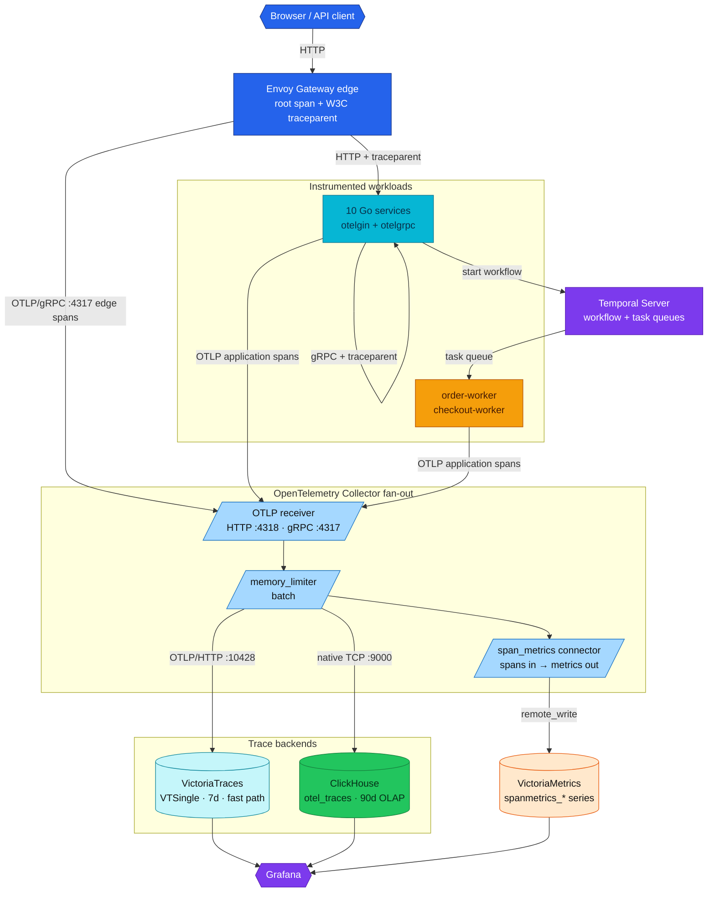
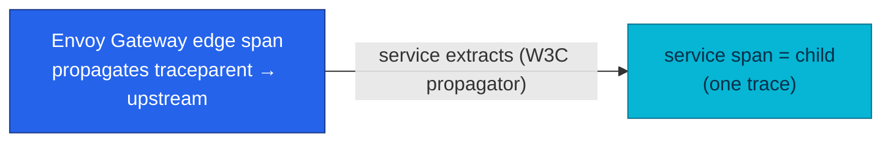

# Distributed Tracing Architecture

## Overview

This document explains the distributed tracing architecture used in this project, including the two-sink trace fan-out (VictoriaTraces + ClickHouse), the OpenTelemetry
Collector fan-out pattern, and the SDK-based instrumentation approach.

Tempo (both installs) and Jaeger were retired by
[RFC-0027](../../proposals/rfc/RFC-0027/README.md) — [ADR-058](../../proposals/adr/ADR-058-retire-jaeger/)
and [ADR-059](../../proposals/adr/ADR-059-retire-tempo/). Their own docs are kept
**archived** for the history: [jaeger.md](jaeger.md), [tempo.md](tempo.md).

## Architecture

### High-Level Flow


```mermaid
flowchart TB
    Client{{"Browser / API client"}}
    Edge["Envoy Gateway edge<br/>root span + W3C traceparent"]

    subgraph workloads["Instrumented workloads"]
        Services["10 Go services<br/>otelgin + otelgrpc"]
        Workers["order-worker<br/>checkout-worker"]
    end
    Temporal["Temporal Server<br/>workflow + task queues"]


    subgraph collectorNode["OpenTelemetry Collector fan-out"]
        Receiver[/"OTLP receiver<br/>HTTP :4318 · gRPC :4317"/]
        Processors[/"memory_limiter<br/>batch"/]
        SpanMetrics[/"span_metrics connector<br/>spans in → metrics out"/]
        Receiver --> Processors
        Processors --> SpanMetrics
    end

    subgraph backends["Trace backends"]
        VT[("VictoriaTraces<br/>VTSingle · 7d · fast path")]
        CH[("ClickHouse<br/>otel_traces · 90d OLAP")]
    end
    VM[("VictoriaMetrics<br/>spanmetrics_* series")]

    Grafana{{"Grafana"}}

    Client -->|"HTTP"| Edge
    Edge -->|"HTTP + traceparent"| Services
    Services -->|"gRPC + traceparent"| Services
    Services -->|"start workflow"| Temporal
    Temporal -->|"task queue"| Workers
    Edge -->|"OTLP/gRPC :4317 edge spans"| Receiver
    Services & Workers -->|"OTLP application spans"| Receiver
    Processors -->|"OTLP/HTTP :10428"| VT
    Processors -->|"native TCP :9000"| CH
    SpanMetrics -->|"remote_write"| VM
    VT --> Grafana
    CH --> Grafana
    VM --> Grafana

    classDef edge fill:#2563eb,color:#fff,stroke:#1e3a8a;
    classDef service fill:#06b6d4,color:#082f49,stroke:#0e7490;
    classDef worker fill:#f59e0b,color:#451a03,stroke:#b45309;
    classDef platform fill:#7c3aed,color:#fff,stroke:#5b21b6;
    classDef trace fill:#c5f6fa,color:#111,stroke:#0c8599;
    classDef collector fill:#a5d8ff,color:#111,stroke:#1971c2;
    classDef data fill:#22c55e,color:#052e16,stroke:#15803d;
    classDef metric fill:#ffe8cc,color:#111,stroke:#e8590c;
    class Client,Edge edge;
    class Services service;
    class Workers worker;
    class Receiver,Processors,SpanMetrics collector;
    class VT trace;
    class CH data;
    class VM metric;
    class Temporal,Grafana platform;
```

The trace **begins at the edge**: Envoy Gateway's native tracing opens the root
request span and propagates the W3C `traceparent` so each service span is a
child of the edge span (previously traces started at the service — a blind first
hop). See [Edge → service linkage](#edge--service-linkage) for the propagation
behavior that makes this reliable.

### Component Details

**0. Envoy Gateway (edge)**
- **Technology**: `EnvoyProxy.spec.telemetry.tracing` — native Envoy tracing, no plugin
- **Enabled by**: the `platform` GatewayClass's `parametersRef` — cluster CR `kubernetes/infra/configs/envoy-gateway/envoyproxy.yaml` (`samplingRate: 10`, **planned** — not yet run on Kind); local overlay `local-stack/gateway/eg/envoyproxy.yaml` patches `samplingRate: 100` (verified in local-stack)
- **Export**: OTLP **gRPC** to the collector on `:4317` — the tracing provider speaks gRPC only, unlike the app SDKs which export over OTLP HTTP `:4318`; `service.name` is derived as `<gateway>.<namespace>` (locally `platform.envoy-gateway-system`)
- **Role**: opens the **root request span** for every proxied call and propagates the W3C `traceparent` downstream, so the trace starts at the edge instead of the first service. Envoy's sampler is `ParentBased`, so an inbound sampled `traceparent` is always honored regardless of `samplingRate`
- **Logs**: the edge has **no OTLP logs path** — its only log output is the JSON access log on stdout, tailed by Vector (see [../logging/README.md](../logging/README.md))
- **Config**: `kubernetes/infra/configs/envoy-gateway/envoyproxy.yaml` (cluster); local mirror `local-stack/gateway/eg/envoyproxy.yaml`

**1. Microservices (SDK Approach)**
- **Technology**: Go OpenTelemetry SDK
- **Export Protocol**: OTLP HTTP
- **Endpoint**: `otel-collector-opentelemetry-collector.monitoring.svc.cluster.local:4318`
- **Sampling**: `ParentBased(TraceIDRatioBased)`, ratio 10% (prod default; dev sets `OTEL_SAMPLE_RATE=1.0` explicitly)
- **Implementation**: `pkg/obsx.SetupObservability()` — one call in each service's `main()` wires the `TracerProvider` + W3C propagator; `otelgin`/`otelgrpc` create the spans (no per-repo `middleware/tracing.go`)

**2. OpenTelemetry Collector**
- **Deployment**: Kubernetes Deployment (1 replica, scalable)
- **Function**: Fan-out layer — a `traces` pipeline distributing to **two** sinks (plus the `span_metrics` connector), and a `logs` pipeline going to **two** (fleet-wide app `otelzap` tee → VictoriaLogs *and* ClickHouse `otel_logs`). The edge has no OTLP logs path; its only log output is the JSON access log on stdout, tailed separately by Vector
- **Configuration**: `kubernetes/infra/controllers/tracing/otel-collector/otel-collector.yaml`
- **Ports**: 4317 (gRPC), 4318 (HTTP), 8888 (metrics)

**3. VictoriaTraces (fast path)** — `VTSingle` CR, VictoriaMetrics Operator
- **Purpose**: the interactive trace store — open a trace, follow a request
- **Storage**: local PVC, **7-day** retention; **no object-storage dependency**
- **Query**: Grafana, through the **Jaeger datasource type** pointed at
  `/select/jaeger` — the Jaeger *deployment* is gone, its *query API* is what
  VictoriaTraces speaks. Also queryable with LogsQL, and a Tempo-compatible API
  exists at `/select/tempo` (upstream **experimental** — not what our datasource uses)
- **Service graph**: `-servicegraph.enableTask=true` turns on the background task
  behind `/select/jaeger/api/dependencies`. It runs on a 1-minute interval with a
  1-minute lookbehind and is **not retroactive** — enabling it does not build a
  graph for spans already stored ([ADR-059](../../proposals/adr/ADR-059-retire-tempo/))
- **Config**: `kubernetes/infra/configs/observability/tracing/victoriatraces/vtsingle.yaml`

**4. ClickHouse (analytics tier)** — `otel_traces` table
- **Purpose**: SQL over spans, and the long-retention copy
- **Storage**: **90 days** — the longest of any store on the platform
- **Query**: Grafana ClickHouse datasource; the only place a `trace_id` JOIN
  across `otel_logs` ↔ `otel_traces` is possible in a single query
- **Config**: the collector's `clickhouse` exporter (see below);
  [ADR-023](../../proposals/adr/ADR-023-clickhouse-observability-olap/),
  [clickhouse](../clickhouse/README.md)

## Why Two Backends?

The OTel Collector fans out to **two** trace sinks. They are not redundant — each
answers a question the other answers badly.

### Use Cases

1. **VictoriaTraces — the fast path**
   - Day-to-day work: find a trace, open it, walk the spans
   - Local PVC, 7-day retention, **no object storage** — managed by the *same*
     VictoriaMetrics Operator as metrics (`VMSingle`) and logs (`VLSingle`), so
     one operator owns all three signals
   - Serves the Jaeger query API, which is how Grafana reaches it
   - Details: [victoriatraces.md](victoriatraces.md),
     [backend comparison](backends-comparison.md)

2. **ClickHouse — the analytics tier**
   - `otel_traces`, **90 days** vs 7 on the fast path
   - Aggregate questions a trace UI cannot answer: *which endpoint regressed
     this week*, *how many traces touched this customer*
   - The only place a `trace_id` JOIN across `otel_logs` ↔ `otel_traces` is
     possible in one query ([ADR-023](../../proposals/adr/ADR-023-clickhouse-observability-olap/),
     [clickhouse](../clickhouse/README.md))

### How it got here

The fan-out was **five** sinks until 2026-08: Tempo raw, Tempo chart
([ADR-040](../../proposals/adr/ADR-040-tempo-community-helm-chart/), a phase-1
parallel run that never reached phase 2), Jaeger, VictoriaTraces and ClickHouse.
Three of them earned their keep only as *learning* installs, and two of the three
cost more than they returned: Tempo needed two RustFS buckets and silently failed
TraceQL, Jaeger's in-memory store lost every trace on restart.
[RFC-0027](../../proposals/rfc/RFC-0027/README.md) retired all three, keeping the
one capability Tempo actually owned — the service graph — by turning on
VictoriaTraces' own service-graph task. See
[ADR-058](../../proposals/adr/ADR-058-retire-jaeger/) and
[ADR-059](../../proposals/adr/ADR-059-retire-tempo/).

## SDK vs Sidecar: Why SDK?

### Current Approach: OpenTelemetry SDK

**Implementation:** services never build the exporter, `TracerProvider`, or
propagator by hand. The shared **`pkg/obsx.SetupObservability()`** wires all of
that once (one call in `main()`); span instrumentation comes from the
`otelgin` (HTTP) and `otelgrpc` (east-west) contrib middlewares. See the
[OpenTelemetry policy page](../opentelemetry/README.md).

```go
// main() — one wiring point per service (pkg/obsx)
obs, err := obsx.SetupObservability(ctx, obsx.ConfigFromEnv())
if err != nil { /* fail startup */ }
defer obs.Shutdown(shutdownCtx)
```

Inside `SetupObservability`, `obsx` builds the OTLP trace exporter
(`otlptracehttp`), batches it into an `sdktrace.TracerProvider`, sets the W3C
`traceparent` propagator, and installs the sampler
`ParentBased(TraceIDRatioBased(rate))` — so downstream hops honour the root
(edge) decision and a service's own ratio only applies when it is itself the
root of a trace.

**Advantages:**
- ✅ **Full Control**: Custom instrumentation, sampling, attributes
- ✅ **Resource Efficient**: No sidecar container overhead
- ✅ **Language Optimized**: Go-specific optimizations
- ✅ **Simple Deployment**: No additional containers per pod
- ✅ **Learning Value**: Better understanding of OpenTelemetry internals

**Disadvantages:**
- ❌ **Code Changes**: Requires instrumentation in code
- ❌ **Language Specific**: Need SDK for each language
- ❌ **Application Overhead**: Export processing in app process

### Alternative: Sidecar Collector

**How it works:**
- OTel Collector runs as sidecar container in same pod
- Applications send traces to localhost collector
- Collector handles export to backends

**When to use:**
- Polyglot environments (Java, Python, Node.js, Go)
- Zero-code instrumentation needed
- Large-scale production (100+ services)
- Centralized collector management

**Why we don't use it:**
- All services are Go (homogeneous stack)
- Need custom instrumentation
- Resource efficiency is important
- Learning/POC environment

## Edge → service linkage

For the edge's root span and the downstream service span to land in the **same
trace**, the edge must propagate a W3C `traceparent` onto the upstream request
that the service then extracts. Envoy Gateway's tracing does this **natively** —
there is no propagation config to set or plugin to enable: every proxied
request carries `traceparent` upstream, whether or not the inbound request had
one.


```mermaid
flowchart LR
    E["Envoy Gateway edge span<br/>propagates traceparent → upstream"] -->|"service extracts (W3C propagator)"| L["service span = child<br/>(one trace)"]
    classDef edge fill:#2563eb,color:#fff,stroke:#1e3a8a;
    classDef service fill:#06b6d4,color:#082f49,stroke:#0e7490;
    class E edge;
    class L service;
```

**Verified:** local-stack (Envoy Gateway standalone, `samplingRate: 100`) links
**100%** of proxied requests edge→service. Service-to-service hops (the order
saga over gRPC) already link, confirming the service-side W3C propagator works
— no service change was needed.

> **Cluster sampling note:** the edge samples head-based at `samplingRate: 10`
> (10%, **planned** — the cluster CR has not yet run on Kind) as the trace
> root; the local overlay patches this to `100`. Each service wraps its ratio in
> **`ParentBased`** (`ParentBased(TraceIDRatioBased(rate))`, set inside
> `obsx.SetupObservability`), and so does the edge's own sampler — both honour
> whichever `traceparent.sampled` flag reaches them: a sampled remote parent →
> keep, an unsampled one → drop. A service's own ratio therefore only applies
> when it is itself the root of a trace. This guarantees *sampling
> completeness* — a trace the edge keeps is kept whole downstream regardless of
> any per-service rate drift — on top of the edge's native `traceparent`
> propagation.

## Configuration

### Microservices Configuration

All microservices use consistent configuration via Helm values:

```yaml
# kubernetes/apps/domains/*-rs.yaml (env section, per service)
env:
  - name: OTEL_COLLECTOR_ENDPOINT
    value: "otel-collector-opentelemetry-collector.monitoring.svc.cluster.local:4318"
  - name: OTEL_SAMPLE_RATE
    value: "0.1"  # 10% sampling
  - name: OTEL_SERVICE_NAME
    value: << inputs.name >>  # authoritative service.name
  - name: TRACING_ENABLED
    value: "true"
```

**Key Points:**
- All services point to OTel Collector (not directly to backends)
- Single endpoint simplifies configuration
- Easy to change backends without app changes

### OpenTelemetry Collector Configuration

The deployed pipelines (`kubernetes/infra/controllers/tracing/otel-collector/otel-collector.yaml`):

| Pipeline | Processors | Exporters |
|----------|------------|-----------|
| `traces` | `memory_limiter` → `batch` | VictoriaTraces (OTLP HTTP `:10428`) · ClickHouse `otel_traces` · **`span_metrics` connector** |
| `logs` | `memory_limiter` → `batch` | VictoriaLogs (OTLP HTTP `:9428`) · **ClickHouse** `otel_logs` |
| `metrics` | `memory_limiter` → `deltatocumulative` → `batch` | vmagent OTLP ingest `:8429` |
| `metrics/spanmetrics` | `batch` | VictoriaMetrics `prometheus_remote_write` — receives from the `span_metrics` connector ([ADR-057](../../proposals/adr/ADR-057-span-metrics-in-collector/)) |

Full walkthrough — component model, processor ordering, exporter durability,
the ClickHouse startup coupling, and the troubleshooting runbook:
[OpenTelemetry Collector](../opentelemetry/collector.md).

**Benefits:**
- Single configuration point
- Easy to add/remove backends
- Consistent processing (batching, memory limiting)

## Data Flow

### Trace Lifecycle

0. **Request hits the edge** — Envoy Gateway's tracing opens the **root span** and propagates `traceparent` upstream
1. **Request arrives** at the microservice carrying that `traceparent`
2. **SDK creates span** via Gin middleware (child of the edge span)
3. **Span attributes** added (service name, HTTP method, path)
4. **Span ends** and queued for export
5. **Batch export** every 5 seconds (or when batch full)
6. **OTLP HTTP** sent to OTel Collector
7. **Collector processes** (memory limit, batch)
8. **Fan-out** to VictoriaTraces (OTLP HTTP) and ClickHouse (`otel_traces`) — two sinks — while the `span_metrics` connector derives RED metrics from the same spans
9. **Backends store** traces
10. **Query** in Grafana: VictoriaTraces via the Jaeger datasource type, ClickHouse via SQL

### Sampling Strategy

**Current:** `ParentBased(TraceIDRatioBased(OTEL_SAMPLE_RATE))` — the root decides
by ratio, downstream honours the parent.
- **Production**: `OTEL_SAMPLE_RATE=0.1` (10%; the SDK default when unset)
- **Development**: `OTEL_SAMPLE_RATE=1.0` set explicitly (e.g. `local-stack`) — there
  is no automatic ENV-based adjustment; the ratio is exactly `OTEL_SAMPLE_RATE`.

**Rationale:**
- Reduces storage and processing overhead
- Still captures representative sample
- `ParentBased` keeps sampled traces whole across services (no torn traces)

**Future Improvements:**
- Adaptive sampling based on error rate
- Head-based sampling in collector
- Tail-based sampling for errors

## Production Considerations

### Current Limitations

1. **Single-node stores**: VictoriaTraces is one `VTSingle` on a PVC and ClickHouse is a single shard — neither is replicated, so a lost volume is lost traces. Acceptable here because traces are diagnostic data with a 7/90-day horizon, not a system of record.
2. **Collector HA**: Single replica (no redundancy); in-memory exporter queues drop on restart
3. **Security**: No TLS between components
4. **Service graph is not retroactive**: it is built by a background task from spans arriving *after* it was enabled ([ADR-059](../../proposals/adr/ADR-059-retire-tempo/))

### Recommended Improvements

**1. Durability for the fast path:** VictoriaTraces has no object-storage tier —
VictoriaLogs-style S3 support is on the upstream roadmap only. Today the
durability answer is ClickHouse's 90-day copy of the same spans, not a second
trace store. Revisit if/when upstream ships object storage.

**2. High Availability:** raise `replicaCount` behind the existing Service —
head sampling means no trace-ID-aware routing is required. See
[Collector § Deployment patterns](../opentelemetry/collector.md#deployment-patterns--and-which-one-this-platform-runs).

**3. Monitoring (in place):** collector self-metrics on `:8888` are scraped and
alerted — [`OtelMetricsPipelineExportFailures`](../runbooks/microservices/OtelMetricsPipelineExportFailures.md).
Remaining: a dedicated collector dashboard.

**4. Security:**
- Enable TLS between collector and backends
- Network policies for pod communication
- Authentication for query endpoints

## Deployment Methods: Helm vs Operator

The tracing stack answers this question **twice**, differently, and on purpose.

| Component | How it is deployed | Why |
|-----------|--------------------|-----|
| OTel Collector | **Helm chart** (`HelmRelease`) | The config *is* the deliverable — one YAML block of receivers/processors/exporters. A CRD would add a layer without removing one |
| VictoriaTraces | **CR** (`VTSingle`, VictoriaMetrics Operator) | The operator is already on the cluster for `VMSingle` + `VLSingle`; adding traces means one more CR, not one more controller |

Both are reconciled by Flux through the `tracing-local` Kustomization
(path `./controllers/tracing`, `dependsOn: [secrets-local, storage-local, clickhouse-local]`
— ClickHouse must be up before the collector's `create_schema` runs).

### Why not the OpenTelemetry Operator

It would buy **auto-instrumentation** (zero-code injection via annotations) and
multi-collector management across namespaces. Neither is a problem we have: every
service already calls `pkg/obsx.SetupObservability()`, so instrumentation is
explicit and version-pinned in `go.mod` rather than injected at admission time —
and there is exactly one collector. The operator also requires cert-manager for
its webhooks, which is a dependency edge for no gain here.

Worth revisiting if the platform ever needs to instrument a service **it does not
own the source of** — that is the case auto-instrumentation exists for.

## Related Documentation

- OpenTelemetry Collector manifests: `kubernetes/infra/controllers/tracing/otel-collector/otel-collector.yaml`
- VictoriaTraces manifest: `kubernetes/infra/configs/observability/tracing/victoriatraces/vtsingle.yaml`
- [APM Overview](./README.md)
- [VictoriaTraces](./victoriatraces.md) · [backend comparison](./backends-comparison.md)
- Archived, read-only: [Jaeger](./jaeger.md) · [Tempo](./tempo.md)

## References

- [OpenTelemetry Documentation](https://opentelemetry.io/docs/)
- [Jaeger Documentation](https://www.jaegertracing.io/docs/) — for the **query API**, which VictoriaTraces serves
- [VictoriaTraces Documentation](https://docs.victoriametrics.com/victoriatraces/)
- [CNCF Observability Best Practices](https://www.cncf.io/blog/)
- [OpenTelemetry Operator](https://opentelemetry.io/docs/platforms/kubernetes/operator/)

_Last updated: 2026-08-24 — RFC-0027 retired Tempo (both installs) and Jaeger, so the
fan-out is **two** trace sinks, not five. Rewritten: the overview, the topology diagram, the
backend rationale, the pipeline table (now including `metrics/spanmetrics`), the trace
lifecycle, the production limitations, and the deployment-method section — which described
deploying Jaeger._
