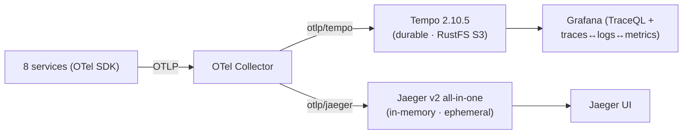

# Tracing Backends: Tempo vs Jaeger vs VictoriaTraces

A decision-oriented comparison of the three tracing backends relevant to this platform. It
explains **what runs today** (Tempo + Jaeger), and evaluates **VictoriaTraces** as a possible
future consolidation — it is **not deployed**; a dedicated deep-dive plan comes later.

> **TL;DR** — Today: **Tempo** is the durable backend (object storage on **RustFS**, TraceQL,
> native Grafana correlation); **Jaeger** is a secondary in-memory UI kept for learning. **VictoriaTraces**
> is the strategic "consolidate tracing into the VM operator" option, but it is **`v0.1.0` (not GA)**
> and has **no TraceQL** — evaluated and **planned**, not adopted yet.

## What runs today

The OTel Collector fans the **same** traces to both backends — see
[architecture.md](architecture.md). Tempo is durable; Jaeger is ephemeral by choice (see
[jaeger.md](jaeger.md#storage--in-memory-here-and-why-vs-tempo-on-rustfs)).

## Side-by-side

| Dimension | **Grafana Tempo** | **Jaeger** | **VictoriaTraces** |
|-----------|-------------------|------------|--------------------|
| Maturity | Mature, GA | Mature, GA (v2 = OTel-Collector distro) | **`v0.1.0` — early/experimental, not GA** |
| Storage | **Object storage** (S3/GCS/Azure/local) — uses **RustFS** here | memory / badger / ES / OpenSearch / Cassandra / ClickHouse — **no object storage** | stores traces in the **VictoriaLogs engine**; **no object storage needed** |
| Ingestion | OTLP, Jaeger, Zipkin | OTLP (v2), Jaeger, Zipkin | **OTLP only** |
| Query | **TraceQL** (scoped attrs + structural operators `>>`/`~`) | tag / duration / service filters (no query language) | **LogsQL** + **Jaeger query API** — **no TraceQL** |
| Grafana | **Native datasource** + traces↔logs↔metrics↔profiles correlation | Jaeger datasource / standalone UI | via the **Jaeger datasource** (no native VT datasource) |
| Service graph / span metrics | metrics-generator → remote_write to VM | dependency graph; SPM (needs a metrics backend) | built-in service-graph generation |
| Operator on this platform | Helm/manifests | Helm chart (all-in-one) | **`VTSingle`/`VTCluster` CRDs** — drop-in to the **VictoriaMetrics Operator** |
| Correlation sweet spot | single-pane Grafana across all 4 pillars | own UI | tightest **log↔trace** (traces *are* VictoriaLogs data, same LogsQL) |

## Trade-offs for this platform

The platform already runs the **VictoriaMetrics Operator** (VMSingle/VMAgent/VMAlert) and
**VictoriaLogs (VLSingle)** for metrics + logs, plus **RustFS** (S3). That shapes the call:

- **Tempo** fits the *capability* requirements best: TraceQL (relational span queries), durable
  object storage on the RustFS we already run, and native Grafana correlation with VM + VictoriaLogs
  + Pyroscope. It is mature and already wired. Cost: it is a Grafana-ecosystem component (one more
  "vendor"), and depends on object storage (which we have).
- **Jaeger** uniquely offers its standalone UI (trace compare, dependency graph). With **no S3
  backend** and in-memory storage it is not a durable store; here it is intentionally a **learning /
  comparison** UI, not the system of record.
- **VictoriaTraces** is the *consolidation* play: tracing would join metrics + logs under one
  operator, one ops model, one query family (**LogsQL**), with no object-storage dependency.
  Against that: **`v0.1.0`** (API-unstable, pre-GA) and **no TraceQL** — and Grafana sees it as a
  **Jaeger datasource**, so existing Tempo/TraceQL correlation links would be re-pointed.

## Recommendation / roadmap

1. **Now:** keep **Tempo** as the durable backend (RustFS S3, 7-day retention) and **Jaeger**
   in-memory as the secondary learning UI. This is the current state after the RustFS change.
2. **Later (separate deep-dive plan):** **pilot VictoriaTraces** (`VTSingle`) alongside, since it
   is a drop-in operator CRD with no object-storage dependency — cheap to trial. Evaluate
   LogsQL-trace querying + the Jaeger-datasource correlation on real data.
3. **Adopt VictoriaTraces as the sole backend only when** it reaches ~1.0/GA **and** the
   **TraceQL → LogsQL** trade-off is acceptable — for the prize of consolidating tracing into the
   VM operator beside metrics + logs.

## References

- [Tracing guide](./README.md) · [Architecture](./architecture.md) · [Jaeger guide](./jaeger.md)
- VictoriaMetrics Operator (metrics + logs today): [observability metrics](../metrics/README.md)
- Grafana Tempo: <https://grafana.com/docs/tempo/latest/> · Jaeger: <https://www.jaegertracing.io/docs/> · VictoriaTraces: <https://docs.victoriametrics.com/victoriatraces/>
