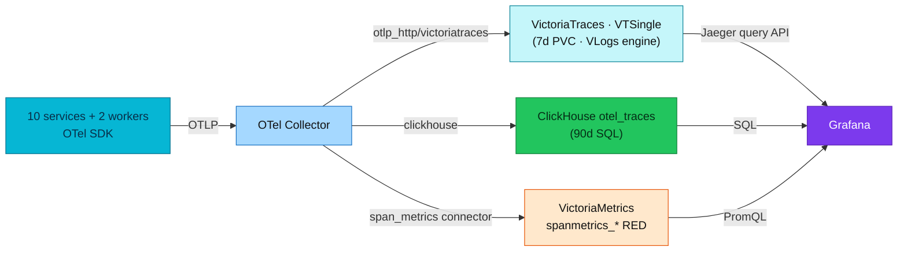

# Tracing Backends: what we chose, and what we gave up

The "which trace backend" question is **closed**. This page is the comparison that
closed it: what each engine offered, what the platform actually needed, and which
trade-offs we accepted. Live operational detail belongs to
[victoriatraces.md](victoriatraces.md) and [architecture.md](architecture.md); the
decisions belong to [ADR-058](../../proposals/adr/ADR-058-retire-jaeger/),
[ADR-059](../../proposals/adr/ADR-059-retire-tempo/) and
[RFC-0027](../../proposals/rfc/RFC-0027/README.md).

> **TL;DR** — the collector fans every span to **two** sinks. **VictoriaTraces**
> (`VTSingle`) is the fast path: 7-day PVC retention, no object storage, managed by
> the VictoriaMetrics Operator that already runs metrics and logs, and it serves the
> **Jaeger query API** that Grafana talks to. **ClickHouse** `otel_traces` is the
> 90-day SQL tier and the only place a `trace_id` JOIN against `otel_logs` is
> possible. **Tempo** and **Jaeger** were retired in 2026-08 — the columns below
> keep *why*.

## What runs today

```mermaid
flowchart LR
  Apps["10 services + 2 workers<br/>OTel SDK"] -->|OTLP| OC["OTel Collector"]
  OC -->|otlp_http/victoriatraces| V["VictoriaTraces · VTSingle<br/>(7d PVC · VLogs engine)"]
  OC -->|clickhouse| CH["ClickHouse otel_traces<br/>(90d SQL)"]
  OC -->|span_metrics connector| VM["VictoriaMetrics<br/>spanmetrics_* RED"]
  V -->|Jaeger query API| G["Grafana"]
  CH -->|SQL| G
  VM -->|PromQL| G
  classDef service fill:#06b6d4,color:#082f49,stroke:#0e7490;
  classDef trace fill:#c5f6fa,color:#111,stroke:#0c8599;
  classDef collector fill:#a5d8ff,color:#111,stroke:#1971c2;
  classDef platform fill:#7c3aed,color:#fff,stroke:#5b21b6;
  classDef data fill:#22c55e,color:#052e16,stroke:#15803d;
  classDef metric fill:#ffe8cc,color:#111,stroke:#e8590c;
  class Apps service;
  class OC collector;
  class V trace;
  class CH data;
  class VM metric;
  class G platform;
```

Both sinks receive the **same** spans — this is a fan-out, not a tiering. Nothing
moves from one store to the other; they expire independently at 7 and 90 days.

## Side-by-side

The two retired columns are kept because the trade-offs are the reasoning, and
because the same engines will come up again on other platforms.

| Dimension | **VictoriaTraces** (running) | **ClickHouse** (running) | **Grafana Tempo** (retired) | **Jaeger** (retired) |
|-----------|------------------------------|--------------------------|-----------------------------|----------------------|
| Storage | Local PVC, **VictoriaLogs engine**; no object storage needed | MergeTree table, 90d TTL | **Object storage** — needed a RustFS bucket (two, once the chart install joined) | memory / badger / ES / Cassandra / ClickHouse — **no object storage** |
| Query | **LogsQL** + **Jaeger API**; Tempo-compatible API is upstream-experimental | **SQL** — the only cross-signal JOIN | **TraceQL** (scoped attrs, structural `>>`/`~`) | tag / duration / service filters, no query language |
| Grafana | via the **Jaeger datasource type** | ClickHouse datasource | native datasource + 4-pillar correlation | Jaeger datasource / own UI |
| Service graph | **built-in task** — `-servicegraph.enableTask`, measured at 12 edges incl. DB dependencies | derivable in SQL, nothing built | metrics-generator (only the *chart* install was live) | dependency graph, needed Spark or a metrics backend |
| Operator story | **`VTSingle` CR** — same VictoriaMetrics Operator as `VMSingle` + `VLSingle` | Altinity operator | Helm/manifests, own ops model | Helm all-in-one |
| Why it lost | — | — | Two buckets, two installs, and **TraceQL failed silently** in Grafana | In-memory: **every trace lost on restart** |

## Trade-offs we accepted

Retiring Tempo was not free. Recorded honestly:

- **TraceQL is gone.** VictoriaTraces' Tempo-compatible API is marked
  *experimental* upstream, and we do not point a datasource at it. Relational span
  queries (`{ span.http.status_code >= 500 } >> { span.db.system = "postgresql" }`)
  are no longer available in a trace UI — the equivalent question now goes to
  ClickHouse as SQL, which is more verbose and not in the trace-view flow.
- **The service graph is not retroactive.** VictoriaTraces builds it from a
  background task with a 1-minute lookbehind, so enabling it does not backfill the
  graph for spans already stored ([ADR-059](../../proposals/adr/ADR-059-retire-tempo/)).
- **Grafana calls it "Jaeger".** The datasource *type* stays `jaeger` even though no
  Jaeger runs — a naming trap worth knowing before someone "cleans up" that
  datasource and takes tracing offline with it.
- **No object-storage tier for the fast path.** VictoriaTraces keeps traces on a
  PVC; S3 support is on the upstream roadmap only. ClickHouse's 90-day copy is the
  durability answer, not a second trace store.

What we gained: one operator instead of three ops models, one fewer storage
dependency, two RustFS buckets freed, and a fan-out that is small enough to hold in
your head.

## Storage footprint — still unmeasured

No measurement of ClickHouse against VictoriaTraces or VictoriaLogs exists on this
platform, and the public claims do not settle it either: both ClickHouse and
VictoriaLogs publish their compression advantage against *Elasticsearch and Loki*,
not against each other. Treat any sizing statement here as unproven. Reading `EXPLAIN indexes = 1` on
the live `otel_*` tables: [schema-and-queries](../clickhouse/schema-and-queries.md).

## References

- [Tracing guide](./README.md) · [Architecture](./architecture.md) · [VictoriaTraces](./victoriatraces.md)
- Decisions: [RFC-0027](../../proposals/rfc/RFC-0027/README.md) · [ADR-058](../../proposals/adr/ADR-058-retire-jaeger/) · [ADR-059](../../proposals/adr/ADR-059-retire-tempo/) · [ADR-057](../../proposals/adr/ADR-057-span-metrics-in-collector/)
- Archived, read-only: [Jaeger](./jaeger.md) · [Tempo](./tempo.md)
- VictoriaTraces: <https://docs.victoriametrics.com/victoriatraces/> · ClickHouse: <https://clickhouse.com/docs>

---
_Last updated: 2026-08-24 — rewritten for RFC-0027. The page used to compare three
candidates to help pick one; the pick is made, so it now records the decision and
the accepted costs. The old version also linked `README.md#tempo-runs-twice`, an
anchor that no longer exists._
