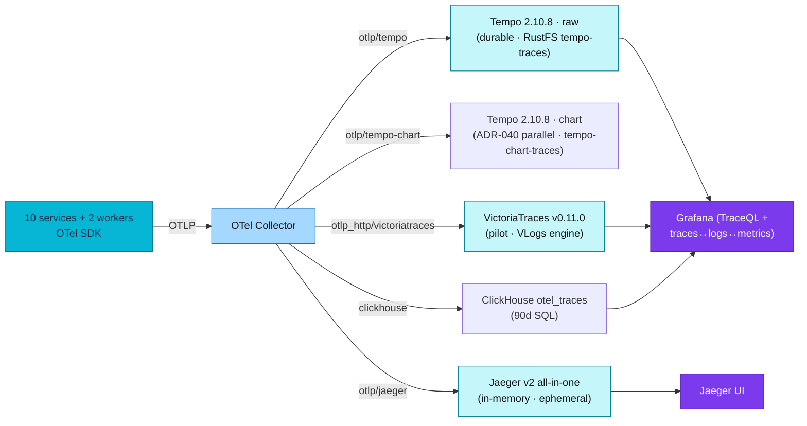

# Tracing Backends: Tempo vs Jaeger vs VictoriaTraces

A decision-oriented comparison of the tracing backends on this platform. The OTel Collector fans
the same traces to **five** sinks: **Tempo** from the raw manifests, **Tempo** again from the Helm
chart ([ADR-040](../../proposals/adr/ADR-040-tempo-community-helm-chart/) phase-1 parallel run),
**Jaeger**, **VictoriaTraces** (`VTSingle`, `v0.11.0`) as a pilot, and **ClickHouse** `otel_traces`
as a 90-day SQL tier. The three columns below compare the *engines*; the two Tempo installs share
one engine and differ in delivery — see [tracing/README.md](README.md#tempo-runs-twice).

> **TL;DR** — **Tempo** is the durable backend (object storage on **RustFS**, TraceQL, native Grafana
> correlation), and it runs **twice** during the ADR-040 parallel run; **Jaeger** is a secondary
> in-memory UI kept for learning; **ClickHouse** holds the same spans for 90 days for SQL and a
> `trace_id` JOIN against logs; **VictoriaTraces** is a
> **pilot** — the strategic "tracing in the VM operator beside metrics + logs" play, but
> still **`v0.x` (pre-GA)** with **partial TraceQL search compatibility** but no
> TraceQL metrics or pipelines. It does not replace Tempo/Jaeger; a future ADR
> decides any consolidation.

## What runs today

```mermaid
flowchart LR
  Apps["10 services + 2 workers<br/>OTel SDK"] -->|OTLP| OC["OTel Collector"]
  OC -->|otlp/tempo| T["Tempo 2.10.8 · raw<br/>(durable · RustFS tempo-traces)"]
  OC -->|otlp/tempo-chart| TC["Tempo 2.10.8 · chart<br/>(ADR-040 parallel · tempo-chart-traces)"]
  OC -->|otlp/jaeger| J["Jaeger v2 all-in-one<br/>(in-memory · ephemeral)"]
  OC -->|otlp_http/victoriatraces| V["VictoriaTraces v0.11.0<br/>(pilot · VLogs engine)"]
  OC -->|clickhouse| CH["ClickHouse otel_traces<br/>(90d SQL)"]
  T --> G["Grafana (TraceQL +<br/>traces↔logs↔metrics)"]
  J --> JU["Jaeger UI"]
  V --> G
  CH --> G
  classDef service fill:#06b6d4,color:#082f49,stroke:#0e7490;
  classDef trace fill:#c5f6fa,color:#111,stroke:#0c8599;
  classDef collector fill:#a5d8ff,color:#111,stroke:#1971c2;
  classDef platform fill:#7c3aed,color:#fff,stroke:#5b21b6;
  class Apps service;
  class OC collector;
  class T,J,V trace;
  class G,JU platform;
```

The OTel Collector fans the **same** traces to all five sinks — see
[architecture.md](architecture.md). Tempo is durable; Jaeger is ephemeral by choice (see
[jaeger.md](jaeger.md#storage--in-memory-here-and-why-vs-tempo-on-rustfs)); VictoriaTraces is the
pilot (see [victoriatraces.md](victoriatraces.md)).

## Side-by-side

| Dimension | **Grafana Tempo** | **Jaeger** | **VictoriaTraces** |
|-----------|-------------------|------------|--------------------|
| Maturity | Mature, GA | Mature, GA (v2 = OTel-Collector distro) | **`v0.11.0` — 0.x, pre-GA (piloted here)** |
| Storage | **Object storage** (S3/GCS/Azure/local) — uses **RustFS** here | memory / badger / ES / OpenSearch / Cassandra / ClickHouse — **no object storage** | stores traces in the **VictoriaLogs engine**; **no object storage needed** |
| Ingestion | OTLP, Jaeger, Zipkin | OTLP (v2), Jaeger, Zipkin | **OTLP only** |
| Query | **TraceQL** (scoped attrs + structural operators `>>`/`~`) | tag / duration / service filters (no query language) | **LogsQL** + **Jaeger and partial Tempo/TraceQL search APIs**; no TraceQL metrics/pipelines |
| Grafana | **Native datasource** + traces↔logs↔metrics↔profiles correlation | Jaeger datasource / standalone UI | via the **Jaeger datasource** (no native VT datasource) |
| Service graph / span metrics | **raw install inert** (`remote_write: []` — writes nowhere), but the **chart install is live**: span-metrics + service-graphs remote-written to vmagent with `send_exemplars: true`. Nothing consumes those series yet (`traces_spanmetrics` / `traces_service_graph` appear in no dashboard, alert or rule) | dependency graph; SPM (needs a metrics backend) | built-in service-graph generation |
| Operator on this platform | Helm/manifests | Helm chart (all-in-one) | **`VTSingle`/`VTCluster` CRDs** — drop-in to the **VictoriaMetrics Operator** |
| Correlation sweet spot | single-pane Grafana across all 4 pillars | own UI | tightest **log↔trace** (traces *are* VictoriaLogs data, same LogsQL) |

## Trade-offs for this platform

The platform already runs the **VictoriaMetrics Operator** (VMSingle/VMAgent/VMAlert) and
**VictoriaLogs (VLSingle)** for metrics + logs, plus **RustFS** (S3). That shapes the call:

- **Tempo** fits the *capability* requirements best: TraceQL (relational span queries), durable
  object storage on the RustFS we already run, and native Grafana correlation with VM + VictoriaLogs
  + Pyroscope. It is mature and already wired. Cost: it is a Grafana-ecosystem component (one more
  "vendor"), and depends on object storage (which we have).
- **Jaeger** uniquely offers its standalone UI (trace compare, dependency graph). With **no S3
  backend** and in-memory storage it is not a durable store; here it is intentionally a **learning /
  comparison** UI, not the system of record.
- **VictoriaTraces** is the *consolidation* play: tracing would join metrics + logs under one
  operator, one ops model, one query family (**LogsQL**), with no object-storage dependency.
  Against that: **`v0.11.0`** (0.x, pre-GA) and **partial TraceQL API
  coverage** (no metrics/pipelines) — and Grafana sees it as a **Jaeger
  datasource**, so existing Tempo/TraceQL correlation links would be re-pointed.

## Recommendation / roadmap

1. **Now:** five sinks receive every span. **Tempo** is the durable backend (RustFS S3, 7-day
   retention) and runs twice while ADR-040 phase 2 is outstanding; **Jaeger** in-memory is the
   secondary learning UI; **ClickHouse** is the 90-day SQL tier; **VictoriaTraces**
   (`VTSingle` v0.11.0) is a **pilot** (drop-in operator CRD, no object-storage dependency) — see
   [victoriatraces.md](victoriatraces.md). Evaluate LogsQL-trace querying + the Jaeger-datasource
   correlation on real data.

   Note when comparing storage footprints: no measurement of ClickHouse against VictoriaTraces or
   VictoriaLogs exists on this platform, or in the public claims either — both ClickHouse and
   VictoriaLogs publish their compression advantage against *Elasticsearch and Loki*, not against
   each other.
2. **Adopt VictoriaTraces as the sole backend only when** it reaches ~1.0/GA and
   the remaining **TraceQL coverage gap** is acceptable — for the prize of
   consolidating tracing into the
   VM operator beside metrics + logs. Decide via a future ADR.

## References

- [Tracing guide](./README.md) · [Architecture](./architecture.md) · [Jaeger guide](./jaeger.md)
- VictoriaMetrics Operator (metrics + logs today): [observability metrics](../metrics/README.md)
- Grafana Tempo: <https://grafana.com/docs/tempo/latest/> · Jaeger: <https://www.jaegertracing.io/docs/> · VictoriaTraces: <https://docs.victoriametrics.com/victoriatraces/>

---
_Last updated: 2026-08-23 — corrected to five sinks (`tempo-chart` and ClickHouse were absent), and the span-metrics row: the chart install's metrics-generator is live, which was the doc's own stated reason to prefer the chart._
Grafana datasource re-verified on the compose E2E gate); the TraceQL-coverage
assessment below still dates from the v0.9.4 review — no upstream change claims to
close that gap._
