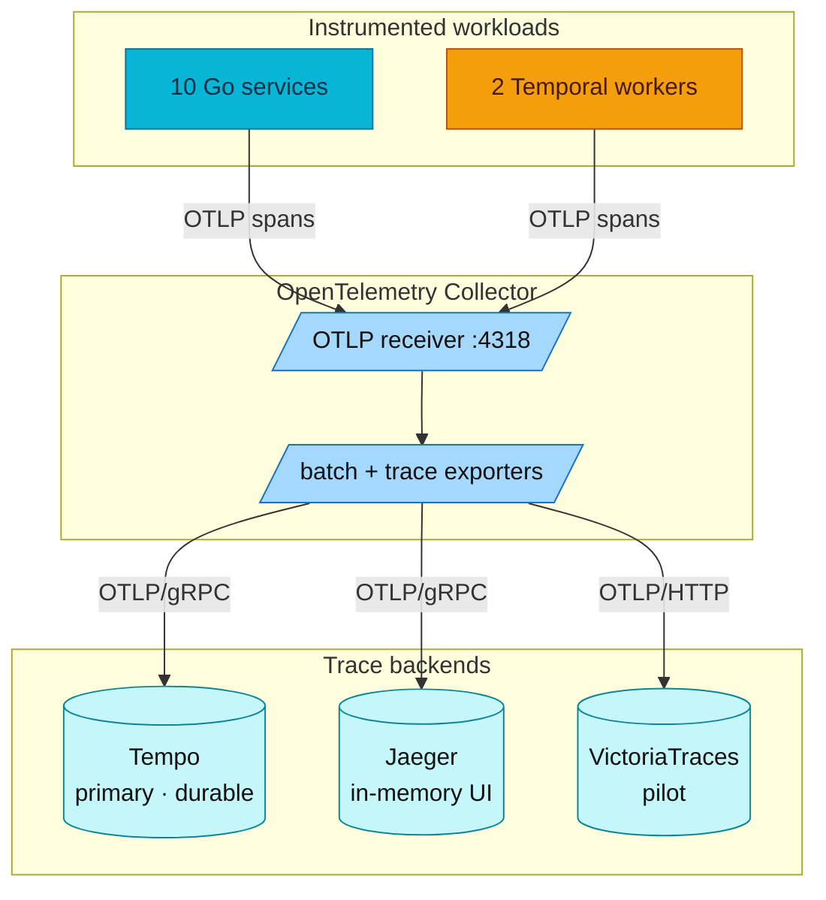

# Jaeger Distributed Tracing Guide

## Overview

Jaeger is an open-source distributed tracing platform that runs alongside Grafana Tempo (and the VictoriaTraces pilot — see [victoriatraces.md](victoriatraces.md)) in this project. All three backends receive the same traces via OpenTelemetry Collector fan-out, giving you the flexibility to use either UI.

## Quick Start

### Access Jaeger UI

```bash
kubectl port-forward -n monitoring svc/jaeger 16686:16686
```

Open: http://localhost:16686

### Deploy Jaeger

```bash
# Jaeger is deployed via GitOps (Flux) as part of infrastructure controllers.
# Trigger a reconcile if needed:
make sync
```

## Jaeger vs Tempo Comparison

| Feature | Jaeger | Tempo |
|---------|--------|-------|
| **UI** | Standalone, feature-rich | Via Grafana |
| **Query Language** | Service + Tags | TraceQL (powerful) |
| **Service Graph** | Built-in dependency graph | Via metrics-generator (configured but inert — `remote_write: []`) |
| **Compare Traces** | Built-in compare feature | Not available |
| **Trace Timeline** | Detailed, expandable | Basic in Grafana |
| **Storage** | Memory, Badger, ES, Cassandra | Local, S3, GCS, Azure |
| **Resource Usage** | Higher (all-in-one) | Lower |
| **Best For** | Debugging, development | Production at scale |

## When to Use Jaeger

**Use Jaeger when:**
- You need a standalone tracing UI
- Debugging specific requests
- Comparing two traces side-by-side
- Viewing service dependency graph
- Familiar with Jaeger from other projects

**Use Tempo when:**
- Integrated Grafana experience
- Using TraceQL for complex queries
- Cost-effective storage at scale
- Correlating traces with metrics/logs in same UI

## Jaeger UI Features

### 1. Search Traces

**By Service:**
1. Select service from dropdown
2. Set time range
3. Click "Find Traces"

**By Tags:**
```
http.status_code=500
http.method=POST
user.id=123
```

**By Duration:**
- Min/Max duration filters
- Find slow requests

### 2. Trace Detail View

**Timeline View:**
- Expand/collapse spans
- View span details (tags, logs, process)
- See timing breakdown

**Span Information:**
- Operation name
- Duration
- Tags (http.method, http.url, etc.)
- Logs (events within span)
- Process info (service, hostname)

### 3. Compare Traces

1. Find first trace
2. Click "Compare" button
3. Search for second trace
4. Side-by-side comparison

**Use cases:**
- Compare slow vs fast requests
- Debug regression issues
- Analyze A/B differences

### 4. Service Dependencies

Navigate to "System Architecture" tab:
- Visual service dependency graph
- Request flow between services
- Identify critical paths

### 5. Deep Dependency Graph

Shows transitive dependencies:
- Direct dependencies
- Indirect dependencies
- Dependency depth

## Architecture in This Project



**Key Points:**
- Applications send to OTel Collector (not Jaeger directly)
- Same traces appear in Tempo, Jaeger, and VictoriaTraces (pilot)
- No data duplication at application level

## Configuration

### Jaeger All-in-One

Located at: `kubernetes/infra/controllers/tracing/jaeger/jaeger.yaml`. Deployed via the
**`jaegertracing/jaeger` Helm chart** (Jaeger v2, all-in-one) — **not** the Jaeger Operator.

```yaml
# jaeger_storage backend (Jaeger v2 OTel-collector config)
backends:
  primary_store:
    memory:
      max_traces: 100000   # in-memory ring buffer
```

### Storage — in-memory here, and why (vs Tempo on RustFS)

Jaeger in this project runs **in-memory** (`max_traces: 100000`): traces are a bounded ring
buffer **lost on every pod restart** — intentionally, because Jaeger is kept only as a
**second UI for learning/comparison**; **Tempo is the durable backend** (object storage on
RustFS, 7-day retention).

**Important asymmetry:** unlike Tempo, **Jaeger has no S3 / object-storage backend.** Its
persistence options are:

| Option | Type | Fit |
|--------|------|-----|
| `memory` (current) | in-process ring buffer | ephemeral; lost on restart |
| `badger` | embedded KV on a **PVC** | single-node persistence (homelab) |
| Elasticsearch / OpenSearch | external search cluster | production, heavy |
| Cassandra / ClickHouse | external database | production, heavy |

So "make Jaeger durable on RustFS" is **not possible** — Jaeger can't speak S3. To persist it
you'd switch to `badger` (a PVC) for single-node, or stand up an external ES/ClickHouse. We
deliberately keep `memory` and let **Tempo** own durable trace storage. See the
[backend comparison](./backends-comparison.md).

### Grafana Datasource

Located at: `kubernetes/infra/configs/observability/grafana/datasource-jaeger.yaml`

```yaml
datasource:
  name: Jaeger
  type: jaeger
  url: http://jaeger.monitoring.svc.cluster.local:16686
  jsonData:
    tracesToLogsV2:
      datasourceUid: victorialogs
    tracesToMetrics:
      datasourceUid: prometheus
```

## Common Workflows

### Debug Slow Request

1. Open Jaeger UI
2. Select service
3. Set Min Duration (e.g., 500ms)
4. Find slow trace
5. Expand spans to find bottleneck
6. Check span tags for details

### Find Errors

1. Search with tag: `error=true`
2. Or: `http.status_code=500`
3. View trace timeline
4. Check span logs for error details

### Trace Cross-Service Request

1. Find trace by trace-id
2. View full timeline
3. See all services involved
4. Identify latency at each hop

### Compare Before/After

1. Find trace from before change
2. Copy trace ID
3. Find trace from after change
4. Use Compare feature
5. Analyze differences

## Troubleshooting

### No Traces in Jaeger

1. **Check Jaeger is running:**
   ```bash
   kubectl get pods -n monitoring -l app.kubernetes.io/name=jaeger
   ```

2. **Check OTel Collector:**
   ```bash
   kubectl logs -n monitoring -l app.kubernetes.io/name=opentelemetry-collector
   ```

3. **Verify application endpoint:**
   ```bash
   kubectl exec -n auth deployment/auth -- env | grep OTEL_COLLECTOR_ENDPOINT
   # Should show: otel-collector-opentelemetry-collector.monitoring.svc.cluster.local:4318
   ```

### Traces in Tempo but not Jaeger

1. **Check OTel Collector export to Jaeger:**
   ```bash
   kubectl logs -n monitoring -l app.kubernetes.io/name=opentelemetry-collector | grep jaeger
   ```

2. **Verify Jaeger OTLP is enabled:**
   ```bash
   kubectl logs -n monitoring -l app.kubernetes.io/name=jaeger | grep OTLP
   ```

### UI Shows "No Traces Found"

1. Extend time range
2. Check service name is correct
3. Generate some traffic first
4. Wait for traces to be indexed

## Best Practices

### 1. Use Meaningful Service Names

```yaml
# Good (this platform injects the bare input name, e.g. "order")
OTEL_SERVICE_NAME: "order"

# Bad
OTEL_SERVICE_NAME: "app1"
```

### 2. Add Custom Tags

```go
span.SetAttributes(
    attribute.String("user.id", userID),
    attribute.String("order.id", orderID),
)
```

### 3. Use Span Events for Debugging

```go
span.AddEvent("cache_hit", trace.WithAttributes(
    attribute.String("key", cacheKey),
))
```

### 4. Set Meaningful Operation Names

```go
ctx, span := tracer.Start(ctx, "ProcessOrder")
// Not: tracer.Start(ctx, "handler")
```

## Related Documentation

- [APM Overview](./README.md)
- [Tracing Guide](./README.md)
- OTel Collector config: `kubernetes/infra/controllers/tracing/otel-collector/otel-collector.yaml`
- [Jaeger Official Docs](https://www.jaegertracing.io/docs/)

---
_Last updated: 2026-07-14_
