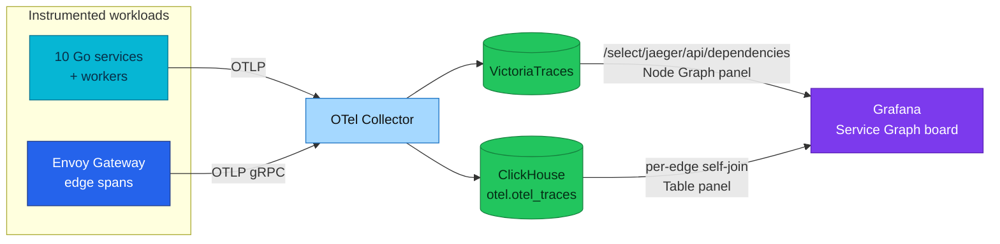

# Service Graph

Who calls whom on this platform, and how each of those calls is doing — from two
sources, because no single one carries both halves.

| Fact | Value |
|------|-------|
| **Status** | Deployed |
| **Topology source** | VictoriaTraces dependency API — `/select/jaeger/api/dependencies` |
| **Per-edge RED source** | ClickHouse self-join over `otel.otel_traces` |
| **Dashboard** | **Service Graph** (`uid: service-graph`), folder *Microservices / Golden Signals* |
| **Manifests** | [`grafana-dashboard-service-graph.yaml`](../../../kubernetes/infra/configs/observability/grafana/dashboards/grafana-dashboard-service-graph.yaml), [`service-graph.json`](../../../kubernetes/infra/configs/observability/grafana/dashboards/service-graph.json) |
| **Decision record** | [ADR-059](../../proposals/adr/ADR-059-retire-tempo/README.md) |
| **Measured** | 34 dependency-API edges, 24 ClickHouse service→service edges (2026-08-25, Kind) |

## Why there are two sources

Tempo produced a service map from per-edge **metrics**: a `service_graph`
processor paired client and server spans and emitted `callCount`, failure and
latency as Prometheus series. Retiring Tempo ([ADR-059](../../proposals/adr/ADR-059-retire-tempo/README.md))
retired that producer, and the replacement splits in two:

| Question | Answer comes from | What it cannot tell you |
|----------|-------------------|-------------------------|
| What is the shape of the system right now? | VictoriaTraces dependency API | Nothing about failure or latency — the API returns `callCount` only |
| How is one specific edge doing? | ClickHouse self-join | Nothing in PromQL — it is a query, not a series, so it cannot back an alert |

That split is the deliberate trade recorded in the ADR: no new component on the
collector's hot path, at the cost of per-edge alerting. If per-edge alerting ever
becomes a real requirement rather than a hypothetical, the ADR names the
`service_graph` connector as the thing to adopt.

## Architecture



## The topology half — VictoriaTraces dependency API

Grafana's Jaeger datasource type has a native **Dependency graph** query
(`queryType: dependencyGraph`); the Service Graph board's Node Graph panel uses
it against the `victoriatraces` datasource. Nothing else is configured — the
datasource already carries `nodeGraph.enabled: true`.

Three properties matter in practice:

- **It is derived, not stored.** VictoriaTraces recomputes edges from spans in a
  background task on a **1-minute** interval.
- **It is therefore not retroactive.** A freshly rebuilt cluster shows an empty
  graph until traffic flows — during the 2026-08-24 rebuild it returned **0
  edges for eleven minutes** before the first task run. An empty map is not
  evidence of a broken map.
- **It includes database edges.** `checkout -> checkout:postgresql`,
  `product -> product:redis` and the like appear as nodes, derived from client
  spans that carry `db.system`. This is why the API reports more edges (34) than
  the service→service SQL below (24).

## The per-edge half — the ClickHouse self-join

An edge is a parent span and its child: the caller's `Client` span and the
callee's `Server` span, joined on `TraceId` plus `ParentSpanId → SpanId`.

```sql
SELECT
    caller.ServiceName                                                   AS client,
    callee.ServiceName                                                   AS server,
    count()                                                              AS callCount,
    countIf(caller.StatusCode = 'Error' OR callee.StatusCode = 'Error')  AS failed,
    round(quantile(0.95)(caller.Duration) / 1e6, 2)                      AS p95_ms
FROM otel.otel_traces AS caller
INNER JOIN otel.otel_traces AS callee
    ON  callee.TraceId      = caller.TraceId
    AND callee.ParentSpanId = caller.SpanId
WHERE caller.Timestamp >= now() - INTERVAL 24 HOUR
  AND callee.Timestamp >= now() - INTERVAL 24 HOUR
  AND caller.SpanKind = 'Client'
  AND callee.SpanKind = 'Server'
GROUP BY client, server
ORDER BY callCount DESC
```

In the dashboard panel the two `now() - INTERVAL 24 HOUR` bounds are
`$__fromTime` / `$__toTime`, so the table follows the time picker.

To see whether this self-join prunes granules (`EXPLAIN indexes = 1`), use
[schema-and-queries](../clickhouse/schema-and-queries.md).

Result on the Kind cluster, 2026-08-25, immediately after the K0–K6 gate:

```
┌─client─────────────────┬─server──────────┬─callCount─┬─failed─┬─p95_ms─┐
│ platform.envoy-gateway │ product         │       513 │      0 │   1.74 │
│ platform.envoy-gateway │ keycloak        │       134 │      0 │ 134.64 │
│ order-worker           │ order-worker    │        36 │      0 │   0.25 │
│ platform.envoy-gateway │ cart            │        15 │      0 │ 323.15 │
│ checkout               │ checkout-worker │        12 │      0 │ 117.83 │
│ platform.envoy-gateway │ checkout        │        10 │      0 │  844.6 │
│ payment                │ mockpay         │         5 │      0 │ 165.46 │
└────────────────────────┴─────────────────┴───────────┴────────┴────────┘
```
(24 rows; the seven largest shown.)

### Four things to know before trusting a number here

- **`failed` reads 0 across every edge today, and that is a measurement, not a
  bug.** It counts spans whose status is `Error`. Verified on this cluster:
  **zero** `Server`-kind spans have *ever* carried `StatusCode = 'Error'` — the
  services record HTTP status as an attribute and leave span status `Unset`, even
  for a 4xx. The only Error spans on the platform are `Client`-kind: the edge's
  egress to Grafana returning 401 during its own login flow, and one Valkey
  `evalsha` NOSCRIPT. The column becomes meaningful the moment a callee sets span
  status; until then, read failure from the RED span metrics
  (the **RED Span Metrics** board, [ADR-057](../../proposals/adr/ADR-057-span-metrics-in-collector/README.md)) instead.
- **`p95_ms` is what the *caller waited for*.** It is taken from the caller's
  span, not the callee's. That distinction is visible on
  `checkout -> checkout-worker`: measured caller-side it is **118 ms** (the
  Temporal `StartWorkflow` call), and callee-side it would be **3434 ms** (the
  workflow's own execution). Neither is wrong; they answer different questions,
  and this table answers the caller's.
- **The self-edge is real.** `order-worker -> order-worker` is the worker
  invoking its own Temporal activities.
- **An uninstrumented callee has no edge.** The join needs a `Server` span, so a
  call to Grafana or Temporal UI is invisible here even though the gateway
  recorded the `Client` span.

### Cost

The join scans `otel.otel_traces` twice with no materialized columns or skip
indexes for it. That is acceptable for an interactive deep dive over hours;
it is *not* something to point a 30-second dashboard refresh at over 90 days.
Keep the time picker tight.

## Operations

**Open it:** Grafana → *Microservices / Golden Signals* → **Service Graph**.

**The map is empty.**

1. Confirm traffic exists at all — the Node Graph is derived from spans, so no
   spans means no map.
2. Wait one minute. The background task interval is 1 minute and it is not
   retroactive.
3. Query the API directly to separate a data problem from a panel problem:
   ```bash
   kubectl port-forward -n monitoring svc/grafana-service 3000:3000
   curl -s -u admin:<pw> \
     "http://localhost:3000/api/datasources/proxy/uid/victoriatraces/api/dependencies?endTs=$(date +%s000)&lookback=86400000" \
     | jq '.data | length'
   ```
   A number greater than zero here with an empty panel is a panel problem.

**The table is empty or slow.** Narrow the time range first. To run the query
outside Grafana:

```bash
kubectl port-forward -n monitoring svc/clickhouse-clickhouse 8123:8123
# credentials: secret/clickhouse-credentials in the monitoring namespace
curl -s "http://<user>:<pw>@localhost:8123/" --data-binary @query.sql
```

Note the cluster's ClickHouse user is **not** the local-stack one — compose uses
`default:otel`, the cluster reads `secret/clickhouse-credentials`.

## References

- [ADR-059 — Retire Tempo](../../proposals/adr/ADR-059-retire-tempo/README.md) — the decision, its trade, and when to re-open it
- [VictoriaTraces](victoriatraces.md) — the backend and its Jaeger-API surface
- [Tracing architecture](architecture.md) — how spans reach both stores
- [ClickHouse](../clickhouse/README.md) — the OTel schema and retention ([schema-and-queries](../clickhouse/schema-and-queries.md))
- [Grafana](../grafana/README.md) — datasources, dashboards and how they are provisioned

---
_Last updated: 2026-08-25_
