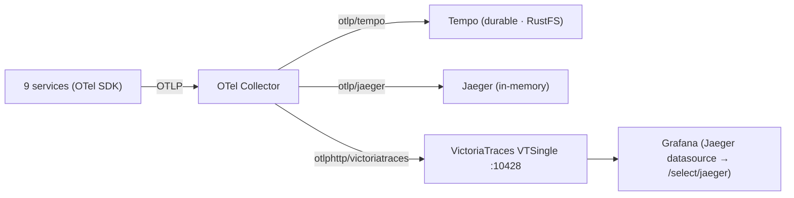

# VictoriaTraces (pilot)

**VictoriaTraces** is deployed as a **pilot, third tracing backend** alongside [Tempo](./README.md)
and [Jaeger](./jaeger.md) — the OTel Collector fans the same OTLP traces to all three. The point of
the pilot is to evaluate the **VM-operator consolidation** story: tracing managed by the *same*
VictoriaMetrics Operator (and *same* storage engine) as metrics (`VMSingle`) and logs (`VLSingle`),
with **no object-storage dependency**.

> **Maturity caveat** — VictoriaTraces is **`v0.6.0` (0.x, pre-GA)**. This is a **pilot**, not a
> replacement: Tempo (durable on RustFS) + Jaeger stay. Any consolidation onto VictoriaTraces is a
> future decision (ADR), gated on ~1.0/GA and accepting the **TraceQL → LogsQL** trade-off. See the
> full [backends comparison](./backends-comparison.md).

## How it fits



VictoriaTraces stores traces in the **VictoriaLogs engine** (traces-as-logs) — so the tightest
correlation is **log↔trace** via the same LogsQL your `VLSingle` already uses. A single port
**`:10428`** serves everything: OTLP-HTTP ingest, the Jaeger query API, LogsQL, and `/metrics`.

## Deployment — `VTSingle` (operator-managed)

CR: [`kubernetes/infra/configs/monitoring/victoriametrics/vtsingle.yaml`](../../../kubernetes/infra/configs/monitoring/victoriametrics/vtsingle.yaml)
— a drop-in `operator.victoriametrics.com/v1` CRD, same ops model as `VMSingle`/`VLSingle`:

| Field | Value |
|-------|-------|
| `image` | `victoriametrics/victoria-traces:v0.6.0` (pinned — 0.x, fast-moving) |
| `retentionPeriod` | `7d` (matches VMSingle/VLSingle) |
| `storage` | 10Gi PVC (VictoriaLogs engine — **no object storage**) |
| `useStrictSecurity` | `true` (non-root, hardened) |
| metrics | operator auto-creates a `VMServiceScrape` (no manual ServiceMonitor) |

The operator creates a Service for the CR (VM-operator convention **`vtsingle-victoria-traces`** in
`monitoring`, port `10428`) — **verify the exact name at apply**:

```bash
kubectl get svc -n monitoring | grep victoria-traces
```

## Ingestion (OTLP-HTTP)

The OTel Collector exports to VictoriaTraces over **OTLP-HTTP** (its gRPC `:4317` is TLS-by-default,
so HTTP is simpler). In
[`otel-collector.yaml`](../../../kubernetes/infra/controllers/tracing/otel-collector/otel-collector.yaml):

```yaml
exporters:
  otlphttp/victoriatraces:
    traces_endpoint: http://vtsingle-victoria-traces.monitoring.svc.cluster.local:10428/insert/opentelemetry/v1/traces
    tls: { insecure: true }
    compression: gzip
# pipelines.traces.exporters: [otlp/tempo, otlp/jaeger, otlphttp/victoriatraces]
```

## Querying

- **Grafana** — a **Jaeger-type** datasource (uid `victoriatraces`, there is no native VT datasource)
  pointed at the Jaeger query API: `http://vtsingle-victoria-traces.monitoring.svc.cluster.local:10428/select/jaeger`.
  `tracesToLogsV2`/`tracesToMetrics` are wired to VictoriaLogs/VictoriaMetrics like the other backends.
- **UI / API** — exposed at `victoriatraces.duynh.me` (Kong ingress → `:10428`).
- **LogsQL** (advanced, traces-as-logs) — `POST /select/logsql/query`, e.g.:

  ```bash
  curl -X POST "http://localhost:10428/select/logsql/query" \
    --data-urlencode 'query=resource.service.name:product' --data-urlencode 'limit=50'
  ```

  *(LogsQL field names map from OTLP attributes; verify the exact field syntax against your own
  trace data — the Jaeger datasource is the primary query path in Grafana.)*

## Try it locally (docker-compose)

The [`local-stack`](../../../local-stack/README.md) wires the same path on a laptop — no cluster
needed: the 9 services emit OTLP-HTTP to an **OTel Collector**, which re-exports to a single-node
**VictoriaTraces** container, and you audit traces in a bundled **Grafana**.

```bash
cd local-stack && docker compose up -d --build
# generate spans: log in alice/password123 at http://localhost:3001 and run a checkout
open http://localhost:3002   # Grafana → Explore → VictoriaTraces → pick a service
```

The collector is mandatory because the services' standard OTLP-HTTP SDK posts to `…/v1/traces`,
which can't be retargeted at VictoriaTraces' `/insert/opentelemetry/v1/traces` ingest path directly.
Quick ingest check: `curl 'http://localhost:10428/select/jaeger/api/services'`.

## Status

Pilot, wired in the manifests — the collector's 3-way fan-out exporter and the Grafana
`victoriatraces` datasource are both deployed config (`otel-collector.yaml`,
`datasource-victoriatraces.yaml`); v0.6.0 verified standalone (ingests OTLP-HTTP traces; the
Jaeger API returns them). Tempo + Jaeger are unchanged and Tempo stays primary/durable.
See [backends-comparison.md](./backends-comparison.md) for the decision context.

---
_Last updated: 2026-07-07_
