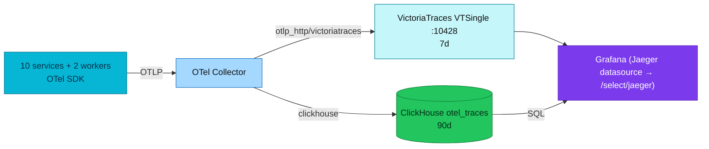

# VictoriaTraces

**VictoriaTraces** is the platform's **fast trace path**: the store you open when
you are following one request. The OTel Collector fans the same OTLP traces to
**two** sinks — VictoriaTraces (7d) and ClickHouse `otel_traces` (90d) — see
[tracing/README.md](./README.md). It delivers the **VM-operator consolidation**
story: tracing managed by the *same* VictoriaMetrics Operator (and *same* storage
engine) as metrics (`VMSingle`) and logs (`VLSingle`), with **no object-storage
dependency**.

> **It started as a pilot.** Tempo was the primary store and Jaeger the secondary
> UI until [RFC-0027](../../proposals/rfc/RFC-0027/README.md) retired both
> ([ADR-058](../../proposals/adr/ADR-058-retire-jaeger/),
> [ADR-059](../../proposals/adr/ADR-059-retire-tempo/)). VictoriaTraces is
> still **`v0.x` (pre-GA)** — that risk was accepted rather than eliminated, and
> the cost we accepted is TraceQL: see
> [backends-comparison § Trade-offs](./backends-comparison.md#trade-offs-we-accepted).

## How it fits


```mermaid
flowchart LR
  Apps["10 services + 2 workers<br/>OTel SDK"] -->|OTLP| OC["OTel Collector"]
  OC -->|otlp_http/victoriatraces| V["VictoriaTraces VTSingle :10428<br/>7d"]
  OC -->|clickhouse| CH[("ClickHouse otel_traces<br/>90d")]
  V --> G["Grafana (Jaeger datasource → /select/jaeger)"]
  CH -->|SQL| G
  classDef service fill:#06b6d4,color:#082f49,stroke:#0e7490;
  classDef trace fill:#c5f6fa,color:#111,stroke:#0c8599;
  classDef collector fill:#a5d8ff,color:#111,stroke:#1971c2;
  classDef platform fill:#7c3aed,color:#fff,stroke:#5b21b6;
  classDef data fill:#22c55e,color:#052e16,stroke:#15803d;
  class Apps service;
  class OC collector;
  class V trace;
  class CH data;
  class G platform;
```

VictoriaTraces stores traces in the **VictoriaLogs engine** (traces-as-logs) — so the tightest
correlation is **log↔trace** via the same LogsQL your `VLSingle` already uses. A single port
**`:10428`** serves everything: OTLP-HTTP ingest, the Jaeger query API, LogsQL, and `/metrics`.

## Deployment — `VTSingle` (operator-managed)

CR: [`kubernetes/infra/configs/observability/tracing/victoriatraces/vtsingle.yaml`](../../../kubernetes/infra/configs/observability/tracing/victoriatraces/vtsingle.yaml)
— a drop-in `operator.victoriametrics.com/v1` CRD, same ops model as `VMSingle`/`VLSingle`:

| Field | Value |
|-------|-------|
| `image` | `victoriametrics/victoria-traces:v0.11.0` (pinned — 0.x, fast-moving) |
| operator | chart `0.66.2` / app `v0.73.1` (matching CRDs rendered by the same chart) |
| `retentionPeriod` | `7d` (matches VMSingle/VLSingle) |
| `storage` | 10Gi PVC (VictoriaLogs engine — **no object storage**) |
| `useStrictSecurity` | `true` (non-root, hardened) |
| metrics | operator auto-creates a `VMServiceScrape` (no manual ServiceMonitor) |

The operator creates a Service for the CR (VM-operator convention **`vtsingle-victoria-traces`** in
`monitoring`, port `10428`) — **verify the exact name at apply**:

```bash
kubectl get svc -n monitoring | grep victoria-traces
```

The standalone `victoria-metrics-operator-crds` chart is an alternative CRD
ownership model. This platform does not install it because the operator chart
already renders and upgrades matching CRDs; installing both would give two
Helm releases ownership of the same cluster-scoped resources.

## Ingestion (OTLP-HTTP)

The OTel Collector exports to VictoriaTraces over **OTLP-HTTP** (its gRPC `:4317` is TLS-by-default,
so HTTP is simpler). In
[`otel-collector.yaml`](../../../kubernetes/infra/controllers/tracing/otel-collector/otel-collector.yaml):

```yaml
exporters:
  otlp_http/victoriatraces:
    traces_endpoint: http://vtsingle-victoria-traces.monitoring.svc.cluster.local:10428/insert/opentelemetry/v1/traces
    tls: { insecure: true }
    compression: gzip
# pipelines.traces.exporters: [otlp_http/victoriatraces, clickhouse, span_metrics]
```

## Querying

- **Grafana** — a **Jaeger-type** datasource (uid `victoriatraces`, there is no native VT datasource)
  pointed at the Jaeger query API: `http://vtsingle-victoria-traces.monitoring.svc.cluster.local:10428/select/jaeger`.
  `tracesToLogsV2`/`tracesToMetrics` are wired to VictoriaLogs/VictoriaMetrics like the other backends.
- **Tempo-compatible API** — `/select/tempo` exposes partial TraceQL search
  (coverage last assessed on v0.9.4; the 0.10/0.11 releases announce no change here)
  and is marked **experimental** upstream. This platform's datasource does **not**
  use it — the Jaeger API is the query path. TraceQL metrics and pipelines have no
  equivalent here at all; that question goes to ClickHouse as SQL.
- **Service graph** — `/select/jaeger/api/dependencies`, gated on
  `-servicegraph.enableTask=true` in the CR. The task runs on a 1-minute interval
  with a 1-minute lookbehind and is **not retroactive**: before it was enabled the
  endpoint answered `200` with an empty list, which reads exactly like "no
  dependencies" ([ADR-059](../../proposals/adr/ADR-059-retire-tempo/)).
- **UI / API** — exposed at `victoriatraces.duynh.me` (the `victoriatraces` HTTPRoute → `:10428`).
- **LogsQL** (advanced, traces-as-logs) — `POST /select/logsql/query`, e.g.:

  ```bash
  curl -X POST "http://localhost:10428/select/logsql/query" \
    --data-urlencode 'query=resource.service.name:product' --data-urlencode 'limit=50'
  ```

  *(LogsQL field names map from OTLP attributes; verify the exact field syntax against your own
  trace data — the Jaeger datasource is the primary query path in Grafana.)*

## Try it locally (docker-compose)

The [`local-stack`](../../../local-stack/README.md) wires the same path on a laptop — no cluster
needed: the 10 services and 2 workers emit OTLP-HTTP to an **OTel Collector**,
which re-exports to a single-node **VictoriaTraces** container and to **ClickHouse**, and you audit traces in a bundled **Grafana**.

```bash
cd local-stack && docker compose up -d --build
# generate spans: log in alice/password123 at http://localhost:3001 and run a checkout
open http://localhost:3002   # Grafana → Explore → VictoriaTraces → pick a service
```

The collector is mandatory because the services' standard OTLP-HTTP SDK posts to `…/v1/traces`,
which can't be retargeted at VictoriaTraces' `/insert/opentelemetry/v1/traces` ingest path directly.
Quick ingest check: `curl 'http://localhost:10428/select/jaeger/api/services'`.

## Status

**Primary trace store.** The collector's `otlp_http/victoriatraces` exporter and the
Grafana `victoriatraces` datasource are both deployed config (`otel-collector.yaml`,
`datasource-victoriatraces.yaml`), and the service graph is enabled in the CR —
measured at 12 edges including database dependencies on the Kind cluster. The
long-retention copy of the same spans lives in ClickHouse `otel_traces` (90d).
See [backends-comparison.md](./backends-comparison.md) for the decision context.

---
_Last updated: 2026-08-24 — no longer a pilot. RFC-0027 retired Tempo and Jaeger, so this
is the primary trace store: the title, the caveat block, the diagram, the exporter list and the
status section all said otherwise. Added the service-graph endpoint and its not-retroactive
caveat, and demoted the Tempo-compatible API to what it is — experimental and unused here._
