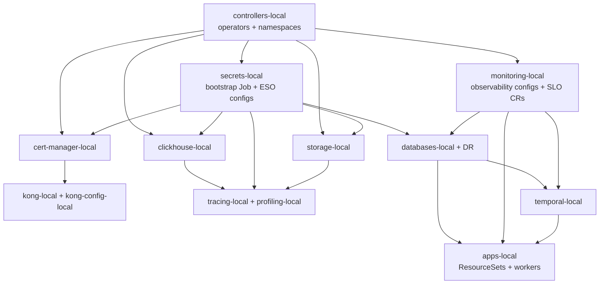

# Platform delivery

GitOps bring-up, application delivery (ResourceSets), Kong edge, CI/CD policy, and
day-2 platform patterns for the duynhlab homelab.

| | |
|---|---|
| **Deployed today** | Kind cluster — `kubernetes/clusters/local/` (20 Flux Kustomizations) |
| **Applications** | 10 Go microservices + React frontend + Temporal workers (`order-worker`, `checkout-worker`) + `mockpay` |
| **GitOps** | Flux Operator + OCI artifacts + Kustomize — [`setup.md`](setup.md) |
| **App onboarding** | Domain ResourceSets + InputProviders — [`application-delivery.md`](application-delivery.md) |
| **Edge** | Kong DB-less gateway — [`kong-gateway.md`](kong-gateway.md) |
| **Planned (not in homelab yet)** | Prod cluster overlay (`kubernetes/clusters/production/` stub); dev/uat branch CI promotion — see [`gitflow.md`](gitflow.md) + [`cicd.md`](cicd.md) callouts |

> **Homelab vs target:** docs in this folder describe both what runs on **local Kind
> today** and **policy targets** (prod TLS, dev→uat→main promotion). When a section
> reads operational but the prod cluster or CI wiring is not live, it is marked
> **planned** in the source doc or in the table below.

---

## Overview

Platform delivery splits into three layers:

1. **Bootstrap** — Kind + local OCI registry + OpenTofu Flux Operator install (`make up`).
2. **Reconcile** — Flux Kustomizations apply infra then apps in `dependsOn` order.
3. **Operate** — Kyverno admission, Kong ingress, observability, secrets sync, SLOs.

Application business logic and handlers live in separate service repos; homelab owns
manifests, GitOps pins, gateway routes, and the docs index.

## Flux dependency summary

Infra waves reconcile before apps. High-level order (full numbered graph in
[`setup.md`](setup.md#project-architecture)):

`make flux-sync` (inside `make sync`) reconciles only a **subset** of Kustomizations
— see [`setup.md`](setup.md) for the caveat. After infra-only changes, reconcile the
specific Kustomization or run `make sync`.

---

## Document map

| Doc | When to read |
|-----|----------------|
| [`setup.md`](setup.md) | First bring-up, Makefile commands, hosts, seed data, full Flux graph, project tree |
| [`application-delivery.md`](application-delivery.md) | Add a service, ResourceSet contract, image pins, domain labels |
| [`kong-gateway.md`](kong-gateway.md) | Routing, TLS, plugins, rate limits, ingress runbooks |
| [`graceful-shutdown.md`](graceful-shutdown.md) | Go shutdown pattern, probe tuning per HTTP service |
| [`cicd.md`](cicd.md) | Polyrepo CI standards, scan-before-push, signing targets |
| [`gitflow.md`](gitflow.md) | Branching and release policy (**target** — prod cluster TBD) |
| [`kyverno.md`](kyverno.md) | Admission policy tiers, Audit→Enforce, PolicyExceptions |
| [`mcp-servers.md`](mcp-servers.md) | VictoriaMetrics/Logs/Flux MCP servers for AI-assisted ops |
| [`sonarcloud.md`](sonarcloud.md) | Per-repo SonarCloud keys and coverage gates |
| [`ruleset-automation.md`](ruleset-automation.md) | Org-wide GitHub Ruleset automation via gh-patcher |
| [`gke-internal-dns.md`](gke-internal-dns.md) | **Reference only** — GKE + Cloud DNS patterns; not homelab topology |

Workflow templates (not prose docs): `build_template.yml`, `check_template.yml`.

---

## References

- [`kubernetes/clusters/local/`](../../kubernetes/clusters/local/) — Flux Kustomization CRs
- [`kubernetes/infra/`](../../kubernetes/infra/) — controllers + configs
- [`kubernetes/apps/`](../../kubernetes/apps/) — ResourceSets and InputProviders
- [`terraform/README.md`](../../terraform/README.md) — Flux Operator bootstrap

_Last updated: 2026-07-22 — platform hub; drift fixes tracked in setup, kong-gateway, application-delivery._
