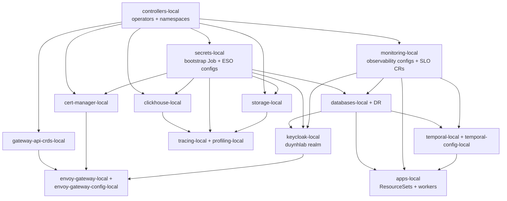

# Platform delivery

GitOps bring-up, application delivery (ResourceSets), the Envoy Gateway edge, CI/CD policy, and
day-2 platform patterns for the duynhlab homelab.

| | |
|---|---|
| **Deployed today** | Kind cluster — `kubernetes/clusters/local/` (24 declared Flux Kustomizations; `mcp-local` commented out, so 23 apply) |
| **Applications** | 10 Go microservices + React frontend + back-office portal + Temporal workers (`order-worker`, `checkout-worker`) + `mockpay` |
| **GitOps** | Flux Operator + OCI artifacts + Kustomize — [`setup.md`](setup.md) |
| **App onboarding** | Domain ResourceSets + InputProviders — [`application-delivery.md`](application-delivery.md) |
| **Edge** | Envoy Gateway on the Gateway API — [`envoy-gateway.md`](envoy-gateway.md) |
| **CI/CD candidate** | Two-branch `dev`/`main` trust gates in `gha-workflows` PR #119; service-repository adoption not started — [`cicd.md`](cicd.md) |
| **Planned (not in homelab yet)** | Prod cluster overlay (`kubernetes/clusters/production/` stub); cluster signature/provenance admission enforcement |

> **Homelab vs target:** docs in this folder describe both what runs on **local Kind
> today** and **policy targets** (prod TLS, dev→main promotion). When a section
> reads operational but the prod cluster or CI wiring is not live, it is marked
> **planned** in the source doc or in the table below.

---

## Overview

Platform delivery splits into three layers:

1. **Bootstrap** — Kind + local OCI registry + OpenTofu Flux Operator install (`make up`).
2. **Reconcile** — Flux Kustomizations apply infra then apps in `dependsOn` order.
3. **Operate** — Kyverno admission, edge HTTPRoutes, observability, secrets sync, SLOs.

Application business logic and handlers live in separate service repos; homelab owns
manifests, GitOps pins, gateway routes, and the docs index.

## Flux dependency summary

Infra waves reconcile before apps. High-level order (full numbered graph in
[`setup.md`](setup.md#project-architecture)):

```mermaid
flowchart TD
    controllers["controllers-local<br/>operators + namespaces"]
    secrets["secrets-local<br/>bootstrap Job + ESO configs"]
    certmgr["cert-manager-local"]
    gwcrds["gateway-api-crds-local"]
    keycloak["keycloak-local<br/>duynhlab realm"]
    edge["envoy-gateway-local +<br/>envoy-gateway-config-local"]
    monitoring["monitoring-local<br/>observability configs + SLO CRs"]
    storage["storage-local"]
    clickhouse["clickhouse-local"]
    tracing["tracing-local + profiling-local"]
    databases["databases-local + DR"]
    temporal["temporal-local + temporal-config-local"]
    apps["apps-local<br/>ResourceSets + workers"]

    controllers --> secrets
    controllers --> certmgr
    controllers --> monitoring
    secrets --> certmgr
    controllers --> gwcrds
    gwcrds --> edge
    certmgr --> edge
    keycloak --> edge
    databases --> keycloak
    secrets --> keycloak
    monitoring --> keycloak
    controllers --> storage
    secrets --> storage
    controllers --> clickhouse
    secrets --> clickhouse
    clickhouse --> tracing
    secrets --> tracing
    storage --> tracing
    secrets --> databases
    monitoring --> databases
    databases --> temporal
    monitoring --> temporal
    databases --> apps
    monitoring --> apps
    temporal --> apps
```

This diagram is a summary — the full numbered graph of all 24 Kustomization CRs
lives in [`setup.md`](setup.md#project-architecture).

`make flux-sync` (inside `make sync`) reconciles only a **subset** of Kustomizations
— see [`setup.md`](setup.md) for the caveat. After infra-only changes, reconcile the
specific Kustomization or run `make sync`.

---

## Document map

| Doc | When to read |
|-----|----------------|
| [`setup.md`](setup.md) | First bring-up, Makefile commands, hosts, seed data, full Flux graph, project tree |
| [`kind-e2e-audit.md`](kind-e2e-audit.md) | **The Kind cluster gate** — K0–K6 runbook proving Flux delivered the pinned images, admission, the real edge, and cluster-only telemetry. Twin of the [Compose E2E audit](../../local-stack/docs/e2e-audit.md) |
| [`application-delivery.md`](application-delivery.md) | Add a service, ResourceSet contract, image pins, domain labels |
| [`envoy-gateway.md`](envoy-gateway.md) | The edge: resource model, policy attachment, both provider modes, failure modes |
| [`kong-gateway.md`](kong-gateway.md) | **Archived** — the previous gateway's guide, kept for reference |
| [`keycloak.md`](keycloak.md) | The identity provider: deployment, realm import, database, reset procedure, signals |
| [`cicd.md`](cicd.md) | PR, dev-artifact, and production-release trust gates; rollout state and operations |
| [`gitflow.md`](gitflow.md) | Two-branch `dev`/`main` source promotion, hotfix sync, and release policy |
| [`kyverno.md`](kyverno.md) | Admission policy tiers, Audit→Enforce, PolicyExceptions |
| [`mcp-servers.md`](mcp-servers.md) | VictoriaMetrics/Logs/Flux/Grafana MCP servers for AI-assisted ops |
| [`sonarcloud.md`](sonarcloud.md) | Per-repo SonarCloud keys and coverage gates |
| [`ruleset-automation.md`](ruleset-automation.md) | Org-wide GitHub Ruleset automation via gh-patcher |
| [`gke-internal-dns.md`](gke-internal-dns.md) | **Reference only** — GKE + Cloud DNS patterns; not homelab topology |

Workflow templates (not prose docs): [`check_template.yml`](check_template.yml),
[`build_template.yml`](build_template.yml),
[`release_template.yml`](release_template.yml), and
[`sync_main_to_dev_template.yml`](sync_main_to_dev_template.yml).

---

## References

- [`kubernetes/clusters/local/`](../../kubernetes/clusters/local/) — Flux Kustomization CRs
- [`kubernetes/infra/`](../../kubernetes/infra/) — controllers + configs
- [`kubernetes/apps/`](../../kubernetes/apps/) — ResourceSets and InputProviders
- [`terraform/README.md`](../../terraform/README.md) — Flux Operator bootstrap

_Last updated: 2026-08-31 — indexed the CI/CD v2 candidate, its four caller
templates, and the `dev`/`main` model without claiming consumer adoption._
