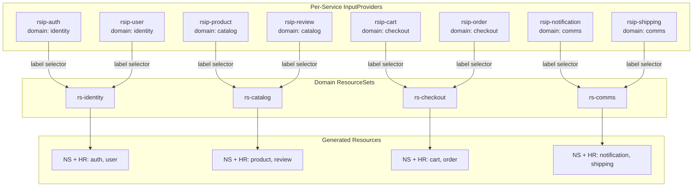

# Application Delivery Guide (Hybrid ResourceSet Architecture)

This document describes the **Hybrid ResourceSet** application delivery architecture: domain-scoped ResourceSets for blast radius isolation combined with per-service ResourceSetInputProviders for team autonomy. Based on the official [Flux Operator Decoupled Pattern](https://fluxoperator.dev/docs/resourcesets/app-definition/).

---

## 1. Why Flux Operator (ResourceSet)?

Migrating from a traditional GitOps approach (Kustomize + Helm) to **Flux Operator (ResourceSet)** introduces several critical improvements:

- **Absolute DRY**: A shared `resourcesTemplate` replaces 8-10 near-identical HelmRelease files. Standard updates (OTel endpoints, common labels) happen in one place per domain.
- **Decoupled Inputs**: Each service defines its own `ResourceSetInputProvider` (Static), enabling teams to manage config independently without merge conflicts.
- **Template-Based Flexibility**: Go templating provides `if/else` and `range` logic directly in manifests for complex requirements (e.g., enabling caching only for specific services).
- **Domain Isolation**: Domain-scoped ResourceSets limit blast radius to ~25% of backend services per failure.
- **Self-Service Onboarding**: Adding a new microservice requires creating one small InputProvider file (~15 lines) with the correct domain label.

## 2. Architectural Overview



## 3. File Layout

```
kubernetes/apps/
├── domains/                       # Domain ResourceSets (template + inputsFrom selector)
│   ├── identity-rs.yaml           # rs-identity: auth, user
│   ├── catalog-rs.yaml            # rs-catalog: product, review
│   ├── checkout-rs.yaml           # rs-checkout: cart, order
│   └── comms-rs.yaml              # rs-comms: notification, shipping
├── services/                      # Per-service InputProviders (Static)
│   ├── auth.yaml                  # labels: domain=identity
│   ├── user.yaml                  # labels: domain=identity
│   ├── product.yaml               # labels: domain=catalog
│   ├── review.yaml                # labels: domain=catalog
│   ├── cart.yaml                  # labels: domain=checkout
│   ├── order.yaml                 # labels: domain=checkout
│   ├── notification.yaml          # labels: domain=comms
│   └── shipping.yaml              # labels: domain=comms
└── frontend-rs.yaml               # rs-frontend (standalone, inline inputs)
```

Flux Kustomization with `path: ./` auto-discovers all YAML files recursively.

### Key Components

| Directory | Kind | Purpose |
|-----------|------|---------|
| `domains/*.yaml` | ResourceSet | Domain-scoped template rendering Namespace + HelmRelease per service |
| `services/*.yaml` | ResourceSetInputProvider (Static) | Per-service configuration, discovered via label selector |
| `frontend-rs.yaml` | ResourceSet | Frontend HelmRelease (standalone, different chart values, no DB) |

### Domain Mapping

| Domain | ResourceSet | Services | Rationale |
|--------|------------|----------|-----------|
| identity | `rs-identity` | auth, user | Shared auth-db, identity boundary |
| catalog | `rs-catalog` | product, review | Product data + reviews, shared read patterns |
| checkout | `rs-checkout` | cart, order | Transaction-shared-db, purchase flow |
| comms | `rs-comms` | notification, shipping | Supporting-shared-db, auxiliary services |
| frontend | `rs-frontend` | frontend | Standalone (React SPA, no DB) |

### Label Convention

Each InputProvider uses two labels for selector matching:

```yaml
metadata:
  labels:
    app.kubernetes.io/part-of: backend-services
    platform.duynhne.dev/domain: identity  # identity | catalog | checkout | comms
```

Each domain ResourceSet selects by domain:

```yaml
spec:
  inputsFrom:
    - kind: ResourceSetInputProvider
      selector:
        matchLabels:
          platform.duynhne.dev/domain: identity
```

### Naming Convention

| Resource type | Pattern | Example |
|---------------|---------|---------|
| ResourceSet | `rs-<domain>` | `rs-identity`, `rs-catalog` |
| ResourceSetInputProvider | `rsip-<service>` | `rsip-auth`, `rsip-product` |
| Domain RS file | `<domain>-rs.yaml` | `identity-rs.yaml` |
| Service input file | `<service>.yaml` | `auth.yaml` |

## 4. Template Contract (Mandatory Rules)

These rules prevent the `BuildFailed` and Helm type-mismatch errors that occur at scale.

### 4.1 Safe Key Access

Every key that is **not guaranteed** to exist in all input entries must use the `index` + `default` pattern:

```yaml
# SAFE - works when key is absent
<< index inputs "db_port" | default "5432" >>

# UNSAFE - fails with "map has no entry for key"
<< inputs.db_port >>
```

**When to use which pattern:**

| Pattern | Use when |
|---------|----------|
| `inputs.name` | Key is **required** and present in every InputProvider (`name`, `namespace`, `db_host`, `db_secret`, `pool_max`, `replicaCount`) |
| `index inputs "key" \| default "val"` | Key is **optional** or only present in some InputProviders (`db_port`, `db_user`, `db_sslmode`, `cache_enabled`, `review_url`, `auth_url`) |

### 4.2 String Typing for Env Values

Kubernetes env `value` fields must be strings. Values that Go/YAML may interpret as boolean or integer must be quoted:

```yaml
# REQUIRED for booleans - prevents "expected string, got bool"
value: << index inputs "tracing_enabled" | default "true" | quote >>

# REQUIRED for numbers - prevents "expected string, got int"
value: << inputs.pool_max | quote >>
value: << index inputs "db_port" | default "5432" | quote >>
```

**Rule of thumb**: if the default/input value looks like a bare number or `true`/`false`, pipe through `quote`.

### 4.3 Chart-Specific Value Shapes

The `mop` Helm chart expects specific value structures. Mismatches cause Helm install failures:

```yaml
# CORRECT - mop chart expects envFrom as object with string secretRef
migrations:
  envFrom:
    secretRef: << inputs.db_secret >>

# WRONG - Kubernetes-style list, but mop chart template accesses .envFrom.secretRef
migrations:
  envFrom:
    - secretRef:
        name: << inputs.db_secret >>
```

### 4.4 InputProvider Concatenation Behavior

`inputsFrom` with label selectors **discovers** all matching `ResourceSetInputProvider` objects in the same namespace. Each provider's `defaultValues` becomes one input set. The ResourceSet iterates the template once per input set.

Global defaults (registry URL, OTel endpoint, log level) are embedded as `index` + `default` in the template itself, not via a separate InputProvider.

### 4.5 Template Duplication

All 4 domain ResourceSets share the same `resourcesTemplate`. This is duplicated across 4 files. When updating the template, change all 4 domain files. This is the accepted tradeoff for blast radius isolation.

## 5. Image Tag Strategy

### Static Tags (Current Default)

All ResourceSets use a **static `latest` tag**. Every reconciliation pulls the newest image with that tag.

### Dynamic Tags via OCIArtifactTag (Future)

To enable automatic semver-based rollouts, define a `ResourceSetInputProvider` of type `OCIArtifactTag` per service and include its exported `tag` in the service's InputProvider using the `Permute` input strategy.

**When to enable dynamic tags:**
- Service has stable semver releases in GHCR
- Team wants zero-touch deploys on image push

**When to keep static tags:**
- Early development / frequent iteration
- No semver tags published yet

## 6. Onboarding New Microservices

1. **Create InputProvider file** `kubernetes/apps/services/<name>.yaml`:
   ```yaml
   apiVersion: fluxcd.controlplane.io/v1
   kind: ResourceSetInputProvider
   metadata:
     name: rsip-<name>
     namespace: default
     labels:
       app.kubernetes.io/part-of: backend-services
       platform.duynhne.dev/domain: <domain>
   spec:
     type: Static
     defaultValues:
       name: <name>
       namespace: <name>
       replicaCount: 1
       db_host: "db-pooler.<name>.svc.cluster.local"
       db_migration_host: "db-rw.<name>.svc.cluster.local"
       db_secret: "<name>-db-credentials"
       pool_max: "10"
   ```
2. **Validate and deploy**:
   ```bash
   make validate
   make sync
   ```
3. **Verify** (the domain ResourceSet auto-discovers the new InputProvider):
   ```bash
   kubectl get resourceset rs-<domain> -n default
   kubectl get helmrelease <name> -n <name>
   kubectl get pods -n <name>
   ```

## 7. Scaling Strategy

### Current Architecture Benefits

| Metric | Value |
|--------|-------|
| **Blast radius** | ~25% (one domain) |
| **Merge conflicts** | None (1 file per service) |
| **Onboarding time** | < 5 min (create InputProvider + push) |
| **Health granularity** | 1 check per domain (5 total) |
| **Team autonomy** | Full (each service owns its InputProvider) |

### Beyond 50 Services: Further Scaling

For very large deployments (50+ services per domain):

- **Split OCI artifacts per domain**: separate Kustomizations with independent source refs, so a change in `checkout` does not trigger reconciliation in `identity`.
- **Add more domains**: split large domains into sub-domains (e.g., `catalog-read`, `catalog-write`).
- **Consider reconciliation scheduling**: use `schedule` on InputProviders to control polling frequency for dynamic tags at scale.

## 8. Operability Guide

### 8.1 Debug Checklist (ResourceSet Failure)

```bash
# 1. Which ResourceSet is failing?
kubectl get resourceset -A -o wide

# 2. What is the exact error?
kubectl describe resourceset <name> -n default | grep -A5 "Message:"

# 3. Common errors and fixes:
#    "map has no entry for key X"   -> Use: index inputs "X" | default "val"
#    "expected string, got bool"    -> Add: | quote
#    "can't evaluate field X"       -> Check mop chart value shape

# 4. Is the HelmRelease itself failing?
flux get hr -A | grep False

# 5. Check generated HelmRelease values:
kubectl get helmrelease <name> -n <ns> -o yaml | yq '.spec.values'

# 6. Check pod status:
kubectl get pods -n <ns>
kubectl describe pod <pod> -n <ns>
kubectl logs <pod> -n <ns> -c init
```

### 8.2 Debug Checklist (Kustomization Failure)

```bash
# 1. Overall status
flux get kustomizations

# 2. Which resource is stalled?
kubectl describe kustomization apps-local -n flux-system | grep -A3 "Message:"

# 3. Force reconciliation
flux reconcile source oci apps-oci -n flux-system
flux reconcile kustomization apps-local -n flux-system
```

### 8.3 Operability Metrics

| Metric | Definition | Target |
|--------|-----------|--------|
| **Blast radius** | % of services affected by one ResourceSet failure | < 30% (domain-scoped) |
| **MTTR** | Time from alert to identifying the failing service | < 5 minutes |
| **Reconcile scope** | Number of HelmReleases re-rendered per change | Only services in affected domain |
| **Onboarding time** | Time to add a new service to an existing domain | < 5 minutes (create InputProvider + push) |

---

**Tip**: Always execute `make validate` before pushing. The validation script includes Flux Operator schemas for comprehensive verification.
