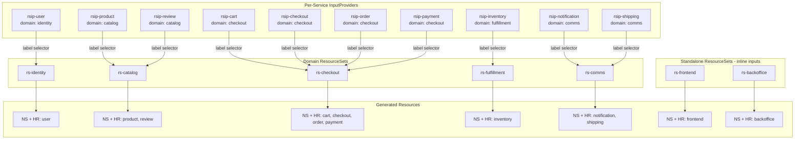

# Application Delivery Guide (Hybrid ResourceSet Architecture)

This document describes the **Hybrid ResourceSet** application delivery architecture: domain-scoped ResourceSets for blast radius isolation combined with per-service ResourceSetInputProviders for team autonomy. Based on the official [Flux Operator Decoupled Pattern](https://fluxoperator.dev/docs/resourcesets/app-definition/).

---

## 1. Why Flux Operator (ResourceSet)?

Migrating from a traditional GitOps approach (Kustomize + Helm) to **Flux Operator (ResourceSet)** introduces several critical improvements:

- **Absolute DRY**: A shared `resourcesTemplate` replaces 8-10 near-identical HelmRelease files. Standard updates (OTel endpoints, common labels) happen in one place per domain.
- **Decoupled Inputs**: Each service defines its own `ResourceSetInputProvider` (Static), enabling teams to manage config independently without merge conflicts.
- **Template-Based Flexibility**: Go templating provides `if/else` and `range` logic directly in manifests for complex requirements (e.g., enabling caching only for specific services).
- **Domain Isolation**: Domain-scoped ResourceSets limit blast radius to one domain per failure — between 10% and 40% of the 10 backend services, depending on the domain (see §7).
- **Self-Service Onboarding**: Adding a new microservice requires creating one small InputProvider file (~15 lines) with the correct domain label.

## 2. Architectural Overview


```mermaid
flowchart TD
    subgraph services [Per-Service InputProviders]
        userIP["rsip-user<br/>domain: identity"]
        productIP["rsip-product<br/>domain: catalog"]
        reviewIP["rsip-review<br/>domain: catalog"]
        checkoutIP["rsip-checkout<br/>domain: checkout"]
        cartIP["rsip-cart<br/>domain: checkout"]
        orderIP["rsip-order<br/>domain: checkout"]
        paymentIP["rsip-payment<br/>domain: checkout"]
        inventoryIP["rsip-inventory<br/>domain: fulfillment"]
        notifIP["rsip-notification<br/>domain: comms"]
        shipIP["rsip-shipping<br/>domain: comms"]
    end

    subgraph domains [Domain ResourceSets]
        rsIdentity["rs-identity"]
        rsCatalog["rs-catalog"]
        rsCheckout["rs-checkout"]
        rsFulfillment["rs-fulfillment"]
        rsComms["rs-comms"]
    end

    subgraph standalone [Standalone ResourceSets - inline inputs]
        rsFrontend["rs-frontend"]
        rsBackoffice["rs-backoffice"]
    end

    subgraph output [Generated Resources]
        hrIdentity["NS + HR: user"]
        hrCatalog["NS + HR: product, review"]
        hrCheckout["NS + HR: cart, checkout, order, payment"]
        hrFulfillment["NS + HR: inventory"]
        hrComms["NS + HR: notification, shipping"]
        hrFrontend["NS + HR: frontend"]
        hrBackoffice["NS + HR: backoffice"]
    end

    userIP -->|"label selector"| rsIdentity
    productIP -->|"label selector"| rsCatalog
    reviewIP -->|"label selector"| rsCatalog
    cartIP -->|"label selector"| rsCheckout
    checkoutIP -->|"label selector"| rsCheckout
    orderIP -->|"label selector"| rsCheckout
    paymentIP -->|"label selector"| rsCheckout
    inventoryIP -->|"label selector"| rsFulfillment
    notifIP -->|"label selector"| rsComms
    shipIP -->|"label selector"| rsComms

    rsIdentity --> hrIdentity
    rsCatalog --> hrCatalog
    rsCheckout --> hrCheckout
    rsFulfillment --> hrFulfillment
    rsComms --> hrComms
    rsFrontend --> hrFrontend
    rsBackoffice --> hrBackoffice
```

## 3. File Layout

```
kubernetes/apps/
├── domains/                       # Domain ResourceSets (template + inputsFrom selector)
│   ├── identity-rs.yaml           # rs-identity: user
│   ├── catalog-rs.yaml            # rs-catalog: product, review
│   ├── checkout-rs.yaml           # rs-checkout: cart, checkout, order, payment
│   ├── fulfillment-rs.yaml        # rs-fulfillment: inventory
│   └── comms-rs.yaml              # rs-comms: notification, shipping
├── services/                      # Per-service InputProviders (Static)
│   ├── user.yaml                  # labels: domain=identity
│   ├── product.yaml               # labels: domain=catalog
│   ├── review.yaml                # labels: domain=catalog
│   ├── cart.yaml                  # labels: domain=checkout
│   ├── checkout.yaml              # labels: domain=checkout
│   ├── order.yaml                 # labels: domain=checkout
│   ├── payment.yaml               # labels: domain=checkout
│   ├── inventory.yaml             # labels: domain=fulfillment
│   ├── notification.yaml          # labels: domain=comms
│   └── shipping.yaml              # labels: domain=comms
├── frontend-rs.yaml               # rs-frontend (standalone, inline inputs)
├── backoffice-rs.yaml             # rs-backoffice (standalone) — operator portal SPA
├── mockpay.yaml                   # standalone HelmRelease — mock payment provider (payment ns)
├── order-worker.yaml              # standalone Connection + WorkerDeployment — versioned Temporal
│                                  # saga worker (order ns). ONE file forever; the Temporal Worker
│                                  # Controller creates one Deployment per build id (ADR-054)
└── checkout-worker.yaml           # standalone HelmRelease — checkout abandonment worker (checkout ns)
```

Flux Kustomization with `path: ./` auto-discovers all YAML files recursively.

### Key Components

| Directory | Kind | Purpose |
|-----------|------|---------|
| `domains/*.yaml` | ResourceSet | Domain-scoped template rendering Namespace + HelmRelease per service |
| `services/*.yaml` | ResourceSetInputProvider (Static) | Per-service configuration, discovered via label selector |
| `frontend-rs.yaml` | ResourceSet | Frontend HelmRelease (standalone, different chart values, no DB) |
| `backoffice-rs.yaml` | ResourceSet | Backoffice portal HelmRelease (standalone, no DB; RFC-0023) |

### Domain Mapping

| Domain | ResourceSet | Services | Rationale |
|--------|------------|----------|-----------|
| identity | `rs-identity` | user | platform-db (CNPG), identity boundary |
| catalog | `rs-catalog` | product, review | product-db (product) + platform-db (review) on CNPG, shared read patterns |
| checkout | `rs-checkout` | cart, checkout, order, payment | product-db (CNPG), purchase flow |
| fulfillment | `rs-fulfillment` | inventory | product-db (CNPG) via PgDog, stock/availability boundary |
| comms | `rs-comms` | notification, shipping | platform-db (CNPG), auxiliary services |
| frontend | `rs-frontend` | frontend | Standalone (React SPA, no DB) |
| backoffice | `rs-backoffice` | admin-service | Standalone operator portal (React SPA, no DB); staff realm, own host |

### Label Convention

Each InputProvider uses two labels for selector matching:

```yaml
metadata:
  labels:
    app.kubernetes.io/part-of: backend-services
    platform.duynhlab.dev/domain: identity  # identity | catalog | checkout | fulfillment | comms
```

Each domain ResourceSet selects by domain:

```yaml
spec:
  inputsFrom:
    - kind: ResourceSetInputProvider
      selector:
        matchLabels:
          platform.duynhlab.dev/domain: identity
```

### Naming Convention

| Resource type | Pattern | Example |
|---------------|---------|---------|
| ResourceSet | `rs-<domain>` | `rs-identity`, `rs-fulfillment` |
| ResourceSetInputProvider | `rsip-<service>` | `rsip-user`, `rsip-product` |
| Domain RS file | `<domain>-rs.yaml` | `identity-rs.yaml` |
| Service input file | `<service>.yaml` | `user.yaml` |

## 4. Template Contract (Mandatory Rules)

These rules prevent the `BuildFailed` and Helm type-mismatch errors that occur at scale.

### 4.1 Safe Key Access

Every key that is **not guaranteed** to exist in all input entries must use the `index` + `default` pattern:

```yaml
# SAFE - works when key is absent
<< index inputs "db_port" | default "5432" >>

# UNSAFE - fails with "map has no entry for key"
<< inputs.db_port >>
```

**When to use which pattern:**

| Pattern | Use when |
|---------|----------|
| `inputs.name` | Key is **required** and present in every InputProvider (`name`, `namespace`, `db_host`, `db_secret`, `pool_max`, `replicaCount`) |
| `index inputs "key" \| default "val"` | Key is **optional** or only present in some InputProviders (`db_port`, `db_user`, `db_sslmode`, `cache_enabled`, `review_url`, `auth_url`) |

### 4.2 String Typing for Env Values

Kubernetes env `value` fields must be strings. Values that Go/YAML may interpret as boolean or integer must be quoted:

```yaml
# REQUIRED for booleans - prevents "expected string, got bool"
value: << index inputs "tracing_enabled" | default "true" | quote >>

# REQUIRED for numbers - prevents "expected string, got int"
value: << inputs.pool_max | quote >>
value: << index inputs "db_port" | default "5432" | quote >>
```

**Rule of thumb**: if the default/input value looks like a bare number or `true`/`false`, pipe through `quote`.

### 4.3 Chart-Specific Value Shapes

The `mop` Helm chart expects specific value structures. Mismatches cause Helm install failures:

```yaml
# CORRECT - mop chart expects envFrom as object with string secretRef
migrations:
  envFrom:
    secretRef: << inputs.db_secret >>

# WRONG - Kubernetes-style list, but mop chart template accesses .envFrom.secretRef
migrations:
  envFrom:
    - secretRef:
        name: << inputs.db_secret >>
```

### 4.4 InputProvider Concatenation Behavior

`inputsFrom` with label selectors **discovers** all matching `ResourceSetInputProvider` objects in the same namespace. Each provider's `defaultValues` becomes one input set. The ResourceSet iterates the template once per input set.

Global defaults (registry URL, OTel endpoint, log level) are embedded as `index` + `default` in the template itself, not via a separate InputProvider.

### 4.5 Template Duplication

All 5 domain ResourceSets share the same `resourcesTemplate`. This is duplicated across 5 files. When updating the template, change all 5 domain files. This is the accepted tradeoff for blast radius isolation.

## 5. Image Tag Strategy

### Pinned Tags (Current Default)

Each service's `ResourceSetInputProvider` supplies an explicit `image_tag` input that the domain ResourceSet renders into the HelmRelease (`tag: "<< inputs.image_tag >>"`). Tags are pinned to a specific `sha` or `vX.Y.Z` per service — `:latest` is banned as a **platform rule** (AGENTS.md admission rules) and never used. Note the Kyverno `disallow-latest-tag` ClusterPolicy currently runs in **Audit** mode (`validationFailureAction: Audit`): a `:latest` tag would be reported in PolicyReports, not blocked at admission. Flipping it to Enforce is planned per the [Kyverno rollout strategy](kyverno.md#rollout-strategy).

### Promote a validated release to local Kind

The current local delivery path is explicit and reviewable. A `vX.Y.Z` tag
builds the immutable release image, but it does **not** update this repository or
deploy to Kind automatically. The `$imagepolicy` comments are update markers;
without active `ImagePolicy` and `ImageUpdateAutomation` resources they have no
runtime effect.

1. Run the mandatory [local-stack E2E release
   audit](../../local-stack/docs/e2e-audit.md) against the exact commit intended
   for the tag. Every Phase A, B, and C row must pass.
2. Create the signed `vX.Y.Z` tag in the owning application repository and wait
   for CI to test, scan, build, and sign the `X.Y.Z` image.
3. Update every homelab consumer of that image:

   | Release | Required homelab pin |
   |---------|----------------------|
   | Standard service | `kubernetes/apps/services/<service>.yaml` → `image_tag` |
   | Checkout | Checkout service pin **and** `kubernetes/apps/checkout-worker.yaml` |
   | Payment | Payment service pin **and** `kubernetes/apps/mockpay.yaml` |
   | Frontend | `kubernetes/apps/frontend-rs.yaml` |
   | Backoffice portal | `kubernetes/apps/backoffice-rs.yaml` — the tag is only deployable if its build carried the cluster build args (see the file's comment) |
   | Order API | `kubernetes/apps/services/order.yaml` → `image_tag` |
   | Order worker | **One line**: the `image:` tag in `kubernetes/apps/order-worker.yaml`. Nothing else — see below |

### Releasing the order worker

Since [ADR-054](../proposals/adr/ADR-054-temporal-worker-controller/) this is
**one line and no manual step**, and the instructions that used to live here —
add `order-worker-<build>.yaml` side by side, run the activation Job, delete the
old file at `DRAINED` — describe a model that no longer exists. The
[RFC-0021 cutover/rollback](../proposals/rfc/RFC-0021/cutover-rollback.md)
runbook is kept as the **historical** procedure; do not follow it.

```bash
# 1. Edit ONE line. Nothing else in the file changes.
$EDITOR kubernetes/apps/order-worker.yaml     # image: ...order-service:<new tag>

# 2. Validate, then publish.
make validate && make flux-push && make flux-sync

# 3. Watch the controller do the rest. Ramp % walks the rollout.steps.
kubectl -n order get wd order-fulfillment -w
#   NAME               CURRENT      TARGET       RAMP %
#   order-fulfillment  <old build>  <new build>  10   -> 50 -> (empty when promoted)
```

**What you do NOT do, and why each one is gone:**

| Retired step | Why |
|---|---|
| Copy the manifest to a new filename | There is one `WorkerDeployment`, forever. The controller creates the per-version `Deployment`s |
| Set `TEMPORAL_WORKER_BUILD_ID` | The controller **derives** the build id and injects it. Hand-setting it gives the pod two identities; `make validate` rejects that |
| Update `service.version` | It is read from the `temporal.io/build-id` pod label via `fieldRef`, so it follows the build id by itself |
| Run `kubectl create job --from=cronjob/temporal-worker-set-current-version` | The CronJob is deleted. The controller sets the Current version through the Temporal API |
| Read `describe-version` and delete the old file | `sunset` does it: scale to zero 1h after the server reports the version `drained`, delete 24h later |

**The build id is not the image tag**, and that surprises people. It is the image
prefix plus a hash of the whole pod template, so a resources or env edit mints a
version too — stricter than the old tag-only rule, and the reason a release is one
line. It is written down nowhere in git; read the live value:

```bash
kubectl -n order get wd order-fulfillment      # CURRENT / TARGET / RAMP % are printer columns
kubectl -n order get po -L temporal.io/build-id
```

**Rolling back** is the same one line in reverse: set the tag to the previous
image. If that template was deployed before, the build id is **the same one it had**
— `ComputeBuildID` is deterministic over the image reference plus the pod template,
so a revert re-promotes the existing version object and its Deployment rather than
minting a third. A new id appears only for a template this `WorkerDeployment` has
never carried. Verified on the cluster 2026-08-22: reverting a memory-limit change
re-promoted `2.5.0-498f` with its original `healthySince`, and the abandoned build
moved into `status.deprecatedVersions`.

Either way the build you are abandoning drains on its own, and workflows already
pinned to it keep running to completion on it. That is the guarantee, and it is why
a rollback needs no hurry.

**Verifying an actual saga** — the audit row is
[`kind-e2e-audit.md` K4.10](kind-e2e-audit.md#k4--the-real-edge-and-identity),
which drives a checkout to confirm and asserts `Status COMPLETED` with a `BuildId`
equal to the `CURRENT` above.

`checkout-worker` is **not** versioned and takes none of this: it is an ordinary
`HelmRelease`, and a tag move there is a normal rollout.
4. Validate before publishing manifests:

   ```bash
   make validate
   ```

5. Reconcile Kind. Bootstrap a missing cluster with `make up`; use `make sync`
   for an existing cluster:

   ```bash
   make sync
   make flux-status
   flux get helmreleases -A
   kubectl get pods -n <service>
   kubectl get pods -n <service> \
     -o jsonpath='{.items[*].spec.containers[*].image}'
   ```

6. Confirm the affected Kustomization and HelmRelease are Ready, the rollout is
   healthy, and the pod runs the exact `X.Y.Z` image. A local-stack pass does not
   waive a Kind failure: admission, NetworkPolicy, TLS, CNPG, secrets, and Flux
   behavior exist only in the cluster gate.

### Dynamic Tags via OCIArtifactTag (Future)

To enable automatic semver-based rollouts, define a `ResourceSetInputProvider` of type `OCIArtifactTag` per service and include its exported `tag` in the service's InputProvider using the `Permute` input strategy.

**When to enable dynamic tags:**
- Service has stable semver releases in GHCR
- Team wants zero-touch deploys on image push

**When to keep pinned tags:**
- Early development / frequent iteration
- No semver tags published yet

## 6. Onboarding New Microservices

1. **Create InputProvider file** `kubernetes/apps/services/<name>.yaml`:
   ```yaml
   apiVersion: fluxcd.controlplane.io/v1
   kind: ResourceSetInputProvider
   metadata:
     name: rsip-<name>
     namespace: default
     labels:
       app.kubernetes.io/part-of: backend-services
       platform.duynhlab.dev/domain: <domain>
   spec:
     type: Static
     defaultValues:
       name: <name>
       namespace: <name>
       replicaCount: 1
       # RFC-0018 — pick the cluster for the domain (see Domain Mapping table):
       # Identity/comms (platform-db):
       db_host: "platform-db-pooler-rw.platform.svc.cluster.local"
       db_migration_host: "platform-db-rw.platform.svc.cluster.local"
       # Catalog/checkout/fulfillment on product-db
       # (product, cart, checkout, order, payment, inventory):
       # db_host: "pgdog-product.product.svc.cluster.local"
       # db_migration_host: "product-db-rw.product.svc.cluster.local"
       # Exception — payment: connects DIRECT to CNPG over TLS, not via PgDog
       # (db_host: "product-db-rw.product.svc.cluster.local" + db_sslmode: "require");
       # payment refuses cleartext DB and PgDog terminates no TLS yet — see the
       # comment in kubernetes/apps/services/payment.yaml.
       db_secret: "<name>-db-credentials"
       pool_max: "10"
   ```
2. **Validate and deploy**:
   ```bash
   make validate
   make sync
   ```
3. **Verify** (the domain ResourceSet auto-discovers the new InputProvider):
   ```bash
   kubectl get resourceset rs-<domain> -n default
   kubectl get helmrelease <name> -n <name>
   kubectl get pods -n <name>
   ```

## 7. Scaling Strategy

### Current Architecture Benefits

| Metric | Value |
|--------|-------|
| **Blast radius** | One domain: 10–40% of the 10 backend services. `rs-checkout` carries 4 of 10 (40%) — a known concentration above the < 30% target (see §8.3) |
| **Merge conflicts** | None (1 file per service) |
| **Onboarding time** | < 5 min (create InputProvider + push) |
| **Health granularity** | 1 check per domain (5 domains) + `rs-frontend` + `rs-backoffice` = 7 ResourceSet checks; `mockpay` and `checkout-worker` are standalone HelmReleases, and `order-worker` is a standalone `WorkerDeployment`, all outside the ResourceSet checks |
| **Team autonomy** | Full (each service owns its InputProvider) |

### Beyond 50 Services: Further Scaling

For very large deployments (50+ services per domain):

- **Split OCI artifacts per domain**: separate Kustomizations with independent source refs, so a change in `checkout` does not trigger reconciliation in `identity`.
- **Add more domains**: split large domains into sub-domains (e.g., `catalog-read`, `catalog-write`).
- **Consider reconciliation scheduling**: use `schedule` on InputProviders to control polling frequency for dynamic tags at scale.

## 8. Operability Guide

### 8.1 Debug Checklist (ResourceSet Failure)

```bash
# 1. Which ResourceSet is failing?
kubectl get resourceset -A -o wide

# 2. What is the exact error?
kubectl describe resourceset <name> -n default | grep -A5 "Message:"

# 3. Common errors and fixes:
#    "map has no entry for key X"   -> Use: index inputs "X" | default "val"
#    "expected string, got bool"    -> Add: | quote
#    "can't evaluate field X"       -> Check mop chart value shape

# 4. Is the HelmRelease itself failing?
flux get hr -A | grep False

# 5. Check generated HelmRelease values:
kubectl get helmrelease <name> -n <ns> -o yaml | yq '.spec.values'

# 6. Check pod status:
kubectl get pods -n <ns>
kubectl describe pod <pod> -n <ns>
kubectl logs <pod> -n <ns> -c init
```

### 8.2 Debug Checklist (Kustomization Failure)

```bash
# 1. Overall status
flux get kustomizations

# 2. Which resource is stalled?
kubectl describe kustomization apps-local -n flux-system | grep -A3 "Message:"

# 3. Force reconciliation
flux reconcile source oci apps-oci -n flux-system
flux reconcile kustomization apps-local -n flux-system
```

### 8.3 Operability Metrics

| Metric | Definition | Target |
|--------|-----------|--------|
| **Blast radius** | % of services affected by one ResourceSet failure | < 30% (domain-scoped). **Known gap**: `rs-checkout` bundles cart, checkout, order, payment — 40% of the fleet in one domain; splitting it is the lever if the target must hold |
| **MTTR** | Time from alert to identifying the failing service | < 5 minutes |
| **Reconcile scope** | Number of HelmReleases re-rendered per change | Only services in affected domain |
| **Onboarding time** | Time to add a new service to an existing domain | < 5 minutes (create InputProvider + push) |

---

**Tip**: Always execute `make validate` before pushing. The validation script includes Flux Operator schemas for comprehensive verification.

---

_Last updated: 2026-08-22 — RFC-0026/ADR-054: the Temporal Worker Controller owns the versioned-worker lifecycle (build id derived, one file, no activation step). Previously 2026-08-19 — synced to the deployed 5-domain reality (fulfillment/inventory added, auth removed); honest blast-radius numbers (rs-checkout = 40%); Kyverno `:latest` ban stated as Audit-mode, not enforced; payment direct-TLS DB exception documented._
