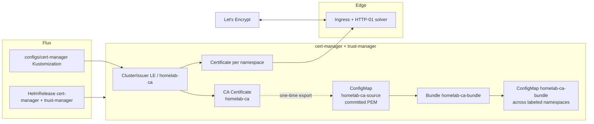

# cert-manager + Let's Encrypt + Flux CD (8 microservices)

This guide provides **Helm values**, **Flux CD v2** manifests (`HelmRepository`, `HelmRelease`, `Kustomization`), **ClusterIssuer** (Let's Encrypt staging + production, HTTP-01), **Certificate** templates for all eight backend services, **Ingress** examples with cert-manager annotations, deployment steps, and troubleshooting.

**Repository paths (implemented in this repo):**

| Purpose | Path |
|--------|------|
| Jetstack `HelmRepository` | [`kubernetes/clusters/local/sources/helm/jetstack.yaml`](../../kubernetes/clusters/local/sources/helm/jetstack.yaml) |
| cert-manager `HelmRelease` | [`kubernetes/infra/controllers/cert-manager/helmrelease.yaml`](../../kubernetes/infra/controllers/cert-manager/helmrelease.yaml) |
| trust-manager `HelmRelease` | [`kubernetes/infra/controllers/cert-manager/trust-manager-helmrelease.yaml`](../../kubernetes/infra/controllers/cert-manager/trust-manager-helmrelease.yaml) |
| ClusterIssuers + Certificates | [`kubernetes/infra/configs/cert-manager/`](../../kubernetes/infra/configs/cert-manager/) |
| CA bundle distribution (trust-manager) | [`docs/security/trust-distribution.md`](../security/trust-distribution.md) |
| Flux `Kustomization` (configs) | [`kubernetes/clusters/local/cert-manager-config.yaml`](../../kubernetes/clusters/local/cert-manager-config.yaml) |
| Ingress example (optional; not in default kustomize) | [`kubernetes/infra/configs/cert-manager/ingress-example.yaml`](../../kubernetes/infra/configs/cert-manager/ingress-example.yaml) |

**Preference — ACME solver:** **HTTP-01** is the default below (works with **Ingress** controllers such as ingress-nginx, GKE Ingress, Traefik). Use **DNS-01** (wildcard certs, no HTTP reachability) when you control a DNS API (e.g. Cloud DNS, Cloudflare); an optional pattern is noted in [DNS-01 / wildcard](#dns-01--wildcard-optional).

**Compatibility:** Flux **Kustomization** `kustomize.toolkit.fluxcd.io/v1`, **HelmRelease** `helm.toolkit.fluxcd.io/v2`, **GitOps** best practices (declarative sources, `dependsOn`, prune).

---

## 1. Architecture (summary)



---

## 2. HelmRepository (Jetstack)

**File:** `kubernetes/clusters/local/sources/helm/jetstack.yaml`

```yaml
apiVersion: source.toolkit.fluxcd.io/v1
kind: HelmRepository
metadata:
  name: jetstack
  namespace: flux-system
spec:
  interval: 1h
  url: https://charts.jetstack.io
```

Add the file to `kubernetes/clusters/local/sources/kustomization.yaml` under `resources:`.

---

## 3. Namespace

Add to `kubernetes/infra/controllers/namespaces.yaml` (or let the chart create it — this repo pre-creates namespaces):

```yaml
apiVersion: v1
kind: Namespace
metadata:
  labels:
    environment: local
  name: cert-manager
```

---

## 4. Helm values (cert-manager HelmRelease)

Official chart: `jetstack/cert-manager`. Pin a chart version that matches your target ([Artifact Hub — cert-manager](https://artifacthub.io/packages/helm/cert-manager/cert-manager)).

**File:** `kubernetes/infra/controllers/cert-manager/helmrelease.yaml`

```yaml
apiVersion: helm.toolkit.fluxcd.io/v2
kind: HelmRelease
metadata:
  name: cert-manager
  namespace: cert-manager
spec:
  interval: 10m
  timeout: 10m
  chart:
    spec:
      chart: cert-manager
      sourceRef:
        kind: HelmRepository
        name: jetstack
        namespace: flux-system
      version: "1.16.2"
  install:
    crds: CreateReplace
    createNamespace: false
    remediation:
      retries: 3
  upgrade:
    crds: CreateReplace
    remediation:
      retries: 3
  values:
    installCRDs: true
    global:
      leaderElection:
        namespace: cert-manager
    replicaCount: 1
    resources:
      requests:
        cpu: 25m
        memory: 64Mi
      limits:
        cpu: 200m
        memory: 256Mi
    webhook:
      replicaCount: 1
      resources:
        requests:
          cpu: 10m
          memory: 32Mi
        limits:
          cpu: 100m
          memory: 128Mi
    cainjector:
      replicaCount: 1
      resources:
        requests:
          cpu: 10m
          memory: 64Mi
        limits:
          cpu: 100m
          memory: 256Mi
```

**Include** `kubernetes/infra/controllers/cert-manager/kustomization.yaml`:

```yaml
apiVersion: kustomize.config.k8s.io/v1beta1
kind: Kustomization
resources:
  - helmrelease.yaml
```

**Wire** `cert-manager/` into `kubernetes/infra/controllers/kustomization.yaml` `resources:` (e.g. after `secrets/`).

**Controllers Flux Kustomization health check** (`kubernetes/clusters/local/controllers.yaml`): add:

```yaml
    - apiVersion: helm.toolkit.fluxcd.io/v2
      kind: HelmRelease
      name: cert-manager
      namespace: cert-manager
```

---

## 5. ClusterIssuer — Let's Encrypt (staging + production, HTTP-01)

Replace `acme@YOURDOMAIN` and `nginx` (Ingress class) to match your cluster.

**File:** `kubernetes/infra/configs/cert-manager/clusterissuers.yaml`

```yaml
apiVersion: cert-manager.io/v1
kind: ClusterIssuer
metadata:
  name: letsencrypt-staging
spec:
  acme:
    email: acme@duynh.me
    server: https://acme-staging-v02.api.letsencrypt.org/directory
    privateKeySecretRef:
      name: letsencrypt-staging-account-key
    solvers:
      - http01:
          ingress:
            class: nginx
---
apiVersion: cert-manager.io/v1
kind: ClusterIssuer
metadata:
  name: letsencrypt-prod
spec:
  acme:
    email: acme@duynh.me
    server: https://acme-v02.api.letsencrypt.org/directory
    privateKeySecretRef:
      name: letsencrypt-prod-account-key
    solvers:
      - http01:
          ingress:
            class: nginx
```

**GKE Ingress (default class):** use `gce` or your IngressClass name instead of `nginx`. **Traefik:** set `ingressClassName` / class per [cert-manager HTTP-01](https://cert-manager.io/docs/configuration/acme/http01/).

---

## 6. Certificate resources — eight microservices (template)

One **Certificate** per hostname (per namespace). DNS names below follow `gateway.duynh.me` style from [api-naming-convention.md](../api/api-naming-convention.md); **replace** `local.duynh.me` with your domain.

| Service      | Namespace      | Example DNS name              |
|-------------|----------------|-------------------------------|
| auth        | auth           | auth.duynh.me              |
| user        | user           | user.duynh.me              |
| product     | product        | product.duynh.me           |
| cart        | cart           | cart.duynh.me              |
| order       | order          | order.duynh.me             |
| review      | review         | review.duynh.me            |
| notification| notification   | notification.duynh.me      |
| shipping    | shipping       | shipping.duynh.me          |

**File:** `kubernetes/infra/configs/cert-manager/certificates-microservices.yaml`

```yaml
# Repeat pattern: metadata.namespace + dnsNames must match your Ingress host.
apiVersion: cert-manager.io/v1
kind: Certificate
metadata:
  name: auth-tls
  namespace: auth
spec:
  secretName: auth-tls
  issuerRef:
    kind: ClusterIssuer
    name: letsencrypt-staging
  dnsNames:
    - auth.duynh.me
---
apiVersion: cert-manager.io/v1
kind: Certificate
metadata:
  name: user-tls
  namespace: user
spec:
  secretName: user-tls
  issuerRef:
    kind: ClusterIssuer
    name: letsencrypt-staging
  dnsNames:
    - user.duynh.me
---
apiVersion: cert-manager.io/v1
kind: Certificate
metadata:
  name: product-tls
  namespace: product
spec:
  secretName: product-tls
  issuerRef:
    kind: ClusterIssuer
    name: letsencrypt-staging
  dnsNames:
    - product.duynh.me
---
apiVersion: cert-manager.io/v1
kind: Certificate
metadata:
  name: cart-tls
  namespace: cart
spec:
  secretName: cart-tls
  issuerRef:
    kind: ClusterIssuer
    name: letsencrypt-staging
  dnsNames:
    - cart.duynh.me
---
apiVersion: cert-manager.io/v1
kind: Certificate
metadata:
  name: order-tls
  namespace: order
spec:
  secretName: order-tls
  issuerRef:
    kind: ClusterIssuer
    name: letsencrypt-staging
  dnsNames:
    - order.duynh.me
---
apiVersion: cert-manager.io/v1
kind: Certificate
metadata:
  name: review-tls
  namespace: review
spec:
  secretName: review-tls
  issuerRef:
    kind: ClusterIssuer
    name: letsencrypt-staging
  dnsNames:
    - review.duynh.me
---
apiVersion: cert-manager.io/v1
kind: Certificate
metadata:
  name: notification-tls
  namespace: notification
spec:
  secretName: notification-tls
  issuerRef:
    kind: ClusterIssuer
    name: letsencrypt-staging
  dnsNames:
    - notification.duynh.me
---
apiVersion: cert-manager.io/v1
kind: Certificate
metadata:
  name: shipping-tls
  namespace: shipping
spec:
  secretName: shipping-tls
  issuerRef:
    kind: ClusterIssuer
    name: letsencrypt-staging
  dnsNames:
    - shipping.duynh.me
```

Switch `letsencrypt-staging` → `letsencrypt-prod` when DNS + HTTP-01 are verified.

### Wildcard (one cert for many hosts)

Requires **DNS-01** and a **DNS provider** solver (not HTTP-01). See [DNS-01 / wildcard](#dns-01--wildcard-optional).

---

## 7. Ingress examples (TLS + cert-manager)

### Option A — Ingress shim (recommended): annotations only

cert-manager creates/manages the Certificate from Ingress annotations; **do not** duplicate a separate `Certificate` for the same host unless you know what you’re doing.

```yaml
apiVersion: networking.k8s.io/v1
kind: Ingress
metadata:
  name: auth
  namespace: auth
  annotations:
    cert-manager.io/cluster-issuer: letsencrypt-staging
    # kubernetes.io/ingress.class: nginx   # if not using ingressClassName
spec:
  ingressClassName: nginx
  tls:
    - hosts:
        - auth.duynh.me
      secretName: auth-tls
  rules:
    - host: auth.duynh.me
      http:
        paths:
          - path: /
            pathType: Prefix
            backend:
              service:
                name: auth
                port:
                  number: 8080
```

### Option B — Explicit `Certificate` + Ingress referencing existing secret

Use the `Certificate` manifests from section 6; Ingress references `secretName` that cert-manager populates:

```yaml
spec:
  tls:
    - hosts: [auth.duynh.me]
      secretName: auth-tls
```

---

## 8. Flux: Kustomization for cert-manager configs

**File:** `kubernetes/infra/configs/cert-manager/kustomization.yaml`

```yaml
apiVersion: kustomize.config.k8s.io/v1beta1
kind: Kustomization
resources:
  - clusterissuers.yaml
  - certificates-microservices.yaml
```

**File:** `kubernetes/clusters/local/cert-manager-config.yaml`

```yaml
apiVersion: kustomize.toolkit.fluxcd.io/v1
kind: Kustomization
metadata:
  name: cert-manager-local
  namespace: flux-system
  labels:
    app.kubernetes.io/component: infrastructure
spec:
  interval: 10m
  timeout: 5m
  sourceRef:
    kind: OCIRepository
    name: infrastructure-oci
  path: ./configs/cert-manager
  prune: true
  wait: true
  dependsOn:
    - name: controllers-local
```

Add `cert-manager-config.yaml` to `kubernetes/clusters/local/kustomization.yaml` **after** `controllers.yaml` and **before** `apps.yaml`.

---

## 9. Deployment (step-by-step)

1. **Ingress controller** — HTTP-01 needs a working Ingress with a **public** IP/DNS. On Kind, use [ingress-nginx](https://kubernetes.github.io/ingress-nginx/deploy/) or match your platform. **Local Kind without public DNS:** certificates stay **Pending**; use **staging** issuer or **mkcert**/self-signed for dev.
2. **DNS** — Create **A/AAAA** (or CNAME) for each `*.duynh.me` host → load balancer IP.
3. **Commit** HelmRepository, namespaces, `controllers/cert-manager`, `configs/cert-manager`, Flux `cert-manager-local`, and `kustomization.yaml` updates.
4. **Push** to the branch Flux watches; **reconcile** (or wait for interval).
5. **Verify** cert-manager pods: `kubectl -n cert-manager get pods`.
6. **Verify** ClusterIssuers: `kubectl get clusterissuer`.
7. **Verify** Certificates: `kubectl get certificate -A`.
8. **Switch to prod** issuer when staging succeeds: update Ingress annotations or `Certificate.spec.issuerRef.name` to `letsencrypt-prod`.

---

## 10. Troubleshooting & validation

```bash
# cert-manager pods
kubectl -n cert-manager get pods

# ClusterIssuers ready
kubectl describe clusterissuer letsencrypt-staging

# All certificates & challenges
kubectl get certificate,certificaterequest,order,challenge -A

# One certificate detail
kubectl -n auth describe certificate auth-tls

# cert-manager logs
kubectl -n cert-manager logs deploy/cert-manager -f

# Flux
flux get kustomizations
flux reconcile kustomization cert-manager-local --with-source
```

**Common issues**

| Symptom | Check |
|--------|--------|
| Certificate Pending | DNS not pointing to LB; Ingress class mismatch; firewall |
| HTTP-01 fails | Host not reachable on port 80 from internet; wrong Ingress class in ClusterIssuer |
| Rate limit (429) | Let's Encrypt staging for tests; avoid deleting/recreating too often |

---

## 11. trust-manager — distributing the homelab CA bundle

cert-manager creates `homelab-ca-secret` in the `cert-manager` namespace only.
Workloads in **other** namespaces that need to validate TLS connections signed
by the homelab CA (k6 → gateway, future Vector → HTTPS sinks, in-cluster HTTPS
clients) need that CA in their own namespace. trust-manager solves this with
a single cluster-scoped `Bundle` CRD.

**Full deep-dive:** [`docs/security/trust-distribution.md`](../security/trust-distribution.md)

**Quick reference**

```yaml
# Bundle: combines Mozilla CAs + homelab CA, syncs to labeled namespaces.
apiVersion: trust.cert-manager.io/v1alpha1
kind: Bundle
metadata:
  name: homelab-ca-bundle
spec:
  sources:
    - useDefaultCAs: true
    - configMap:
        name: homelab-ca-source
        key: ca.crt
  target:
    configMap:
      key: ca-bundle.pem
    namespaceSelector:
      matchLabels:
        platform.duynhlab.dev/needs-trust: "true"
```

**Opt a namespace in:**

```yaml
metadata:
  name: my-namespace
  labels:
    platform.duynhlab.dev/needs-trust: "true"
```

trust-manager creates `ConfigMap/homelab-ca-bundle` in that namespace within
~10s. Mount as `/etc/ssl/certs/ca-bundle.pem` and set `SSL_CERT_FILE` for Go
clients.

**Why not point Bundle directly at `homelab-ca-secret`?** Rotation safety. We
commit the CA cert as a static file under
`kubernetes/infra/configs/cert-manager/ca-source/homelab-ca.crt` and let the
Bundle read from a kustomize-generated ConfigMap. CA rollover then happens
through PRs that bundle old + new CA simultaneously, never an atomic swap.
Full runbook in `docs/security/trust-distribution.md` § 5.

---

## DNS-01 / wildcard (optional)

1. Create a **ClusterIssuer** (or Issuer) with a **DNS01** solver for your provider ([cert-manager DNS providers](https://cert-manager.io/docs/configuration/acme/dns01/)).
2. Example (structure only — credentials via Secret referenced by issuer):

```yaml
spec:
  acme:
    solvers:
      - dns01:
          cloudDNS:
            project: my-gcp-project
        selector:
          dnsNames:
            - "*.duynh.me"
            - "local.duynh.me"
```

3. Use **one** `Certificate` with `dnsNames: ["*.duynh.me","local.duynh.me"]` and a single TLS secret referenced by multiple Ingresses (same namespace limitations apply — wildcards are often **one namespace** or shared cert; plan accordingly).

---

## References

- [cert-manager — Installation (Helm)](https://cert-manager.io/docs/installation/helm/)
- [Flux — HelmRelease](https://fluxcd.io/flux/components/helm/helmreleases/)
- [Let's Encrypt — Staging](https://letsencrypt.org/docs/staging-environment/)
